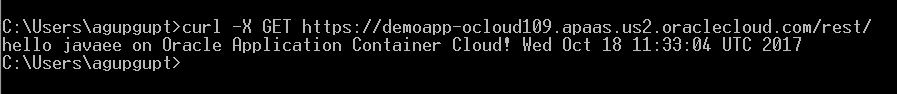

# 截屏:将 Java EE 应用程序推送到 Oracle 云

> 原文：<https://medium.com/oracledevs/screencast-pushing-a-java-ee-app-to-oracle-cloud-a986b33e10e4?source=collection_archive---------1----------------------->

这里有一个屏幕截图，展示了如何从命令行轻松地将 Java EE 应用程序推送到 Oracle 应用程序容器云

## 概观

*   从一个 Java EE 7 Maven 原型开始— `mvn archetype:generate -Dfilter=com.airhacks:javaee7-essentials-archetype`
*   修改代码——添加一个简单的 JAX 遥感资源并用`mvn clean install`构建项目
*   添加(少量)元数据(`deployment.json`)

```
{ “instances”:1, “memory”:”1G”}
```

*   [安装和配置 PSM](https://docs.oracle.com/en/cloud/paas/java-cloud/pscli/using-command-line-interface-1.html) (几分钟的事！)
*   并推送至云— `**psm accs push** -n demoapp -r javaee -s hourly -d deployment.json -p target/**sample.war**`
*   测试— `curl -x GET [https://demoapp-<domain>.apaas.us2.oraclecloud.com](https://demoapp-ocloud109.apaas.us2.oraclecloud.com)/rest/`



cURL test

# 不要忘记…

*   查看针对 Oracle 应用容器云的[教程](https://docs.oracle.com/en/cloud/paas/app-container-cloud/create-first-applications.html)——每个运行时都有一些内容！
*   [应用容器云上的其他博客](http://bit.ly/2gR3nrV)
*   [PaaS 服务管理器 CLI 文档](https://docs.oracle.com/en/cloud/paas/java-cloud/pscli/abouit-paas-service-manager-command-line-interface.html)

干杯！

> 本文表达的观点是我个人的观点，不一定代表甲骨文的观点。