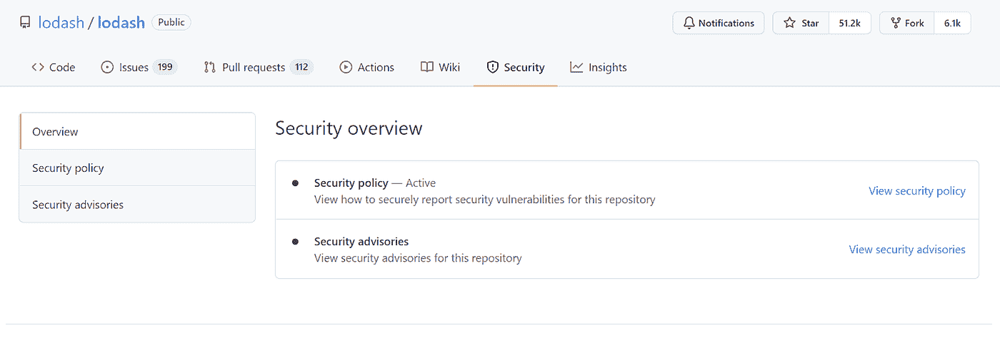

# 筛选 NPM 包裹:最佳实践

> 原文：<https://medium.com/globant/screening-npm-packages-best-practices-a24930b2624e?source=collection_archive---------1----------------------->

在搜索第三方 NPM 软件包时，您会发现许多提供类似功能的替代软件包。但是，做出正确的选择是一件重要的事情&不是一件容易的事情。此外，在使用软件包之前检查它的许可是非常重要的事情之一。

因此，我们将本文分为两部分。在本文的第一部分，我们将讨论在选择第三方 NPM 软件包时可以遵循的一些最佳实践。而在 [**筛选 NPM 套餐:套餐发牌**](/@janit.bansal/npm-licenses-c1c51ec216f6) 篇中我们将深入探讨套餐发牌部分。

以下是我们在选择 NPM 套餐时可以遵循的一些最佳做法

**套餐许可**

检查包的许可类型是最重要的事情。它为您提供了关于软件包使用的条款和条件的详细信息。

如果你已经安装了软件包，那么你可以使用一个 [***许可证检查器***](https://www.npmjs.com/package/license-checker) 来检查 NPM 软件包许可证&确保你安装的软件包是合法使用的。

我们将在“[筛选 NPM 包:包许可](/@janit.bansal/npm-licenses-c1c51ec216f6)”一文中详细讨论这一点。

**维护**

这是一个很好的迹象，表明一个包是活跃的&问题较少，如果它经常更新的话&有许多版本。您可以在 GitHub 库上查看发布版本的数量。你也可以查看GitHub insights 来寻找对 NPM 包的社区支持。以下是你可以考虑的一些见解。

您可以在存储库页面上轻松找到“使用者”和“贡献者”的数量。更多的用户和贡献者意味着这个包是受欢迎的和值得信赖的。

“贡献者”选项卡为您提供了开发人员社区的见解。在这里，您可以找到贡献者的统计表示。如果有频繁的贡献，那么这个包是由一个好的开发者社区维护的。

**投稿&下载频率**

你可以在 NPM 软件包主页上查看每周下载次数和统计图表。下载次数越多，你就越信任这个包。

你可以用*来比较&不同包的下载/发行/GitHub 明星。你只需要搜索软件包&，它会显示统计数据。它还显示了其他选择。您可以选择&进行比较。*

****

*您还可以在 GitHub 存储库中检查星号、分叉、提交频率和贡献者计数。从这些统计中，你可以了解一个图书馆的受欢迎程度和社区贡献。*

***捆尺寸***

*包的大小随着它使用的代码和依赖的数量而增加。大的封装尺寸反过来影响应用的性能和尺寸。*

*因此，为了避免这种情况，您可以在安装软件包之前使用类似于***b***[***undlepobia***](https://bundlephobia.com/)的工具来检查软件包的大小。*

**

***安全漏洞***

*包裹安全是选择 NPM 包裹的另一个重要方面。您可以从 GitHub 存储库的“安全”标签中查看 NPM 包的安全策略。*

**

*如果定义了活动的安全策略，这意味着开发人员已经采取了初步措施来确保他们的包的安全性。*

*如果您已经安装了 NPM 软件包，但没有考虑安全性，您可以使用 ***npm audit*** 命令进行安全检查。*

****npm audit — fix*** 命令可以在一定程度上帮助你修复漏洞。*

*此外，您可以分析包的依赖性来检查安全漏洞。*

***结论***

*在这篇文章中，我们讨论了一些选择 NPM 包时可以遵循的最佳实践。*

*要了解更多关于开源许可和版权声明的信息，你可以参考- [**筛选 NPM 包:包许可**](/@janit.bansal/npm-licenses-c1c51ec216f6)*

***参考***

* [## npm 文档

### 国家预防机制登记册、网站和命令行界面的文件

docs.npmjs.com](https://docs.npmjs.com/)*