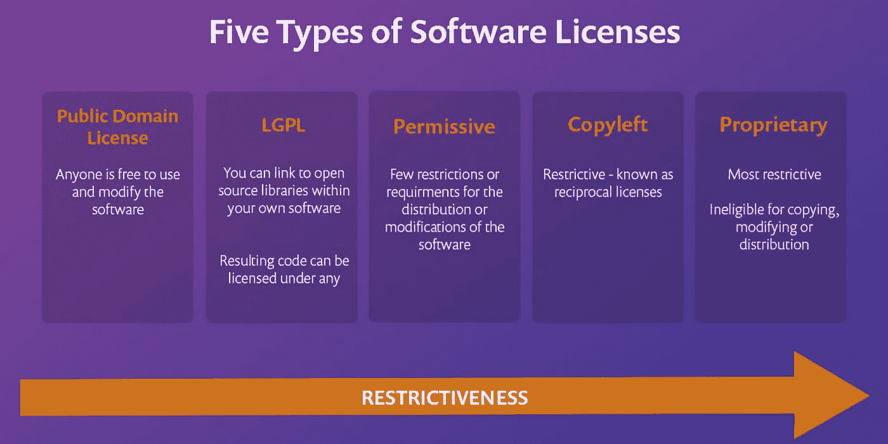

# 屏蔽 NPM 软件包:软件包许可

> 原文：<https://medium.com/globant/screening-npm-packages-package-licensing-c1c51ec216f6?source=collection_archive---------2----------------------->

在主 **npm** 注册表中有超过**130 万**个包可用。开发人员可以利用开源库的优势，并且不需要重新发明已经发明的库，但是当涉及到这些开源库的许可时，我们大多数人可能会在选择正确的库时感到困惑。目前有 200 多种开源许可，但只有一半得到了开源倡议的批准。对于开发人员来说，在某些开源许可证上选择库以确保它满足他们的需求并且产品保持兼容并不是一件容易的事情。

我们将触及广泛使用的受欢迎的 OSI 批准的许可证，也将看到如何选择正确的一个。

## 大多数开源许可证通常属于以下类型之一:

## **公共领域**

这是最宽松的软件许可类型。当软件处于公共领域时，任何人都可以不受任何限制地修改和使用软件。但是在将它添加到您的代码库之前，您仍然需要确保它是安全的。请注意:没有明确许可的代码不会自动进入公共领域。这包括您在互联网上找到的片段。

## 自由的

*许可许可也被称为“Apache 风格”或“BSD 风格”。它们包含了如何修改或重新分发软件的最低要求。这种类型的软件许可可能是自由和开放源码软件使用的最流行的许可。除了 Apache 许可和 BSD 许可，另一种常见的变体是 MIT 许可。*

## **GNU 宽松通用公共许可证**

GNU 宽松通用公共许可证允许你链接到你的软件中的开源库。如果你只是编译或链接一个 LGPL 授权库和你的代码，你可以在任何你想要的许可下发布你的应用，甚至是专有许可。但是如果你修改了这个库或者把它的一部分复制到你的代码中，你将需要用类似 LGPL 的术语来发布你的应用程序。

## *左复印*

*根据 copyright left 许可证的条款，如果新代码在同一软件许可证下发布，许可代码可作为软件项目的一部分进行修改或发布。*

*这意味着，如果软件产品中包含的代码被指定为“仅供个人使用”，则分发的新产品必须带有相同的指定/限制。*

## 所有人

*这些软件许可证使软件不具备复制、修改或分发的资格。这是最严格的软件许可类型，保护开发者或所有者免于未经授权使用软件。*

# 以下是一些最受欢迎和使用最广泛的许可证:

## **麻省理工**

一份简短的许可协议，其条件仅要求保留版权和许可声明。许可的作品、修改和更大的作品可以在不同的条款下发布，并且没有源代码。

## 阿帕奇 2.0

*主要条件要求保留版权和许可通知的许可。贡献者提供专利权的明确授予。许可的作品、修改和更大的作品可以在不同的条款下发布，并且没有源代码。*

## BSD 3-条款

*该许可证也被称为“新 BSD 许可证”或“修改的 BSD 许可证”。BSD 3 条款许可允许您几乎不受限制地自由使用软件，只要您在其中包含 BSD 版权和许可声明(全文可见)。同样的情况也适用于其他常用的 BSD 许可证变体，BSD 双条款许可证，但与非背书条款相关的内容除外。(非背书条款不是****BSD 2-条款*** *许可的一部分。)*

## (美)工业安全委员会(Industrial Security Commission)

*许可许可证允许人们在没有担保的情况下，通过正确的归属对你的代码做任何事情。ISC 许可证在功能上等同于* ***BSD 双条款*** *和****MIT****许可证，删除了一些不再需要的语言。*

## GNU GPLv3

本强左版权许可证的许可条件是在同一许可证下提供许可作品和修改的完整源代码，包括使用许可作品的更大作品。必须保留版权和许可声明。贡献者提供专利权的明确授予。

**参考文献:**

[https://opensource.org](https://opensource.org/)/

详细的比较你也可以参考以下网址:[https://choosealicense.com/appendix/](https://choosealicense.com/appendix/)