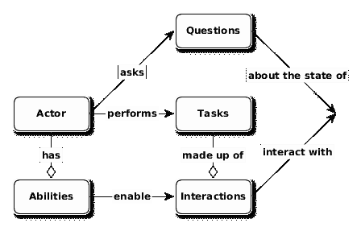
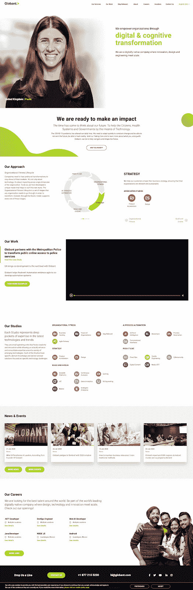

# 自动化测试项目的剧本模式 POM 的替代方案

> 原文：<https://medium.com/globant/screenplay-pattern-for-automation-test-projects-an-alternative-to-pom-58ee297d3673?source=collection_archive---------0----------------------->

*摘要—* 文献和案例研究表明，当自动化测试框架被实现时，页面对象模型作为事实上的模式具有优势。大多数时候，我们都同意好处以及我们应该如何定义它，但有时我们不会考虑其他可能挑战这种方法的因素。

这篇文章的目的不是要推翻这个模型，而是提供测试自动化模式的另一个视角，以及当不可预料的场景出现或者项目条件不理想时，它们如何能够成功地提供帮助。

**为什么在我们的自动化项目中使用设计模式是个好主意？**

自动化测试是开发软件以测试软件的过程。因此，测试模式与软件开发中使用的设计模式大致相似。测试自动化开发中最具挑战性的方面一直是代码维护。由于框架无法应对不断增长的代码库和不断变化的特性，许多测试自动化项目已经被淹没或废弃。为了保持较低的维护成本，自动化工程师应该通过使用现有的功能来进行常见的、通用的或重复的操作，从而尽量减少他们重新发明或从头创建的代码[1]。

**页面对象模型**

页面对象是一种面向对象的模式，作为 AUT 页面的接口[2]，封装页面元素并抽象要在 UI 中执行的操作。好处是，如果页面的 UI 发生变化，测试本身不需要变化，只有页面对象中的代码需要变化。随后，支持新 UI 的所有更改都集中在一个地方[3]。在摘要页面中，对象设计模式提供了以下优势:

*   测试代码和特定于页面的代码(比如定位器和布局)之间有一个清晰的分离。
*   页面提供的服务或操作有一个单一的存储库，而不是让这些服务分散在整个测试中。

POM[4]是所有场景或应用的最佳解决方案吗？当面对复杂的大规模项目时，我们开始看到一些挑战，例如:

*   由于大型类的维护，重构和更新的成本增加，因为它们打破了面向对象的设计原则。
*   为多个页面和复杂组件开发 POM 框架等同于任何应用程序开发，因此团队应该在编程最佳实践方面有丰富的知识。
*   页面对象模型不是一个通用模型，它特定于基于页面/屏幕的应用程序。

对于不熟悉熟练程序员(例如 [SOLID](http://butunclebob.com/ArticleS.UncleBob.PrinciplesOfOod) )使用的模式和设计原则的团队来说，页面对象是一个很好的起点，但是在项目早期就应该考虑将强大的技术技能引入团队的重要性，以避免这些挑战[5]。

**剧本模式**

剧本模式是一种基于软件工程原则编写高质量自动化验收测试的方法，例如:

1.  单一责任:一个类应该只有一个单一的责任。
2.  开放-封闭:软件模块应该对扩展开放，但对修改关闭
3.  有效使用抽象层:隐藏子系统的工作细节，允许关注点分离。

它鼓励健康的测试习惯和设计良好的测试套件，易于阅读，易于维护，易于扩展，使团队能够更有效地编写更健壮和更可靠的自动化测试[6]。它是由 John Ferguson Smart 作为 Serenity BDD 框架的一部分引入的，目的是将设计模式集中在用户交互上，而不是应用程序页面上。

从坚实的[7]原则中提取概念，框架设计在用户与应用程序交互的方式上被分解为目标、任务和行动。

Figure 1: Screenplay pattern model

正如我们已经定义的，用户是模式的主要概念，他们被帮助他们执行用例的不同特性所包围:

*   一个**角色**是应用程序的用户，它拥有一定数量的**能力**，比如浏览网页或者查询 restful web 服务。
*   一个参与者执行**任务**，其中每个任务由一个或多个**交互**组成，考虑到这些交互需要与当前参与者的能力兼容。这些交互直接影响着应用程序的状态
*   行动者可以问**问题**以验证行动和目标。

剧本模式的另一个主要焦点是高可读性测试代码的生成。让我们看看这些概念是如何与一些使用 Java 语言的示例集成在一起的:

定义新的参与者:

actor James = actor . named(“IT 专业人士詹姆斯”)

演员有能力:

詹姆斯·康(用他的浏览器浏览网页)

参与者执行一项任务:

James . attempts to(search careers . for path with(MOBILE _ DEVELOPMENT))

任务由交互组成:

enter . the value(career path)。into(careerpathscreen . search path)

演员提问:

james.should(参见(theCareerItems，hasItem(theCareerPath)))

**研究案例:单页应用**

我们将用一个简单的例子来回顾使用 BDD 和 SOLID 原则设计自动化测试框架的心理过程。

一般来说，web 应用程序被定义为一组具有交互组件的链接网页，允许用户进行预定义的操作和事务。如今，这些应用程序正在转变为像桌面应用程序一样的行为，并用一个新的术语来描述:单页应用程序(SPA)。从技术上讲，SPA 通过用来自服务器的新数据动态重写当前页面来与 web 浏览器交互，而不是浏览器加载整个新页面的默认方法。在这种新的环境下，页面对象模型的概念和优点(特别是在大型复杂的应用程序中)开始变得不清楚。

如果我们严格遵循 POM 模式，SPA 表示将由几个包含大量元素的页面类组成。在最好的情况下，我们可以定义一个组件类的继承树，但仍然由单个页面管理，增加了对象的耦合和责任。将焦点从页面转移到用户交互，我们可以在保持坚实原则的情况下管理一个复杂的 SPA。

[**Globant.com**](https://www.globant.com/)

**让我们分析一下在 POM 世界中单页应用程序通常是如何描述的。**

****

**在这种情况下，登录或主页包含几个具有多个元素和交互的部分。通常这些部分有小的流程和视图，增加了我们需要在每个页面上维护的元素数量。**

**我们的第一个尝试将是开发一个页面类，我们在其中定义所有的元素。最终，这个类将包含数百行代码，由于代码缺乏可读性和低内聚性，增加了复制选择器和方法的机会。我们仍然可以把这个页面分割成一个更容易管理的组件，就像 Martin Fowler 说的:*尽管有“页面”对象这个术语，但这些对象通常不应该为每个页面而构建，而是为页面上的重要元素而构建。但是在继续分析降低页面对象复杂性的更好方法之前，让我们问问自己，我们试图建模的是什么？当我们使用 POM 构建自动化框架时，最大的问题之一是，有时我们专注于描述我们可以在页面上做的每个动作，而不是建模用户可以做什么以及他们如何做。***

**例如，我们可以设计这种特定类型应用程序的多个测试之一，回答以下问题:**

**谁？作为 IT 专业人士的詹姆斯**

****为什么？**(目标):情景:了解职业机会**

****什么？**(任务):当我寻找移动发展职业道路的机会时**

***@When("当我寻找移动发展职业道路的机会")***

***public void searchForCareerPath(){***

***专业人士试图(***

***search careers . for path with(MOBILE _ DEVELOPMENT)；***

***)；***

***}***

****如何？**(动作):**

***输入. the(searchCareerPath)。into(careerpathscreen . search path)；***

***click . on(careerpathscreen . search button)；***

**因此，根据关于对象处理多少功能的第一个坚实原则(S:单一责任),最终的体系结构将描述较小的类，而不是像下面这样的几个大类:**

**| —问题**

**| |—CareerDetails.java**

**| |—CareerFilter.java**

**| |—DisplayedCareer.java**

**| |—CareerAvailability.java**

**| |—TheCareerStatus.java**

**| |—TheCareers.java**

**|**

**| —任务**

**| |—SearchCareers.java**

**| |—SeeCareerDetails.java**

**| |—ClearCareerFilter.java**

**| |—FilterCareer.java**

**| |—ApplyForJob.java**

**|**

**| —用户界面**

**| |—ApplicationHomePage.java**

**| |—Careers.java**

**| |—CareersDetails.java**

**| |—ApplyJob.java**

**现在，如果我们想添加新的功能，我们只需要创建一个新的类，避免修改现有的类，并满足第二个坚实的原则(O: Open Close ),即一个类应该对扩展开放，但对修改关闭。**

**我们可以提到，像 Java 和 javascript[9]这样最常用的编程语言都支持剧本模式。它与 JBehave 和 Cucumber 等 BDD 框架进行了本机集成，还包括 Selenium 和 RestAssured，分别作为 Web 和 API 的自动化框架。**

****我应该开始重构我所有的代码，并转向电影剧本模式吗？****

**第一个答案是不会。实现新设计模式的真正好处将取决于许多因素，如应用程序架构类型、团队技能、开发过程的稳定性等等。**

**我的建议是先启动一个新项目，然后测试你对层组织和编码效率、可读性和可维护性的感觉。此外，测试从简单到复杂的不同场景，以便预测沿途可能出现的障碍或问题。**

**这里提供的例子只是一个初步的指导，有助于展示主要的概念，但是实现可能会有所不同，并且可以发现模式之间的一些混合。试着根据你的知识调整你的框架以适应你的需求，并围绕市场上的概念和成功经验进行更多的阅读。**

**作为个人想法的总结，页面对象模型对于正在学习实现自动化框架的团队非常有用，但是当我们经历更复杂的场景，其中涉及多个团队并且自动化代码呈指数增长时，如果不将其视为生产代码，这种方法可能会导致不清楚的结果。剧本模式允许我们从一开始就开发更安全和可管理的，允许可维护和可伸缩的测试框架实现。另一方面，需要对层抽象和编程技巧有很好的理解，这样成熟的团队才能从实现中充分受益。一个很好的起点是 John Ferguson Smart 个人网页[10],在那里你可以找到文档、网上研讨会和在线活动。**

****参考文献:****

**[1][https://blog . aspire sys . com/testing/design-patterns-in-test-automation-world/](https://blog.aspiresys.com/testing/design-patterns-in-test-automation-world/)**

**[2]测试中的应用程序**

**[3][https://www . selenium . dev/documentation/en/guidelines _ and _ recommendations/page _ object _ models/](https://www.selenium.dev/documentation/en/guidelines_and_recommendations/page_object_models/)**

**[4]页面对象模型**

**[5][https://www . infoq . com/articles/Beyond-Page-Objects-Test-Automation-Serenity-screen play/](https://www.infoq.com/articles/Beyond-Page-Objects-Test-Automation-Serenity-Screenplay/)**

**[6][https://serenity-BDD . github . io/theserentitybook/latest/serenity-screen play . html](https://serenity-bdd.github.io/theserenitybook/latest/serenity-screenplay.html)**

**[7]SOLID 是五个设计原则的助记首字母缩略词，旨在使软件设计更易于理解、灵活和维护**

**[https://martinfowler.com/bliki/PageObject.html](https://martinfowler.com/bliki/PageObject.html)**

**[9]serenity-js.org**

**[https://johnfergusonsmart.com/serenity-bdd/](https://johnfergusonsmart.com/serenity-bdd/)**