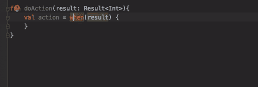
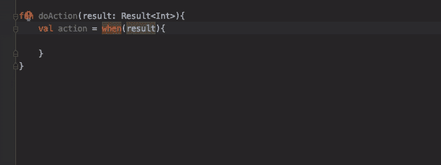

# 用类密封

> 原文：<https://medium.com/androiddevelopers/sealed-with-a-class-a906f28ab7b5?source=collection_archive---------0----------------------->


## 科特林词汇—密封类

通常我们需要表现有限的可能性；一个 web 请求要么成功，要么失败，一个`User`只能是一个专业用户或者一个标准用户。

为了对此建模，我们可以使用一个`enum`，但是这有很多限制。枚举类只允许每个值有一个实例，不能对每个类型编码更多的信息，例如一个`Error`事例有一个关联的`Exception`属性。

你可以使用一个抽象类和一些扩展，但是这失去了枚举带来的有限类型集的优势。[密封类](https://kotlinlang.org/docs/reference/sealed-classes.html)提供了两个世界的精华:抽象类的自由表示和枚举类型的受限集合。请继续阅读，了解更多关于密封类的信息，或者，如果您喜欢视频，请点击此处查看:

# 密封类的基础

像抽象类一样，密封类允许您表示层次结构。子类可以是任何类型的类:一个数据类，一个[对象](https://kotlinlang.org/docs/reference/object-declarations.html#object-declarations)，一个常规类，甚至是另一个密封类。与抽象类不同，您必须在同一个文件中或者作为嵌套类来定义这些层次结构。

```
// Result.ktsealed class Result<out T : Any> {
    data class Success<out T : Any>(val data: T) : Result<T>()
    data class Error(val exception: Exception) : Result<Nothing>()
}
```

试图将密封类扩展到定义它的文件之外会产生编译错误:

```
*Cannot access ‘<init>’: it is private in Result*
```

# 忘了一根树枝？

我们通常希望处理所有可能的类型:

```
when(result) {
    is Result.Success -> { }
    is Result.Error -> { }
}
```

但是如果有人加了一种新型的`Result` : `InProgress`呢:

```
sealed class Result<out T : Any> {
    data class Success<out T : Any>(val data: T) : Result<T>()
    data class Error(val exception: Exception) : Result<Nothing>()
    **object InProgress : Result<Nothing>()** }
```

如果一个分支没有被覆盖，编译器会给我们一个错误，而不是依靠我们的内存或 IDE 搜索来确保所有 when 用法都处理新类。当像 if 语句一样，只需要我们通过产生一个编译器错误来覆盖所有选项(也就是详尽的)时，它就像一个表达式:

```
val action = when(result) {
    is Result.Success -> { }
    is Result.Error -> { }
}
```

*当表达式必须详尽时，添加必要的“正在进行中”分支或 else 分支，而不是*

即使我们使用 when 作为语句，也要获得这种漂亮的好处，添加这个 helper 扩展属性:

```
val <T> T.exhaustive: T
    get() = this
```

所以现在，通过添加`.exhaustive`，如果一个分支丢失了，编译器将给出我们之前看到的同样的错误。

```
when(result){
    is Result.Success -> { }
    is Result.Error -> { }
}.exhaustive
```

# IDE 自动完成

由于密封类的所有子类型都是已知的，IDE 可以为我们填充 when 语句的所有可能的分支:



这个特性在更复杂的密封类层次结构中大放异彩，因为 IDE 可以识别所有分支:

```
sealed class Result<out T : Any> {
  data class Success<out T : Any>(val data: T) : Result<T>()
  **sealed class Error(val exception: Exception) : Result<Nothing>() {
     class RecoverableError(exception: Exception) : Error(exception)
     class NonRecoverableError(exception: Exception) : 
                                               Error(exception)
  }** object InProgress : Result<Nothing>()
}
```



这是不能用抽象类实现的功能类型，因为编译器不知道继承层次；因此，IDE 无法生成分支。

# 在后台

那么是什么让密封类有这样的行为呢？让我们看看反编译的 Java 代码中发生了什么:

```
sealed class Result
data class Success(val data: Any) : Result()
data class Error(val exception: Exception) : Result()@Metadata(
…
d2 = {“Lio/testapp/Result;”, “T”, “”, “()V”, **“Error”, “Success”**, “Lio/testapp/Result$Success;”, “Lio/testapp/Result$Error;” …}
)public abstract class Result {
    private Result() {}
    // $FF: synthetic method
    public Result(DefaultConstructorMarker $constructor_marker) {
        this();
    }
}
```

密封类的元数据保存了子类的列表，允许编译器在需要的地方使用这些信息。

`Result`被实现为一个抽象类，有两个构造函数:

*   私有默认构造函数
*   只能由 Kotlin 编译器使用的合成构造函数

所以，这意味着没有其他类可以直接调用构造函数。如果我们查看 Success 类的反编译代码，我们会看到它调用合成构造函数:

```
public final class Success extends Result {
    @NotNull
    private final Object data

    public Success(@NotNull Object data) {

       **super((DefaultConstructorMarker)null);** this.data = data;
    }
```

开始使用密封类来建模受限的类层次结构，允许编译器和 IDE 帮助您避免类型错误。