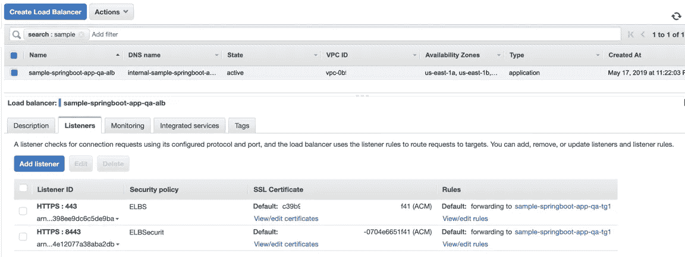
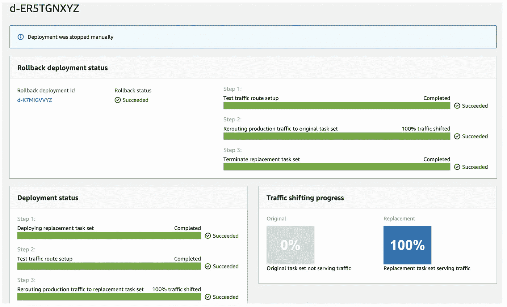

# 使用 AWS CodeDeploy 深入了解无缝蓝/绿部署

> 原文：<https://medium.com/capital-one-tech/seamless-blue-green-deployment-using-aws-codedeploy-4c36c0bbeef4?source=collection_archive---------0----------------------->


在我们深入了解如何使用蓝/绿部署之前，让我们试着了解一下它是什么。

*蓝/绿部署是一种部署模式，旨在部署新版本的应用程序/软件，而不会出现任何停机或风险极小。蓝/绿部署是通过建立一个类似的堆栈，然后在这个新的堆栈上部署新版本的应用程序来实现的。流量从当前堆栈(称为蓝色堆栈)转移到新堆栈(称为绿色堆栈)。*

既然我们已经讨论了它是什么，那么为什么应该选择蓝/绿部署呢？

*   **无停机:**您将流量从蓝色堆栈转移到绿色堆栈。
*   **简单回滚:**如果绿色堆栈不健康，您可以遵循相反的过程，将流量移回蓝色堆栈。
*   **降低风险:**在迁移生产实时流量之前，您可以通过运行功能测试来验证绿色堆栈。

在这篇博客中，我们将深入探讨如何使用 [**AWS CodeDeploy**](https://aws.amazon.com/codedeploy/) 服务为 ECS 容器任务进行蓝/绿部署。

当 AWS 在 2015 年 4 月推出 ECS 时，没有对蓝/绿部署的现成支持。工程师们尝试了各种方法来解决这个问题，包括:

*   交换 ELB 后面的自动缩放组。
*   更新自动扩展组启动配置。
*   使用 Route53 的 DNS 路由更新。

2016 年 8 月，AWS 推出了[应用负载均衡器](https://docs.aws.amazon.com/elasticloadbalancing/latest/application/introduction.html) (ALB)，但仍不支持 ECS 蓝/绿部署。为了解决这个问题，我在 Capital One 的团队实施了我们自己开发的蓝/绿部署解决方案，使用测试 ALB 测试流量，然后交换 ALB 侦听器规则以实现蓝/绿任务之间的流量切换。

快进到 2018 年 11 月，亚马逊 ECS 使用 [CodeDeploy](https://aws.amazon.com/codedeploy/) 添加了对蓝/绿部署的官方支持。

# ECS 蓝/绿部署的先决条件

*   ECS 部署类型应为“蓝绿色”。
*   ECS 服务必须使用应用程序负载平衡器或网络负载平衡器。*我们将在本博客中使用 ALBr。*
*   ALB 应该有一个接受 prod 流量的侦听器。
*   可以向负载平衡器添加一个可选的测试监听器，用于路由测试流量。如果您指定了测试侦听器，CodeDeploy 会在部署期间将您的测试流量路由到替换/绿色任务集。
*   应该创建两个 ALB 目标组，一个用于蓝色任务，另一个用于绿色任务。

# CodeDeploy 蓝/绿部署流程

这里的假设是，开发团队已经在使用部署自动化以编程方式创建带有 ALB 和目标组的 ECS 服务，或者他们应该使用 AWS 控制台进行设置。

下图显示了初始部署，其中只有蓝色任务正在运行，并占用 100%的生产流量。


Initial Blue Stack

现在，让我们看看基于 CodeDeploy 的蓝/绿部署。从下图中，您会注意到绿色任务开始了(它们是新版本的代码),并被附加到目标组 2。ALB 测试流量监听程序现在已准备好接收端口 8443 上的测试流量，测试流量将被发送到使用目标组 2 的绿色任务。一旦测试流量通过测试监听器准备好，我们就可以添加一个钩子(lambda 函数)。lambda 函数可以在 ALB/test 侦听器端口 8443 上执行一些功能测试，并将返回“成功”或“失败”。


*Green traffic flowing through Test listener*

假设测试流量 lambda hook 返回“成功”，生产流量被路由到目标组 2，该组又由绿色任务(新代码版本)提供服务。ALB prod 监听器端口 443 和 test 监听器端口 8443 现在都指向目标组 2。CodeDeploy 将蓝色任务保留一段预先配置的时间，以便可以从 CodeDeploy 控制台或通过 CLI/API 调用进行回滚。


*Prod traffic flowing through Green tasks*

一旦经过了预先配置的时间段，CodeDeploy 将终止蓝色任务，在这一点之后，回滚将是不可能的。


*Blue tasks terminated*

# **各种代码部署资源**

现在让我们深入研究一下实现细节。支持 ECS 蓝/绿部署需要以下 AWS CodeDeploy 工件:

*   代码部署应用程序
*   CodeDeploy 部署组
*   代码部署部署


因此，您可以从 AWS CodeDeploy 控制台创建上述 CodeDeploy 资源，也可以使用 CLI 或特定于语言的 API(如 [Python/Boto3](https://boto3.amazonaws.com/v1/documentation/api/latest/index.html) )以编程方式创建它们。让我们看一看它是什么样子的:

## **使用 Python/Boto3 创建一个 CodeDeploy 应用程序:**

```
cd_client = boto3.client('codedeploy')
response = cd_client.create_application( applicationName=application_name,
    computePlatform='ECS')
```

## **使用 Python/Boto3 创建一个 CodeDeploy 部署组:**

```
response = cd_client.create_deployment_group(
    applicationName='AppECS-sample-springboot-app-qa-bg',
    deploymentGroupName='DgpECS-sample-springboot-app-qa-bg',
    deploymentConfigName='CodeDeployDefault.ECSAllAtOnce',serviceRoleArn='arn:aws:iam::123456789123:role/ecs_service_role',
    triggerConfigurations=[
    {
      'triggerName': 'sample-springboot-app-qa-code-deploy-bg-
      trigger',
      'triggerTargetArn': 'arn:aws:sns:us-east-
      1:123456789123:my_sns_topic',
      'triggerEvents': [
        "DeploymentStart",
        "DeploymentSuccess",
        "DeploymentFailure",
        "DeploymentStop",
        "DeploymentRollback",
        "DeploymentReady"
      ]
    },
],autoRollbackConfiguration={
    'enabled': True,
    'events': [
      'DEPLOYMENT_FAILURE', 'DEPLOYMENT_STOP_ON_ALARM', 
      'DEPLOYMENT_STOP_ON_REQUEST',
    ]
},deploymentStyle={
    'deploymentType': 'BLUE_GREEN',
    'deploymentOption': 'WITH_TRAFFIC_CONTROL'
},blueGreenDeploymentConfiguration={
    'terminateBlueInstancesOnDeploymentSuccess': {
      'action': 'TERMINATE',
      'terminationWaitTimeInMinutes': 15
    },

    'deploymentReadyOption': {
       'actionOnTimeout': 'CONTINUE_DEPLOYMENT'
    }
},loadBalancerInfo={
    'targetGroupPairInfoList': [
      {
        'targetGroups': [
          {
            'name': 'sample-springboot-app-qa-tg1'
          },
          {
            'name': 'sample-springboot-app-qa-tg2'
          }
        ],
        'prodTrafficRoute': {
          'listenerArns': 'arn:aws:elasticloadbalancing:us-east-    
          1:123456789123:listener/app/sample-springboot-app-qa-
          alb/2b8b8ab60f9c7e43/97b643f12d4fa8a4'
        },
        'testTrafficRoute': {
          'listenerArns': 'arn:aws:elasticloadbalancing:us-east-
          1:123456789123:listener/app/sample-springboot-app-qa-
          alb/2b8b8ed64f9c7e43/09261df9b5476d39'
        }
      },
    ]
},ecsServices=[
    {
      'serviceName': 'sample-springboot-app-qa',
      'clusterName': 'my-test-cluster'
    }
]
)
```

## **创建一个 CodeDeploy 部署:**

```
response = cd_client.create_deployment(
    applicationName='AppECS-sample-springboot-app-qa-bg',
    deploymentGroupName='DgpECS-sample-springboot-app-qa-bg',
    revision={
      'revisionType': 'AppSpecContent',
      'appSpecContent': {
        'content': "APPSPEC FILE CONTENT",
        'sha256': "xxxxxx"
      }
    }, ignoreApplicationStopFailures=False,
    autoRollbackConfiguration={
      'enabled': True,
      'events': [
        'DEPLOYMENT_FAILURE',
        'DEPLOYMENT_STOP_ON_ALARM',
        'DEPLOYMENT_STOP_ON_REQUEST'
      ]
    }
)
```

CodeDeploy“部署”使用一个 AppSpec 文件，这是一个 YAML 文件，提供资源信息和执行挂钩信息。如下所示，资源部分包含任务定义和容器信息。Hooks 部分允许您添加 lambda 函数，以便在 CodeDeploy 蓝/绿部署的生命周期中的不同时间点触发(更多详细信息请参见下一部分)。

```
{
    "version": 0.0,
    "Resources": [
        {
            "TargetService": {
                "Type": "AWS::ECS::Service",
                "Properties": {
                    "TaskDefinition": "ECS-TASK-DEFINITION-ARN",
                    "LoadBalancerInfo": {
                        "ContainerName": "my-container",
                        "ContainerPort": 8080
                    }
                }
            }
        }
    ],
    "Hooks": [
  {
   "AfterAllowTestTraffic": "arn:aws:lambda:us-east-1:1234567890:function:my-green-ready-hook"
  }
 ]
}
```

# 蓝/绿部署在行动:快乐之路

## **初始设置:**

这里我们有一个使用蓝/绿部署的 ECS 服务(由 CodeDeploy 提供支持),运行一个 Fargate 任务。

请注意，ECS 服务是基于 ECS 任务定义版本 132 运行的，并且正在运行一个 Fargate 任务:


ECS- Before Blue/Green deployment

附加到此 ECS 服务的 ALB 和目标组:


ALB — Before Blue/Green deployment

端口 443 的监听器是生产流量监听器，端口 8443 是测试流量监听器。此时，两个监听器都连接到以“-tg2”结尾的同一个目标组。


Target Groups — Before Blue/Green deployment

为此 ECS 服务创建的两个目标组使用 Code Deploy 支持蓝/绿部署。此时，只有目标组“-tg2”正在运行一个目标/任务，并连接到上面的 ALB 监听器。

## 让我们启动蓝绿部署

首先，我们开始 ECS 服务的蓝/绿部署。可以使用 ECS API 或使用 AWS ECS 控制台-更新 ECS 服务功能以编程方式启动 ECS 部署，然后从 CodeDeploy 控制台或 CodeDeploy API 创建新的部署。更新的代码版本将在新的 ECS 任务定义文件中提及，该文件将用于更新 ECS 服务。

由于 ECS 服务的部署控制器是 CodeDeploy，CodeDeploy 中的部署将被触发，一个新的 ECS 任务将在这里启动。


CodeDeploy — Initiate Deployment

您可以在下面看到一个新的 ECS 任务已经开始，运行计数现在是 2。在 Deployments 选项卡下，主要条目用于当前的蓝色任务，活动条目用于新的即将到来的绿色任务。


ECS — Blue/Green deployment in progress in CodeDeploy

绿色任务现在已经启动并运行。PROD 流量仍然由原始堆栈中的蓝色任务提供服务。在这个阶段，回滚仍然是可能的，但是请记住，回滚只会终止绿色任务。


Code Deploy — Post creation of Green task

现在 ALB 监听器已经更新了。PROD 侦听器(端口 443)仍然与目标组“-tg2”连接，并为实时流量提供服务。测试侦听器(端口 8443)与目标组“-tg1”相关联，该目标组以前根本没有与 ALB 相关联。因此，您可以点击 ALB DNS:8443 并测试绿色堆栈，该堆栈没有接收任何生产流量。


ALB — Now listeners are connected to PROD and TEST target groups

现在，“-tg1”(获取测试流量)和“-tg2”(获取生产流量)都连接到 ALB 服务测试和生产监听器。


Target Groups — Both target groups now active and attached to ALB

## **生产流量从蓝色移动到绿色任务:**

流量路由完成，新的绿色任务(或替换任务)现在服务于生产流量。**但是流量路由是怎么发生的呢？我们能控制这一切吗？** —好问题，我会在单独的部分回答:)

在这个阶段回滚仍然是可能的，因为蓝色任务仍然存在并处于空闲状态，它将在接下来的 15 分钟内可用(这个持续时间可以在 DeploymentGroup 属性“terminationWaitTimeInMinutes”中配置，如前一节所示),但是**回滚是如何工作的？** —这又是一个好问题，我将在另一部分解释。


CodeDeploy — Traffic rerouting done

ECS 现在使用更新的任务定义版本 133(以前是 132)运行任务。原始任务和新任务仍然在运行，这就是为什么回滚仍然是可能的。“部署”选项卡现在显示 100%的流量由替换任务提供服务，这是新的绿色任务。


ECS — Post traffic rerouting from blue to green

现在，ALB 监听器 PROD (Port-443)和 TEST (Port-8443)都指向目标组“-tg1”，该组将绿色任务作为目标。



ALB — Post traffic rerouting

## 快进 15 分钟—蓝/绿部署已经完成

根据 code deploy“deployment group”配置“terminationWaitTimeInMinutes”，15 分钟后将终止蓝色任务。由于蓝色任务消失，回滚不再可能！


CodeDeploy — Post termination of Blue/original task

随着蓝色/原始任务的消失，ECS 运行任务计数恢复为 1。任务定义版本为“133”，这意味着新版本服务于生产流量。在“部署”选项卡下，活动条目现在已不存在。


# 蓝/绿部署正在进行:回滚流程

## 让我们回顾一下我们当前稳定的生产状态:

*   ECS 服务正在使用任务定义版本 133 运行 1 个任务。
*   ALB 监听器生产(端口 443)和测试(端口 8443)都指向目标组“-tg1”。
*   目标组“-tg1”处于活动状态，为生产流量提供服务，而“-tg2”未连接到 ALB。

我们现在要部署一个新版本，并将在流量重新路由后进行回滚，以演示回滚流程:

## 同样，让我们启动蓝/绿部署:

让我们快进并查看新的蓝/绿部署将流量重新路由到绿堆栈并等待 15 分钟后终止原始/蓝任务的状态。

我们有 CodeDeploy 蓝/绿部署等待终止蓝任务，并产生由新的绿/替换任务服务的流量。


CodeDeploy — Post rerouting traffic

ECS 服务现在使用新的 ECS 任务定义版本 134(我们从 133 开始此部署)运行新任务，我们的 ECS 运行任务计数为 2，一个使用 ECS 任务定义版本 133，另一个使用新的 ECS 任务定义版本 134。ECS 部署应该显示新的主要任务为 100%的流量提供服务。


ECS Service — Deployment View

ALB 侦听器 PROD(端口 443)和 TEST(端口 8443)都指向目标组“-tg2”。以前它们连接到“-tg1”。


ALB — Listeners

# **所以，让我们假设部署不顺利，我们现在必须回滚…**

让我们通过单击“停止并回滚部署”按钮从 CodeDeploy 控制台启动回滚:


Code Deploy — Stop and rollback message

部署的工作方式是 CodeDeploy 停止当前部署并跳过删除原始/蓝色任务的步骤。然后，它创建一个新的部署来回滚以前的部署，并将流量从替换/绿色任务重新路由回原始/蓝色任务。它还终止替换/绿色任务。



Code Deploy — Rollback Deployment

# 让我们回顾一下 ECS 和 ALB 设置看起来像回滚后的样子

ECS 服务现在正在使用原始任务定义版本 133 运行任务，并且正在运行的任务计数回到 1。ECS 部署显示主要任务的生产流量为 100%。


ECS Service — Post Rollback

ALB 侦听器(生产和测试)都返回到目标组“-tg1”。


ALB — Listeners Post Rollback

***这样就完成了成功的回滚！***

# 如何控制蓝/绿任务之间的流量路由？

CodeDeploy 允许您运行蓝色/绿色部署管道的附加挂钩。钩子只是你实现的 lambda 函数。

一些示例场景如下:

*   在路由生产流量之前，在绿色堆栈上运行功能测试。
*   一些环境设置，如在生产流量迁移之前将文件下载/上传到 S3。

# Amazon ECS 部署的生命周期事件挂钩列表(参考:此处)

*   **BeforeInstall** —用于在创建替换任务集之前运行任务。
*   **AfterInstall** —用于在创建替换任务集并且其中一个目标组与其关联后运行任务。
*   **AfterAllowTestTraffic** —用于在测试监听器向替换任务集提供流量后运行任务。此时钩子函数的结果可以触发回滚。
*   **BeforeAllowTraffic** —用于在第二个目标组与替换任务集关联之后，但在流量转移到替换任务集之前运行任务。这个生命周期事件中钩子函数的结果可以触发回滚。
*   **AfterAllowTraffic** —用于在第二个目标组向替换任务集提供流量后运行任务。这个生命周期事件中钩子函数的结果可以触发回滚。

## **如何添加生命周期挂钩？**

生命周期挂钩 lambda 函数可以通过您创建的 AppSpec 文件添加，并附加到 CodeDeploy 部署对象，请参考上一节中的示例。

我的自动回滚实现包括:

*   为生命周期事件" **AfterAllowTestTraffic "添加一个挂钩。**
*   lambda 函数使用 ALB DNS +测试侦听器端口(8443)对绿色任务运行功能测试。
*   如果功能测试通过(即向 CodeDeploy 控制台返回“Succeeded”)，蓝/绿部署将继续，流量将转移到绿色堆栈。
*   如果测试失败(即向 CodeDeploy 控制台返回“失败”)，它将启动流量到蓝色堆栈的自动回滚。

# TL；速度三角形定位法(dead reckoning)

使用 AWS CodeDeploy 的 ECS 服务部署是一个非常强大的组合，它提供了非常简单和健壮的蓝/绿部署支持。

额外的部署生命周期挂钩使您能够根据自己的需求灵活地控制流量路由策略。

如果您已经在广泛使用 AWS 服务，并且 ECS 是您的容器部署平台，那么您绝对应该考虑将它作为一个首选架构，而不是自行开发的解决方案。

*如果你想了解使用现有 AWS 服务的金丝雀部署模式，请点击这里*[](/capital-one-tech/deploying-with-confidence-strategies-for-canary-deployments-on-aws-7cab3798823e)**，这是一篇关于这个主题的精彩文章！**

# ***参考文献:***

*   *AppSpec 文件示例:[https://docs . AWS . Amazon . com/code deploy/latest/user guide/reference-app spec-File-Example . html # app spec-File-Example-ECS](https://docs.aws.amazon.com/codedeploy/latest/userguide/reference-appspec-file-example.html#appspec-file-example-ecs)*
*   *ECS 部署钩子:[https://docs . AWS . Amazon . com/code deploy/latest/user guide/reference-app spec-file-structure-Hooks . html # app spec-Hooks-ECS](https://docs.aws.amazon.com/codedeploy/latest/userguide/reference-appspec-file-structure-hooks.html#appspec-hooks-ecs)*

**披露声明:2020 资本一。观点是作者个人的观点。除非本帖中另有说明，否则 Capital One 不隶属于所提及的任何公司，也不被这些公司认可。使用或展示的所有商标和其他知识产权是其各自所有者的财产。**