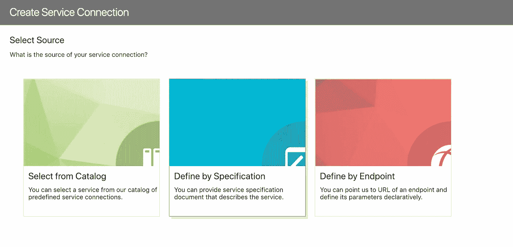
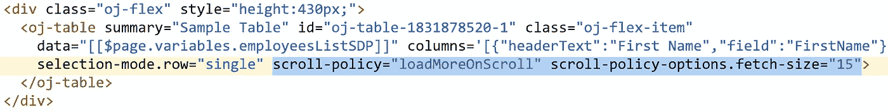

# 基于 ADF BC REST 的 Oracle Visual Builder 中的搜索表单

> 原文：<https://medium.com/oracledevs/search-form-in-oracle-visual-builder-based-on-adf-bc-rest-7761f33d15db?source=collection_archive---------0----------------------->

Oracle Visual Builder 支持现成的 ADF BC REST。使用“按规范定义”向导建立服务连接:

向导支持 ADF 作为 API 类型。在 REST URL 的末尾添加 *describe* ，这将为公开的 ADF BC REST 服务带来元数据(关于属性类型的信息等。):

将自动填充端点列表。您可以选择连接支持的所有端点，也可以只选择几个端点:

对 endpoint 最典型的操作是将它与表进行映射，以显示收集的数据。您可以将 Oracle JET 表拖放到 VBCS 页中，然后选择“添加数据”选项将其与服务连接进行映射:

在向导中，您可以选择先前定义的服务连接:

有一种方法可以将向导切换到详细视图，并从可用于连接的多个端点中进行选择:

在下一步中，您将选择要在表列中显示的服务属性。所有声明，甜蜜:

在 Visual Builder 中，您可以随时快速测试应用程序，它将在单独的浏览器选项卡中加载(或者您可以将应用程序切换到实时模式，并直接在 VBCS 窗口中测试页面功能):

Visual Builder 中的每个操作都是通过事件来处理的。例如，此事件映射有重置按钮(您可以在左侧的结构选项卡中看到它):

在任何时候，您都可以切换到源代码视图，并检查(或编辑)Visual Builder 为您生成的 HTML/JET 代码。太酷了，想象一下手工输入和复制粘贴所有这些文本，既费力又费时(你可以在生活中做比复制粘贴 HTML 代码更好的事情):

让我们解释一下在这个例子中搜索表单逻辑是如何完成的。我已经定义了页面范围变量类型，该类型将保存搜索属性名称、类型和操作:

基于此类型创建尽可能多的变量，尽可能多的搜索条件项。确保提供属性和操作名称(将 value 属性留空，这将由用户指定):

用变量映射搜索表单字段:

为搜索按钮创建一个事件，该事件调用搜索操作链:

在动作链中，我们可以定义搜索逻辑。在执行搜索条件之前，我们需要准备搜索条件数组(通常可以跳过这一步，但当前的 Visual Builder 存在问题，当至少一个条件项为空时，它无法执行条件搜索)。调用自定义 JavaScript 函数，其中将准备搜索条件数组:

自定义 JavaScript 函数，它有助于准备基于标准的数组(如果未设置搜索项，我们将分配空值):

函数的结果与服务连接标准相映射，搜索将自动执行:

表分页也是自动处理的。确保指定滚动策略= loadMoreOnScroll 并定义提取大小:

资源:

1.  我的 [GitHub](https://github.com/abaranovskis-redsamurai/vbcsmodularapp) 上的示例源代码
2.  Shay 的博客— [在 Visual Builder 中用复合条件过滤数据提供者](https://blogs.oracle.com/shay/filtering-data-providers-with-compound-conditions-in-visual-builder)
3.  Shay 的博客— [基于 Oracle ADF 的 Oracle JET UI，带有可视化构建器](https://blogs.oracle.com/shay/oracle-jet-ui-on-top-of-oracle-adf-with-visual-builder)
4.  我之前的一篇关于 Visual Builder 中的查询逻辑的文章—[ADF BC REST 在 VBCS 的查询逻辑实现](http://andrejusb.blogspot.com/2018/09/query-logic-implementation-in-vbcs-for.html)

*原载于 2019 年 1 月 26 日*[*andrejusb.blogspot.com*](https://andrejusb.blogspot.com/2019/01/search-form-in-oracle-visual-builder.html)*。*