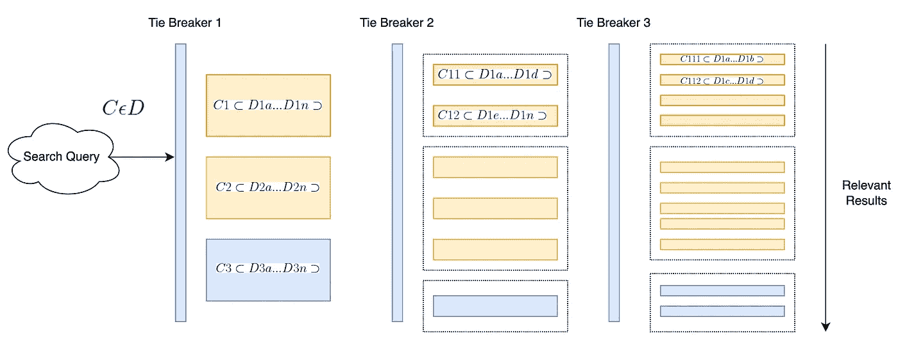
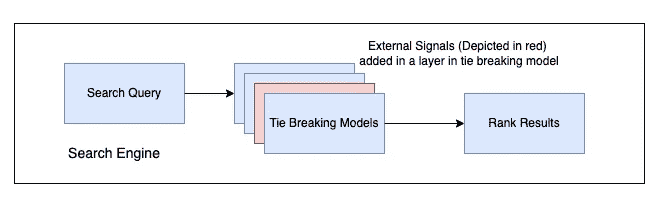
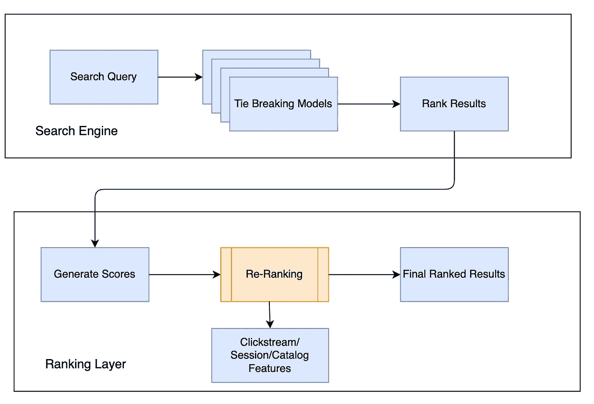
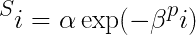
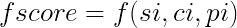

# 非评分搜索引擎中的搜索重新排序

> 原文：<https://medium.com/walmartglobaltech/search-re-ranking-in-non-scoring-search-engines-74e5aea2b33e?source=collection_archive---------5----------------------->

Search Re Ranking in non-scoring engines

# **问题陈述:**

搜索引擎的相关性基于不同类型的评分模型。查询中的文档检索可以表示为基于相关性的文档级别的分数。solr、elastic search、vespa 等搜索引擎遵循加权评分模型(更好和最受欢迎)来基于相关性检索文档。在像 endeca 这样的少数搜索引擎中，algolia 搜索相关性是基于平局决胜模型的。基于不同的外部属性重新排列文档是一个挑战。

在这个博客中将讨论以下问题。

*   *在非评分搜索引擎中，如何根据外部信号对搜索结果进行重新排序？*
*   *如何使解决方案通用，而不考虑搜索引擎？*

# 无评分搜索引擎是如何工作的？

评分搜索引擎一般使用 [TF-IDF](https://www.researchgate.net/publication/238123710_Understanding_Inverse_Document_Frequency_On_Theoretical_Arguments_for_IDF) 或 [BM-25](https://www.researchgate.net/publication/220613776_The_Probabilistic_Relevance_Framework_BM25_and_Beyond) 算法基于查询检索相关文档。搜索检索算法已经发展，并且基于向量的搜索相似性搜索已经用于检索相关文档。在这个博客中，我们将讨论不提供评分模型的搜索引擎。

以下是在非评分搜索引擎中确定查询相关性所基于的一组特征。

*   **Words** :如果查询包含一个以上的术语，那么匹配用户键入的更多单词的对象的排名将会更高。
*   **属性**:在更重要的属性(标题、描述)中，匹配项的排名会更高。
*   **接近度**:将排名较高的词相互接近(脱脂牛奶比脱脂半乳好)。
*   **错别字**:不包含错别字的单词排名会更靠前。
*   **Position** :将位于属性开头而不是中间或结尾的单词排序。
*   **精确**:对没有任何后缀的精确匹配的单词进行排名

非评分搜索引擎应用上述特征集并应用相关性排名。管道从一个搜索引擎到另一个有所不同，平局决胜模式通常对这些搜索引擎中的每一个都是独特的。让我们在下一节讨论基于外部信号的重新排序。

# 搜索相关性—平局打破模式

*   对于搜索查询，基于相关字段，搜索引擎从完整的集合/索引(D)中检索结果的语料库(C)。
*   现在，基于搜索引擎中定义的相关性模型对文档进行排序和分类。当它通过第一个标准时，语料库(C)基于匹配被进一步分成语料库(C1·C2……)的子集
*   下一组相关性参数被应用于相同的语料库(C1)，并且进一步的结果被分组为粒度的(C11，C12)，并且在第一次平局决胜中 C1 和 C2 之间发生的结果的排名总是被保持，直到所有的排名标准被应用到最后。
*   在应用所有标准之后，检索最终的相关结果。应用标准的顺序因搜索引擎而异。

Tie-breaker Model

# 如何利用外部信号影响相关性？

在现代搜索引擎(solr/elastic)中，整合外部信号/排名模型/属性以使搜索相关变得更加容易和简单。我们不打算讨论在加权评分模型中影响相关性。在平局决胜模型中，我们如何整合外部信号？

搜索相关性会受到外部信号数量的影响。

*   客户行为——当客户试图获得相关结果时，点击流数据、会话数据、用户行为/购买总是可以考虑在内的。
*   产品属性——动态产品属性也可以作为影响顾客购物模式的主要信号之一。
*   当前趋势—基于不同来源的季节性/区域性影响，相关性可能会发生变化。

# 将外部信号作为属性添加到现有相关性中

一种选择是使用这些信号作为现有搜索相关性的属性，如下所述。平局决胜层之一可以包括这些信号以在现有相关性中重新排序。

下面是这种方法的缺点列表

*   一旦外部信号适合平局决胜模型，对外部信号进行的计算就失去了其准确性/价值。
*   添加多个信号在定义优先级方面存在问题，并且搜索引擎需要动态选择数百个这些信号，这是一个限制。
*   在搜索引擎中包括这些排名算法会产生对搜索引擎的依赖性，并且很少有搜索引擎对包括运行时间信号有限制。
*   许多开源排名模型是可用的。因此，理想情况下，这些排名解决方案应该是不可知的搜索引擎。

# 搜索引擎外的排名

可以使用各种信号来构建排名算法，如添加到购物车计数、搜索项的印象、位置、项目的销售分数、项目的促销等。算法还包括点击的热度，产品的新鲜度。

*   当搜索引擎提供查询时，它处理查询并检索相关文档。基于在搜索引擎内定义的相关性算法，结果被排序并作为结果从搜索引擎发送
*   检索结果后，需要对这些文档进行排序或评分。

# 评分算法

*   对于产品(p)的每个位置(I)，需要计算位置分数(s)。
*   确定分数需要分布的范围。这个范围可以在每个查询类别中改变。
*   根据产品在搜索项中的位置和确定的范围，计算每个查询结果的产品得分。

*   在上面的表达式中，需要在每个类别计算 alpha 和 beta 值，以在搜索结果的每个位置分配分数。
*   这种评分算法不能公平地描述相关和不相关产品之间的差异。这纯粹是基于搜索引擎返回的项目位置的分布
*   在这种方法中，外部信号在排名后相关性中起主要作用。
*   分布式位置分数与来自点击流/会话 ci 的分数以及基于动态属性 pi 的产品分数一起使用。

*   这些累积分数最终用于对产品进行排名。

在这种方法中，模型或外部排名算法的集成是可能的，而不需要建立对搜索引擎的依赖。此外，扩展到排名算法不会严重影响核心搜索相关性。由于分数的分布是基于有限的界限，在这种方法中外部排序的偏差非常大。从积极的一面来看，如果有计划迁移到评分引擎(最受欢迎和首选的)，排名算法的变化是非常小的。

在搜索评分系列中，下一组博客将讨论基于评分的引擎(Solr/Elastic)中不同的重新排名方法。

## 参考

*   [https://www . algolia . com/doc/guides/managing-results/relevance-overview/](https://www.algolia.com/doc/guides/managing-results/relevance-overview/)
*   [https://docs . Oracle . com/CD/e 66320 _ 01/config . 11-2/Endecaconfig/html/gscg _ rel rank _ modules . XML concept _ 9466097175444 e5fa 75 fcd 1474459376 . html](https://docs.oracle.com/cd/E66320_01/config.11-2/Endecaconfig/html/gscg_relrank_modules.xmlconcept_9466097175444E5FA75FCD1474459376.html)