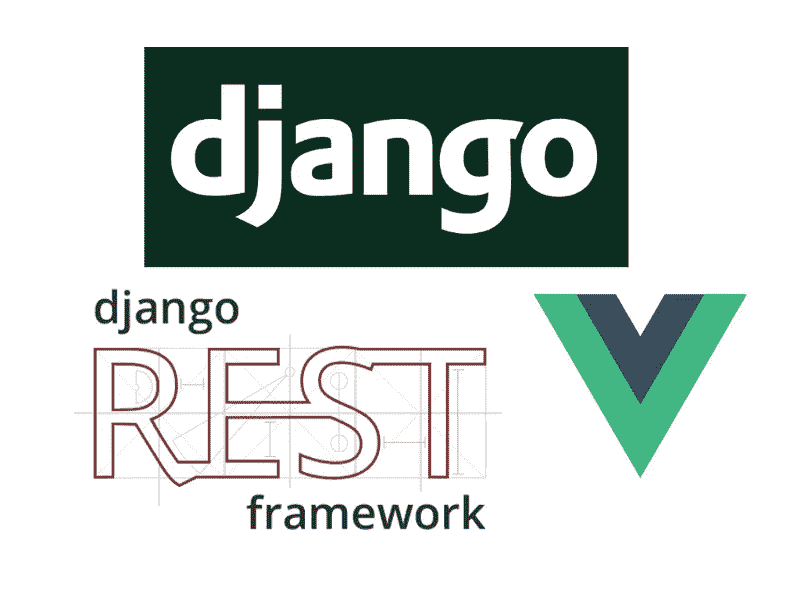
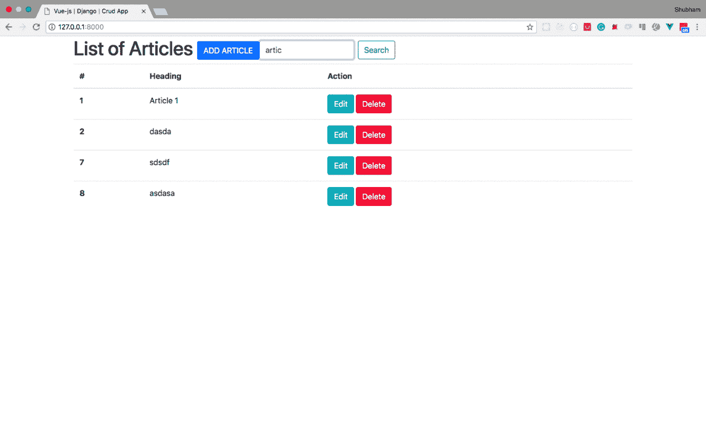

# 使用 Django 和 Vue.js 搜索过滤器

> 原文：<https://medium.com/quick-code/searchfilter-using-django-and-vue-js-215af82e12cd?source=collection_archive---------6----------------------->



> 这篇文章是我上一篇文章的延续，在那篇文章中我解释了如何使用 vue.js 2.x 和 Django 2.0.2 来制作 [CRUD api，请首先阅读那篇文章，然后浏览这篇文章](/quick-code/crud-app-using-vue-js-and-django-516edf4e4217)

在本教程中，你将学习如何使用 Django 和 Vue.js 制作一个搜索过滤器

只需按照步骤创建一个搜索过滤器

*   在 django rest 框架视图集中添加一个搜索过滤器标签
*   提及应该执行搜索的字段
*   了解搜索 api
*   将搜索 api 与 vue.js 集成

## 在 django rest 框架中添加搜索过滤器标签

```
from rest_framework import viewsets, **filters**
from .models import Article
from .serializers import ArticleSerializerclass ArticleViewSet(viewsets.ModelViewSet):
    queryset = Article.objects.all()
    serializer_class = ArticleSerializer
    **filter_backends = (filters.SearchFilter,)
    search_fields = ('article_id', 'article_heading','article_body')**
```

观察前面代码中突出显示的内容，首先我们导入了过滤器，然后在过滤器后端提到了 SearchFilter。

## 提及应该执行搜索的字段

```
from rest_framework import viewsets,filters
from .models import Article
from .serializers import ArticleSerializerclass ArticleViewSet(viewsets.ModelViewSet):
    queryset = Article.objects.all()
    serializer_class = ArticleSerializer
    filter_backends = (filters.SearchFilter,) **search_fields = ('article_id', 'article_heading','article_body')**
```

这里我们已经提到了必须执行搜索的字段，事实上这里您也可以添加外键字段，就像如果类别是外键并且它包含一个名为“名称”的字段，那么您可以添加类似类别 _ _ 名称搜索也将在该字段上执行。

## 了解搜索 api

现在重要的部分是你如何调用这个 api 来得到搜索结果。看看我的项目文件夹中的路由器文件

```
from rest_framework import routers
from article.viewsets import ArticleViewSetrouter = routers.DefaultRouter()router.register(r'article', ArticleViewSet)
```

在上一篇文章中，我们在 api 端点 **/api/article** 进行 api 调用，与搜索相同，只是在 get 请求中添加了一个搜索参数，如 **/api/article？search=search_term** 没有什么新东西，我们得到了精炼的结果。

## 将搜索 api 与 vue.js 集成

首先沿着添加文章按钮的搜索框

```
<h1>List of Articles
          <button  type="button" class="btn btn-primary" data-toggle="modal" data-target="#addArticleModal">ADD ARTICLE</button>
          </h1>
          &emsp;
          **<div class="form-inline my-2 my-lg-0">
            <input class="form-control mr-sm-2" type="text" placeholder="Search" v-model="search_term" aria-label="Search">
            <button class="btn btn-outline-success my-2 my-sm-0" v-on:click.prevent="getArticles()">Search</button>
          </div>**
```

如果使用 vue 实例中的 search_term 变量映射搜索输入，搜索按钮将运行修改后的 getArticles()函数

修改 getArticles 函数以添加搜索词

```
 data: {
        articles: [],
        loading: true,
        currentArticle: {},
        message: null,
        newArticle: { 'article_heading': null, 'article_body': null },
        **search_term: '',**
      },
      mounted: function() {
        this.getArticles();
      },
      methods: {
        getArticles: function() {
          **let api_url = '/api/article/';
          if(this.search_term!==''||this.search_term!==null) {
            api_url = `/api/article/?search=${this.search_term}`
          }**
          this.loading = true;
          this.$http.get(**api_url**)
              .then((response) => {
                this.articles = response.data;
                this.loading = false;
              })
              .catch((err) => {
                this.loading = false;
                console.log(err);
              })
        },
```

首先，在初始数据包中有一个搜索项参数，用于处理搜索项中的更改，接下来是 getArticles 函数中的修改，我们更新了 getArticles 函数，增加了检查是否有搜索项，如果有搜索项，则追加到 url，否则不存在。

现在，你完成了点击主步骤

```
python manage.py runserver
```

并查看您的应用程序的工作情况



> 请参考[**https://github.com/ShubhamBansal1997/crud-app-vuejs-django**](https://github.com/ShubhamBansal1997/crud-app-vuejs-django)查看代码，这个 webapp 在这里是活动的[**https://vue-django-crud-heroku.herokuapp.com**](https://vue-django-crud-heroku.herokuapp.com)。如果你发现任何错误，请在评论中提出。

用 **❤** 制造

**小费不胜感激！💰 😉**

**我的比特币地址** : bc1qysxlz0p9nlcyndeysqltdhelwpdhurglgxz96x

**My Ethereum address** : 0x42c98e296B27228d9ee84e519BEC8eE0d09cad30