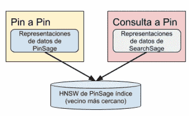
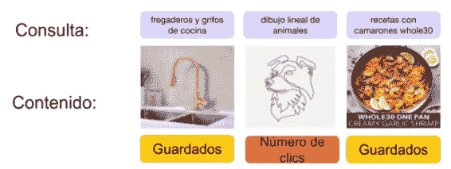
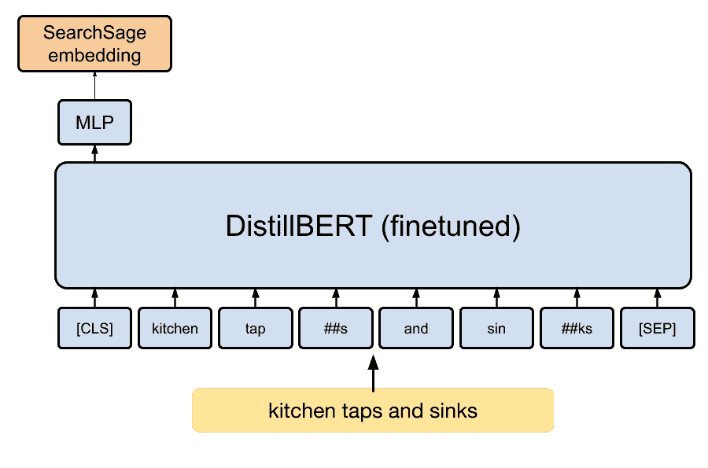
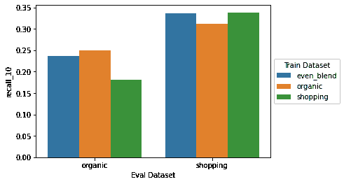
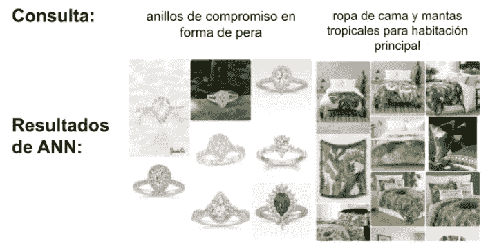

# SearchSage:在 Pinterest 上学习搜索查询表示法

> 原文：<https://medium.com/pinterest-engineering/searchsage-aprendizaje-de-las-representaciones-de-consultas-de-b%C3%BAsqueda-en-pinterest-5bdef4f3e898?source=collection_archive---------4----------------------->

Nikil Pancha | 软件工程师,Andrew Zhai | 软件工程师,Chuck Rosenberg | 先进技术组负责人和 Jure Leskovec 首席科学家,先进技术组

*这篇文章最初发表于 英语.Read the English version* [*here*](/pinterest-engineering/searchsage-learning-search-query-representations-at-pinterest-654f2bb887fc) *(T7 )*

在 Pinterest 上,每天都有数十亿的想法被展示出来,而对内容、用户和搜索查询的数据表示进行神经建模是不断改进这些机器学习驱动推荐的关键。良好的数据表示(数字矢量形式的离散实体样本)允许快速生成候选者,并且是对相关内容进行分类,检索和评级的模型的强大信号。

我们从[数据的可视化表示(T9),基于卷积神经网络(CNN)的图像表示开始我们的渲染学习工作流程,然后转向](/pinterest-engineering/unifying-visual-embeddings-for-visual-search-at-pinterest-74ea7ea103f0)[PinSage(T11),一种基于图形的多模式引脚表示。我们将这项工作扩展到更多用例,例如](/pinterest-engineering/pinsage-a-new-graph-convolutional-neural-network-for-web-scale-recommender-systems-88795a107f48)[PinnerSage](/pinterest-engineering/pinnersage-multi-modal-user-embedding-framework-for-recommendations-at-pinterest-bfd116b49475),这是一个用户表示,它将用户以前的 Pins 操作分组,从那时起,我们继续与更多实体合作,例如搜索查询,Idea Pins,购物项目和内容创建者。

在本条目中,我们将重点介绍 SearchSage(我们的搜索查询表示法),并详细介绍我们如何创建和启动 SearchSage 以检索和排名搜索,以提高推荐的相关性,并在有机 Pins、产品 Pins 和广告搜索中进行参与。这种数据表示方式现已应用于超过 15 个使用案例,是我们有机模型和广告相关模型的最重要特征之一。它还导致了指标的增加;例如,搜索中的产品 Pins 点击次数超过 35 秒的**11%**,相关搜索增加**42%**。

当我们开始时,我们的目标是 (1) 解决搜索检索中的漏洞效率问题,以及 (2) 利用用户反馈和最先进的语言建模来提高搜索结果的质量。Pinterest 是一个视觉平台,当用户在 Pinterest 上搜索内容时,他们通常会根据图像而不是与之关联的文本做出初步判断。尽管如此,Pinterest 上的大多数搜索检索都是基于精确的文本匹配,其中包括 3 个阶段:

1.  候选人是根据与搜索查询的令牌匹配生成的。
2.  这些候选人使用轻量化模型进行评分,并保留顶级 N。
3.  这些 N 结果根据多种因素进行排名,包括预期相关性、参与度和转化概率。

以前,为了将可视化结果纳入搜索候选者中,我们采用了间接方法:我们将搜索查询分配给对这些查询有更多参与的引脚(称为封面引脚),从这些引脚中获取数据表示,对它们进行分组,然后根据[分层小型可导航世界(HNSW)图的索引发出几个近似最近邻(ANN)查询。然后,将 ANN 查询的结果与步骤 3 之前的基于文本的结果相结合,这使得基于文本的候选人和数据表示的候选人都有资格。](https://arxiv.org/abs/1603.09320)

虽然这种方法有一些重要的好处(例如:,处理多重查询),该系统不是从端到端学习的。因此,我们的目标是通过利用用户的参与反馈*(搜索查询,Pin)* 来构建搜索学习检索系统。

# 两塔模型

传统上,用于候选生成的数据表示是通过两个塔来学习的:一个用于表示查询,另一个用于表示用于检索的语料库的元素。查询和元素之间的相似性可以通过传统的度量学习损失函数(例如基于边际的三倍损失或 Softmax 抽样)来学习。

但是,在构建 SearchSage 时,我们的目标略有不同。在 Pinterest,我们的许多模型已经在其功能中包含了 PinSage 数据表示。此外,我们还创建了 PinSage 表示的近似 HNSW 近邻索引,以便快速生成相关引脚和启动源的引脚到引脚候选项。由于现有的以 PinSage 为中心的基础架构(以及存储额外 256d fp16 数据表示的违规行为),我们开发了与 PinSage 兼容的学习数据表示。换句话说,我们有一个双塔模型,但候选塔被冻结为我们的 PinSage 数据表示。这是以牺牲模型性能为代价的(一般来说,自由度越高,模型越好),但在易于采用方面,选择是明确的。

# 训练数据

为了训练这个模型,我们从形状对(搜索查询,Pin 与参与)开始。我们仅限于保存的引脚和长点击(超过 35 秒),因为我们假设它们比较弱的参与形式(如结算(当您单击引脚,但用户不单击链接到引脚的网页)或较短的点击)有更多的信号。为了简化流程,我们不收集明确的负面例子。

一个有用的启发式技术,以产生相关的模型是限制正外观计数。我们从数据中采样,以便每个具有参与的引脚在我们的训练数据中最多出现 N 次,这有助于凭经验消除可以为许多不同查询接收参与的非典型引脚,并使模型训练不稳定。直观地说,这种抽样策略限制了模型学习始终检索某些流行的引脚的能力,因为一个阳性示例在一个季节只能看到有限的次数。

# 评估

作为在线性能的代理,我们计算了 Recall@k(更常见的是 Recall@10),我们将其定义为承诺引脚在前几千名中恢复的对(查询,正数)的比例,指数为 1M 随机引脚,从我们计划编制索引的整个语料库中提取。搜索有两个选项卡:“浏览”选项卡(用于发现内容)和“商店”选项卡(用于帮助用户查找要购买的内容)。在实践中,我们通常从有机和产品语料库中获取数据,因此我们在两个评估数据集中测量性能:

1.  保存的引脚,根据所有引脚的抽样索引(“有机参与”)进行评估
2.  长点击产品引脚,根据所有产品的索引进行评估(“购买参与度”)

为了表示查询,我们使用了一个小型转换模型,该模型使用 Huggingface 的 [变换器](https://arxiv.org/abs/1910.03771) 包中提供的预训练权重进行初始化(基于 distilBERT,多语言,区分大小写)。我们考虑并尝试了其他架构,包括类似于[CLSM](https://dl.acm.org/doi/10.1145/2661829.2661935)的架构, [n-gram/chrom 包](https://arxiv.org/abs/1907.00937)和 LSTM,但我们发现变压器的性能足以在线运行,易于训练,并且比其他架构具有更好的性能(如果并且只有在端到端调整的情况下)。我们将单个线性读取层应用于模型标记 [CLS](替代分组策略并未改善性能,包括最大/总和/平均值,或每个层的数据表示 [CLS] 加权组合)。尽管推断变压器的 O(num_tokens2) 成本很高,但我们没有看到比其他深度架构更高的延迟,因为搜索查询通常包含少于 10 个令牌。

# 损失函数

作为损失函数,我们对正批处理示例使用 softmax。在文献中,这种方法被用来减少计算和复杂性,因为它只需要成对的查询和正示例,并且不需要计算负样本的数据表示[[Yi 等人。2019 年(T7)。这相当于将我们的训练视为一个分类问题,其中我们希望预测具有承诺的引脚的标签为 1,批次中所有其他引脚的标签为 0(查询数据表示形式的规范化不会产生明显不同的性能)。对于更多的数学趋势,这种损失函数可以描述如下:](https://dl.acm.org/doi/10.1145/3298689.3346996)

我们观察到这种方法比使用基于利润的损失或使用更复杂的三重损失的负面抽样策略更有效(类似于[ [Wu 等。, 2017](https://arxiv.org/abs/1706.07567) ) 当映射到固定数据表示空间时。

# 多任务学习

我们的训练数据是基于类似于评估的方式;直观地说,我们相信使用与这两个评估指标相关的数据进行培训将使购买和有机绩效之间取得合理的平衡。为了评估这一点,我们使用以下三个数据集训练模型:

1.  所有保留的引脚(有机)
2.  长产品点击(购物)
3.  (1) 和 (2) 的 50/50 混合 (even_blend)

上图显示了 Recall@10(如上所述)的图表,测量了有机评估和购买数据集,每种颜色代表不同的训练数据集。我们看到,专门针对购买性能的优化会导致有机指标大幅恶化,而不会以 50/50 的比例改善我们的购买评级。有机引脚的独特优化增加了有机任务的指标,但改进相对较少,并且购买指标的成本较高。这验证了 50/50 多任务配置比单任务离线学习配置提供更好的性能。

# 执行

为了使模型能够有效地服务,我们使用了基于 TensorFlow Serving 的内部多 DNN C++ 框架推理平台,该平台支持在线请求的动态批处理。每隔 5 米(或累计批量请求的最大大小时),我们将挂起的 batch_size 请求分组以进行推断,从而以较低的延迟成本大幅提高性能。

我们必须克服的一个挑战是,对于文本模型,输入预处理和模型推理通常是分开的。预处理包括标记化:获取原始文本并生成结果,如流程图,单幅图,单词或句子片段。这可以提高效率,因为预处理可以异步进行;但是,由于预处理通常是自定义代码,因此维护成为一个问题,特别是在训练和执行预处理方法时。具体来说,我们在 Python 环境中训练,并在纯 C++环境中运行。为了简化维护,我们选择创建一个自定义的 C++ PyTorch 运算符用于文本预处理。这允许我们有一个单独的独立伪像,其中取长度为 N 的输入字符串 List[str]并返回数据表示的张量(N,D)。在训练期间,这个自定义操作被暴露为 Python Pytorch 操作符,以便我们可以使用它。

# 结果

由于 SearchSage 与生产环境非常不同,因此我们根据脱机指标优化了模型,然后在 A/B 实验中运行脱机发现的最佳模型,以测试与基于封面引脚的方法相比的优势。

尽管仅基于参与度训练模型,但我们看到仅产品搜索的相关性有所增加( **2 个百分点(pp)P@8 加**按数量加权,如果所有查询的权重相同,则 P@8 加权)以及与采购相关的查询的总体相关性( **1pp P@25 加**按数量加权)。

我们还观察到长产品点击量增加了 **11%** ,搜索结果中的产品展示量增加了 **8%** ,这反过来提高了参与率,这表明使用 SearchSage 检索的内容对用户的价值比之前的方法更高。

总的来说,SearchSage 在最初和最后的查询中都产生了很好的结果。以下是从我们的完整购买引脚语料库中检索的一些 ANN 结果示例:

# 摘要

在本文中,我们概述了 SearchSage,这是一种旨在取代间接解决方案的查询数据表示。上述设置将查询表示为一组 PinSage 数据表示形式,这些表示形式是通过对该查询的历史参与进行分组而生成的。我们认为,从纯文本中显式生成与此引脚数据表示空间兼容的查询数据表示的模型将比以前的方法更好,并且通过在线实验验证了这一点,这表明搜索参与度和相关性有所增加。

在未来,我们将更深入地分析此模型的查询和引脚,因为最初的实验表明,通过允许学习候选数据表示,性能也得到了显着改善。我们还将继续探索如何改进我们的查询表示,遵循一些最新出版物,这些出版物旨在通过在查询数据表示模型中包含图形结构来实现有希望的结果。

*有关 Pinterest 工程的更多信息,请查看我们的* [*工程博客 [*](https://medium.com/pinterest-engineering) *并访问我们的* [*Pinterest Labs*](https://www.pinterestlabs.com/?utm_source=medium&utm_medium=blog-article-post&utm_campaign=pancha-et-al-december-30-2021&utm_content=spanish) *网站。如需查看和申请职位,请访问我们的* [*工作*](https://www.pinterestcareers.com/?utm_source=medium&utm_medium=blog-article-post&utm_campaign=pancha-et-al-december-30-2021&utm_content=spanish) *页面。(T19)*

# *致谢(T21)*

*作者要感谢以下人员的贡献: Laksh Bhasin, Yan Wang, Cosmin Negruseri, Pak Ming Cheung, Yinrui Li, Kurchi Subhra Hazra, Vikli Mohan, Rajat Raina, Pong Eksombatchai, Zhiyuan Zhang*

## 提及的作品

*   [Unifying visual embeddings for visual search at Pinterest | Pinterest Engineering | Pinterest Engineering Blog](/pinterest-engineering/unifying-visual-embeddings-for-visual-search-at-pinterest-74ea7ea103f0)
*   PinSage:A new graph convolutional neural network for web-scale recommendations systems(PinSage:一种用于 web-scale 推荐系统的新型卷积神经网络)
*   PinnerSage:Pinterest 推荐的多模用户嵌入框架
*   Y.A.马尔科夫和 D。A.Yashunin, “ [Efficient and robust approximate nearest neighbor search using hierarchical navigable small world graphs](https://arxiv.org/abs/1603.09320) ”, IEEE transactions on pattern analysis and machine intelligence, 第 3 卷。42、不。4,PP。824-836,2018。
*   T. Wolf et al., [HuggingFace's Transformers: State-of-the-art Natural Language Processing](https://arxiv.org/abs/1910.03771) . 2019 年。
*   Y.沈，何，高，邓，梅尼尔，“一种基于卷积池结构的潜在语义模型在信息检索中的应用”，《美国计算机学会信息与知识管理国际会议论文集》，2014 年，第 101-110 页。doi:[10.1145/2661829.2661935](https://dl.acm.org/doi/10.1145/2661829.2661935)。
*   页（page 的缩写）Nigam 等人，“语义产品搜索”，en Proceedings of the 25 ACM SIGKDD International Conference on Knowledge Discovery & Data Mining，2019，第 2876–2885 页。土井: [10.1145/3292500.3330759](https://dl.acm.org/doi/10.1145/3292500.3330759) 。
*   X.易等，“大语料库项目推荐的采样偏差校正神经建模”，en Proceedings of 13 ACM Conference on recommenders Systems，2019，PP . 269–277。doi:[10.1145/3298689.3346996](https://dl.acm.org/doi/10.1145/3298689.3346996)。
*   C.-Y. Wu，R. Manmatha，A. J. Smola y P. Krahenbuhl，“[深度嵌入学习中的采样问题](https://arxiv.org/abs/1706.07567)”，en Proceedings of the IEEE International Conference on Computer Vision，2017，PP . 2840–2848。