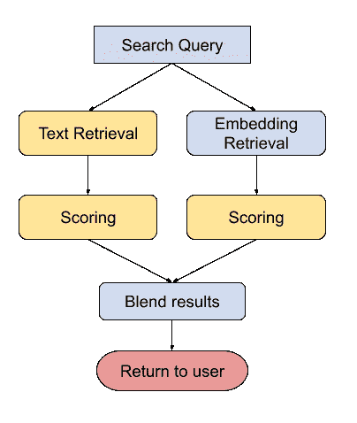
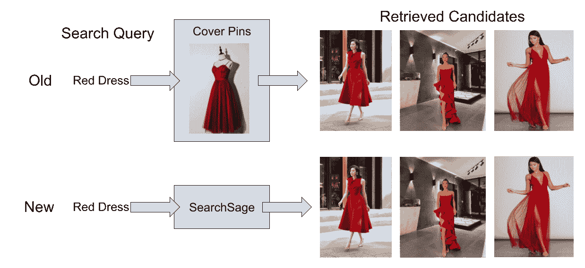
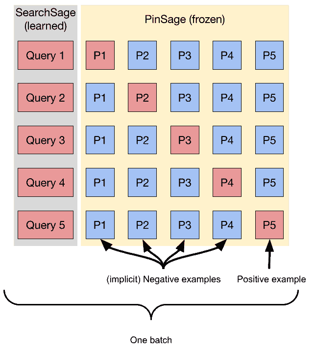

# SearchSage:在 Pinterest 学习搜索查询表示

> 原文：<https://medium.com/pinterest-engineering/searchsage-learning-search-query-representations-at-pinterest-654f2bb887fc?source=collection_archive---------0----------------------->

Nikil Pancha |软件工程师；Andrew Zhai |软件工程师；Chuck Rosenberg |先进技术集团负责人；和 Jure Leskovec |高级技术集团首席科学家

Pinterest 每天向人们展示数十亿个想法，内容、用户和搜索查询嵌入的神经建模是这些机器学习驱动的推荐不断改进的关键。良好的嵌入——将离散实体表示为数字向量——能够快速生成候选，并且是对相关内容进行分类、检索和排序的模型的强信号。

我们从[视觉嵌入](/pinterest-engineering/unifying-visual-embeddings-for-visual-search-at-pinterest-74ea7ea103f0)(一种基于卷积神经网络(CNN)的图像表示)开始我们的表示学习工作流，然后转向 [PinSage](/pinterest-engineering/pinsage-a-new-graph-convolutional-neural-network-for-web-scale-recommender-systems-88795a107f48) (一种基于图形的多模态 Pin 表示)。我们扩展到了更多的用例，如 [PinnerSage](/pinterest-engineering/pinnersage-multi-modal-user-embedding-framework-for-recommendations-at-pinterest-bfd116b49475) ，这是一种基于对用户过去的 Pin 操作进行聚类的用户表示，此后我们与更多的实体合作，包括搜索查询、创意 Pin、购物项目和内容创建者。

在这篇博文中，我们将重点关注我们的搜索查询表示 SearchSage，并详细介绍我们如何构建和推出 SearchSage 进行搜索检索和排名，以提高推荐的相关性以及在有机 pin、产品 pin 和广告搜索中的参与度。现在已用于 15 个以上的使用案例，这种嵌入是我们的有机和广告相关性模型中最重要的功能之一，并带来了指标上的胜利，如搜索中产品引脚的点击率增加了**11%**35s 以上，相关搜索增加了 **42%** 。

Search result blending

一开始，我们的目标是解决(1)搜索检索的漏斗效率问题，以及(2)利用用户反馈和最先进的语言建模来提高我们搜索结果的质量。Pinterest 是一个可视化平台，当用户在 Pinterest 上搜索时，他们通常会根据图片而不是相关文本做出初步判断。尽管如此，Pinterest 上的大多数搜索检索都是基于精确的文本匹配，其中有 3 个阶段:

1.  候选是基于与搜索查询的令牌匹配而生成的
2.  使用轻量级模型对这些候选人进行评分，并保留前 N 名
3.  这 N 个结果按照因素的组合进行排序，包括它们的预测相关性、参与度和转化可能性

以前，为了将视觉结果合并到搜索候选中，我们采用了一种间接的方法:我们将搜索查询映射到这些查询的最常用 Pin(称为封面 Pin)，获取这些 Pin 嵌入，对它们进行聚类，然后针对[分层可导航小世界(HNSW)](https://arxiv.org/abs/1603.09320) 索引发出几个近似最近邻(ANN)查询。然后，在步骤 3 之前，将人工神经网络结果与基于文本的结果混合，从而允许排名对基于文本和基于嵌入的候选人进行评分。

Cover pin retrieval vs SearchSage

虽然这种现有的方法有一些显著的好处(例如，处理查询多义性)，但该系统不是端到端学习的。因此，我们的目标是通过利用来自用户的*(搜索查询，pin)* 参与度反馈，为搜索构建一个学习型检索系统。

# 双塔模型

Two tower retrieval

传统上，用于候选生成的嵌入通过两个塔来学习:一个用于嵌入查询，另一个用于嵌入用于检索的语料库中的项目。这些查询和项目之间的相似性可以通过传统的度量学习损失函数来学习，例如基于边缘的三元组损失或采样 softmax。

然而，我们开发 SearchSage 的目的略有不同。在 Pinterest 上，我们的许多模型已经将 PinSage 嵌入作为特性。类似地，我们已经构建了引脚序列嵌入的 HNSW 近似最近邻索引，以实现相关引脚和本地馈送的快速引脚到引脚候选生成。由于围绕 PinSage 的现有基础设施(以及存储额外 256d fp16 嵌入的基础设施成本)，我们开发了与 PinSage 兼容的学习嵌入。换句话说，我们有一个双塔模型，但候选塔被冻结为我们的 PinSage 嵌入。这是以模型性能为代价的(更多的自由度通常会带来更好的模型)，但是从促进采用的角度来看，这是一个明确的选择。

# 培训用数据

Training data examples

为了训练该模型，我们从成对的形式(搜索查询、占用 Pin)开始。我们将自己限制在 Pin 保存和长时间(35 秒以上)点击，假设它们比更弱的参与形式(如特写镜头(当点击 Pin 但用户没有点击 Pin 后面的网页)或更短的点击)携带更多信号。为了简单起见，我们不收集明确的反面例子。

我们发现对产生相关模型有用的一个启发是正面外观计数的上限。我们对数据进行采样，使得每个参与的 Pin 可以在我们的训练数据中最多出现 N 次，这根据经验有助于移除可能接收许多不同查询的参与的离群 Pin，并且导致模型训练不稳定。直观上，这种采样策略限制了模型学习总是检索某些流行 pin 的能力，因为单个正例在每个时期可能仅被看到有限的次数。

# 估价

作为在线性能的代表，我们计算 Recall@k(最常见的是 Recall@10)，我们将其定义为(查询，肯定)对的比例，在该比例下，在从我们计划索引的完整语料库中抽取的 100 万个随机 Pin 的索引中，被占用的 Pin 被检索到前 k。在搜索中，有两个选项卡:探索选项卡(旨在发现内容)和商店选项卡(旨在帮助用户找到要购买的内容)。在实践中，我们经常从有机和产品语料库中检索，因此我们在两个评估数据集上测量性能:

1.  引脚保存，根据从所有引脚采样的指数进行评估(“有机参与”)
2.  产品大头针的长点击，根据所有产品的指数进行评估(“购物参与”)

# 模型架构

Model Architecture

为了嵌入查询，我们使用一个小的 Transformer 模型，初始化为 Huggingface 的 [transformers](https://arxiv.org/abs/1910.03771) 包(distilbert-base-multilingual-cased)中提供的预训练权重。我们考虑并试验了其他架构，包括类似 [CLSM](https://dl.acm.org/doi/10.1145/2661829.2661935) 的架构、[n grams/character trigrams](https://arxiv.org/abs/1907.00937)包和 LSTMs，但发现变压器足以在线服务，易于训练，并优于其他架构(当且仅当端到端微调时)。我们将单个线性读出层应用于模型的[CLS]令牌(替代池策略没有提高性能，包括最大值/总和/平均值，或每个层的[CLS]嵌入的加权组合)。尽管推断一个转换器的 O(num_tokens)成本令人望而生畏，但我们并没有看到比其他深度架构高得多的延迟，因为搜索查询通常包含不到 10 个令牌。

# 损失函数

Visual depiction of softmax loss

作为损失函数，我们在批量正例上使用 softmax。在文献中，这种方法用于减少计算和复杂性，因为它只需要成对的查询和正样本，而不需要计算负样本的嵌入[ [Yi et al，2019](https://dl.acm.org/doi/10.1145/3298689.3346996) ]。这相当于将我们的训练视为一个分类问题，其中我们希望预测被占用的 Pin 的标签为 1，而批中所有其他 Pin 的标签为 0(查询嵌入的规范化不会导致实质上不同的性能)。对于更倾向于数学的人来说，这个损失函数可以描述如下:

Equation for loss softmax loss

我们发现，当映射到固定的嵌入空间时，这种方法比使用边际损失或使用更复杂的具有三重损失的负采样策略(类似于[ [吴等人，2017](https://arxiv.org/abs/1706.07567) )更有效。

# 多任务学习

我们的训练数据采用与评估相似的形式；凭直觉，我们相信，对与我们的两个评估指标相关的数据进行培训，将在购物和有机表现之间做出合理的权衡。为了对此进行评估，我们在这三个数据集上训练了模型:

1.  所有引脚节省(有机)
2.  产品长期点击率(购物)
3.  (1)和(2)的 50/50 混合物(偶数混合物)

Multi-task performance

上面是 Recall@10(如上定义)的图，是在有机和购物评估数据集上测量的，每种颜色代表一个不同的训练数据集。我们发现，仅针对购物表现进行优化会显著降低有机指标，而不会提高我们对 50/50 混合的购物评价。仅针对有机的优化确实增加了有机任务的指标，但这种改善相对来说是微不足道的，并且对购物指标来说代价更大。这证明了 50/50 多任务设置优于单任务离线学习设置。

# 服务

为了有效地为模型服务，我们使用了一个内部 C++多 DNN 框架推理平台，该平台构建在 TensorFlow 服务之上，支持在线动态批处理请求。每隔 5 毫秒(或者当请求的最大批量累积时)，我们将 batch_size 个未决请求分组在一起进行推断，从而以微小的延迟成本显著提高吞吐量。

要克服的一个挑战是，通常对于文本模型，输入预处理和模型推理是分开的。预处理包括标记化——获取原始文本并产生输出，如字符三元组、单字、单词块或句子块。这可以提高一些效率，因为预处理可以异步进行；然而，因为预处理通常是定制代码，所以维护成为一个问题，尤其是调整训练和服务预处理方法。具体来说，我们在 Python 环境中训练，在纯 C++环境中服务。为了简化这种维护，我们选择构建一个定制的 PyTorch C++操作符来进行文本预处理。这允许我们有一个单一的、自包含的工件，接受长度为 N 的输入字符串列表[str]并返回嵌入的(N，D)张量。在培训过程中，这个自定义操作被公开为 Python Pytorch 操作符，供我们使用。

# 结果

因为 SearchSage 与生产中的产品如此不同，所以我们基于我们的离线指标调整了我们的模型，然后在 A/B 实验中运行我们离线找到的最佳模型，以验证基于 cover Pin 的方法的优势。

尽管只在参与度上训练模型，但我们看到了仅产品搜索相关性的增加( **+2 个百分点(pp) P@8** 按量加权，+8pp P@8，如果所有查询被分配相同的权重)，以及购物相关查询的整体搜索相关性的增加(**+1pp @ 25**按量加权)。

我们还观察到产品长点击率增加了 **11%** ，搜索中的产品印象增加了 **8%** ，提高了参与度，这表明通过 SearchSage 检索的内容比以前的方法为用户提供了更多的效用。

SearchSage 通常适用于头部和尾部查询。以下是从我们的购物别针全集中检索的人工神经网络结果的几个例子:

Example approximate nearest neighbor results

# 摘要

在这篇文章中，我们给出了 SearchSage 的概述，这是一个旨在取代间接解决方案的查询嵌入。前面的设置将一个查询表示为一组 PinSage 嵌入的集群，这些集群是通过对该查询的历史参与度进行聚类而产生的。我们认为，从原始文本中显式地产生与该 Pin 嵌入空间兼容的查询嵌入的模型将比前一种方法执行得更好，并且这通过在线实验得到了验证，显示了搜索参与度和相关性的增加。

将来，我们将研究如何在这个模型中更好地表示查询和 pin，因为最初的实验表明，通过允许学习候选嵌入，性能有了很大的提高。我们还将继续探索改进我们的查询表示的方法，遵循一些较新的文献，这些文献指出当在查询嵌入模型中包括图结构时有希望的结果。

# *致谢*

作者在此感谢以下人员的贡献:拉克什·巴辛、、科斯明·内格罗塞里、张柏明、、李、库尔奇·苏赫拉·哈兹拉、维贾伊·莫汉、拉杰特·刘冰、庞·埃克松巴猜、

*要在 Pinterest 了解更多关于工程的知识，请查看我们的* [*工程博客*](https://medium.com/pinterest-engineering) *，并访问我们的*[*Pinterest Labs*](https://www.pinterestlabs.com/?utm_source=medium&utm_medium=blog-article&utm_campaign=pancha-et-al-november-9-2021)*网站。要查看和申请空缺职位，请访问我们的* [*职业*](https://www.pinterestcareers.com/?utm_source=medium&utm_medium=blog-article&utm_campaign=pancha-et-al-november-9-2021) *页面。*

# 参考作品

*   [通过 Pinterest Engineering | Pinterest Engineering 博客在 Pinterest 上统一视觉搜索的视觉嵌入](/pinterest-engineering/unifying-visual-embeddings-for-visual-search-at-pinterest-74ea7ea103f0)
*   [PinSage:一种新的用于网络规模推荐系统的图卷积神经网络](/pinterest-engineering/pinsage-a-new-graph-convolutional-neural-network-for-web-scale-recommender-systems-88795a107f48)
*   [PinnerSage:Pinterest 推荐的多模态用户嵌入框架](/pinterest-engineering/pinnersage-multi-modal-user-embedding-framework-for-recommendations-at-pinterest-bfd116b49475)
*   Y.A. Malkov 和 D. A. Yashunin，“使用分层可导航小世界图的高效和鲁棒的近似最近邻搜索[”, IEEE 模式分析和机器智能汇刊，第 42 卷，第 4 期，第 824–836 页，2018 年。](https://arxiv.org/abs/1603.09320)
*   T.沃尔夫等人，[拥抱脸的变形金刚:最先进的自然语言处理](https://arxiv.org/abs/1910.03771)。2019.
*   Y.沈，何，高，邓，梅尼尔，“基于卷积池结构的潜在语义模型在信息检索中的应用”，第 23 届美国计算机学会信息与知识管理国际会议论文集，2014 年，第 101-110 页。doi:[10.1145/2661829.2661935](https://dl.acm.org/doi/10.1145/2661829.2661935)。
*   页（page 的缩写）Nigam 等人，“语义产品搜索”，载于《第 25 届 ACM SIGKDD 知识发现与数据挖掘国际会议论文集》，2019 年，第 2876–2885 页。doi:[10.1145/3292500.3330759](https://dl.acm.org/doi/10.1145/3292500.3330759)。
*   X.易等，“大语料库项目推荐的采样偏差校正神经建模”，第 13 届 ACM 推荐系统会议论文集，2019 年，第 269–277 页。土井: [10.1145/3298689.3346996](https://dl.acm.org/doi/10.1145/3298689.3346996) 。
*   C.-Y. Wu，R. Manmatha，A. J. Smola，P. Krahenbuhl，“[深度嵌入学习中的采样问题](https://arxiv.org/abs/1706.07567)”，IEEE 计算机视觉国际会议论文集，2017 年，第 2840–2848 页。