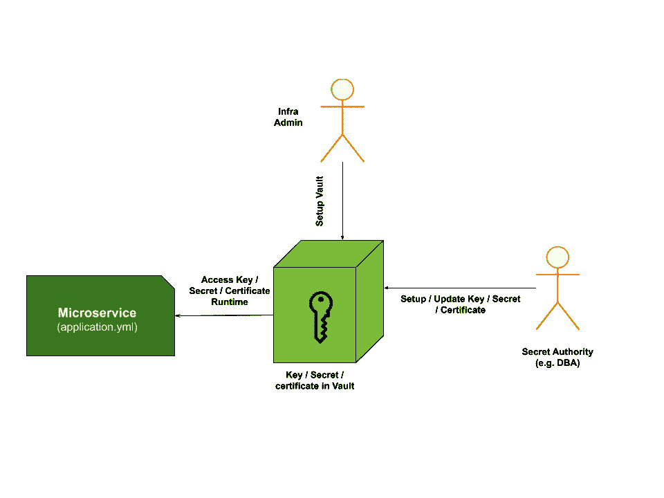
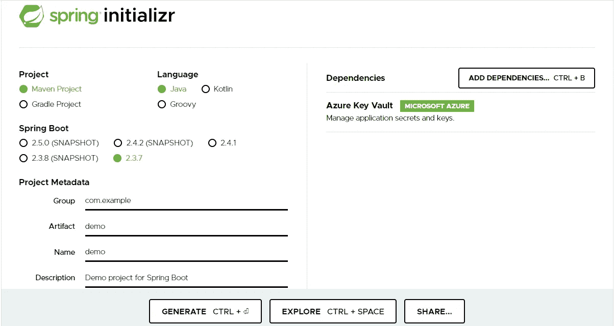

# 使用 Azure Key Vault 在微服务中进行秘密管理

> 原文：<https://medium.com/globant/secret-management-in-microservices-with-azure-key-vault-e90bc8a117ca?source=collection_archive---------0----------------------->


Photo by [Kristina Flour](https://unsplash.com/@tinaflour?utm_source=medium&utm_medium=referral) on [Unsplash](https://unsplash.com?utm_source=medium&utm_medium=referral)

应用程序配置是每个微服务的基本需求，它允许微服务在特定环境(如开发、qa、生产等)中以不同的方式运行和连接。我们如何管理 application.properties(或 application.yml)作为微服务或集中式配置的一部分，一个重要的事情是我们如何处理*秘密*。

# 处理秘密

> 在企业微服务中，秘密管理策略至关重要，尤其是在使用公共云时。

以下是这一战略的驱动力

*   商业关键基础设施机密不应该轻易泄露，应该保护它们免受窥探。
*   秘密应该从应用程序中具体化，这样开发人员就不必担心更高级环境的凭证。
*   秘密的集中存储
*   审计和监控秘密并据此采取行动
*   应允许相关机构在不影响开发团队的情况下管理凭证/机密。

在本文中，我们将讨论一些策略，并详细介绍 Azure Key Vault。

传统上，环境变量用于将数据库密码或一些敏感值等秘密与应用程序分开

```
database.password=${dev-database-mysql-password}
```

在启动时，微服务通过服务器上设置的环境变量来解决这个问题。面临的挑战是，机密过去常常会因接触环境而受到损害。

为了解决这些限制，推出了 secret vault 解决方案，如 HashiCorp 的 vault、作为云不可知第三方实施的 Spring Cloud Vault，以及 Azure Key Vault 和 AWS Secret Manager 等。作为托管云服务。

下图显示了秘密管理解决方案的工作原理。



vault 生命周期中涉及的三个关键实体。

## **1。基础设施管理团队**

该团队负责根据是在自己的基础架构上还是在公共云上创建或订阅保管库。一旦保险库准备就绪，他们就配置并提供对适当秘密机构的访问。

## **2。秘密机关**

秘密机构负责添加和维护保险库中的秘密。秘密机构可以根据环境或所有权而有所不同。例如，生产环境可以由不同的秘密机构管理，或者所有数据库可以由作为秘密管理机构的 DBA 管理。

## **3。消费者**

消费者可以是配置了占位符的开发人员或应用程序。下图中，微服务是一个消费者。通常，Vault 提供库或 API 来解析机密。

# 使用 Spring Boot 应用程序探索 Azure key Vault

1.  *订阅 Azure vault* ，出于探索的目的，你可以尝试 Azure 的免费订阅。[这里有一个链接](https://azure.microsoft.com/en-us/offers/ms-azr-0044p/)。
2.  *在 Azure 中创建一个服务主账户*，通过 Azure Key Vault 的策略配置进行配置。这一步很重要，因为我们将使用这个服务帐户来解决我们在 spring boot 应用程序中的秘密。 ***注意*** :服务主体是一种用户身份，它提供对订阅中 Azure 资源的访问。
3.  登录 Azure 门户，导航到 Azure 密钥库，然后*创建一个秘密*，例如数据库密码。 ***注意*** : Azure 默认以加密模式存储秘密。
4.  *使用***【Azure Key Vault】***创建一个 spring boot 应用程序*作为附加启动器



4.*通过属性 yaml 文件在 spring boot 应用中配置 Azure Key vault* 。

以下代码片段显示了示例 application.yml 配置

```
azure: 
  keyvault: 
    client-id: {{your client id i.e. service principal object id}}
    client-key: {{your client key i.e. service principal key}}
    enabled: true
    refresh-interval: 1800000
    tenant-id: {{your subscription tenant id}}
    token-acquire-timeout-seconds: 60
    uri: "[https://demo.vault.azure.net/](https://demo.vault.azure.net/)"
spring: 
  datasource: 
    driverClassName: com.microsoft.sqlserver.jdbc.SQLServerDriver
    initialization-mode: always
    username: "${database-username}"
    password: "${database-password}"
```

这里需要注意一些重要的事情

*   客户端 id 和客户端密钥是服务主体的细节
*   示例 spring 数据源中的属性(即＄{ database-password })是 Azure key vault 中定义的密钥的名称，它将在这里被透明地解析。

5.如果你想在源代码中引用任何 Azure vault 密钥，你可以使用@Value

```
[@Value](http://twitter.com/Value)("${database-password}")
private String databasePassword;
```

就这样，你就可以在 spring boot 应用程序中使用 Azure key vault。