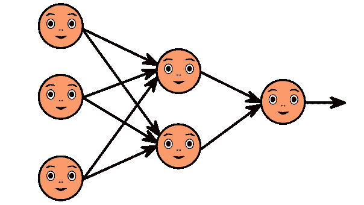
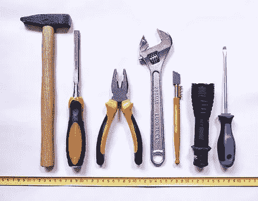
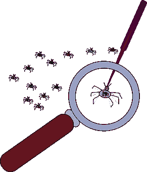

# 成功的数据科学面试秘诀

> 原文：<https://medium.com/walmartglobaltech/secrets-to-a-successful-data-science-interview-73e317a4d620?source=collection_archive---------1----------------------->

你有一个数据科学的面试？恭喜你！但是你担心被拒绝吗？你是否困惑于准备什么才能自信地面对面试？在这篇文章中，我们将分享我们从面试者和面试官的经历中学到的东西。

在数据科学这个已经非常广泛且迅速发展的领域中面试，对应聘者和面试官来说都是一个挑战。面试试图在几个一小时的回合中评估您的数据科学能力，而您的学习已经经历了许多年。这将面试官置于一个不值得羡慕的位置，也就是说，如何评估像你这样充满激情、知识渊博的人？

**它是如何开始的**

这一切都从你在简历中写了什么开始。期待你的简历中与数据科学相关的问题。他们深藏在你的过去(三年以上)是可以理解的，但不要被困扰。我们相信你有能力在简历上给自己和任何事情一个好的交代。请重温它，重新认识你的过去。面试官可能会问你一个问题，例如，“*假设你过去用方法 X 解决了一件事，如果你现在要解决它，你有更好的方法 Y 吗？”*还有，问问自己:*我是不是在简历上写了什么东西**只是为了给面试官留下好印象，但是希望他们不要问这方面的问题？不要这样做！如果你是面试官，你觉得公平吗？这也适用于简历中的科技博客和 GitHub 链接。*

**解决问题:开放式&封闭式**

您的数据科学深度将根据您解决问题的能力进行评估。这些问题可能是:

1.  给定一个要求，如何解决。例如，你的企业正在失去客户，找到原因和解决方案。
2.  给定一个解决方案，它能改进吗？例如，一个现有的解决方案有 90%的“转换率”，你如何让它达到 91%？

你能重复使用你过去的方法并使它们在一个新的不同的环境中工作吗？你是否也能在你最近所学的背景下反思你的旧方法？

这些是开放式问题，在面试范围内可能没有完整的解决方案。记住，这些问题不是为了从你那里免费获得十亿美元的创业想法或可申请专利的想法。远非如此，这些纯粹是为了评估你解决问题的能力。事实上，他们中的一些人可能会对面试官试图解决的数据科学问题产生共鸣。

接下来，这里有一个封闭式问题的例子:推导 CNN 的反向传播，解释梯度增强，等等。前者帮助面试官评估你对意外情况的反应，而后者建立了一个植根于标准理解的基线过滤器。尽你最大努力两者兼得。实践是关键。

**机器学习**

数据科学使用机器学习作为关键技术之一。是的，它可能还会用到神经科学、行为经济学、博弈论、统计力学、复杂性理论、非欧几何以及你所擅长的无数领域。然而，你被期望在工业环境中解决的问题需要作为主要技能的 ML 技术的健全知识。如果你是其他领域的专家，面试官会很高兴，但也请你是 ML 领域的专家。

这是他们将如何评估你的 ML 技能。

1.  标准机器学习课程和书籍涵盖的主题:CS229(斯坦福)，CS4780(康奈尔)，6–034(麻省理工)，PRML(克里斯·毕晓普)，海量数据集的挖掘。注意:PRML 是一本大部头的书。如果它的大小让你焦虑，请放心，PRML 是指示性的。我们并不是说你必须通读整本书。只要有可能，你应该通过阅读标准书籍来巩固课程内容。
2.  简历中提到的 ML 方法，但不是课程或书籍的一部分。
3.  ML 数学:线性代数、概率与统计、多变量微积分、最优化基础(通常这些都包含在标准 ML 课程中)。

**深度学习**

你是个深度学习的忍者。尽管你有强烈的感受，为什么我们仍然认为你需要对“常规”机器学习有一个良好的理解？深度学习模型的“黑箱”性质(你可能完全不同意)使得面试官很难知道你做了什么和模型做了什么。然而，ML 的传统形式似乎是所有候选人的良好公分母。如果一个人建造了一个双向 LSTM，却不知道 SVM 是如何工作的，会是什么样子？请继续，用你的 DL 技能让面试官眼花缭乱，但是在你用你的 ML 印章证明一两点之后。

你应该知道为什么你选择了一个模型/算法/方法/架构。超参数在 DL 中起着关键作用。培养对模型调整的良好理解。好模型和不太好模型的区别可能在于你对超参数的选择。

我们建议在面试前阅读以下材料:

1.  deeplearning.ai 在 Coursera 提供的深度学习专业化(一套 5 门课程)。
2.  Geoff Hinton 的 Coursera 神经网络课程，以加深对概念的理解。
3.  涵盖编码器的全面深度学习课程，在 http://www.cse.iitm.ac.in/~miteshk/CS7015.html.
4.  从长远来看，你可以去看看 Yoshua Bengio 和 Ian Goodfellow 的《深度学习》一书。

注意:我们并没有说你*必须*经历所有这些。通过细读高质量的内容来熟悉主题会给你信心，这种信心可以在各种情况下转移。

**使用工具的经验**

公司会优先考虑那些不仅能清晰表达良好的数据科学解决方案，而且能够使用正确的工具高效实施的候选人。如果你能让自己对业内可用的工具感到舒适，那就太好了。你至少应该从语言的角度了解 python 或者 R，ML 算法的 scikit learn 库，深度学习的 Keras，tensorflow，pytorch，caffe。不要忽视查询语言，例如 HQL、SQL 和分布式框架，如 hadoop 和 spark。好的组织对所有这些技能都有培训计划。被选中的候选人经常参加这些培训课程。熟悉以上工具会给你的候选人带来急需的优势。无论如何，在你被选中后接受训练。这将让你接触到该组织所解决的问题，并有机会与该组织中的其他科学家互动。这些都是新获得的非常重要的经验。

**车型的生产和部署**

面试官希望你知道机器学习模型是如何使用的，它是如何生产和部署的，以及你的模型的整体端到端架构。很难雇佣一个不知道客户/服务/顾客/产品将如何使用他们的模型的人。如果没有部署，您所构建的只是概念验证。在最好的情况下，它可以在您的笔记本电脑上进行演示。为了使你的 ML 模型有用，它需要成为软件管道的一部分。知道如何与工程师互动来部署模型。准备好卷起袖子，在没有任何人提示的情况下行动起来。通过这样做，你提高了自己的价值和在团队中的地位。

**车型生命周期管理**

作为一名伟大的数据科学家，你应该了解 ML 模型的整个生命周期。你应该知道当你的模型试图模拟的世界改变时，你的模型应该如何改变。(这种情况比你想象的更频繁，因为现实世界并不在你的控制之下。)您将决定您的模型需要多长时间重新培训一次，以保持新鲜感。你可能也想自动化再培训过程，以节省你的宝贵时间。将迭代模型构建中节省的时间用于提高性能。为自己创造机会，解释你是如何在一个模型的生命周期中管理它的。

**调试 ML 模型**

调试在软件行业是一项非常重要的技能。如果软件不能被调试，那么它是高度危险的。你应该深入了解你的模型。你应该知道你所使用的算法的内部原理。您应该知道如何进行根本原因分析和调试您的模型。面试官希望你知道当模型存在高偏差或高方差时，你将如何改善结果，你将如何避免爆炸梯度和消失梯度，以及你将如何在训练过程中优化记忆等。

为什么反转链表仍然是一个好主意？

虽然数据结构和算法确实被外包给了软件包，但是您从数据中进行推理的能力是由您对算法和数据结构的理解所帮助的。虽然面试官不会要求你实现跳过列表或平衡 k-d 树，但他们仍然希望你理解算法的顺序复杂性，熟悉基本的数据结构，如链表、堆栈、树、哈希表和堆，并熟悉排序、最短路径、字符串处理等算法。换句话说，来自数据结构和算法的卫生问题。你可能认为通过这个镜头来评判你是不合适的，但是请记住你是在为比赛制造方便。我们相信你能胜任。

**了解公司**

你被要求参加面试的事实表明，你之前的经历已经被人力资源部和招聘经理认为是潜在的合适人选。不要停在那里！你有责任研究并了解公司做什么，你如何增加价值——这是一个很好的区分。那么，为什么我们在名单的底部提到这样一个伟大的区分者呢？在之后，你已经做好了其他方面的准备，这才是真正的*。如果在面试中没有强有力的基本面的支持，候选人对公司了解很多又有什么意义呢？*

**问什么当被问到的时候，“*你有什么问题*？”**

注意，这不是讨好面试官的邀请。在整个面试过程中保持正式和礼貌。

这是展示您对如何作为数据科学团队的一员发挥作用的理解的绝佳机会。这也是一个让面试官看到你在面试中没有的优势的机会。例如，你可能擅长代码审查。你可以询问代码审查是如何工作的。你可以强调你最喜欢的方法，比如说走查。您可能想知道使用的开发平台。您可能会问团队中是否有开源贡献者(如果您是开源贡献者，这是再次强调的时候了)。你可以问交货周期。如果团队分布在不同的时区，检查交互是如何工作的。如果适用，分享您在此类团队中的工作经验。

询问你是否可以从高层次了解面试官参与的项目。比起想了解在家工作的政策或数据科学家的日常工作，这些问题要好得多。小心地措辞这些问题，因为你不是面试官！当然，最好只问两个问题，因为接下来的对话不会给你更多的机会。所以要谨慎选择，并且要受面试环境的引导。最重要的是，做一个耐心的倾听者，这是难忘对话的关键。

注意:不要试图通过越雷池一步来催眠面试官。一如既往，要有尊严。

**一些有用的提示**

1.  请澄清。如果你认为问题不明确，问面试官澄清问题。其实这是数据科学家的一个重要技能，即理解需求。你越早问这些问题越好，因为这样可以节省时间，反过来也有助于面试官更好地评估你。
2.  不要将讨论从 ML 主题移开。相信我们，转移话题并不是一个好主意，原因如下:

*   这是一个糟糕的想法，句号(也许这也是不道德的)。
*   如果成功了，你被选中了，你可能会得到一些你在面试中没有准备深入的工作。
*   大多数情况下是行不通的。面试官和你一样聪明，他们知道你何时试图回避或转移话题。你最终会给人留下不好的印象。

承认你对这个话题不太熟悉是很光荣的。如果可能的话，你可能仍然希望根据基本原则进行尝试，并问一些澄清性的问题。否则，不用担心，面试官会从你的简历转移到另一个话题。

**处理拒绝**

万一你这次没有成功，请放心，面试官不是为了好玩才这么做的。公司投入大量的时间和金钱来评估你，如果你没有做到，这仅仅意味着你需要更多的准备。你的申请没有被拒绝，只有你的 T2 申请被拒绝。此外，考虑这样一个事实，除了你之外，许多其他聪明能干的候选人也在面试你申请的职位。只选择几个候选人是这一过程的本质。如果不是你，也不是世界末日。(坦白地说，不要给任何人那种控制你的权力。)记下不带任何判断地问你的问题。但是先不要分析；让一两天时间让你恢复镇静。然后不带怨恨地思考下一次你如何成为更好的候选人。找出改进的机会并实施行动计划，因为生活在过去或无所作为的状态中是没有用的。公司非常希望你在下一个周期再申请一次(向人力资源部门咨询这个周期)——我们中的许多人在被选中之前已经申请了不止一次。你的人力资源联系人也会努力提供反馈，但是请不要发起反驳链。在这种情况下，表现得像一个数据科学家:如果数据(面试结果)与你的假设(你的准备)不一致，那么就转向一个更好的假设。那就是，下次准备得更好。

好吧，这听起来可能有点哲学。然而，我们认为这是实用的，也是重要的，它能让你成为一个更好的候选人和一个更好的人。培养两种自我意识:内在的和外在的。前者是关于你有多了解自己；后者是关于你有多清楚别人对你的看法。应该清楚这两者是如何结合在一起为你创造一个富有成效的面试经历的。我们推荐你通过 ***洞察*** 通过 ***塔莎 Eurich*** 。

**什么是公平面试？**

你可能在想，*这看起来像是一个冗长的清单，到处都是人造的友好，以一种做作的方式对我提出了很多要求*。这不是我们的意图，也不是人为的友好(抱歉我说了这么多)。你可能想知道作为公平面试过程的一部分，你会得到什么样的回报。以下是我们为候选人提供的内容。你可能会从其他知名组织那里得到类似的经验。

**公正评估**

*   没有问题映射到:*我想出了一个 10 位数的随机数，猜对了。*不，我们不指望你给出我们心中的答案；只要是正确答案，你的答案和我们的一样好。
*   我们不会把我们的个性投射到你身上。例如，我觉得它很容易，因此你也应该觉得它很容易。
*   我们不期望问题一完成就有答案。在你回答之前，我们听听你的沉默或大声思考是完全没问题的。
*   没有技巧性问题或误导性问题。
*   我们两天前才知道的，我们不指望你一辈子都知道。因此，尽管最近阅读了一堆伟大的媒体文章，它们真的让我们觉得自己是天才，但我们不会根据它们提出任何问题(嗅！).
*   一两个糟糕的答案会被良好的整体表现所补偿。

**与你的经验和知识相关的问题**

*   如果你的简历足够丰富，足以让你被邀请参加面试，那么它肯定也足够丰富，足以让我们把问题限制在简历的内容上。简历中没有的东西足以证明它超出了你的专业范围。这不包括基本的 ML 概念。

**礼遇**

*   面试官自我介绍。
*   面试官会告诉你面试是如何组织的。
*   面试官会问你是否需要茶点。
*   面试官关注你。
*   面试官绝对不会做不道德的事情。例如，对你现在或过去的组织或教育机构进行粗鲁或讽刺的评论；或者鼓励你违反你的 NDA。
*   面试官永远不会让你不舒服。比如，他们不会吓唬你，也不会取笑你的答案。
*   面试官陪你去吃午饭，或者把你交给愿意带你去吃午饭的人。

我们希望听到您的反馈。不要忘记与我们分享您的经验，告诉我们这些技巧如何帮助您成功通过数据科学面试。

*我们祝你做好充分准备。愿原力与你同在！*

**联系我们**

*   首席数据科学家，沃尔玛实验室。Venkatasubramaniyan@walmartlabs.com
*   Himanshu(沃尔玛实验室高级数据科学家)，
    himanshu6589@gmail.com

*免责声明:*以上观点为个人观点，不得解释为我们组织的声明立场。然而，我们确实希望任何专业组织都有一个公平的选择过程，反映上述各点。