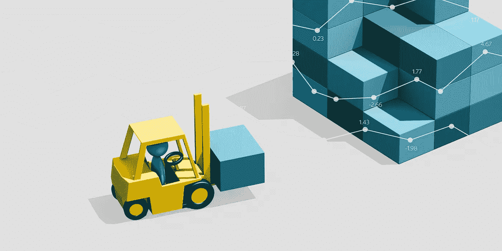
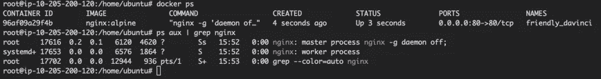

# 安全 Docker 容器需要安全的应用程序

> 原文：<https://medium.com/capital-one-tech/secure-docker-containers-require-secure-applications-75eb358abef9?source=collection_archive---------0----------------------->

## 理解容器如何工作是理解如何保护它们的第一步



应用程序容器是出现并重塑整个行业的伟大技术之一。从历史上看，这种中断很少见；实时见证像 Docker 这样的产品如何从一个想法的种子发展成为当今数字领域的必备主干是非常了不起的。我自己作为技术人员的职业生涯与 Docker 及其更大的容器生态系统的发展和成熟是并行的。随着容器和容器平台的发展，它们周围的社区也在增长，基于容器的产品已经渗透到我们的技术堆栈中。然而，尽管如此，容器实际上是如何工作的，以及它们给运行在其中的应用程序带来的安全隐患，仍然有些神秘。这是我今天想尝试解决的话题。

*注意:虽然我知道有许多容器运行时和方案(* [*lxc*](https://linuxcontainers.org/) *，* [*rkt*](https://coreos.com/rkt/) *，*[*Docker*](https://docker.io)*等)。)我将特别关注 Docker，因为它无疑是最受欢迎的。*

# 打开 Docker 图像包装

首先，我们需要了解什么是[码头工人形象](https://docs.docker.com/glossary/?term=image)。从广义上讲，图像就像容器模板，既可以独立运行，也可以在其上创建新的图像。从更专业的角度来说，图像只是。包含文件系统的 tar 存档。就是这样！

一旦从映像库(如[hub.docker.com](http://hub.docker.com))下载了映像，它们就会被解压缩并存储在主机的文件系统中。我们实际上可以通过导航到映像路径来检查文件系统上的这些映像(对于使用 overlay2 存储驱动程序的主机，`/var/lib/docker/overlay2`)。每个图像层都以 sha256 哈希命名；这是官方阿尔卑斯山图片的基础图层:

```
 root@ip-XXXXXXXXXXX:/var/lib/docker/overlay2/56abedeb5085c1ad962f3dec89d1e9bc6b584ee06d9bed0897221417bb496c56/diff# ls -la
total 72
drwxr-xr-x 18 root root 4096 Jan 24 16:41 .
drwx------  3 root root 4096 Jan 24 16:41 ..
drwxr-xr-x  2 root root 4096 Dec 20 22:25 bin
drwxr-xr-x  2 root root 4096 Dec 20 22:25 dev
drwxr-xr-x 15 root root 4096 Dec 20 22:25 etc
drwxr-xr-x  2 root root 4096 Dec 20 22:25 home
drwxr-xr-x  5 root root 4096 Dec 20 22:25 lib
drwxr-xr-x  5 root root 4096 Dec 20 22:25 media
drwxr-xr-x  2 root root 4096 Dec 20 22:25 mnt
dr-xr-xr-x  2 root root 4096 Dec 20 22:25 proc
drwx------  2 root root 4096 Dec 20 22:25 root
drwxr-xr-x  2 root root 4096 Dec 20 22:25 run
drwxr-xr-x  2 root root 4096 Dec 20 22:25 sbin
drwxr-xr-x  2 root root 4096 Dec 20 22:25 srv
drwxr-xr-x  2 root root 4096 Dec 20 22:25 sys
drwxrwxrwt  2 root root 4096 Dec 20 22:25 tmp
drwxr-xr-x  7 root root 4096 Dec 20 22:25 usr
drwxr-xr-x 11 root root 4096 Dec 20 22:25 var
root@ip-XXXXXXXXXXX:/var/lib/docker/overlay2/56abedeb5085c1ad962f3dec89d1e9bc6b584ee06d9bed0897221417bb496c56/diff#
```

正如我们所看到的，它实际上只是一个保存文件系统的目录。那么，文件系统如何变成一个运行的容器呢？

# 参见 cgroup。请参见群组运行

现在，我们来谈谈 Linux cgroups。 [Cgroups](http://manpages.ubuntu.com/manpages/cosmic/man7/cgroups.7.html) 或“控制组”，是 Linux 内核的一个功能，它允许将进程组与机器的其余部分隔离开来。使用 cgroups，一个进程可以拥有一个“虚拟”文件系统、资源限制、防火墙网络和许多其他特性。如果这听起来像 Docker 容器，那你就对了！Docker 利用 cgroups 来运行它的容器。

为了运行一个容器，Docker 守护进程采取以下步骤(大致):

*   从每个图像层编译虚拟文件系统。
*   创建新的 cgroup。
*   将虚拟文件系统挂载到 cgroup。
*   将 cgroup 限制设置为由映像元数据(存储在本地数据库中)定义的限制。
*   设置组网络。
*   启动图像文件`**CMD**`或 `**ENTRYPOINT**`中定义的过程。

恭喜你！现在，您有了一个正在运行的 Docker 容器。事实上，如果你想检查正在运行的容器，你可以使用 ps 找到它的进程:



# 探索如何构建安全的容器

当你深入了解 Docker 的工作原理时，你会发现它本身并没有什么革命性的东西。它只是利用已经支持的内核原语，如 cgroups，并将它们打包成一个更简单、更易于使用的产品。但是由于 Docker 并没有在实际的内核机制上构建太多东西，所以它处理的容器和它托管的应用程序只和内核本身一样安全。这意味着 Docker 守护进程、它的映像和它的容器没有自己真正的内置安全特性，这些特性允许嵌入的秘密保持秘密或防止未经授权的第三方访问它们的进程和文件系统。我们可以通过探索一些在容器映像中隐藏秘密的更流行的方法来测试这一点:在映像构建时注入秘密，在容器运行时将秘密放入环境变量中。

## **测试#1 在构建时将秘密注入容器**

让我们创建一个新的 Docker 容器。实际上，这很简单。我们需要的只是一个 Docker 文件(假设您已经安装了一个 Docker)。

```
FROM alpine:latest
ADD super.secret /super.secret
CMD /bin/sh
```

我们将创建一个名为 super.secret 的文件来注入容器:

```
$> echo "this is a secret" > super.secret
```

现在我们可以建立图像。

```
root@ip-XXXXXXXXXXX:~/docker# docker build -t secret:test .
Sending build context to Docker daemon  3.072kB
Step 1/3 : FROM alpine:latest
---> 3f53bb00af94
Step 2/3 : ADD super.secret /super.secret
---> 61ea9104ee5d
Step 3/3 : CMD /bin/sh
---> Running in 2a1b90e4b209
Removing intermediate container 2a1b90e4b209
---> c3713649d32e
Successfully built c3713649d32e
Successfully tagged secret:test
root@ip-XXXXXXXXXXX:~/docker#
```

太好了！我们有一个图像，现在包含了我们的秘密(密码，证书，任何你想保密的东西)。那么，如果我们在文件系统中搜索这个秘密文件，会发生什么呢？

```
root@ip-XXXXXXXXXXX:~/docker# find / | grep super.secret
/root/docker/super.secret
/var/lib/docker/overlay2/11567f3bcc1b8e844e22ba37cfef2432ea319247e403707497022edebfd7a7ce/diff/super.secret
root@ip-XXXXXXXXXXX:~/docker#
```

这可不好。我们不仅找到了文件，而且还可以读回那个文件。

```
root@ip-XXXXXXXXXXX:~/docker# cat /var/lib/docker/overlay2/11567f3bcc1b8e844e22ba37cfef2432ea319247e403707497022edebfd7a7ce/diff/super.secret
this is a secret
root@ip-XXXXXXXXXXX:~/docker#
```

这是因为，正如我们前面所探讨的，Docker 映像只是存在于 Docker 主机上的文件系统。现在，在这种情况下，我们显然没有暴露任何东西，因为 a)秘密是`*“this is a secret”*`和 b)图像从未离开我们的本地主机。但是，为了便于讨论，假设我们将我们的图像推送到 Docker Hub，或者像 Artifactory 这样的内部企业存储库。现在，任何对该图像拥有“拉”权限的人都可以访问我们的秘密，这意味着该秘密不再是真正的秘密了。

那么环境变量呢？那些肯定更安全吗？

## **测试#2 在环境变量中注入秘密**

让我们回过头来修改 Dockerfile，添加一个名为`SECRET`的环境变量。

```
FROM alpine:latest
ENV SECRET="" # blank secret that we'll over-write at run-time.
CMD /bin/sh
```

现在我们可以建立这个新的形象。

```
root@ip-XXXXXXXXXXX:~/docker# docker build -t secret:testenv .
Sending build context to Docker daemon  3.072kB
Step 1/3 : FROM alpine:latest
---> 3f53bb00af94
Step 2/3 : ENV SECRET=""
---> Running in a1872c8078c3
Removing intermediate container a1872c8078c3
---> 178c24f06c44
Step 3/3 : CMD /bin/sh
---> Running in bccf052509b7
Removing intermediate container bccf052509b7
---> cca1f3bd8248
Successfully built cca1f3bd8248
Successfully tagged secret:testenv
root@ip-XXXXXXXXXXX:~/docker#
```

因此，现在我们所做的就是将漏洞从文件系统转移到流程环境。虽然这种改变消除了通过图像存储库传播的秘密，但是这种方法仍然不能防止其他容器或用户访问正在运行的容器中的秘密。让我们来探索如何。

首先，我们需要运行我们的新容器。由于它默认运行/bin/sh 并需要用户输入，我们可以用 sleep 命令覆盖它，使它在后台运行。

```
root@ip-XXXXXXXXXXX:~/docker# docker run -d -e SECRET="this is a secret" secret:testenv sleep 300
```

这将使容器在退出前运行五分钟。

现在，就像我们用 Nginx 做的那样，我们可以用 ps 找到在容器中运行的睡眠进程:

```
root@ip-XXXXXXXXXXX:~/docker# clear
root@ip-XXXXXXXXXXX:~/docker# ps aux | grep sleep
root     12184  0.0  0.0   1516     4 ?        Ss   17:06   0:00 
sleep 300
root     12342  0.0  0.0  12944   940 pts/1    S+   17:06   0:00 grep --color=auto sleep
root@ip-XXXXXXXXXXX:~/docker#
```

记下 PID ( `12184`)，然后我们可以通过导航到/proc/9944 并查看 environ 文件来检查流程环境:

```
root@ip-XXXXXXXXXXX:~/docker# cat /proc/12184/environ
PATH=/usr/local/sbin:/usr/local/bin:/usr/sbin:/usr/bin:/sbin:/bin HOSTNAME=6ddf6d9e588dSECRET=this is a secret HOME=/root
root@ip-XXXXXXXXXXX:~/docker#
```

虽然比前一种方法稍微安全一点(而且肯定更加模糊)，但它仍然没有我们希望的那么安全。

# 安全容器需要安全的应用程序

图像和容器不应该被认为是本质安全的——在一个安全的环境中，容器的安全和可接受的使用来自于在应用程序栈的每一层正确地实现安全性。因此，安全性应该在*应用层*实现。为了正确地做到这一点，我们需要考虑一些常见的陷阱。

## 陷阱 1:将秘密硬编码到应用程序中

尤其是在一个发布周期更快的项目中，将所有秘密都放入源代码的诱惑是巨大的。尤其是当您可以在部署新版本时轮换机密时。然而，这带来了一些问题。其中最主要的是，你必须把这些秘密放进代码里。

无论代码在哪里，你的秘密也在哪里。假设每个人都使用某种版本控制系统(VCS ),比如 GitHub、Bitbucket 或 GitLab，那么在项目的生命周期中，你的秘密将在那个 VCS 中。更糟糕的是，这些秘密将继续存在于该项目的提交历史中。即使您定期轮换您的机密，提交历史也为任何愿意做这项工作的人提供了这些机密是如何生成的模式，一旦他们理解了该模式，他们就可以尝试预测下一个将会是什么。

将秘密放入 VCS 还确保他们的视野(秘密可以从需要知道它们的人那里传播多远)相当大，组织中的每个人都可以对该组织的 VCS 系统进行只读访问。

## 陷阱 2:将环境变量用于秘密

正如我们之前已经讨论过的，你不应该把秘密放入环境变量中。说够了。

## 陷阱 3:没有为每个应用程序和环境使用唯一的秘密。

拥有多个帐户、应用程序、API、网络和其他系统的一个问题是跟踪他们最终需要的秘密。帐户有密码，应用程序有加密密钥和证书，API 有 API 密钥，网络有数据包标志或 MAC 地址，这样的列表还有很多——现在需要跟踪这个列表。

有一种非常真实的诱惑，那就是简单地对所有事情使用同一个秘密，这样你就只需要记住或跟踪一件事情，而不是几件。这不仅仅是消费者领域的问题，在消费者领域，人们[一遍又一遍地使用同一个密码](http://time.com/5071176/worst-passwords-2017/)，在他们的银行、购物、纳税申报单、DMV 门户网站等之间共享他们唯一的秘密。这对开发人员和企业 IT 来说也是一个问题。跨应用程序重用像证书或 API 密钥这样的秘密会产生一连串的漏洞:如果一个应用程序的秘密被识别，但它们被另一个应用程序共享，那么第二个应用程序也容易受到攻击。秘密的重复使用也增加了它们的寿命，而时间是秘密的敌人。秘密使用的时间越长，泄露秘密的可能性就越大。

## 陷阱 4:在不安全的地方存储秘密

这与第一个陷阱有关，那就是你永远不应该把你的秘密存放在不安全的地方。这包括共享存储、未加密文件、版本控制系统、电子邮件、聊天应用程序、发展规划应用程序、短信、信鸽、12 世纪羊皮纸、数据库和手写笔记本。仅举几个例子。正如我们最近看到的，一种意外暴露数据的常见方法是通过亚马逊 S3 服务上的用户错误，尽管这不是亚马逊的错。使用 S3 作为一个安全的储存库是一个坏主意，因为像 [Booz-Allen Hamilton 这样的公司最近发现](https://arstechnica.com/information-technology/2017/05/defense-contractor-stored-intelligence-data-in-amazon-cloud-unprotected/)他们通过一个配置非常差的 S3 桶意外泄露了地理空间情报图像，威瑞森和埃森哲也有自己的灾难。虽然第四个缺陷可以说是四个缺陷中最不严重的，但是有一些方法可以正确地保护机密，并且可以在所有类型的应用程序中使用。

## 解决办法

这里的解决方案是实现某种秘密管理，要么通过云提供商(如 AWS 的[秘密管理器](https://aws.amazon.com/secrets-manager/?hp=tile&so-exp=below)和 [KMS](https://aws.amazon.com/kms/?hp=tile&so-exp=below) )、定制应用程序，要么通过第三方应用程序，如 [Hashicorp Vault](https://www.vaultproject.io/) 、 [CyberArk](https://www.cyberark.com/) 、 [Salt](https://docs.saltstack.com/en/latest/topics/pillar/) 或类似的应用程序。最终的结果应该是一个没有秘密概念的容器基础结构、根据需要动态获取秘密的应用程序，以及与基础结构的其余部分分开管理和轮换的秘密。

应该注意的是，严格遵循[“12 因素应用”](https://12factor.net/)思想的应用如果[使用环境变量进行所有的配置](https://12factor.net/config)，将是不安全的。虽然 12 因素应用程序提出的想法是一个很好的起点(Capital One 自己的吉米·雷(Jimmy Ray)在 12 因素应用程序和微服务(T5)上有一篇[的优秀文章)，但开发者永远不应该在没有对规则进行批判性评估的情况下遵守一套规则——这就是其中之一。也许应该增加第十三个因素来讨论秘密管理？](/capital-one-tech/container-ready-applications-with-twelve-factor-app-and-microservices-architecture-16af683a767f)

# 信任的生态圈

真正的应用程序安全应该在应用程序级别处理，而不是在基础结构级别。当在需要机密的环境中运行应用程序时，开发人员应该努力利用机密管理系统来确保这些机密不会超出他们的预期范围。

作为开发人员和工程师，我们应该努力编写自己想要使用的应用程序。我们的角色要求我们与其他开发人员和他们的工作共存时，我们存在于一个信任的生态环境中。我们编写我们的同行将使用的软件，这些软件将管理我们同行的数据，并且在某些情况下，对人们的生活具有真正的权力。信任生态圈的一部分是理解我们编写的软件是安全的，不会不必要地暴露数据。如果这些应用程序在容器中运行，我们有责任确保这些应用程序尽可能安全。

但是有一个好消息:这并不难！与 DevOps/SRE 世界中的许多事情不同，一旦你理解了它们是如何工作的，保护容器就变得非常简单。我希望这篇博文有助于你揭开其中的神秘面纱。

编码快乐！

## 相关:

*   [使用多阶段构建来简化和标准化构建流程](/capital-one-tech/multi-stage-builds-and-dockerfile-b5866d9e2f84)
*   [冰箱里的鲸鱼 Docker 简介](/capital-one-tech/the-whale-in-the-refrigerator-80f659fea1a4)
*   [杂货店中的鲸鱼 Docker 文件和 Docker 图像介绍](/capital-one-tech/whale-in-the-grocery-store-an-introduction-to-docker-and-docker-images-311319688692)

***披露声明:以上观点为作者个人观点。除非本帖中另有说明，否则 Capital One 不属于所提及的任何公司，也不被其认可。使用或展示的所有商标和其他知识产权都是其各自所有者的所有权。本文为 2019 首都一。***