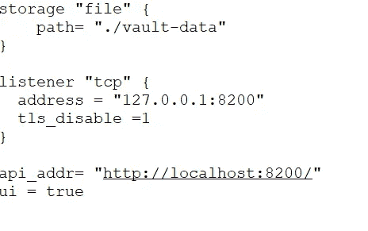
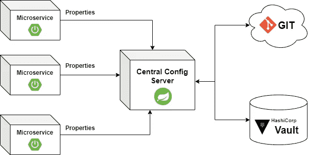
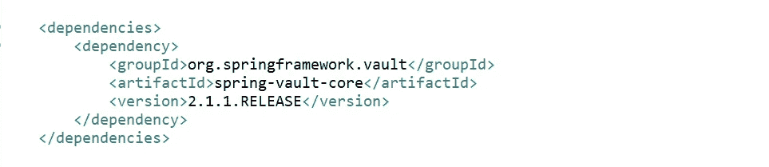
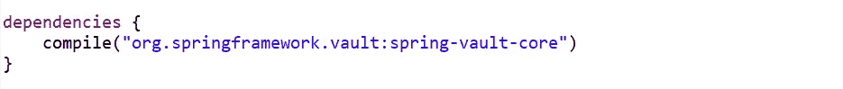
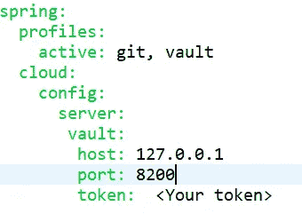
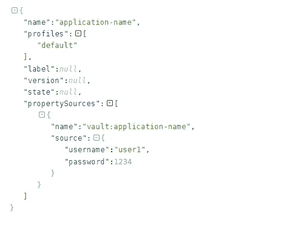

# 通过 HashiCorp Vault 保护微服务配置属性

> 原文：<https://medium.com/globant/secure-microservices-configuration-properties-via-hashicorp-vault-b6db753063e?source=collection_archive---------1----------------------->

# **什么是跳马？**

HashiCorp Vault 是一个平台，用于保护、存储和严格控制对令牌、密码、证书和加密密钥的访问，以保护动态基础架构中的敏感数据和其他机密。使用 vault，我们可以从 vault 键/值存储、数据库等中检索凭证。以安全的方式。保险库，总的来说解决了软件开发中如何管理机密的安全问题。

它是存储应用程序所需的最敏感和最机密的属性的中心位置。它提供加密，以更安全的方式存储这些秘密。我们还可以为 Vault 服务器提供各种访问控制机制。为了确保任何可疑的活动和任何未经授权的用户试图访问这些秘密，Vault 提供了审计跟踪日志，以便我们可以很容易地确定谁试图访问这些文件。Vault 还提供了最重要的功能，即在特定时间段后对机密进行动态滚动。

现代系统需要访问大量秘密:数据库凭证、外部服务的 API 密钥、面向服务架构通信的凭证等。了解谁在访问什么秘密已经非常困难，并且是特定于平台的。如果没有定制的解决方案，添加密钥滚动、安全存储和详细的审计日志几乎是不可能的。这就是 Vault 介入的地方。

# 如何设置 Vault 服务器？

在下面的步骤中，我们将介绍 Windows 操作系统的安装步骤。

1)从 https://www.vaultproject.io/downloads[下载 zip 文件](https://www.vaultproject.io/downloads)

2)将其解压缩，并将目录路径保存在环境变量中

3)在环境变量中或通过命令在命令提示符下设置 VAULT _ ADDR = ' http://127 . 0 . 0 . 1:8200 '

*   export VAULT _ ADDR = ' http://127 . 0 . 0 . 1:8200 '

4)启动 Vault 服务器有两种方式

a)在开发模式下，我们可以手动传递将进一步用于客户端身份验证的根令牌

*   vault 服务器—dev—dev-root-token-id = " 00000000–0000–0000–0000–000000000 "

b)使用基于文件的模式(用于生产和其他环境)

*   创造。包含以下内容的存储库配置的 hcl 配置文件

**vaultconfig.hcl**

然后使用该文件启动 vault 服务器

*   vault server-config = vault config . HCl

启动 Vault 服务器后，我们将对其进行初始化。在初始化期间，生成加密密钥，创建解封密钥，并创建初始根令牌。

*   保险库操作员初始化

初始化后，我们将获得解封密钥和一个用于 vault 服务器的令牌，我们可以用它来解封 vault，该令牌将用于登录 Vault 服务器。请记住，启动后我们至少需要 3 个密钥来解封保险库，所以请确保我们将这 3 个密钥保存在安全的地方，因为没有这个保险库将无法解密秘密。

*   保险库操作员解封

5)通过令牌登录到 vault 服务器

*   保险库登录

6)一旦我们登录，我们可以启用秘密引擎以键值方法存储秘密数据

*   启用存储库机密-版本= 1-路径=机密 kv

7)完成所有工作后，我们现在可以为各个应用程序将机密放入保险库中

*   <application-name>/【T2 金库千伏放秘】=<vaule></vaule></application-name>

# HashiCorp 的 Vault 支持多少集成选项？

1) Linux Shell 集成

2) Java Spring Boot 应用集成

3) Python

4)节点。射流研究…

5)可行的自动化

在本教程中，我们将介绍微服务的 Spring Boot 集成选项，并了解 Spring cloud 如何为 HashiCorp 的 Vault 提供集成支持。

**Vault Integration In Microservices**

# 什么是跳马？

Spring cloud vault 为 HashiCorp 的 vault 提供了 Spring 抽象。它提供了与 Vault 集成的依赖关系，并允许用户与 Vault 服务器交互，以访问数据库用户名和密码、api 令牌、加密代码等秘密。Spring 框架在 spring-vault-core 包中提供了库依赖，因此我们可以将它集成到任何 Spring boot 应用程序构建文件中，如下所示

**美芬**—

**pom.xml**

**梯度**

**build.gradle**

# Spring Boot 微服务的保险库集成

在微服务架构中，我们已经有了 Spring cloud 的一部分，称为中央配置服务器，用于外部化和集中微服务的配置相关属性。有两个选项本地位置和 git 存储库，我们可以在其中保存我们的配置属性。除此之外，我们还可以选择另一个 Vault 服务器，在 Vault 中存储我们的机密和敏感属性，使数据库凭据、Api 令牌和加密代码更加安全。

Spring cloud config 已经包含了 Spring vault core 的依赖项，所以我们不需要在中央配置服务器构建文件中添加任何额外的东西。

我们需要在中央配置 application.yml 文件中添加 Vault 的配置，该文件将用于连接 Vault 服务器，并通过向其传递令牌来获取属性。

**application.yml**

让我们通过一个 HTTP 请求来测试我们的配置服务器，以获取秘密属性。你可以使用 CURL，或者像 POSTMAN 这样的 REST 客户端工具。

$ curl-X " GET " " http://localhost:8888/myapp/default "-H " X-Config-Token:your Token "

这将返回如下所示的响应:

在上面的 json 响应中，我们可以看到第一个属性源，它是存储在 Vault 中的机密的 Vault 服务器。

现在，当我们启动客户端微服务时，它首先会向中央配置服务器询问配置属性，然后中央配置服务器会通过传递令牌密钥进行身份验证，向 Vault 询问数据库凭据或任何其他机密配置属性。一旦请求被完全认证，秘密就通过中央配置服务器被提供给相应的微服务。

# 结论

本教程向您展示了如何在 Spring cloud vault 中保存您的秘密配置。使用 Spring Cloud Config，您可以做更多的事情，例如加密您存储的值，并将其与 Spring Vault 配合使用，以将您的秘密存储在更安全的位置。