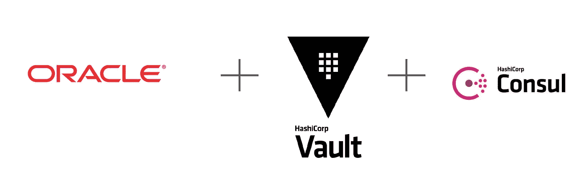

# 使用 Hashicorp Vault 和 Consul 保护 Oracle 数据库连接

> 原文：<https://medium.com/version-1/secure-oracle-database-connection-using-hashicorp-vault-and-consul-67039887803e?source=collection_archive---------1----------------------->


Photo by [Shubham Dhage](https://unsplash.com/@theshubhamdhage?utm_source=medium&utm_medium=referral) on [Unsplash](https://unsplash.com?utm_source=medium&utm_medium=referral)



这是如何使用 Hashicorp Vault PKI 引擎和 Oracle 数据库安全监听器来保护 Oracle 数据库连接的概述。这种模式可以用于开发/测试环境，在这种环境中，您希望使用自己的证书来节省购买第三方证书的成本。此外，这将帮助您自动执行证书轮换，而无需向您的组织 CA 请求签名证书。这种模式基于以下假设:

1.  AWS 是云提供商
2.  Oracle 数据库安装在 EC2 上
3.  IAM 角色附加到 EC2 实例
4.  哈希公司的保险库已经设置好了
5.  安装在 EC2 实例上的 Ansible
6.  用于部署保险库和基础设施的地形

我没有亲自编写所有的详细步骤，而是将所有的参考链接放在一页上，以便您以最简单的方式遵循和理解该过程。所以，开始了。

概括地说，下面的过程由一些高级步骤组成:

1.  启用 Hashicorp Vault PKI 引擎
2.  创建 Vault 角色以授予 PKI 引擎访问权限，并将其映射到 EC2 IAM 角色
3.  部署 consul 模板以从 PKI 引擎获取更新的证书
4.  使用从 PKI 引擎获取的证书创建钱包
5.  使用上面创建的钱包注册安全监听程序

# 启用 Hashicorp Vault PKI 引擎

以下是如何为 Vault 命名空间设置根 CA 和中间 CA 证书的示例:

# 创建 Vault 角色以授予 PKI 引擎访问权限，并将其映射到 EC2 IAM 角色

下面是如何创建一个 vault 角色来授予对 PKI 的访问权限，并使用 terraform 将该角色映射到 IAM 角色的一个片段。(确保将 IAM 角色添加到 EC2 实例配置文件中，以便它承担)

```
# Vault policy document
data "vault_policy_document" "role_vault_cert_policy_document" {
rule {
path = "pki*"
capabilities = ["create", "read", "update", "delete", "list", "sudo"]
}
}# Vault policy
resource "vault_policy" "role_vault_cert_policy" {
name = "${var.service}_cert_policy"
policy = data.vault_policy_document.role_vault_cert_policy_document.hcl
}# Vault AWS Auth backend role with attached above policy
resource "vault_aws_auth_backend_role" "role" {
auth_type = "iam"
bound_iam_principal_arns = [<EC2 IAM Role ARN>]
role = <EC2 IAM Role Name>
token_max_ttl = 2764800
token_policies = ["default", vault_policy.role_vault_cert_policy.name]
}
```

# 部署 consul 模板以从 PKI 引擎获取更新的证书

感谢 [Ned Shawa](https://medium.com/u/1c5af378fb8f?source=post_page-----67039887803e--------------------------------) ，这里有一个很好的概述，介绍了如何部署 consul template 虚拟机以将其与 Vault 集成:

[GitHub—hashi corp/Consul-Template:@ hashi corp Consul 和 Vault 数据的模板渲染、通知程序和监管程序。](https://github.com/hashicorp/consul-template)

一旦您将 consul 模板配置为在 VM 上的某个位置生成证书，您就完成了 70%的工作。现在，让我们从 DevOps 转移到 DBA 位。

# 使用从 PKI 引擎获取的证书创建钱包

您可以使用以下命令，使用 consul 模板从 Vault PKI 引擎获取的 PEM 证书文件创建一个 wallet。

```
# Convert PEM to PKCS12
openssl pkcs12 -export -in <Consul Template Target Location>/certificate.crt -inkey <Consul Template Target Location>/private_key.rsa -certfile <Consul Template Target Location>/ca_chain.crt -out ${ORACLE_HOME}/wallet/ewallet.p12 -password pass:<WALLET PASSWORD># Convert PKCS12 to JKS
${ORACLE_HOME}/bin/orapki wallet pkcs12_to_jks -wallet ${ORACLE_HOME}/wallet/ewallet.p12 -jksKeyStoreLoc ${ORACLE_HOME}/wallet/ewallet.jks -jksKeyStorepwd <JKS KEY PASSWORD> -pwd <WALLET PASSWORD># Create wallet
${ORACLE_HOME}/bin/orapki wallet create -wallet ${ORACLE_HOME}/ssl_wallet -auto_login -pwd <WALLET PASSWORD># Add JKS Cert to wallet
${ORACLE_HOME}/bin/orapki wallet jks_to_pkcs12 -wallet ${ORACLE_HOME}/ssl_wallet -pwd <WALLET PASSWORD> -keystore ${ORACLE_HOME}/wallet/ewallet.jks -jkspwd <JKS KEY PASSWORD># Show certificate details from wallet
${ORACLE_HOME}/bin/orapki wallet display -wallet "${ORACLE_HOME}/ssl_wallet" -pwd <WALLET PASSWORD>
```

# 使用 wallet 注册安全监听程序

您可以通过以下链接在 SQLNet.ora 和 TNSNames.ora 中配置安全监听器

[ORACLE-BASE —使用 SSL 和 TLS 为数据库连接配置 TCP/IP](https://oracle-base.com/articles/misc/configure-tcpip-with-ssl-and-tls-for-database-connections#server-network-configuration)

# 结论

当您的组织希望使用 Hashicorp Vault PKI 引擎来生成证书，并希望内部应用程序使用安全监听器进行连接时，上述过程非常有用。Consul 模板对于自动生成证书和从 Vault PKI 引擎获取证书非常方便。在我的一个客户机上，我们使用了这个过程来自动刷新安全侦听器钱包中的证书，计划在每隔一个星期天作为开发/测试数据库上的 cron 作业进行刷新。请记住，您可以在 consul 配置文件中设置证书的到期时间，因此您可以控制 cron 作业的频率。这有助于我们在开发/测试数据库上维护短期证书，并自动刷新，因此我们再也不用考虑记住每个环境的证书到期时间。如果你有和上面类似的用例，希望这也能帮助你。


**关于作者** Sourish Banerjee 是 devos&1 版本的高级云顾问。