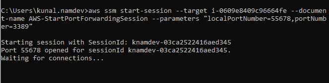

# 使用 AWS SSM 保护 RDP 到 EC2 私有实例

> 原文：<https://medium.com/globant/secure-rdp-to-ec2-private-instance-using-aws-ssm-d0a1cadd9d6?source=collection_archive---------0----------------------->

# 介绍

传统上，我们需要一个堡垒主机来连接 EC2 私有实例，以实现安全连接或减少攻击面，AWS 建议使用一个[堡垒主机](https://docs.aws.amazon.com/quickstart/latest/linux-bastion/welcome.html)，也称为跳转主机。Bastion 是一个特殊用途的 EC2 实例，被设计为来自 Internet 的主要接入点，并充当其他 EC2 实例的代理。为了连接到您的 EC2 实例，您首先将远程桌面协议(RDP)连接到 bastion 主机，并从那里连接到目标 EC2 实例。

为了消除堡垒主机的负担，AWS 提供了 [AWS 系统管理器](https://aws.amazon.com/systems-manager/) (SSM)，允许您安全地连接到您的 EC2 实例，而不需要运行和操作您自己的堡垒主机，也不需要在您的 EC2 实例上运行 SSH。

在本文中，我将介绍如何使用 AWS SSM 和隧道 RDP，使用会话管理器的端口转发功能来访问远程 Windows 实例。

本文包括以下部分:

1-先决条件
2- AWS 系统经理(SSM)
3-创建 Windows OS 用户
4- RDP 到 EC2 实例
5-摘要
6-参考

# 1-先决条件

*   具有互联网连接性(通过 NAT 网关)的 EC2 实例，或者位于为 SSM 配置了 [VPC 端点的子网中。](https://aws.amazon.com/premiumsupport/knowledge-center/ec2-systems-manager-vpc-endpoints/)
*   分配给实例的 IAM 实例配置文件，该实例附加了**amazonsmsmanagedinstancecore**托管策略(或类似权限)。
*   在实例上安装并运行 SSM 代理。
*   在本地计算机上安装和配置 AWS CLI。
*   安装在本地机器上的 AWS CLI 的[会话管理器插件的最新版本。](https://docs.aws.amazon.com/systems-manager/latest/userguide/session-manager-working-with-install-plugin.html)

# 2- AWS 系统经理(SSM)

AWS Systems Manager 会话管理器是一个新的交互式 shell 和 CLI，有助于提供安全、受访问控制和受审核的 Windows 和 Linux EC2 实例管理。会话管理器消除了打开入站端口、管理 SSH 密钥或使用堡垒主机的需要。

AWS SSM 使用实例上的 Systems Manager 代理(SSM 代理)来启动实例和主机之间的连接。SSM 代理预安装在 Windows Server 2016/2019 ami 上。本文将向您展示如何安全地使用 SSM 代理和 Systems Manager API，通过隧道使用端口转发连接到您的私有 Windows EC2 实例，而无需运行 bastion hosts/jump box，也无需向该实例打开任何入站端口。


## **SSM 港转运**

您可以使用会话管理器的端口转发功能建立远程桌面协议(RDP)隧道，以访问远程 Windows 实例，而无需在远程实例上打开入站端口 3389(默认 RDP 端口)。

通过端口转发，您可以将远程实例上的端口转发到本地机器上的端口。这允许用户将传统的远程桌面协议(RDP)端口(3389/tcp)转发到他们本地机器上的可用端口(例如，55678/tcp)。然后，用户可以使用任何 RDP 客户端连接到本地机器上的转发端口，以访问 AWS 中的实例。这可以使用下面的 SSM 命令来实现:

```
aws ssm start-session --target <instance-id> --document-name     AWS-StartPortForwardingSession --parameters “localPortNumber=55678,portNumber=3389”
```

# **3-创建一个 Windows 操作系统用户**

如果您的 EC2 实例加入了一个[活动目录域](https://docs.aws.amazon.com/directoryservice/latest/admin-guide/ms_ad_join_instance.html)，您可以跳过创建 windows 本地用户的这一步，这将是您的活动目录凭证。按照以下步骤在 windows 实例中创建新的远程桌面用户:

A.在 AWS 系统管理器导航菜单中的节点管理下，浏览到会话管理器控制台，并在 Windows 实例上启动会话。


B.键入以下命令创建新用户:

*   以安全字符串的形式输入密码。输入下面的命令，该命令将提示您输入密码，然后键入一个强密码并输入:

```
$Password = Read-Host -AsSecureString
```

*   创建本地用户:

```
New-LocalUser "User01" -Password $Password
```

*   将用户添加到远程桌面用户组:

```
Add-LocalGroupMember -Group “Remote Desktop Users” -Member “User01”
```

*   单击终止以终止会话，或输入 exit 并选择关闭。


# **4- RDP 到 EC2 实例**

按照以下步骤在 RDP 和 EC2 实例之间建立安全连接:

A.浏览到 EC2 控制台，记下 Windows 实例的实例 id。

B.在您的本地机器上打开一个终端，键入下面的命令来启动一个到 Windows 实例的会话。

```
aws ssm start-session --target <instance-id> --document-name     AWS-StartPortForwardingSession --parameters “localPortNumber=55678,portNumber=3389”
```

C.您应该会看到一条消息，表明端口 55678 已经为该会话打开。



D.打开 Microsoft 远程桌面客户端，并使用以下信息添加新的远程桌面。

*   PC 名称:本地主机:55678。
*   用户帐户:提供在前面步骤中创建的用户名和密码。


E.现在，您应该已经连接，能够通过 RDP 在远程实例上工作了。


一旦完成了 EC2 实例上的工作，就可以安全地从 RDP 会话断开连接。然后，您可以进入终端窗口，按 Ctrl+C 取消会话管理器命令。这将关闭到 EC2 实例的连接，并从本地机器上的实例中删除任何转发的端口。

# 5-摘要

在这篇文章中，我们看到了如何使用 AWS 会话管理器访问私有 EC2 实例，而不需要向实例的安全组添加入站规则，管理 SSH 密钥并使用另一个实例作为堡垒主机。我们还学习了如何使用会话管理器来使用端口转发。

# 6-参考文献

[](https://docs.aws.amazon.com/systems-manager/latest/userguide/what-is-systems-manager.html) [## 什么是 AWS 系统管理器？

### AWS 系统管理器(以前称为 SSM)是一种 AWS 服务，您可以使用它来查看和控制您的基础架构…

docs.aws.amazon.co](https://docs.aws.amazon.com/systems-manager/latest/userguide/what-is-systems-manager.html) 

[https://docs . AWS . Amazon . com/systems-manager/latest/user guide/what-is-systems-manager . html](https://docs.aws.amazon.com/systems-manager/latest/userguide/what-is-systems-manager.html)

[https://AWS . Amazon . com/premium support/knowledge-center/ec2-systems-manager-VPC-endpoints/](https://aws.amazon.com/premiumsupport/knowledge-center/ec2-systems-manager-vpc-endpoints/)


在 https://www.globant.com/studio/cloud-ops[拜访我们](https://www.globant.com/studio/cloud-ops)