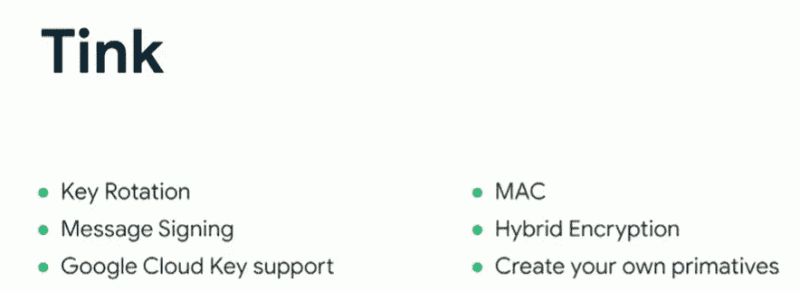

# 如何保护机密🔑在 Android 中(深入)— Android 安全-02

> 原文：<https://blog.kotlin-academy.com/secure-secrets-in-android-using-jetpack-security-in-depth-android-security-02-4026b8e012f4?source=collection_archive---------0----------------------->

在 google I/O 2019 中，Android 团队发布了名为 **Jetpack Security** 的安全加密库，以方便开发人员构建安全的应用程序。


Image from FreePik

在处理隐私问题时，安全性起着至关重要的作用。在我们的 Android 安全主题中，我们必须了解过去的方法及其缺点。请阅读我在 Android 安全系列中的前一篇文章，以便更好地了解它们。

[](/how-to-secure-secrets-in-android-android-security-01-a345e97c82be) [## 如何保护机密🔑在 Android 中— Android Security-01

### 在构建处理 API、从服务器接收的令牌的应用程序时，安全性是一个关键要求…

blog.kotlin-academy.com](/how-to-secure-secrets-in-android-android-security-01-a345e97c82be) 

> 反射

在这个世界上，我们有数以百万计的人们正在使用的 Android 设备。其中一些设备的操作系统使用 AES 加密，而其他操作系统已经实现了 [Adiantum](https://opensource.google/projects/adiantum) 加密。现在，您的设备数据是安全的，但我们应用程序的数据呢？例如，您的应用程序正在处理个人身份数据、财务记录等敏感信息，或者您的应用程序是否运行在*根*设备上。

为此，我们必须提供更多的额外保护来确保其安全，这可以通过 Jetpack Security 轻松实现。它使用 [TINK](https://github.com/google/tink) (谷歌开源库)。Tink 提供了多种功能，包括:



Image from [Securing your app for work](https://www.youtube.com/watch?v=2y9Ol2N1I4k)

> *社区参与度*

[](https://androidweekly.net/issues/issue-488) [## Android Weekly -免费的每周 Android & Kotlin 开发简讯

### Android Weekly 是一份免费的时事通讯，帮助你保持 Android 开发的前沿

androidweekly.net](https://androidweekly.net/issues/issue-488) [](https://dormoshe.io/newsletters/ag/android/78?utm_source=twitter&utm_campaign=twitter) [## Android 趋势# 78-2021 年 10 月 19 日- Dor Moshe 的博客

### 订阅时事通讯，享受每周学习新知识的最新动态。

dormoshe.io](https://dormoshe.io/newsletters/ag/android/78?utm_source=twitter&utm_campaign=twitter) 

在我们的第一篇文章中，我们简要讨论了什么是 Jetpack 安全。所以，直接进入这个库提供的功能，但首先，看看我们主要使用的最重要的 API，Android Jetpack Security 也继承了它的功能。

# 密钥库 API

我们知道，保护机密通常以两种方式实现，首先是**公钥，**这意味着一个密钥用于加密数据，另一个密钥用于解密数据。第二种类型是**对称加密**，在这种方法中，相同的密钥用于加密和解密数据。Android Keystore API 的后端混合使用这两种类型来提供更高的安全性。

Keystore API 通过以下方式使保护机密易于实现:

*   首先，在应用程序第一次运行时生成一个随机密钥，并将其保存在密钥库中。
*   然后，为了存储秘密，首先从密钥库中检索密钥，用密钥加密数据，然后将加密的数据存储在共享首选项中。
*   然后，为了访问数据，首先从共享首选项中读取加密的数据，从 KeyStore 中获取密钥，然后使用这个密钥解密数据。

然而，我们的密钥是随机生成的，并且由 Keystore API 管理，那么我们为什么需要 Jetpack 安全性呢？

我在这里引用 [**迪诺拉·托瓦尔**T3:](https://medium.com/u/676a20de80ad?source=post_page-----4026b8e012f4--------------------------------)

> 你可能会问，如果我们已经有了 **android.security.keystore，**，这使我们有机会创建两种类型的密钥，一个*非对称密钥对或对称密钥，*这个新的库使用 keystore 提供的构建器模式，但以不同的风格，为密钥的创建提供安全设置，考虑到我们需要具有良好性能的良好加密。

Jetpack 安全性大放异彩😎

**Jetpack security 或 JetSec** 提供以下主要功能:

*   万能钥匙管理
*   数据加密

这允许用户以简单和安全的方式在本地存储包含令牌、API 密钥和用户凭证的文件。从密钥管理开始:

# **主密钥管理/密钥库系统**

> 根据 Android Keystore 系统的官方文档

[Android 密钥库系统](https://developer.android.com/training/articles/keystore#SecurityFeatures)允许你将**密钥**存储在一个容器中，使得从设备中提取密钥更加困难。一旦**密钥**在**密钥库**中，它们就可以在密钥材料保持不可导出的情况下用于加密操作。此外，它还提供了**限制何时以及如何使用**密钥的功能，例如要求**用户认证**密钥的使用，或者限制密钥只能在某些加密模式下使用。

**比如**我们大多把钱放在储物柜里，用钥匙锁上。这意味着如果有人能拿到我的钥匙，那么这个人就能轻易地拿到我的钱。同样的场景在这里，密钥用于加密和解密数据，密钥存储在安全的硬件中，即使在根设备上也无法提取。

Android 密钥库包含每个密钥的别名。它的工作方式完全像一张地图，意思是“关键部分”->“关键部分”->“价值部分”->关键的描述。此外，Jetpack 安全提供两种类型的密钥:

`SubKeys`:它用于加密和解密数据，并将自身存储在共享偏好设置中。

`MasterKey`:对所有`subkeys`进行加密，增加安全层，并将自身存储在密钥库中，使入侵者更难提取。


Image from [Securing your app for work](https://www.youtube.com/watch?v=2y9Ol2N1I4k)

`MasterKey`类提供获取默认主密钥的权限，该默认主密钥通过 AES 加密 **(AES256-GCM)** 实现。这是一个对称密钥，在现代设备上运行速度很快。

GetMasterKey using Jetpack Security

> 默认的 **AES256-GCM** 将用于加密少量不需要任何填充或阻塞的数据。

**哪里可以使用分块和填充？**

如果你的数据长度超过了密钥长度，那么我们需要阻塞和填充，因为大多数攻击和挑战都是在这种情况下发生的。

> 根据 [**比尔·布坎南教授的 OBE**](https://medium.com/u/e680fcaf274b?source=post_page-----4026b8e012f4--------------------------------)

`Blocking`:在现代 AES 中，使用 128 位**块**大小，这意味着它将 **16 个字符(或 16 位值)读入一个块，然后加密那个**。在 AES 中，我们创建一个 4x4 矩阵，然后交换行和列，然后将它们放入 S 盒和 P 盒。

`Padding`:用于**分组密码**中，我们**用**填充字节**填充**块。AES 使用 128 位(16 字节)，DES 使用 64 位块(8 字节)。

当我们解密数据时，填充使我们保持正直。如果你在邮件末尾发现奇怪的字符，可能是因为你的填充不太正常。

例如:如果我们使用“hello ”,那么我们必须填充到 16 个字节，这意味着有 11 个填充字节(0xB)给[给](https://asecuritysite.com/encryption/padding):

```
After padding (CMS): 68656c6c6f0b0b0b0b0b0b0b0b0b0b0b
Cipher (ECB): 0a7ec77951291795bac6690c9e7f4c0d
  decrypt: hello
```

此外，Jetpack Security 还提供了灵活性，用户可以使用`KeyGenParameterSpec`类定义自己的自定义密钥参数规范。为了增加更多的安全层，用户可以通过`authorization`、`strongbox`、`biometric`或`faceidentification`来实现。

Jetpack security 推荐使用`time-bound`密钥方法，该方法在有限时间内锁定和解锁密钥:

```
setUserAuthenticationValidityDurationSeconds(120)
```

这主要用于处理非常敏感的数据。

The master key with advanced specification in Jetpack Security

我们将在以后的文章中讨论生物识别和其他提示。

# 数据加密

它提供:

*   加密的共享首选项
*   加密文件

这两种加密都提供 AEAD(验证加密和验证数据),确保数据存储的保密性和数据完整性不会被破坏。

## 加密的共享首选项

当我们希望存储少量数据，如 API_Token、用户凭证等时，我们通常使用 SharedPreferences。SharedPreference 提供了在首选项创建时间定义的`[MODE_PRIVATE](https://developer.android.com/reference/android/content/Context.html#MODE_PRIVATE)`标志，因此它将只由当前应用程序访问。🧐这意味着你的数据将不会被其他应用程序访问，但入侵者可以很容易地在内部目录中找到这个共享的首选文件。

**EncrptedSharedPreference**类为共享偏好设置提供加密。它加密密钥和值的方式如下:

`Key`:它是通过确定性加密算法加密的，这意味着每次我们加密一个密钥，它都会以相同的方式加密，因此，它会被正确地查找。它使用静态初始化向量`AES256_SIV` 类型来确保提供的相同`key value`的密文是相同的。

`Value`:非确定性加密，使用`AES256`类型加密。

> 加密密钥特性是为那些将敏感信息放在密钥中的开发人员而引入的。

How encryptedsharedpreference work

`mainKeyAlias`:是你的万能钥匙

`EncryptedSharedPreferences.PrefKeyEncryptionScheme.AES256_SIV`:是一种密钥加密算法。

`EncryptedSharedPreferences.PrefValueEncryptionScheme.AES256_GCM`:是一种数值加密算法。

## 加密文件

`EncryptedFile`由 Jetpack security 提供的类对整个文件数据进行加密。现在处理`File`有两个操作，即`Read`和`Write`，因为`FileInputStream`和`FileOutputStream`的自定义实现，所以也是安全的。此外，它使用**流式 AES 加密**来处理大文件。

How encryptedfile work

你的万能钥匙是

`FileEncryptionScheme.AES256_GCM_HKDF_4KB`:用于加密数据的方案(将字节写入文件)。

***文件中的退税:***

没有办法修改文件中的现有数据，因为数据被分成块并以不可能重新排序的方式加密。我们唯一能做的是再次重新加密整个文件并修改它，但它有其局限性。

# 履行

该库仅兼容运行 **Android 6.0 (API 23)** 及更新版本的设备。

> 在 app.gradle 中声明[依赖关系](https://developer.android.com/jetpack/androidx/releases/security)

```
dependencies {
    implementation("androidx.security:security-crypto:1.0.0")

    // For Identity Credential APIs
    implementation("androidx.security:security-identity-credential:1.0.0-alpha03")

    // For App Authentication APIs
    implementation("androidx.security:security-app-authenticator:1.0.0-alpha02")

    // For App Authentication API testing
    androidTestImplementation("androidx.security:security-app-authenticator:1.0.0-alpha01")

}
```

# 下一篇文章:

在下一篇文章中，我将定义生物安全、维吉尔加密和密码加密。所以，请继续关注我的[中音](https://medium.com/@ali.azaz.alam)频道。

我希望这篇文章有助于深入了解 android jetpack 的安全性。我们讨论了开发人员用几行代码实现安全方法是多么容易。在 Twitter 上关注我，[***Github***](https://github.com/aliazaz)***，*** 和[***LinkedIn***](https://linkedin.com/in/aliazazalam)*获取更多更新。*

*[](https://twitter.com/AliAzazAlam1) [## 阿里·阿扎兹·阿拉姆

### 阿里·阿扎兹·阿拉姆的最新推文(@AliAzazAlam1)。🇵🇰.企业家👱🏻‍♂️安卓应用开发者📱开源…

twitter.com](https://twitter.com/AliAzazAlam1) 

感谢您花时间阅读这篇文章。如果你喜欢它，请分享！*