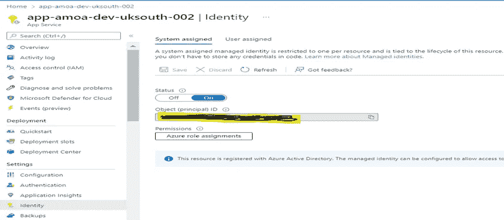
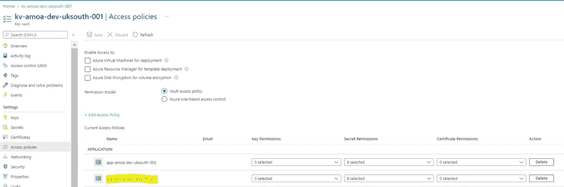
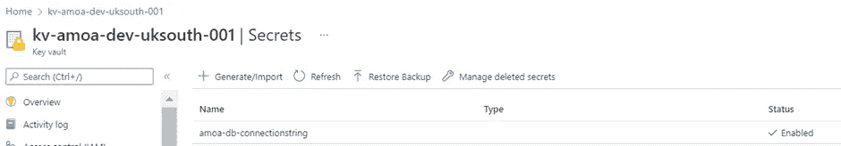
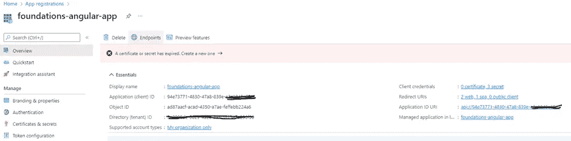
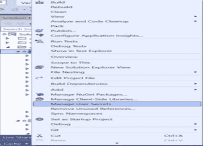
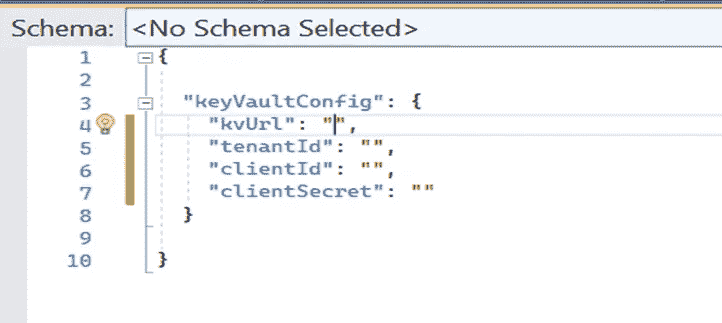
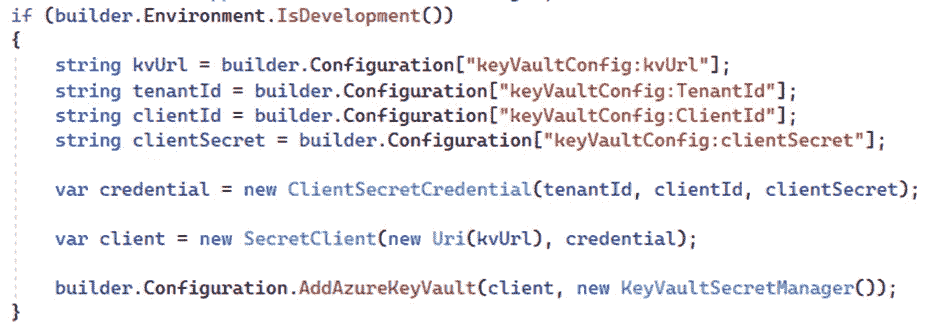
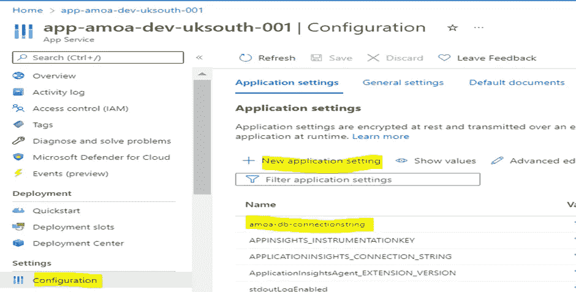
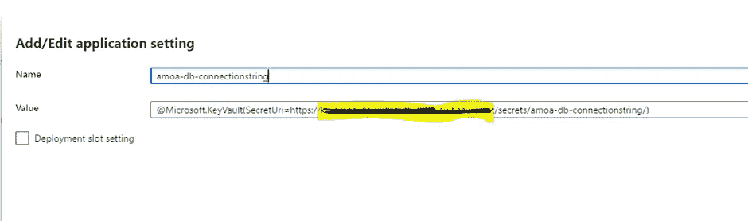
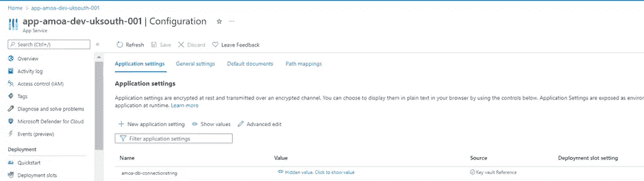

# 保护中的敏感数据。NET 6。

> 原文：<https://medium.com/version-1/secure-sensitive-data-in-net-6-79c141d69015?source=collection_archive---------2----------------------->

作为开发人员，我们总是面临处理代码中敏感配置数据的挑战，比如连接字符串、应用程序机密、证书等。最佳实践建议不要在我们的源代码中存储这样的数据，我们必须找到一种方法来保护这些秘密，并在需要时使用它们。Azure 提供密钥库服务，以高度安全的方式存储这些秘密。Key Vault 为我们的秘密提供了一个保险库存储，因此敏感数据不需要硬编码在我们的代码库中。

Photo by [Tim Evans](https://unsplash.com/@tjevans?utm_source=medium&utm_medium=referral) on [Unsplash](https://unsplash.com?utm_source=medium&utm_medium=referral)

在本文中，我们将演示如何在 Web API 在开发和生产环境中使用的密钥库的帮助下保护和检索连接字符串。可以使用类似的步骤来保护其他敏感数据。
在本文中我们将使用以下:
Visual Studio 2022
。NET Core Web API
Azure Key Vault
用户机密
Azure Windows Web App
如果你想跟进，你需要访问有效的 Azure 订阅。

**第一步:在 Azure 上创建 Azure 密钥库**

如何创建 Azure Key Vault 超出了本文的范围。我们假设，您已经有一个有效的 Azure 订阅和密钥库。

如果您需要创建密钥库的步骤，请遵循链接— [创建密钥库](https://learn.microsoft.com/en-us/azure/key-vault/general/quick-create-portal)。

**步骤 2:为 Azure Web App 启用托管身份**

我们假设你有一个现有的 Azure Web 应用程序。如下图所示启用身份，以便 web 应用程序可以访问 Azure Key Vault。

请记下 Azure Web 应用的对象 ID，稍后将使用它来分配对 Azure key vault 的权限。

**第三步:授予 Azure 密钥库权限**

下一步是为 Azure Key Vault 中的托管身份配置访问策略。这可以通过转到 Azure Key Vault 资源并在访问策略选项卡下，单击选项**添加访问策略来实现。**

**第四步:在 Azure Key Vault 中创建一个秘密**

点击设置下的秘密。在下图中，我们创建了一个名为“**amoa-d b-connectionstring**的秘密，并用实际的连接字符串设置了值。

现在，我们准备从我们的应用程序中访问秘密。

**第五步:** **获取套餐**

创建一个标准的 Asp。Net 核心 web API 定位。NET 6，你需要安装以下软件包来使用 Azure Key Vault:
Azure。身份
蔚蓝。微软。扩展. Configuration.AzureKeyVault

**第六步:保护不同环境中的数据**

现在让我们看看，如何在不同的环境中获取秘密。

**开发:**

从开发环境访问 azure 上的密钥库需要应用程序注册

按照[链接](https://learn.microsoft.com/en-us/power-apps/developer/data-platform/walkthrough-register-app-azure-active-directory)中的步骤完成应用注册，并记下客户端 Id 和客户端密码值。

为 API / Web app 项目创建 secret.json 文件，如下所示，

右键单击项目并选择管理用户机密选项，如下所示:

在下面添加与 secret.json 中的密钥库相对应的密钥值，这是从密钥库中检索值所必需的。

kvUrl:密钥库 Url

tenantId:订阅租户 Id

clientId:在您的应用程序注册完成后收到的 Id。

ClientSecret:使用在应用程序注册中创建的秘密。

利用 **SecretClient** 从密钥库中读取秘密值。

密钥库中存在的连接字符串" **amoa-db-connectionstring** "将被添加到配置中。

通过以上更改，无需在 appSettings 中存储连接字符串。Json 文件。

**制作:**

对于生产环境，使用密钥库引用实用程序从密钥库读取值。

在 app service 的配置中创建一个 Key，如下所示:

参考如下所示的密钥库:

**@微软。KeyVault(SecretUri= <秘密标识符> )**

配置中的密钥如下所示:

通过遵守上述存储敏感数据的方法，我们可以保护数据不被暴露和滥用。希望这篇文章的内容对你有所帮助。

**关于作者:**
Praveen Desai 是这里 1 版的. Net 开发者。