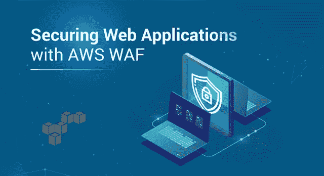
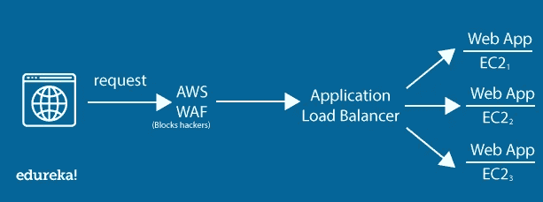
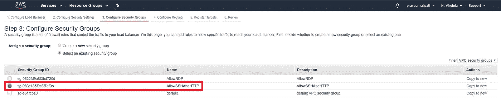
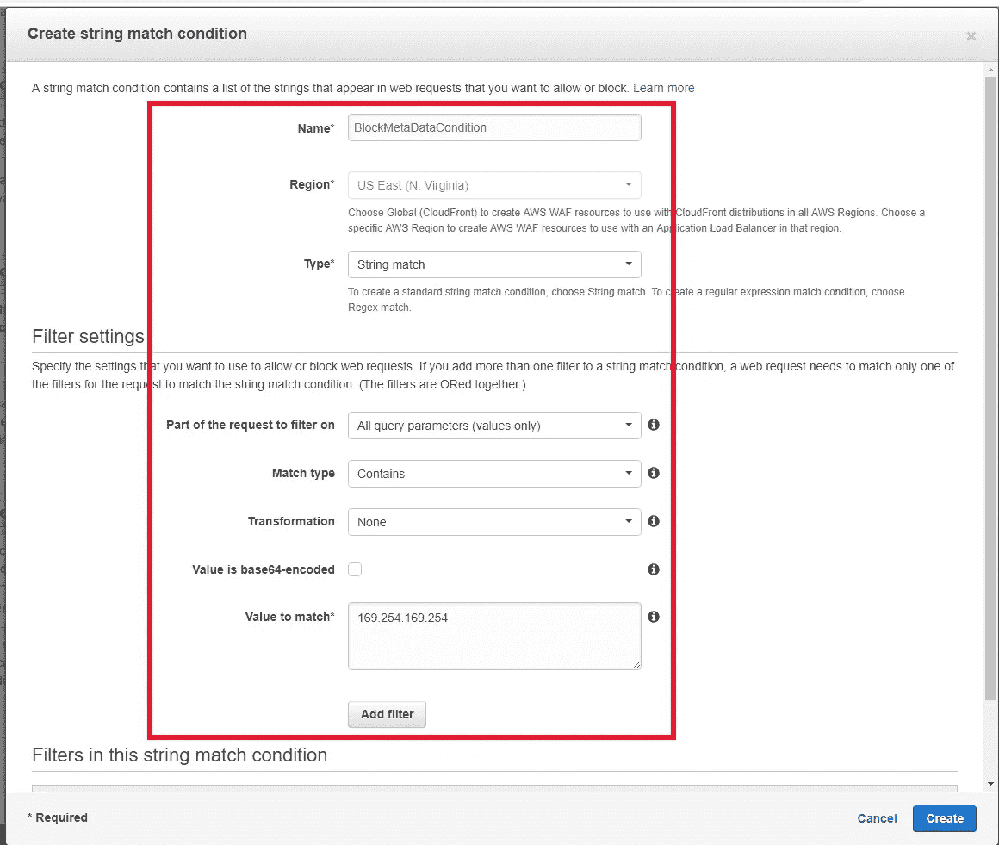

# 如何用 AWS WAF 保护 Web 应用？

> 原文：<https://medium.com/edureka/secure-web-applications-with-aws-waf-cf0a543fd0ab?source=collection_archive---------0----------------------->

Securing Web Applications with AWS WAF — Edureka

本文将告诉您如何使用 AWS WAF 保护 Web 应用程序，并通过一个实际的演示来跟进。本文将涉及以下几点:

*   从一些基础知识开始
*   开始使用 AWS WAF 的步骤顺序

那么让我们开始吧，

继续这篇文章“如何用 AWS WAF 保护 Web 应用程序？”

# 从一些基础知识开始

AWS 提供 EC2、ELB(弹性负载均衡器)、S3(简单存储服务)、EBS(弹性块存储)等服务，以更少的资本支出快速创建有用且精美的应用。在创建这些应用程序时，保护应用程序和数据同样重要。如果保护不当，应用程序数据可能会落入坏人之手，就像最近发生的 [Capital One 事件](https://krebsonsecurity.com/2019/07/capital-one-data-theft-impacts-106m-people/)一样。

Capital One 在 EC2 上托管了一个 Web 应用程序，它没有得到适当的保护。一名前 AWS 员工能够利用该漏洞从 S3 下载大量客户数据。后来发现其他 30 个组织的数据也是从 AWS 下载的。因此，再次强调，仅仅设计和架构应用程序是不够的，保护应用程序的安全也同样重要。

Capital One 使用 AWS WAF(网络应用程序防火墙)来保护网络应用程序，但由于配置不当，黑客得以访问 S3 的数据并下载。在本文中，我们将探讨如何使用和配置 AWS WAF 来防范常见的 web 攻击，如 SQL 注入、XSS(跨站脚本)等。AWS WAF 必须与应用负载平衡器、CloudFront 或 API 网关一起配置。在这个场景中，我们将使用应用程序负载平衡器。客户通过浏览器发出的任何请求都将通过 AWS WAF，然后到达应用程序负载平衡器，最后到达 EC2 上的 Web 应用程序。AWS WAF 可用于使用一组规则和条件来阻止来自黑客的恶意请求。

继续这篇文章“如何用 AWS WAF 保护 Web 应用程序？”

# 开始使用 AWS WAF 的步骤顺序

***第一步:创建易受攻击的 web 应用，***

第一步是创建一个易受 SSRF(服务器端请求伪造)攻击的 web 应用程序，正如这篇关于 Capital One 攻击如何发生的[文章](https://www.thecloudavenue.com/2019/08/how-capital-one-hack-was-achieved-in-aws.html)中所提到的。本文的步骤顺序如下

1.  创建 EC2
2.  安装创建具有 SSRF 漏洞的 web 应用程序所需的软件
3.  创建具有 S3 只读权限的 IAM 角色
4.  将 IAM 角色附加到 EC2
5.  最后，利用 SSRF 漏洞获取与 IAM 角色相关的安全凭证。

一旦在提到的博客中完成了一系列步骤，在下面的 URL 中用 EC2 的公共 IP 地址替换 5.6.7.8，并在浏览器中打开它。与 IAM 角色相关联的安全凭据应该显示在浏览器中，如下所示。这就是 Capital One 被黑的基本过程。有了安全凭证，黑客就能够访问 S3 等其他 AWS 服务来下载数据。

[http://5.6.7.8:80？URL = http://169 . 254 . 169 . 254/latest/meta-data/iam/security-credentials/role 4 EC 2-S3RO](http://5.6.7.8:80?url=http://169.254.169.254/latest/meta-data/iam/security-credentials/Role4EC2-S3RO)

***第二步:创建应用负载均衡器***

AWS WAF 不能与 Web 应用程序直接关联。但是，只能与应用负载平衡器、CloudFront 和 API 网关相关联。在本教程中，我们将创建应用程序负载平衡器，并将其与 AWS WAF 相关联。

**步骤 2a:** 目标组是 EC2 实例的集合，必须在创建应用程序负载平衡器之前创建。在 EC2 管理控制台中，单击左侧窗格中的目标组，然后单击“创建目标组”。

**步骤 2b:** 输入目标组名称并点击“创建”。将成功创建目标组。

**步骤 2c:** 确保选择了目标组，单击 Targets 选项卡，然后单击 edit 向目标组注册 EC2 实例。

**步骤 2d:** 选择 EC2 实例，点击“添加到已注册”并点击“保存”。

应该为目标组注册如下所示的实例。

**步骤 2e:** 创建应用程序负载平衡器的时间到了。单击 EC2 管理控制台左侧窗格中的负载平衡器，然后单击“创建负载平衡器”。

单击“应用程序负载平衡器”的“创建”。

继续这篇文章“如何用 AWS WAF 保护 Web 应用程序？”

**步骤 2f:** 输入应用程序负载平衡器的名称。确保选择了所有可用区域，然后单击“Next”。

**步骤 2g:** 在“配置安全设置”中点击下一步。

在“配置安全组”中创建新的安全组或选择一个现有的安全组。确保端口 80 已打开，可以访问 EC2 上的网页。点击下一步。

**步骤 2h:** 在“配置路由”中选择“现有目标组”，并选择在之前步骤中已经创建的目标组。点击下一步。

**步骤 2i:** 目标 EC2 实例已经注册为目标组的一部分。因此，在“注册目标”选项卡中，不做任何更改，单击“下一步”。

**步骤 2j:** 最后，查看应用程序负载平衡器的所有详细信息，并单击 Create。应用程序负载平衡器的创建如下所示。

**步骤 2k:** 获取应用程序负载平衡器的域名，替换下面 URL 中突出显示的文本，并在浏览器中打开它。请注意，我们通过应用程序负载平衡器访问 Web 应用程序，安全凭证如下所示。可以使用 AWS WAF 阻止下面的 URL，如后续步骤所示，以阻止安全凭证的泄漏。

MyALB-1929899948.us-east-1.elb.amazonaws.com？URL = http://169 . 254 . 169 . 254/latest/meta-data/iam/security-credentials/role 4c 2-S3RO

***第三步:创建 AWS WAF (Web 应用防火墙)***

**步骤 3a:** 进入 AWS WAF 管理控制台，点击“配置 web ACL”。显示了 AWS 晶片概况。这里是 AWS WAF 的层次结构。Web ACL 有许多规则，而规则又有许多条件，我们将在后续步骤中创建这些条件。点击下一步。

**步骤 3b:** 输入 Web ACL 名称，区域为 North Virginia(或创建 EC2 的地方)，资源类型为“应用程序负载平衡器”，最后选择在前面的步骤中创建的应用程序负载平衡器。点击下一步。

**步骤 3c:** 这里必须创建阻止特定 web 应用请求的条件。向下滚动并单击“字符串和正则表达式匹配条件”的“创建条件”。

**步骤 3d:** 输入条件名称，类型为“字符串匹配”，过滤“所有查询参数”，其余参数如下所示。点击“添加过滤器”，然后点击“创建”。这里我们试图创建一个条件，该条件匹配包含查询参数值 169.254.169.254 的 URL。该 IP 地址与 EC2 元数据相关。

步骤 3e: 现在是时候创建一个规则了，它是一个条件的集合。点击“创建规则”并如下所示指定参数。点击“添加条件”，创建和“审查和创建”。

继续这篇文章“如何用 AWS WAF 保护 Web 应用程序？”

**步骤 3f:** 最后查看所有细节，点击“确认并创建”。Web ACL(访问控制列表)将被创建并与应用程序负载平衡器相关联，如下所示。

**步骤 3g:** 现在尝试通过浏览器访问应用负载平衡器 URL，如**步骤 2k** 中所执行的。这一次，我们将得到“403 禁止”，因为我们的网址匹配网络 ACL 条件，我们阻止它。请求永远不会到达 EC2 上的应用程序负载平衡器或 Web 应用程序。这里我们注意到，虽然应用程序允许访问安全凭证，但 WAF 阻止了同样的访问。

***步骤 4:清理本教程中创建的 AWS 资源。必须按照下述完全相同的顺序进行清理。这是为了确保 AWS 停止对在本教程中创建的相关资源进行计费。***

*   删除规则中的条件
*   删除 WebACL 中的规则
*   解除 WebACL 中 ALB 的关联
*   删除 WebACL
*   删除该规则
*   删除条件中的筛选器
*   删除条件
*   删除 ALB 和目标组
*   终止 EC2
*   删除 IAM 角色

## **结论**

如前所述，使用 AWS 创建 Web 应用程序是非常容易和有趣的。但是我们也必须确保应用程序是安全的，数据不会泄露到坏人的手中。安全性可以应用于多个层。在本教程中，我们看到了如何使用 AWS WAF (Web 应用程序防火墙)来保护 Web 应用程序免受攻击，例如匹配 EC2 元数据的 IP 地址。我们还可以使用 WAF 来防范常见的攻击，如 SQL 注入和 XSS(跨站点脚本)。

使用 AWS WAF 或实际上任何其他安全产品都不能保证应用程序的安全，但是必须正确配置产品。如果配置不当，数据可能会落入他人之手，就像 Capital One 和其他组织所发生的那样。此外，要考虑的另一件重要事情是，安全性必须从第一天就考虑到，而不是在以后的阶段插入到应用程序中。

这就把我们带到了这篇关于如何用 AWS WAF 保护 Web 应用程序的文章的结尾。如果你想查看更多关于人工智能、DevOps、道德黑客等市场最热门技术的文章，那么你可以参考 [Edureka 的官方网站。](https://www.edureka.co/blog/?utm_source=medium&utm_medium=content-link&utm_campaign=secure-web-applications-with-aws-waf)

请留意本系列中的其他文章，它们将解释 AWS 的各个方面。

> *1。* [*AWS 教程*](/edureka/amazon-aws-tutorial-4af6fefa9941)
> 
> *2。* [*AWS EC2*](/edureka/aws-ec2-tutorial-16583cc7798e)
> 
> *3。*[*AWSλ*](/edureka/aws-lambda-tutorial-cadd47fbd39b)
> 
> *4。*[*AWS*弹性豆茎](/edureka/aws-elastic-beanstalk-647ae1d35e2)
> 
> *5。* [*AWS S3*](/edureka/s3-aws-amazon-simple-storage-service-aa71c664b465)
> 
> *6。* [*AWS 控制台*](/edureka/aws-console-fd768626c7d4)
> 
> *7。* [*AWS RDS*](/edureka/rds-aws-tutorial-for-aws-solution-architects-eec7217774dd)
> 
> 8。 [*AWS 迁移*](/edureka/aws-migration-e701057f48fe)
> 
> *9。*[*AWS Fargate*](/edureka/aws-fargate-85a0e256cb03)
> 
> *10。* [*亚马逊 Lex*](/edureka/how-to-develop-a-chat-bot-using-amazon-lex-a570beac969e)
> 
> *11。* [*亚马逊*](/edureka/amazon-lightsail-tutorial-c2ccc800c4b7)
> 
> *12。* [*AWS 定价*](/edureka/aws-pricing-91e1137280a9)
> 
> *13。* [*亚马逊雅典娜*](/edureka/amazon-athena-tutorial-c7583053495f)
> 
> *14。* [*AWS CLI*](/edureka/aws-cli-9614bf69292d)
> 
> *15。* [*亚马逊 VPC 教程*](/edureka/amazon-vpc-tutorial-45b7467bcf1d)
> 
> *15。*[*AWS vs Azure*](/edureka/aws-vs-azure-1a882339f127)
> 
> *17。* [*内部部署 vs 云计算*](/edureka/on-premise-vs-cloud-computing-f9aee3b05f50)
> 
> *18。* [*亚马逊迪纳摩 DB 教程*](/edureka/amazon-dynamodb-tutorial-74d032bde759)
> 
> *19。* [*如何从快照恢复 EC2？*](/edureka/restore-ec2-from-snapshot-ddf36f396a6e)
> 
> *20。* [*AWS 代码提交*](/edureka/aws-codecommit-31ef5a801fcf)
> 
> *21。* [*顶级 AWS 架构师面试问题*](/edureka/aws-architect-interview-questions-5bb705c6b660)
> 
> *22。* [*如何从快照恢复 EC2？*](/edureka/restore-ec2-from-snapshot-ddf36f396a6e)
> 
> *23。* [*使用 AWS 创建网站*](/edureka/create-websites-using-aws-1577a255ea36)
> 
> *24。* [*亚马逊路线 53*](/edureka/amazon-route-53-c22c470c22f1)
> 
> 25。 [*AWS 简历*](/edureka/aws-resume-7453d9477c74)

*原载于 2019 年 9 月 20 日*[*https://www.edureka.co*](https://www.edureka.co/blog/secure-web-applications-with-aws-waf/)*。*