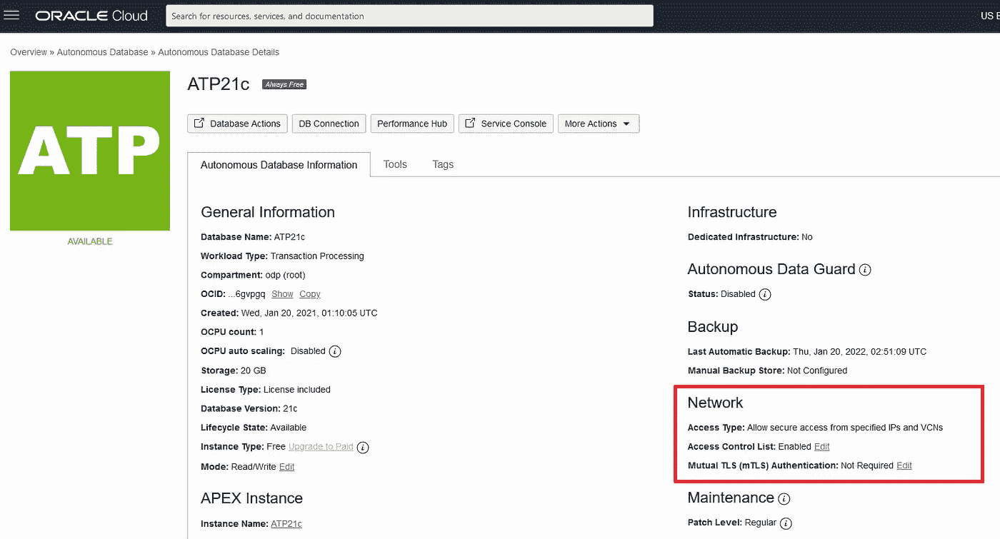

# 安全连接。NET 到 Oracle 自治数据库，无需钱包或客户机配置文件

> 原文：<https://medium.com/oracledevs/securely-connect-net-to-oracle-autonomous-database-without-a-wallet-nor-client-configuration-files-a1438893240a?source=collection_archive---------0----------------------->

对于 Oracle 自治数据库共享(ADB-S)开发人员来说，无需钱包，使用单向传输层安全(TLS)连接变得更加容易。现在，有两种方法可以从。NET 到 ADB-S。

*   **相互 TLS (mTLS)** —客户端和服务器相互验证
*   **单向 TLS (TLS)** —仅客户端认证服务器

在这篇博客文章中，我将讨论这两种连接选项之间的区别，带您完成无 wallet TLS ADB-S 连接设置，并向您展示如何消除将 Oracle 客户端配置文件( *tnsnames.ora* 和 *sqlnet.ora* )部署到您的。NET ADB-S 应用程序。到最后你的。NET apps 将能够连接到 ADB-S，而无需任何 Oracle wallet 或配置文件部署。

# 将 mTLS 和 TLS 与 ADB-S 进行比较

mTLS 和 TLS 都提供到 ADB-S 的安全连接。一个关键区别是 mTLS 需要客户端钱包，而 TLS 不需要。钱包通常从 ADB-S 管理控制台或工具下载，供每个客户使用。的。NET app 必须访问此钱包，才能通过 mTLS 连接到 ADB-S。使用 TLS 的好处是不再需要钱包管理，并且比 mTLS 有更好的连接延迟。

即使没有钱包，TLS 连接仍然是安全的，因为管理员必须定义允许连接到 ADB-S 或使用私有端点的公共端点访问控制列表(ACL)。ACL 可以包括 IP 地址、无类域间路由(CIDR)块和虚拟云网络(VCN)。来自 ACL 外部的任何连接都必须使用 mTLS。因此，TLS 需要 ACL 管理，而 mTLS 不需要。

mTLS 仍然是 ADB-S 的默认连接选项。管理员必须明确启用 TLS 并更新 ACL，以便客户端使用它。启用 TLS 后，TLS 和 mTLS ADB-S 连接可以共存。

Oracle 数据提供程序。NET(ODP.NET)从以下版本开始支持无墙 TLS:

*   ODP。网络核心— 19.13 和 21.4
*   托管 ODP.NET—19.13 和 21.4
*   非托管 ODP.NET—19.14 和 21.5

如果您计划使用不带钱包的 ODP.NET TLS，请确保使用这些版本之一或更高版本。

# 不带钱包的 TLS 设置

使用无墙 TLS 和公共端点需要一些配置步骤。以下是要做的事情:

1.登录 Oracle 云控制台。接下来，选择要为其启用 TLS 的 ADB-S 实例。在**网络**部分，点击**访问控制列表**行上的“编辑”链接。

2.添加允许连接到此 ADB-S 实例的 IP 地址、CIDR 块和/或 vcn，然后单击“保存更改”按钮。

3.保存后，您将返回到 ADB-S 实例控制台页面。在**网络**部分，点击**相互 TLS (mTLS)认证**行上的“编辑”链接。

4.取消选中**要求相互 TLS (mTLS)认证**框，然后单击“保存更改”按钮。

ODP。来自指定 IP、CIDR 块、vcn 的. NET 应用程序现在可以通过 TLS 连接到 ADB-S 实例，而无需钱包。

# 消除 Oracle 客户端文件部署

到目前为止，我们已经了解了如何设置 ODP.NET 亚行的无线连接。通过消除所有 Oracle 配置文件分发，我们可以进一步简化客户端文件部署。这将使您不必为每个 ODP.NET 应用程序部署 *tnsnames.ora* 和 *sqlnet.ora* 。

5.从 ADB-S 实例控制台页面，单击靠近顶部的“数据库连接”按钮。

6.在**连接字符串**部分，从 **TLS 认证**下拉框中选择“TLS”。该选项为每个 ADB-S **TNS 名称**提供一个连接字符串值。单击您要使用的连接字符串文本值旁边的“复制”链接。

# 连接时不部署 Oracle 客户机文件

连接字符串可以粘贴在 ODP.NET 连接字符串的“数据源”属性中。这里有一个[示例 ODP.NET 核心控制台应用程序，它连接到 ADB-S，无需钱包](https://github.com/oracle/dotnet-db-samples/blob/master/samples/autonomous-db/odp-core/console-app/no-wallet/autonomous-odp-core.cs)。

注意 TLS 连接字符串在可分辨名称值两边使用引号。当您在. NET 字符串中保存 TLS 连接字符串时，请在每个引号前添加一个反斜杠(\)转义序列。转义序列允许。NET 将引号识别为 TLS 连接字符串的一部分，而不是连接字符串的结尾。

一旦您提供了“用户 Id”和“密码”值，您就可以运行应用程序从 ACL 上的机器连接到您的 ADB-S 实例。您应该会看到类似如下的结果:

如果您检查代码，您会发现不需要设置`OracleConfiguration.TnsAdmin`或`OracleConfiguration.WalletLocation`，因为不再需要 Oracle 客户端和 wallet 文件。

现在，您拥有了一个到 ADB-S 的安全 ODP.NET 连接，无需部署客户端配置文件。

# 加入对话！

如果你对甲骨文开发人员在他们的自然栖息地发生的事情感到好奇，来加入我们的[公共休闲频道](https://oracledevrel.slack.com/join/shared_invite/zt-uffjmwh3-ksmv2ii9YxSkc6IpbokL1g#/shared-invite/email)！我们不介意成为你的鱼缸🐠