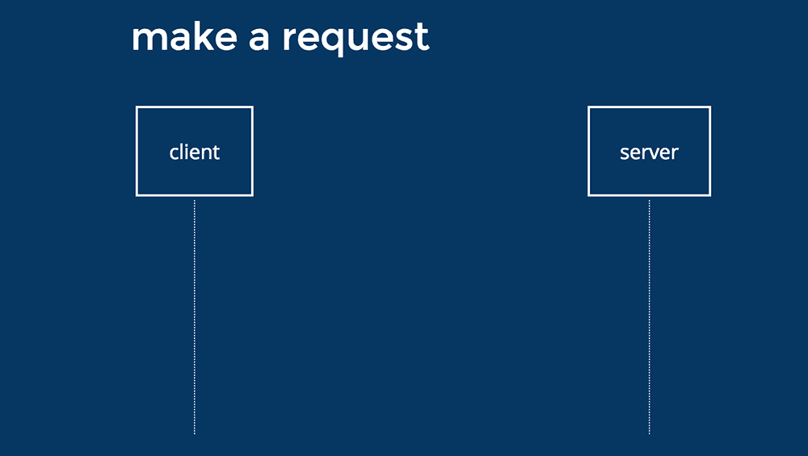
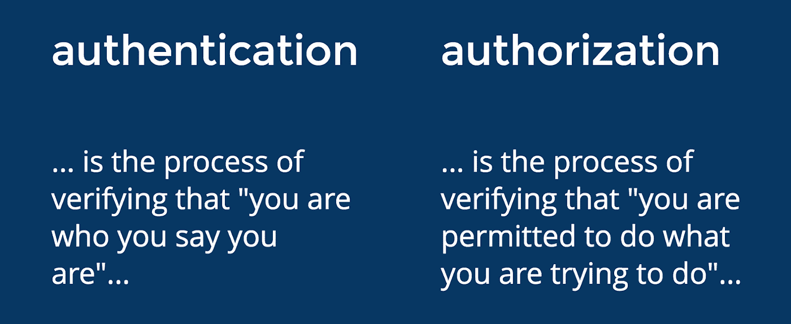
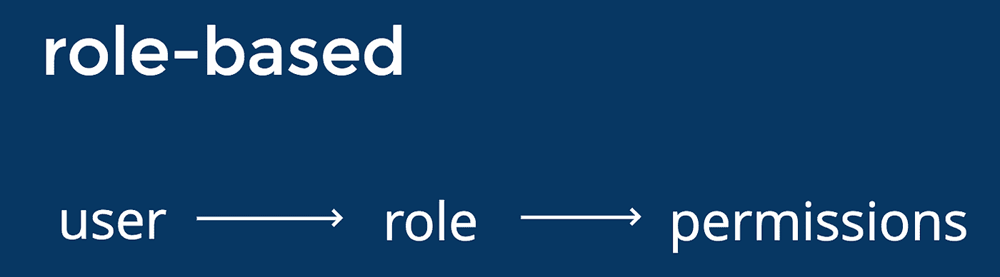
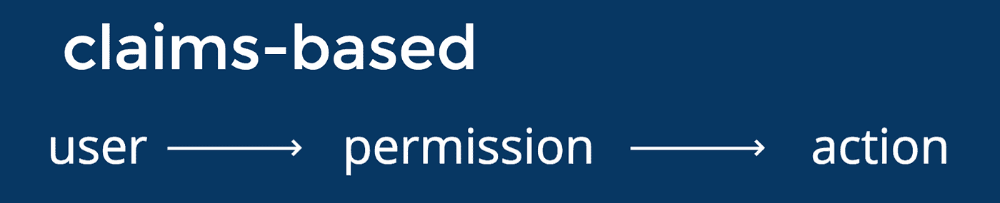
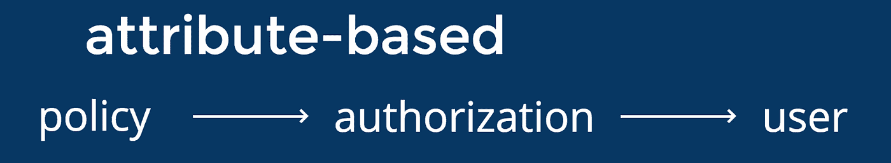
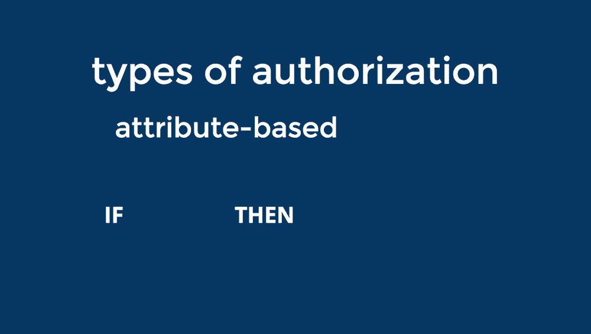
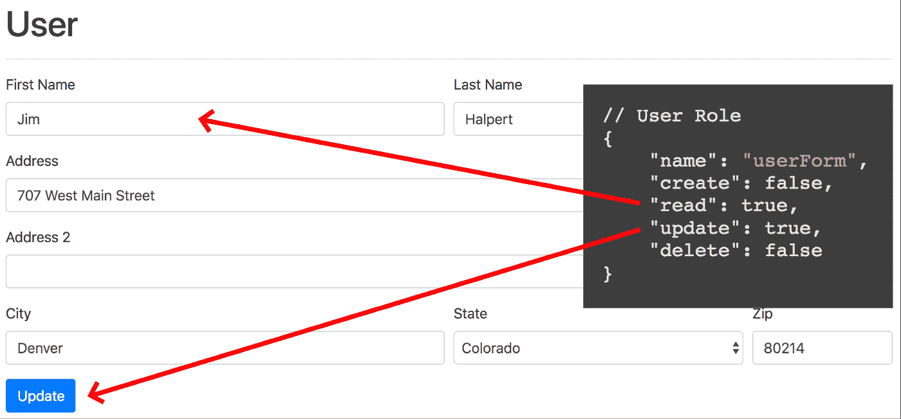
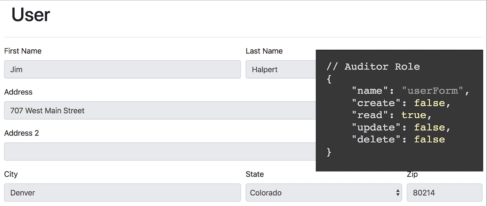

# 通过更好的用户授权保护应用程序

> 原文：<https://medium.com/capital-one-tech/securing-applications-with-better-user-authorization-625ec07a7001?source=collection_archive---------0----------------------->

## 注重安全性的用户流通过应用程序的可能性



在过去几年中，应用程序发生了显著变化。现代 web 浏览器的力量令人难以置信，我们可以使用令人敬畏的框架编写健壮的应用程序，将许多逻辑和关注点转移到客户端。随着我们继续关注用户体验，*应用程序安全性是否也跟上了步伐？*在这里，我们将从客户端和服务器两方面深入探讨应用安全性，并在重新思考安全性的同时找到增强用户体验的方法。

# 认证和授权

每当讨论应用程序安全性时，有两个术语会在对话中反复出现，经常会导致一些混淆— *身份验证和授权。*我有几个简单的短语来帮助识别这两个术语。

*   **认证**是指用户向系统提供一些可以被系统验证的信息。这通常涉及多项检查，以及一组凭证，如用户名和密码。通过身份验证，我们试图确定“你是谁？”
*   **授权**也对用户是谁感兴趣，但用于确定用户可以访问什么功能、动作、数据或应用程序的其他部分。授权回答了“你能做什么？”对于已经过身份验证的用户来说，也不需要授权。未经身份验证的用户可能对应用程序有一些访问权限，尽管通常权限非常有限。



# JSON Web 令牌的作用

当管理客户端和服务器之间或服务器到服务器之间的用户身份验证和授权时，首选的选项是基于令牌的授权。一个流行的解决方案 JSON Web Tokens (JWT)提供了一种无状态的通信机制。简而言之，jwt 只是加密签名的 JSON，能够被接收者验证和确认。因为它们只是 JSON，所以我们可以通过 JWT 传递任何我们想要的信息。几乎任何信息。

JSON Web 令牌是数字签名的，*而不是*加密的，这意味着任何人都可以访问保存在 JWT 中的信息。因此，仔细考虑通过 jwt 存储和传递的数据类型非常重要。

下面是一个您可以考虑的有效载荷示例:

```
{
   “sub”: “1234567890”,
   “admin”: true,
   “name”: “Jim Doe”,
   “email”: “jim@email.com”,
   “iat”: 1516239022,
   “exp”: 1516240022,
   “uid: “573hdk”,
   “roles”: [
      “manager”,
      “superAdmin”
   ]
}
```

它只包含客户端或服务器需要的信息。没有敏感信息，如地址，社会安全号码等。正在被共享。同一个 JWT 有效负载的稍微修改版本可能如下所示:

```
{
   “sub”: “1234567890”,
   “admin”: true,
   …
   “groups”: [
      6,
      42,
      67
   ]
}
```

这里的主要区别是，我们有一个称为“组”的数字数组，而不是称为“角色”的字符串数组。这为我们做了几件事:

*   首先，它对外部用户隐藏了应用程序中的一些安全性，因为我们只存储组的 ID，而不是全名。
*   第二，我们预取的信息可能会在应用程序稍后的查询中使用。通过这样做，只要 JWT 仍然有效，我们就可以消除对请求的额外查询。

# 注重安全性的用户流


那么，考虑到安全性，用户在应用程序中的流动会是什么样的呢？当用户打开应用程序时，他们首先被授权为未经身份验证的用户。这可能只是一个登录屏幕，或者可能是一组有限的功能。接下来，用户进行身份验证，服务器成功验证用户就是他们所说的那个人。从那里，服务器生成一个 JWT，并将其发送回客户端应用程序进行存储。一旦客户端应用程序获得了一些关于用户的信息，最好是来自 JWT 的信息，它就开始为该用户“开启”功能。假设用户继续活跃在应用程序中，客户端将继续向服务器发出请求并处理这些请求，传递 JWT 来授权每个请求。

大多数现代架构将客户端应用程序(例如单页面应用程序(SPA))和服务器分成通过 web 通信的独立组件。每个组件都有保护应用程序的作用。在这里，我们将只关注保护我们的应用程序的客户端方面，但是服务器也验证和检验请求是非常重要的。让我们深入探讨基于用户身份确定用户授权的方法。

# 基于角色的授权



首先，我们来看看*基于角色的授权*。这是指为用户分配一个或多个角色，这些角色决定了用户在应用程序中应该拥有的访问权限。这种访问可以是对应用程序中的页面、组件、功能或数据的访问。基于角色的授权方法通常符合组织的层级结构。角色组的一个例子可以是“经理”、“用户”和“管理员”。当将这些角色分配给应用程序的不同用户时，它们授予对功能和数据的某种级别的访问权限。

通过*基于角色的授权*，客户端应用程序可以根据用户所属的角色授予用户访问权限。

# 基于索赔的授权



第二种常见的授权方法为用户提供了对授权功能的更细粒度的控制。这种方法被认为是“基于声明”的授权。在这里，我们声称用户可以采取类似“canEditProducts”的操作。该声明提供了与用户相关的授权级别，而不是特定于应用程序或组织中的角色。声明还可用于通过启用或禁用用户的功能来修改客户端应用程序上的用户体验。

# 基于属性的授权



随着应用程序功能和用户类型的增加，基于角色和基于声明的授权模型开始变得有局限性。一个值得探索的解决方案是“基于属性”的授权方法。在这里创建一个策略，根据某种条件确定用户在应用程序中拥有什么样的授权——策略可以是任何东西。例如，假设基于一个业务规则，不允许应用程序用户在周末上午 8 点之前编辑产品描述。似乎有点极端，但一些企业可能需要这种类型的限制。以下是一些可能适用的政策:

*   [特定安全组]中的所有用户只能查看位置信息。
*   开发环境中的所有用户都具有管理员访问权限。

这些策略需要适合您的应用程序的模式，但是一旦定义了该模式，就可以很容易地使用逻辑来确定用户的访问。



# CRUD 的作用

基于属性的授权模型不是您希望在客户端应用程序中实现的东西，因为需要存在大量的逻辑。为了简化这种方法在客户端的管理，可以考虑给应用程序中的每个组件一个惟一的名称，然后可以将它链接到任意数量的策略。然后，该组件名称可用于确定用户的访问级别。要跟踪这些访问级别，可以使用创建、读取、更新和删除( [CRUD](https://en.wikipedia.org/wiki/Create,_read,_update_and_delete) )范式，这意味着每个用户登录时，每个惟一的组件都会收到一个 CRUD 对象。这可以为应用程序提供一种非常动态的方式来授权用户。

例如，应用程序路由授权可以有一个简单的检查，如下所示:

*授权服务*

// API 响应

```
const routeAuth = [..{
 “name”: “users”,
 “create”: true,
 “read”: true,
 “update”: true,
 “delete”: true
 }];
```

//授权服务

```
let getRouteAuth = (route: string) => {

 // Find a matching route authorization for provided route
 const auth = routeAuth.find((obj) => { 
   return obj.name === route; });

 if (auth){
    return auth.read;
 } return false;

}
```

假设路由要求对用户进行身份验证，下一步是客户端向服务器请求该用户当前时间段的路由授权。服务器将用一个对象数组来响应。数组中的每个对象代表客户端应用程序中的一条不同的路线。路由由其名称标识，并且对于应用程序应该是唯一的。与路由名称一起的是每个 CRUD 权限的布尔值。给了我们这样一个物体:

```
{
   “name”: “users”,
   “create”: true,
   “read”: true,
   “update”: true,
   “delete”: true
}
```

相同的概念可以应用于每个组件。这里我们有一个输入和更新单个用户的简单表单。CRUD 模式也可以应用于此。



类似地，如果用户对同一表单组件具有受限的权限集，则用户体验将被修改以反映用户的访问。



基于会话期间的用户授权级别，客户端组件可以基于服务器提供的信息打开或关闭功能。客户端应用程序不需要关心复杂的业务逻辑、规则、角色或策略。

这种方法在客户端管理起来要简单得多，并且可以让应用程序对用户在任何时候可以做什么和不可以做什么进行细粒度的控制。

# 把所有的放在一起

将授权转移到路由和组件级别允许用户界面在授权用户时尽可能不被察觉。UI 将使用从 API 收到的任何信息来管理应用程序的设置。在与授权相关的 UI 上不执行任何业务逻辑。仅功能逻辑，*即如果该用户有权访问该路线，则允许该用户访问，如果他们无权访问，则采取一切措施阻止该用户访问该路线。*

*声明:这些观点仅代表作者个人观点。除非本帖中另有说明，否则 Capital One 不属于所提及的任何公司，也不被其认可。使用或展示的所有商标和其他知识产权都是其各自所有者的所有权。本文为 Capital One 2018。*