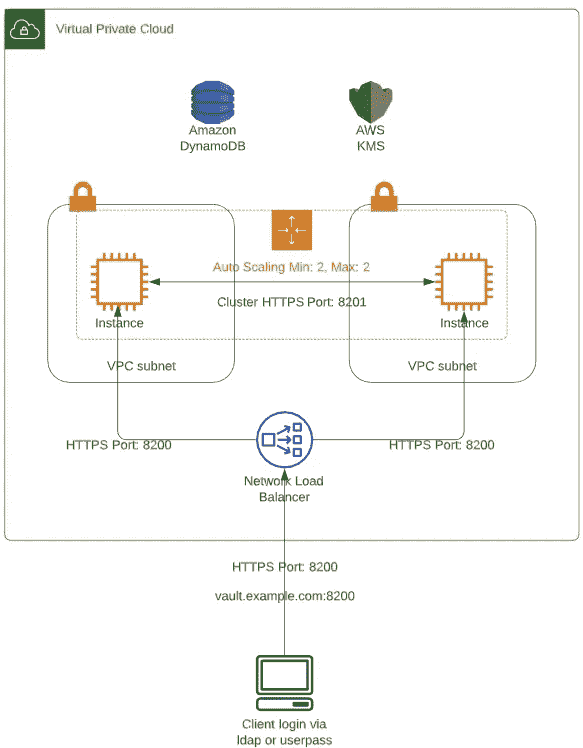
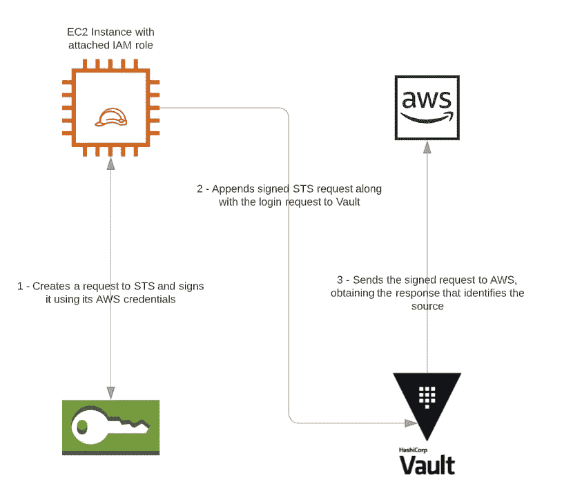
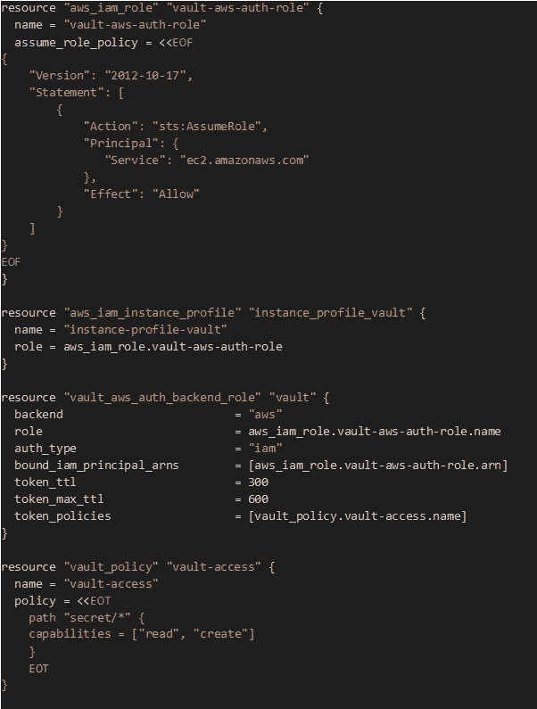
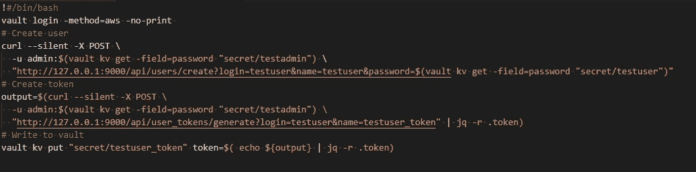

# 使用 Hashicorp Vault 在 AWS 中保护您的秘密

> 原文：<https://medium.com/version-1/securing-your-secrets-in-aws-using-hashicorp-vault-856a95847549?source=collection_archive---------1----------------------->

Photo by [Philipp Katzenberger](https://unsplash.com/@fantasyflip?utm_source=medium&utm_medium=referral) on [Unsplash](https://unsplash.com?utm_source=medium&utm_medium=referral)

在修补或扩展实例时基础设施不变的环境中，可能需要传递秘密，无论是数据库连接的密码还是 TLS 证书。

例如，如果您需要向使用 Active Directory 的内部 DNS 注册实例，您可能需要在启动时为经过身份验证的用户提供凭据，或者您可能需要将 TLS 链和私钥放在 Nginx 配置中。由于我们希望实例能够在启动时这样做而不暴露我们的秘密，我们需要一种方法来保持它们的安全，同时允许我们的实例能够在构建时读取它们。

# 哈希公司金库:概述

这就是[金库](https://www.vaultproject.io/)的用武之地。Vault 是由 Hashicorp 创建的开源工具，用于安全地存储机密，同时控制对密码和证书的访问。这允许在应用程序和服务器短暂的动态基础设施中的安全性。

虽然有许多存储机密的本地工具，但 Vault 提供了一个集中的安全解决方案；**这是一个秘密商店、密钥管理系统、加密系统和 PKI 系统。**它在一个盒子里提供了所有这些东西，使一个解决方案的安全和访问控制变得更加容易。由于 Vault 可以在任何地方运行，因此它能够随着时间的推移为您的环境带来发展，同时控制这些数据，最重要的是能够在其他地区、其他数据中心和其他云提供商复制这些数据。

以上是 AWS 中可能的 Vault 高可用性部署的架构概述。这两个 Vault 服务器通过自动扩展组启动，该组位于内部负载平衡器之后，Vault 数据的存储后端由使用 KMS CMK 加密的 DynamoDB 表提供。

第一次初始化 Vault 时，它会生成一个主密钥，该密钥被拆分为多个份额(密钥被拆分成的份额数是在构建时定义的，同时还会定义恢复密钥所需的份额数。

例如，您可以将其拆分为 8 份，但只需要 5 份即可恢复)。每次启动存储节点(或添加新节点)时，都需要将其解封。这是因为它在内存中还没有主密钥，这意味着它不能解密自己的数据(称为密封的)。要解封 Vault，您可以使用手动过程，让操作员提供重新生成主密钥所需的份额数。在动态环境中，每次节点重启时都进行手动操作并不理想。幸运的是，我们可以使用自动解封，它可以使用 KMS 将解封过程委托给 AWS。这将对整个主密钥进行加密和解密，从而消除了手动输入份额的需要。

请注意，如果自动解封失败，或者如果您需要生成新的根令牌以便对 Vault 进行根访问，您将需要通过手动方法恢复使用恢复共享。因此，应在 Vault 安装时建立一个流程，以加密并与指定的操作员共享。

其中一个选项是使用 PGP 加密，使用运营商的公共 PGP 密钥来加密“他们的”共享，只有他们可以在人工干预的情况下解密。

# 使用 Vault 验证 AWS 实例

要使实例能够登录到 Vault 并在构建时获得所需的机密，它们需要获得一个允许它们访问 Vault 的令牌。Vault 的 AWS 身份验证方法提供了一种自动机制来检索 Vault 令牌，无需操作员提供安全敏感的凭据。

AWS 方法的身份验证类型为 IAM-使用此方法，使用 AWS IAM 凭据签名的特殊 AWS 请求用于身份验证。IAM 身份证明是自动提供给 IAM 实例配置文件中的 AWS 实例的，AWS 已经提供了此信息，Vault 可以使用它来验证客户机。

# 解决方案

通过使用 Hashicorp Vault 及其 AWS auth 方法，我们可以让实例在启动时通过 Vault 进行身份验证，并获得所需的密码和证书。要创建我们的实例所需的 Vault AWS auth 后端角色和策略，我们可以使用 Vault CLI。如果您的基础设施是使用 Hashicorp Terraform 构建的，那么在构建基础设施时，有一些资源可用于创建它们。下面是一些创建 AWS IAM 角色、实例配置文件和 Vault 后端角色和策略的示例 Terraform 代码。

如果此角色附加到实例，它将能够登录到 Vault，并在 secret/path 下读取和创建机密。

然后可以在该实例的用户数据中调用 Vault，而不会暴露我们的任何秘密。

# 下一步是什么？

众所周知，密码和证书应该而且需要定期轮换，以增加安全性。如果这些是在我们的服务运行时更新的，我们不希望从一台服务器到另一台服务器更新证书和密码。使用 Vault 时，您可以使用 Vault 代理和模板来更新它们，这允许将 Vault 机密渲染到本地文件。

关于这方面的进一步信息可以在这里找到:[https://www.vaultproject.io/docs/agent/template/](https://www.vaultproject.io/docs/agent/template/)

*Gareth Norman 是 Version 1 的 DevOps 工程师，与客户一起帮助开发和构建创新的云解决方案。请继续关注 Medium 的第 1 版，以获取更多来自 Gareth 的帖子。*