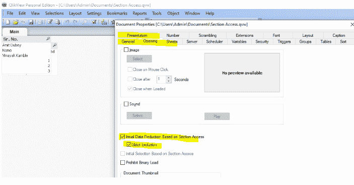

# QlikView 中的安全实施

> 原文：<https://medium.com/globant/security-implementation-in-qlikview-67148315de8d?source=collection_archive---------1----------------------->

## 详细了解在 QlikView 中 cal、广告组、QMC 和区域访问的工作方式


Image by [Qlik](https://help.qlik.com/en-US/)

在 [BI](https://www.qlik.com/us/business-intelligence) 领域，保护应用程序与开发&发布应用程序一样重要。必须保护应用程序免受未经授权或非法的访问。例如，健康保险行业的业务用户不应该能够查看或访问专为汽车保险行业设计的 Qlik 仪表板。此外，如果有必要，我们可以只显示相关的信息，以便用户只看到他们的数据。我们有一定的安全技术，我们将在本文中讨论，以解决上述所有困难。

**本文将涵盖:**

*   什么是 QlikView 及其架构
*   QlikView 如何处理认证和授权
*   客户端访问许可证(CAL)及其类型
*   如何使用 AD 组保护 QlikView 应用程序
*   如何使用 QlikView 工作表中的`OSUSER()`功能
*   应用程序级、行级和表级的数据级部分访问

要继续阅读本文，您应该了解 [QlikView](https://help.qlik.com/en-US/qlikview-developer/May2022/Content/QV_HelpSites/what-is.htm) BI 工具，并初步了解 [QMC](https://help.qlik.com/en-US/qlikview/May2022/Subsystems/QMC/Content/QV_QMC/Administering.htm) (Qlik 管理控制台)和 Active Directory。

# QlikView 简介

下图将帮助您理解 QlikView 的基本架构。


Image by QlikView Community

它有三层:

1.  **数据访问** —通过 QlikView desktop 连接到多个数据源。
2.  **应用** — Qlik Developer 将创建一个应用并通过 QMC 发布/分发该应用。
3.  **演示** —业务用户可以通过 QlikView 接入点访问应用程序。要访问该应用程序，用户需要拥有分配给他们的 cal。此外，它们应该是活动目录和分区访问表的一部分。

解释 3 层架构的目的是提供一个借助 cal、AD 组和部分访问功能实施安全 QlikView 应用程序的端到端概念。

# QlikView 身份验证和授权

身份验证和授权是保护应用程序的两个重要方面。身份验证是验证某人是谁，而授权是验证用户可以访问哪些特定的应用程序、文件和数据。


Authentication and Authorization process

1.  web 层处理前两个步骤，即获取用户凭证和验证哪个包含身份验证(即 QVWS 或 IIS)。
2.  传输用户身份的第三步是通过 web 层使用 QVP 协议将身份传输到 QlikView Server 来实现的。
3.  第四步是授权，由 QlikView Server 使用目录服务连接器解析的组来处理。


Image by Qlik Help

# 客户端访问许可证及其类型介绍

客户端访问许可证提供对 QlikView Server 上可用的 QlikView 文档的访问。如果 cal 未分配给个人或文档，您将无法访问 QlikView 接入点上的应用程序。您必须拥有发行者许可证才能使用 cal。

## 不同类型的 cal:

*   **命名 CAL:** 命名 CAL 访问基于个人用户；身份证对所有证件都有效。如果将命名 CAL 分配给个人用户，他们可以访问 QlikView Server 上的所有可用文档。我们必须遵守[链接](https://community.qlik.com/t5/QlikView-App-Dev/How-to-assign-the-named-cal-in-QMC/td-p/556866)上提供的说明，将命名的 CAL 分配给用户。
*   **文档 CAL:** 文档 CAL 访问也基于个人用户 ID，但它只针对一个文档。如果同一用户使用这种许可方法连接到两个文档，他将使用两个文档 cal。我们必须遵守[链接](https://community.qlik.com/t5/Official-Support-Articles/How-to-assign-a-document-CAL-in-QlikView-Management-Console/ta-p/1713354)上提供的说明，将命名 CAL 分配给用户。
*   **会话 CAL:** 如果用户没有指定的 CAL 或文档 CAL，会话 CAL 会自动分发给用户。它们可以分配给经过身份验证的用户和匿名用户。会话呼叫的最小会话持续时间为 15 分钟。会话调用不需要显式分配；如果不可能为用户获取其他 CAL(用户 CAL 和文档 CAL ),或者如果没有进行身份验证，这将是一个动态分配。但请记住单击“允许动态 CAL 分配”,并遵循与文档 CAL 相同的步骤。
*   **d . Usage CAL:**Usage CAL 允许任何用户(无论是已识别用户还是匿名/未识别用户)访问一个 QlikView 文档，该文档位于为一个客户端分配了 Usage CAL 的服务器上，每次会话最长可达 60 分钟。

# 使用 AD 组保护 QlikView 应用程序

首先，我们必须创建广告组，并将其分配给 QlikView 应用程序。将广告组分配给单个应用程序或一堆 Qlik 应用程序后，只有属于广告组的授权用户才能看到这些应用程序；否则，他们看不到 Qlik 应用程序上的任何内容。这些广告组将限制未经授权的用户访问 Qlik 应用程序。

下面是通过 active directory 保护应用程序的分步过程。

*   首先，我们必须决定是从业务角度还是从应用角度创建广告组。如果是 LOB 方面，我们必须提出 ServiceNow 请求来创建广告组，并将它们分配给同一 LOB 下的一组 Qlik 应用程序。如果是应用程序，那么我们必须提出单个广告组请求，并将这些广告组分配给单个 Qlik 应用程序。
*   创建广告组后，转到文档并单击源文档选项卡。
*   单击并展开 QlikView 应用程序，然后创建一个任务
*   从任务转到分发选项卡，并选择手动选项卡。单击+号，并从下拉列表中添加所需的详细信息，如服务器名称、已安装的文件夹、用户类型(所有用户、所有已验证的用户、已命名的用户)和收件人，如单个用户或 AD 组。


QMC — AD group settings

# QlikView 工作表中的 OSUSER()函数

`OSUSER()`是系统功能的一部分。系统功能提供访问系统、设备和 Qlik Sense 应用程序属性的功能。

该函数返回一个包含当前连接的用户名的字符串。它可用于数据加载脚本和图表或 [QlikView sheet](https://help.qlik.com/en-US/qlikview/May2022/Subsystems/Client/Content/QV_QlikView/TheSheet.htm) 表达式。

我们可以通过使用`OSUSER()`功能对未授权用户隐藏 QlikView 工作表。

我们可以写类似 **if(OSUSER()= '域名\Sachin 这样的表达式。h '，1，0)** 在下面的 QlikView 条件表选项卡中。

如果表达式与 ST\Sachin 匹配，它将计算表达式。h，那么只有那个特定的工作表是可见的；不然看不出来。


OSUSER()Example

# 数据级部分访问

区段访问在文件级别起作用，一旦您被授予 QlikView 文件的访问权限，它将决定用户有权访问该数据文件中的哪些数据区段。使用 QlikView 中的“隐藏脚本”功能，QlikView 中的“访问安全性”部分可以在数据表中执行多达行和字段级别的操作。

以下是关于部分访问的几个要点。

*   部分访问在 Qlik 应用程序中动态减少数据，显示/隐藏 Qlik 工作表，并限制对 Qlik 应用程序的非法访问。
*   它用于控制应用程序的安全性。例如，作为区段访问表一部分的用户 id 可以访问应用程序；否则，他们将无法访问它。
*   节访问类似于缩减，但由 QlikView Server 在用户访问文档时完成，QlikView Publisher 进行缩减。
*   我们可以通过使用 Active Directory 中的用户 ID 或 NT 目录中的单个用户 ID 和 NTNAME 来实现这一点。

**注意:**基于节访问的缩减可能会在分发的文档中导致不想要的结果，应谨慎使用。

QlikView 应用程序中有三种类型的区域访问实施。

1.  应用级别
2.  行级别
3.  纸张水平

在开始之前，我们将讨论部分访问语法和实现代码的重要要点。

访问部分有两个部分。

## 分区访问

在这一部分，我们可以加载包含以下信息的内嵌表格、Excel 或数据库表格。

可以在安全性表中将用户分配到“管理员”或“用户”访问级别。除非受到安全性表的限制，否则具有管理员权限的用户可以访问应用程序中的所有数据。拥有用户权限的用户只能访问安全性表中定义的数据。如果没有分配有效的访问级别，用户将无法打开应用程序。

我们可以用两种方式验证应用程序。

1.  NTNAME —来自 active directory 或其他身份验证源的用户身份；利用这一点，您可以支持 SSO
2.  USERID —内部 QlikView 用户标识由 QlikView 管理的用户和密码；您可以将此方法用作独立的或第二层安全措施
3.  减少—此字段有助于减少仪表板数据。如果我们想向 XYZ 用户显示南部地区的数据，向 PQR 用户显示北部地区的数据，那么我们只需在 REDUCTION 列中添加这些值，该列应该在仪表板中可用，以限制数据。缩减列中*的含义是特定用户可以访问下表中指定的所有区域。
4.  省略—省略字段将对用户隐藏“省略”列中指定的字段。例如，对用户 ID XYZ 隐藏利润列。

以上是区段访问表的重要部分。


## 部分应用

在本节中，我们将介绍我们的 QlikView 代码。我们可以在这一部分添加数据建模代码。

只有当区段访问和区段应用程序区段之间有一个公共列时，行级区段访问才起作用。

下面列出了在 QlikView 脚本中创建区域访问代码的步骤。

1.  第一行代码将是区段访问，然后，添加内联代码/Excel/CSV/数据库表，其中包含区段访问表的重要部分，如下所述。
2.  在部分访问部分之后，我们必须编写以分号结尾的部分应用程序关键字，并添加实际的 QlikView 代码或业务逻辑。
3.  然后，转到设置—文档属性—打开选项卡—检查基于节访问和严格排除的初始数据缩减，务必。

根据选中的状态，仪表板将减少数据。

```
Section Access;
Load * INLINE [
    ACCESS, USERID, REGION, OMIT
    ADMIN, A,*, 
    USER, B, SOUTH, PROFIT,
    USER, C, EAST,
    USER, D, NORTHEAST,
];
Section Application;

Load * INLINE [
REGION, SALES, PROFIT
EAST,100,8
WEST,200,6
SOUTH,300,7
NORTH,400,4
];
```


QlikView Section Access Strict Exclusion Demo


Access Denied error

如果有人未经授权试图打开应用程序，我们会收到一条错误消息。此外，由于严格的排除，用户 D 拥有东北地区的访问权限，但是在上面的示例中，我们的数据模型中没有东北地区的数据，因此用户 D 将得到一个错误。

# 不同类型的部分访问

下面是应用程序、行和表级别部分访问的一些快照示例。

## 应用级别

如果我们尝试使用下面列出的用户 id(A、B、C 和 D)登录不会有任何问题，但是如果我们使用下表中没有列出的任何其他用户 id，我们将无法这样做。


Section Access Sample Example


User Input Image

下面是管理员访问编辑权限和用户编辑的快照。用户级访问权限具有最低限度的特权。



Document Properties Admin Settings


Document Properties User Settings

## 行级访问

在下面的例子中，用户 A 登录后，我们可以看到该地区的所有数据。


Row level section access output 1

在下面的输出中，用户 B 登录后，我们只能看到南部地区的数据。


Row level section access output 2

省略示例:

例如,“省略”字段将删除“省略”列中指定的字段。对 USERID B 隐藏利润列。

请参见下面的输出；用户 b 登录后看不到利润栏。


OMIT code and output

## 工作表级访问

表级节访问略有不同。我们必须维护一个内联或 Excel/CSV 表格，其中包含用户和表编号。查看下面突出显示的内嵌表格。“1”表示启用工作表，“0”表示禁用工作表。


Sheet level section access code

根据上面的内嵌表级表，我们必须分配 SH01 和 SH02。如此类推到各自的工作表，如下所示。

所以用户 ID A 看不到表 2 和表 5，用户 ID B 看不到表 1 和表 4。


Sheet-level conditional setting

用户 ID A 看不到表 2 和表 5


User ID A home screen

用户 ID B 看不到表 1 和表 4


User ID B home screen

# 结论

在讨论了 QlikView 中的每个安全组件后，我们可以得出结论，分区访问是 Qlik BI 工具的一个非常重要的部分。我们可以使用不同的级别(如应用程序、行和表级别)创建可靠和安全的应用程序。

此外，我们还了解了如何使用 QlikView 管理控制台将广告组分配给 Qlik 应用程序，并讲述了客户端访问许可证的基础知识。

当我们不想添加部分访问代码，但想根据有限的用户数量隐藏和显示工作表时，我们已经理解了`OSUSER()`函数的使用。

# 参考

*   [QlikView 服务器和发行商](https://www.packtpub.com/product/qlikview-server-and-publisher/9781782179856)
*   [面向开发人员的 QlikView 11](https://www.packtpub.com/product/qlikview-11-for-developers/9781849686068?_ga=2.113564996.2118779450.1669713561-481310824.1669713561)
*   [QlikView 开发人员指南](https://www.packtpub.com/product/qlikview-for-developers-cookbook/9781782179733?_ga=2.170726499.2118779450.1669713561-481310824.1669713561)

*感谢* [*费德里科*](https://medium.com/u/cfab8f825ee8?source=post_page-----67148315de8d--------------------------------) *！！*