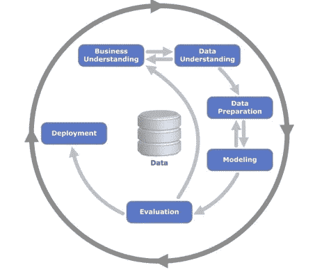
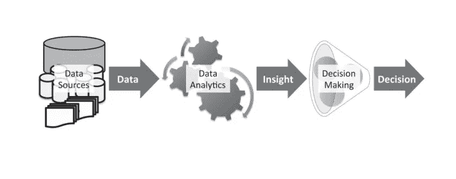
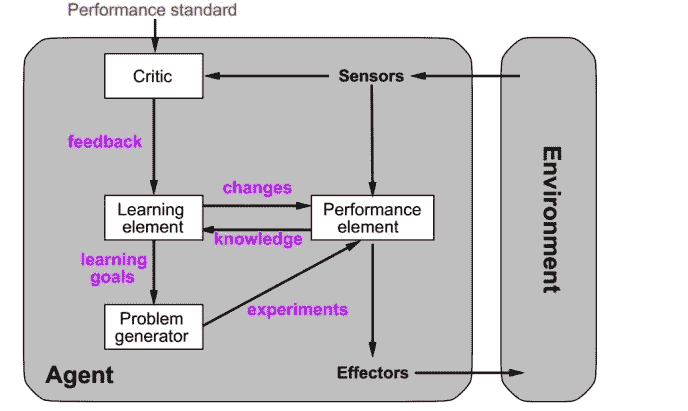
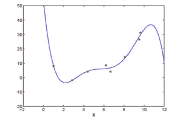
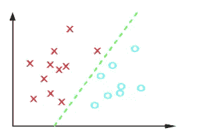

# Sedikit Ilmu Tentang Pembelajaran Mesin

> 原文：<https://medium.easyread.co/sedikit-ilmu-tentang-pembelajaran-mesin-58b9d375a38f?source=collection_archive---------5----------------------->

## Apa itu Pembelajaran Mesin?

Kali ini kita akan membahas mengenai dunia ***Machine Learning*** . Seperti yang kita ketahui, saat ini *machine learning* menjadi topik yang hangat dibicarakan. Di dunia *machine learning* kita belajar mengenai bagaimana kita membuat sebuah *agent* dapat mempelajari sesuatu. Dalam dunia *machine learning* sendiri, kita bekerja dengan *big data* , yang artinya bekerja pada data yang jumlahnya sangat banyak.

*Oh iya* , kalau diartikan dalam bahasa Indonesia *machine learning* sendiri berarti pembelajaran mesin. Bisa dibilang *sih,* mesin kini mampu melakukan apa yang dapat dikerjakan oleh manusia. Untuk menciptakan sebuah mesin yang dapat belajar tersebut banyak hal yang harus dilakukan. *Machine learning* sendiri memiliki konsep pemahaman data. Konsep dari *machine learning* sendiri dapat dilihat pada gambar dibawah ini.

Selain harus memahami konsep terlebih dahulu, kita juga harus memahami bagaimana arsitektur dari *machine learning* tersebut. Adapun proses *machine learning* tersebut jika dibuat dalam bagan akan terlihat seperti berikut.

## **Pendekatan Machine Learning**

Ada 2 pendekatan machine learning, yaitu:
1\. Dirancang, diprogram, diberi knowledge oleh manusia
2\. Dirancang sehingga bisa belajar dari input (percept, pengalaman, dll).

## **Arsitektur Learning Agent**

Untuk lebih mempermudah memahami bagaimana *learning agent* terjadi, perhatikan gambar berikut:

**Beberapa jenis *agent* :** Ada beberapa jenis *agent* yang mungkin akan membantu kamu lebih memahami dunia *machine learning* . Antara lain adalah sebagai berikut:
- ***Searching Agent*** , biasanya *agent* ini memiliki prioritas melakukan pencarian
- ***Goal Based Agent*** , *agent* ini memiliki prioritas mencapai tujuan pada *state* awal yang sudah ditetapkan
- ***Simple Reflex Agent*** , secara *reflex agent* ini akan bekerja.

## **Jenis-Jenis Metode Learning**

Ada 2 jenis metode *learning* dalam *machine learning* , yaitu:
- ***Supervised*** , artinya *agent* belajar memetakan *input* ke *output* . Pada metode *supervised* , data sudah memiliki label. Biasanya digunakan untuk estimasi fungsi.
- ***Unsupervised*** , sebuah *learning algorithm* yang melakukan pengambilan pola dari sekumpulan data yang sudah diberikan.
- ***Reinforcement*** , *agent* menerima *input* data dan harus mengambil tindakan.

## **Data Preprocessing**

*Machine learning* atau pembelajaran mesin dapat dilakukan untuk mendapatkan model prediksi data. Sebelumnya, *ingat* , ketika belajar mengenai pembelajaran mesin, artinya kita belajar mengenai data. Ketika kita memiliki ribuan data set yang harus diprediksi, maka kita harus mengetahui bagaimana data tersebut, apa target dari ribuan data set tersebut dan untuk apa data set tersebut.

Data set adalah sekumpulan banyak data. Ada 2 jenis data set, yaitu data *training,* data yang akan di proses untuk mendapatkan model prediksi dan data *testing* , data yang digunakan untuk menguji data training.
Langkah — langkah yang dapat dilakukan untuk *preprocessing data* ialah:
1\. Kita harus memiliki data
2\. Mengamati data yang *missing* atau tidak lengkap
3\. Melakukan *encode categorical data* 4 *.* Membagi data menjadi *data training* dan *data testing
5\.* Melakukan *feature scalling*

Untuk dapat mempermudah pemodelan prediksi, dapat menggunakan beberapa jenis pemodelan yang sudah ada, yaitu:
1\. Regresi
Ciri-ciri dari pemodelan menggunakan regresi adalah:
- Nilai output ti bernilai kontinu (riil)
- Bertujuan untuk memprediksi output dengan akurat untuk data baru.

2\. Klasifikasi
Ciri-ciri dari pemodelan menggunakan klasifikasi adalah sebagai berikut:
- Nilai output *ti* bernilai diskrit (kontinu)
- Bertujuan untuk mengklasifikasi data dengan akurat

*Nah* , kira-kira begitulah sedikit ilmu mengenai pembelajaran mesin. Semoga artikel ini bermanfaat bagi kamu yang ingin mencoba. Kamu juga dapat melihat beberapa sumber. Jika ada pertanyaan, boleh sertakan di kolom komentar *Happy Learning!* 😃

*Artikel ini di tulis oleh* [*Greace Maulina Situmorang*](https://medium.com/u/ea11b2d7b02c?source=post_page-----58b9d375a38f--------------------------------) *mahasiswa Teknik Informatika di Institut Teknologi Del. Follow profilnya untuk mendapatkan update-an terbaru artikel-artikelnya.*

*Jika kamu merasa artikel ini menarik dan bermanfaat, bagikan ke lingkaran pertemanan kamu, agar mereka dapat membaca artikel ini.
Atau jika kamu tertarik untuk membagikan cerita kamu pada publikasi ini, kamu boleh mengirimkan cerita kamu ataupun mengikuti langkah-langkah yang ada* [***disini***](https://medium.com/easyread/about-easyread-74b20960e180) *.*