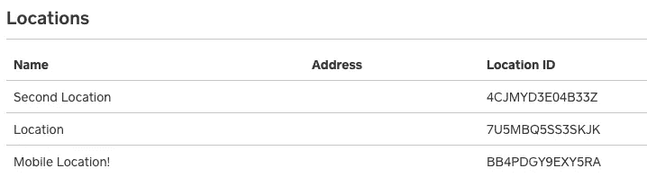

# 无需 API 调用即可查看您的位置 ID

> 原文：<https://medium.com/square-corner-blog/see-your-location-id-without-the-api-call-90f49a661ab7?source=collection_archive---------1----------------------->

## 我们最新更新的 Square 开发者门户包括位置 id

> 注意，我们已经行动了！如果您想继续了解 Square 的最新技术内容，请访问我们的新家[https://developer.squareup.com/blog](https://developer.squareup.com/blog)

当商家注册 Square 时，他们创建了我们所说的“位置”这个位置代表了他们做生意的独特地方。它可以是一个实体店，一个电子商务网站，甚至是一个移动位置，如食品卡车。随着时间的推移，随着业务的增长和扩展或进入新的领域，这些位置可能会发生变化。

对于开发人员来说，位置尤其重要，因为它们决定了您收费的交易归属于哪个位置，或者哪个位置的商品在您的库存中被更新。通常情况下，您会使用[列表位置端点](https://docs.connect.squareup.com/api/connect/v2#endpoint-listlocations)来查找您想要对其执行操作的位置 ID，然后在剩下的时间里将单个位置硬编码到您的软件中。

现在，您可以从您的[开发者门户](https://connect.squareup.com/apps/)获取位置 ID，而不必进行一次性的位置列表调用！

这是一个在 [Square 开发者门户](https://connect.squareup.com/apps/)中面向所有开发者的改动。您可以今天登录并选择一个应用程序来亲自查看。在开发者文档[Square business](https://docs.connect.squareup.com/articles/square-business-structure)的结构中了解更多关于 Square Business 的信息。