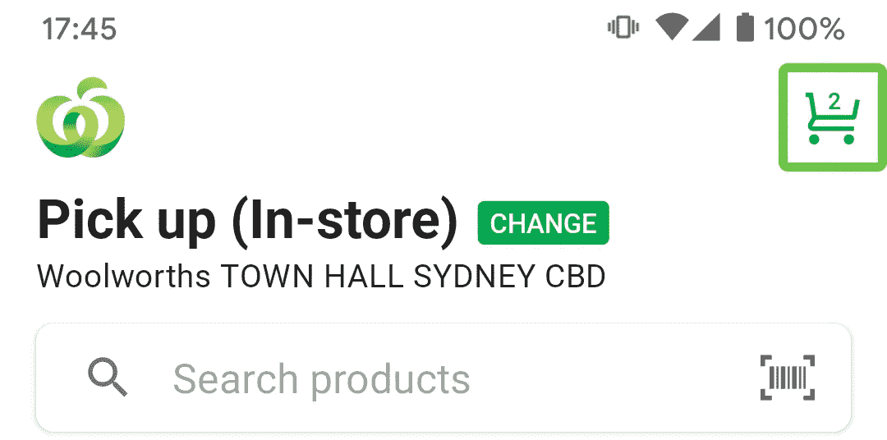
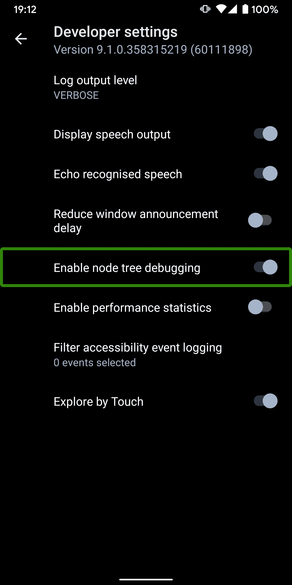
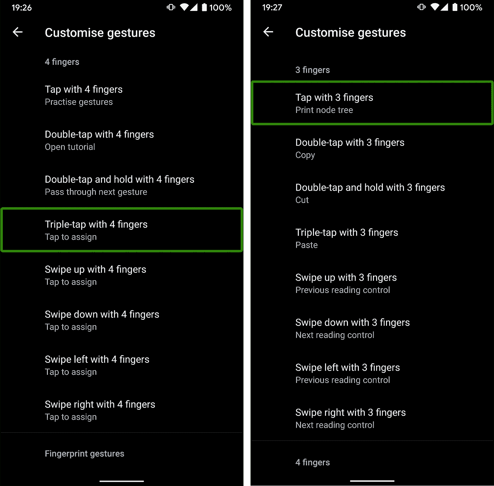
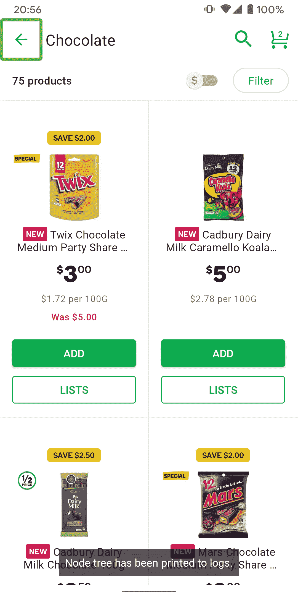
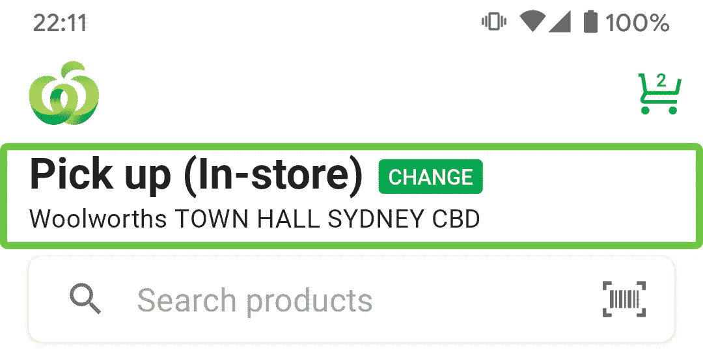

# 看到对讲看到的🔍

> 原文：<https://medium.com/google-developer-experts/seeing-what-talkback-sees-181b3dfa95e8?source=collection_archive---------2----------------------->


Photo by [Edi Libedinsky](https://unsplash.com/@supernov?utm_source=medium&utm_medium=referral) on [Unsplash](https://unsplash.com?utm_source=medium&utm_medium=referral)

作为 Android 开发者，我们应该做的事情之一是确保我们的应用程序尽可能地易于访问。有很多演讲和文章讨论当前 MDC a11y 支持背后的[动机、](https://youtu.be/nTNwZXVRGdY)[到](https://youtu.be/bTodlNvQGfY)[支持 a11y 的](https://youtu.be/1by5J7c5Vz4)、[测试概述](https://developer.android.com/guide/topics/ui/accessibility/testing)，甚至[创建自己的 a11y 服务](https://developer.android.com/guide/topics/ui/accessibility/service)！

有很多资源告诉我应该做什么，但我发现非常缺乏的是在出现问题时帮助我找出该做什么的信息(而且了解我，总会有事情出错)。

例如，这是我的应用程序主页的上半部分。



TalkBack says “2 items in cart”

当 cart action 菜单项被聚焦时，我们希望 TalkBack 能够宣布购物车中当前有多少商品。然而，我注意到，有时 TalkBack 会在宣布“购物车中有 2 件商品”后，突然说出数字(而且只是数字)。奇怪！

如果我能深入了解对讲“看到”了什么，我就能找出解决问题的方法，让我们的对讲公告不那么混乱。我还没有在官方的 Android 文档中找到任何关于如何做到这一点的提及，完全是出于运气，我偶然发现了这个 ✨ [惊人的](https://withintent.uncorkedstudios.com/tutorial-debugging-android-accessibility-818cfd361414) ✨ [文章](https://withintent.uncorkedstudios.com/tutorial-debugging-android-accessibility-818cfd361414)作者 [Midori Bowen](/@midori.bowen) 来自 2018(！).

# 等等，什么！😻

原来在 TalkBack 的开发者设置深处有一个“启用节点树调试”的选项。美岛莉链接到关于启用这一设置的 Android 文档，但该页面已被删除。😿



Turn it on! (While you’re there, turn on “Display speech output” as well if you prefer. This will put up a `Toast` of the TalkBack announcements)

这里提到的“节点树”基本上就是 TalkBack 如何解释你的视图层次结构。拥有这方面的可见性肯定会让我们更深入地了解幕后发生了什么。

[按照 OG 帖子中概述的步骤](https://withintent.uncorkedstudios.com/tutorial-debugging-android-accessibility-818cfd361414)启用节点树调试。自从美岛莉的文章发表以来，Android 和 TalkBack 中的一些东西已经发生了变化，但是总的来说，这些步骤会让你知道如何启用日志功能。例如，不再寻找“未分配”，可分配的手势现在副标题为“点击分配”。在某些设备上，TalkBack 允许多手指手势，因此有很多选项可以用来触发节点树日志转储。如果一个手势已经有一个动作，如果您愿意，您仍然可以覆盖它。



I settled on “Tap with 3 fingers”

# 这是什么？🤔

我们现在可以通过使用我们在 TalkBack 中设置的手势来触发任何屏幕上的节点树的转储。



TalkBack will tell you it has been done

在这一点上，我想重申，请不要像我一样，花一个小时寻找日志实际上在哪里(我忘了我有 Logcat 过滤器🤦‍♀).它们*是 Logcat 中的*，标签为`TreeDebug`。

下面是节点树的部分输出(去掉了冗长的时间戳):

前几行(第 2–9 行)与状态栏相关，所以我们忽略它。我们的应用程序的内容从第 10 行(`type=TYPE_APPLICATION`)开始，屏幕上的所有视图都在下面几行中。每个`ViewGroup`都是选项卡式的，这对于弄清楚每个节点如何映射到视图层次结构非常有帮助。这里有很多信息，而且自从美岛莉的帖子以来，有些事情已经发生了变化，所以我想回顾一下我们在日志中可以看到的东西会是很好的。让我们以第 18 行为例:

```
(1100966)652.Switch:(668, 225 - 800, 357):CONTENT{See only Specials}:STATE{OFF}:not checked(action:FOCUS/A11Y_FOCUS/CLICK):focusable:clickable
```

屏幕*是*实际上是一个`RecyclerView`，所以让我们也来看看我们接收到了什么信息:

在...结束时:

我能够从[日志树文件](https://github.com/google/talkback/blob/f5d564fdc915a74d8cde4868608f307de9ccf957/utils/src/main/java/com/google/android/accessibility/utils/TreeDebug.java)的[反馈报告](https://github.com/google/talkback)中收集所有这些信息。

注意，除了记录节点树，TalkBack 还记录遍历顺序，这在试图找出屏幕上元素获得焦点的顺序时可能很有用。

# 解决我们的问题…也许👀

回到我们最初的问题，节点树给了我们一个线索(购物车菜单项在我的应用程序的大多数屏幕中):

```
(1094239)652.ViewGroup:(948, 77 - 1080, 209):CONTENT{Cart: 2 items in Cart}(action:FOCUS/A11Y_FOCUS/CLICK):focusable:clickable
  (1095200)652.TextView:(1008, 107 - 1023, 140):TEXT{2}(action:A11Y_FOCUS):supportsTextLocation
```

啊哈！看起来`ViewGroup`作为一个整体和`TextView`本身都可以有焦点(看起来`TextView`本身没有`CONTENT`的值，这是 TalkBack 宣布的)，这*可以*解释为什么我有时只听到数字吗？

我想我仍然没有一个明确的答案，但是在`TextView`上设置`android:importantForAccessibility="no"`应该不会有问题，因为当`ViewGroup`获得焦点时，已经给了用户足够的上下文。

我希望随着越来越多的人成为 a11y 的盟友，我们也能在 a11y 工具上得到更多的关注，并有更多的技术文章专注于支持 a11y 超越基础。例如，您知道我们可以改变 Talkback 所说的内容，以提供更多可操作内容的上下文吗？例如，当选择此`ViewGroup`时:



双击会将用户带到编辑商店或送货地址屏幕

对讲将宣布“双击更改”，而不是默认的“双击激活”。前者为用户提供了更多的上下文，让他们知道在与元素交互时会发生什么。仔细想想，这是我们下一个 a11y 帖子的好主意！到时候见！👌

*最初发布于 2021 年 9 月 13 日*[*https://zarah . dev*](https://zarah.dev/2021/09/13/debugging-accessibility.html)*。*