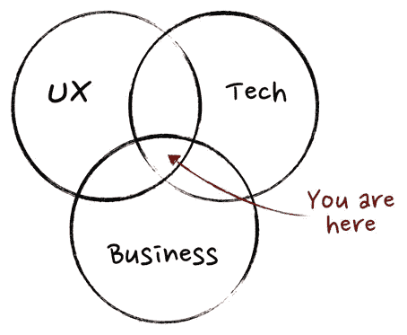

# Sekilas Tentang Posisi Product Manager

> 原文：<https://medium.easyread.co/sekilas-tentang-posisi-product-manager-609c1799a3d4?source=collection_archive---------1----------------------->

Posisi Manajer Produk atau *Product Manager* (kedepannya saya akan menyingkatnya menjadi PM) sepertinya adalah posisi yang terdengar cukup asing bagi mereka yang tidak bekerja di dunia perusahaan rintisan atau *startup* . Ketidaktahuan ini wajar karena posisi PM memang jarang ada di luar perusahaan rintisan. Tulisan ini bermaksud untuk memberi gambaran tentang posisi PM.

Jadi apa sih posisi PM itu? Mudahnya adalah posisi yang mengelola… produk. Apapun yang berkaitan dengan sebuah produk — mulai dari proses ideasi, eksesusi idea, hingga operasional produk — menjadi tanggung jawab seorang PM. Untuk itulah posisi ini dinamakan manajer, walaupun posisi ini tidak mengepalai siapapun.

Mari kita lihat diagram Venn yang hampir selalu digunakan jika kita membahas tentang manajemen produk berikut:

Diagram ini menjelaskan kalau posisi PM ada di *overlap* antara UX, *tech* , dan *business* . Artinya, PM bekerja sebagai jembatan antara ketiga bidang ini dengan tujuan untuk membentuk sebuah produk yang sukses. PM bertanggungjawab untuk:

*   Mendefinisikan strategi dan *roadmap* sebuah produk.
*   Menentukan spesifikasi produk dengan rinci.
*   Berkolaborasi dengan tim lain ( *engineering, finance* , *customer service* , dll) untuk mengembangkan produk.
*   Memantau performa produk dan menentukan area yang perlu dibenahi dari produk tersebut.

Karena tanggung jawab inilah, posisi PM sering dianggap penting di banyak perusahaan rintisan.

## Jenis-jenis PM

*   *Operational PM* — bertanggung jawab atas hal-hal yang sifatnya operasional, misalnya pembuatan internal tool untuk mendukung operasional sehari-hari sebuah produk atau integrasi dengan pihak ketiga. Dengan natur kerja yang seperti itu, maka *Operational PM* ini akan sering berkomunikasi dengan tim operasional dan juga pihak eksternal. *Operational PM* juga biasanya akan lebih memiliki tanggung jawab untuk selalu siap siaga kapanpun jika ada masalah tertentu yang bisa mengganggu operasional produk.
*   *Feature PM* — bertanggung jawab atas apa yang dilihat oleh pengguna produk, misalnya bagaimana menentukan alur pembelian produk atau membuat fitur baru yang dibutuhkan pengguna. Untuk itu, *Feature PM* akan banyak bekerja dengan semua jenis pemrogram (sisi depan maupun belakang). Meskipun fokus utamanya ada di pengembangan fitur, namun *Feature PM* akan tetap mengurusi hal-hal operasional yang berkaitan dengan fitur yang dikembangkan.
*   *Business-to-business PM* — kategori ini adalah tipe lain dari Feature PM. Feature PM biasa berfokus pada fitur yang digunakan oleh pengguna individu, sementara Business-to-business PM berfokus untuk fitur yang digunakan oleh pengguna korporat yang bekerjasama dengan kita.

## Dengan siapa PM bekerja?

Sesuai dengan tipe-tipe PM diatas, maka pihak-pihak yang akan bekerja dengan PM tentunya akan berbeda.

Walaupun begitu, pada dasarnya setiap PM akan berada di dalam suatu tim produk yang beranggotakan PM, analis produk, dan admin produk. Analis dan admin berfungsi untuk membantu PM dalam tugas-tugas yang sesuai dengan posisi mereka. Terkadang mereka pun bisa membantu PM untuk memimpin proyek yang tergolong kecil.

Di luar tim produk, seorang PM akan bekerjasama dengan:

*   Tim *engineering* yang terdiri dari *front-end engineer* , *back-end engineer* , dan *mobile app engineer* . PM di perusahaan rintisan akan hampir selalu bekerja dengan engineer, walaupun tidak semua jenis engineer akan dibutuhkan di dalam suatu proyek.
*   Tim desain yang terdiri dari *interaction designer* , *user interface designer* , *copywriter* , ataupun *user interface developer* . *Feature* dan *Business-to-business* PM biasanya banyak bekerja dengan tim desain.
*   Tim *finance* untuk setiap proyek yang mempunyai konsekuensi finansial.
*   Tim *marketing* untuk fitur baru yang akan dijadikan nilai jual.
*   Tim operasional untuk fitur atau produk yang membutuhkan layanan pelanggan.
*   Tim data untuk keperluan tracking dan analisa data.

## Kegiatan sehari-hari seorang *PM*

Menurut saya, kegiatan sehari-hari seorang PM sangat dinamis. Terkadang saya bisa menghadiri rapat hampir seharian penuh, tetapi kadang saya duduk bekerja di meja saya seharian. Ketika bekerja pun, hal-hal yang bisa dikerjakan dapat berbeda-beda setiap harinya. Tetapi berikut adalah bagaimana kegiatan harian saya biasanya.

Pagi hari adalah waktu untuk mengerjakan tugas personal karena sebagian anggota tim masih belum di kantor. Ada beberapa hal yang bisa dilakukan:

*   Memantau performa di hari sebelumnya.
*   Membaca berita untuk mendapatkan informasi terbaru mengenai industri dan/atau teknologi yang relevan dengan produk yang kita kelola.
*   Mengerjakan pekerjaan personal yang membutuhkan konsentrasi tinggi, seperti membuat spesifikasi produk dan *roadmap* produk.

Menjelang siang — ketika para engineer sudah datang — adalah waktu untuk bertemu dengan para *engineer* untuk berbagi laporan mengenai pekerjaan masing-masing. Sesi ini penting untuk memastikan setiap pekerjaan tetap sesuai rencana, terutama untuk proyek penting berskala besar yang mempunyai tenggat waktu rilis.

Setelah sinkronisasi selesai, kemudian saya membuka kotak masuk *email* . Saya sengaja untuk melakukan ini tepat sebelum makan siang supaya konsentrasi saya di pagi hari tidak terganggu oleh *email* yang masuk.

Setelah jam makan siang, maka waktunya untuk rapat-rapat. Jumlah rapat bergantung pada seberapa banyak proyek dan juga tanggung jawab yang dimiliki, namun biasanya setiap hari akan ada sekitar 3–4 jam waktu yang dihabiskan untuk rapat jika masih di level junior.

Kemudian setelah rapat selesai dan kondisi emosi sudah mulai memuncak kembali, saya kembali mengerjakan tugas-tugas yang belum selesai.

## Yang harus dimiliki seorang *PM*

Menurut saya, ada beberapa hal yang harus dimiliki oleh seorang PM:

*   Pemahaman yang mendalam akan produk yang dikelolanya. Seorang PM harus memahami mengapa produknya penting dan apa yang ingin dicapai oleh produk tersebut. PM juga harus tahu setiap detail dari produknya, misalnya apa yang akan terjadi jika sebuah tombol diklik.
*   Kemampuan komunikasi yang baik. PM bekerja dengan banyak pihak sehari-harinya, maka seorang PM harus tahu bagaimana caranya berkomunikasi yang baik; mulai dari memimpin rapat hingga bernegosiasi.
*   Kemampuan membagi waktu. Pekerjaan seorang PM seringkali berganti-ganti sepanjang harinya, maka PM harus belajar bagaimana membagi waktu dan juga memaksimalkannya dengan baik.
*   Kemampuan untuk berkata tidak. Banyak pihak akan datang dan membuat permintaan fitur untuk dibuat atau bug untuk diperbaiki. Namun kita tidak akan mampu untuk mengiyakan semua permintaan. Maka seorang PM harus mampu menentukan prioritas dan berkata tidak untuk permintaan yang tidak masuk prioritas.

## Jenjang karir seorang *PM*

Ada tiga level utama untuk posisi PM:

*   *Associate Product Manager* (APM) adalah posisi tingkat awal. Seorang APM akan bertanggungjawab atas satu/beberapa sub-produk dan mengerjakan satu/banyak proyek sekaligus.
*   *Product Manager* (PM) adalah posisi yang bertanggungjawab atas suatu produk sepenuhnya. Karena mengelola sepenuhnya, maka seorang PM juga sudah mulai menentukan roadmap dari produk tersebut disamping mengerjakan proyek.
*   *Senior Product Manager* (SPM) adalah posisi tingkat atas yang tidak lagi berfokus pada eksekusi proyek. SPM bertanggungjawab atas banyak produk dan lebih berfokus untuk mengepalai dan menuntun tim-tim produk yang ada di bawahnya.

*Nah* , kira-kira seperti itulah gambaran sekilas mengenai posisi *Product Manager* di sebuah perusahaan. Jika kamu berminat untuk melamar pada posisi tersebut, maka tulisan ini dapat membantu kamu tentang bagaimana sebenarnya seorang PM bekerja. Jadi, selamat membaca dan semangat!