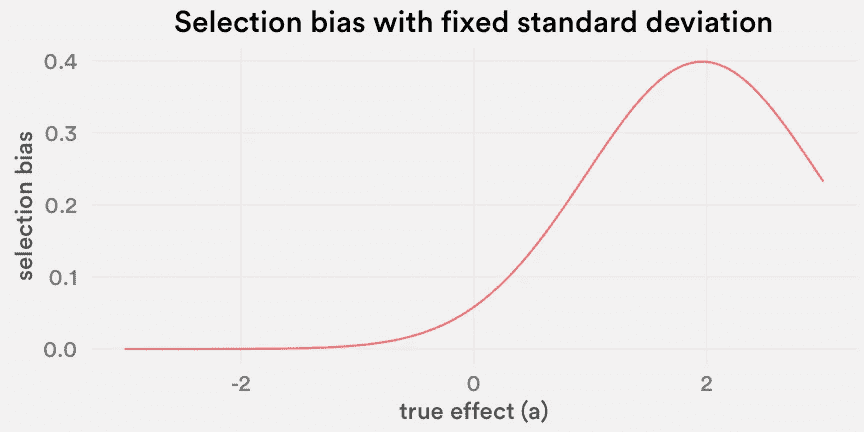

# 在线实验中的选择偏差

> 原文：<https://medium.com/airbnb-engineering/selection-bias-in-online-experimentation-c3d67795cceb?source=collection_archive---------3----------------------->

## 思考 A/B 测试中赢家诅咒的一种方法

*由刘璋* [和*李敏勇*和](/@minyong)

Take a break for a few minutes outside “Cairo’,” one of our kitchens in San Francisco. The coffee is hot, and the view is fabulous.

在在线实验平台中，我们选择具有显著成功结果的实验来发布产品。在估计已发布特性的综合影响时，我们研究了这一过程中的统计选择偏差，并提出了一种获得无偏估计的修正方法。

# 赢家的诅咒是什么？

作为一名不到两年前开始从事工业数据科学工作的统计学家，看到几乎普遍采用实验来指导产品和业务决策令人鼓舞。统计推断和假设检验在我们的日常工作中根深蒂固，对随机性的理解为我们的决策提供了很多信息。然而，大数据和大规模 A/B 测试时代对我们的旧方法提出了新的挑战。

如果你有在大规模实验平台上运行 A/B 测试的经验，这可能是你以前见过的:数字并不总是累加的。这里有一个例子。在几个月的时间里，我们 Airbnb 的团队连续进行了几次实验。除了一个小的维持组(图中的分裂维持组)之外，六个实验在显示了我们的目标度量的统计上的显著提升之后向所有用户推出。在成功实验的刺激下，我们计算了它们对我们的目标指标的影响，并发现:

在自下而上的计算中，每个数字都是对目标指标的影响的点估计，由每个成功的 A/B 实验进行测量。天真地说，自下而上的总和以及抵制的“元实验”结果都是对总体效应的有效衡量。我们如何解释这两种方法之间的差距？

你的第一印象很可能是，“等等，这些效应真的是累加的吗？”是的，因为我们把这个过程设计成一系列一个接一个进行的实验。我们还假设每次变化的提升百分比足够小，以至于可以通过加法或乘法找到累积效应( *log(1+x)~x* 当 *x* 很小时)。另一方面，答案也是否定的，因为不需要很多领域知识就能理解存在许多潜在问题:

1.  **实验结果的方差-** 每个估计都有自己的置信区间。这两个数字 7.2%和 4%可能不会因为它们各自的方差而有显著差异。
2.  **实验中的季节效应——**旅行具有很强的季节性，Airbnb 也不例外。虽然这些实验是按顺序进行的，所以它们可以被总结，但它们的效果可能会随着时间的推移而发生变化。
3.  **短期与长期效应-** 有时，单个实验只擅长测量短期效应。将它们叠加在一起并不一定会导致对抵制实验所估计的长期影响的准确估计。
4.  **对照组和治疗组之间的同类相食-** 即使每个实验中的估计是无偏的，但由于每个实验组中的人之间潜在的相互作用，当样本量处于不同的比例时，效果本身可能是不同的。在 Airbnb，我们称之为“自相残杀”,这在其他实验环境中也并不少见。我们已经研究了解决这个问题的方法，但是这已经超出了本文的范围。

上述每一个问题都可以是一篇独立的文章。然而，除了所有这些导致差距的貌似合理的因素之外，还有一个更基本的因素存在于几乎所有的在线实验平台:选择偏差，或者我们称之为**赢家的诅咒**。

# 你正遭受赢家的诅咒吗？

赢家的诅咒是普通价值拍卖中的一种现象，赢家往往会为物品的价值支付过高的价格。类似地，所选实验的观察效果往往会高估实验的真实效果。这是这个想法的一个简单的例子。假设我们运行 10 个实验，同样的固定标准偏差为 1%。我们在每个实验中收集足够的样本，并单独观察它们的效果，如下图第一行所示。我们还假装不知道潜在的真实影响，这在第二行中表示。一切都是以百分比表示的。

我们使用观察到的结果对每个实验分别进行学生 t 检验。如果我们将 I 型误差水平设为 *α =* 0.05，很容易看出 t 检验统计量只是观测值本身，需要大于 1.96 才有显著结果。因此，用红色圈出的三个实验变得很重要:

因此，如果我们将这三个实验中观察到的效应相加，总效应将为 2.7% + 2.6% + 3.3% = 8.6%。然而，由于我们知道潜在的真实效应，我们看到观察结果的总和确实大于真实效应的总和:1% + 1% + 4% = 6%。在这种情况下，向上偏差为 2.6%。

事实上，上面的例子不仅仅是一个糟糕的例子，其背后的原因可以通过几个简化假设的统计公式得到正式解释。假设 *X1，…，Xn* 是定义在同一个概率空间上的随机变量，每个 *Xᵢ* 都服从有限均值 *aᵢ* 和有限方差 *σᵢ* 的分布(分布不一定相同。)我们将 *aᵢ* 视为未知真实效应，通常用无偏估计 *Xᵢ* 来估计。

考虑一个普通的 A/B 测试设置，我们对每个实验进行简单的双样本测试。然后，我们选择测试统计大于阈值的“显著”实验，这相当于当观察到的正面估计效果大于阈值时。假设我们对每个实验 *i* 使用显著性水平 *αᵢ* 。现在，让我们假设σᵢ是已知的。我们选择这样的实验，即*xᵢ*/*σᵢ*>*bᵢ*，其中 *bᵢ* 是显著性水平*αᵢ*的参考分布的截止值，通常设置为 0.05。

让我们定义一组有意义的实验*a*= {*I*|*xᵢ*/*σᵢ*>*bᵢ*}。那么， *A* 的总真实效果就是*t _ a =*∑{*I*∑*a*}*aᵢ.*如果把正显著性实验的效果加起来， *A* 的总估计效果为*s _ a*=∑{*I*∑*a*}*xᵢ*。注意，由于 *A* 是一个随机集合，因此 E*S _ A≦*E*T _ A*一般。同样，总真实效果 *T_A* 是随机的。我们可以将期望的总真实效果定义为 e[*t _ a*]= e[∑{*I*∑*a*}*aᵢ*。

我们可以证明 E *S_A* ≥ E *T_A* 。事实上，

所有的被加数都是非负的，因为下截尾均值-零分布的均值总是正的，因此选择偏差总是正的。作为一个例子，我们可以在正态分布下，将上述总和中的各个项绘制为真实效应 *aᵢ* 的函数，如果*σᵢ*= 1 和 *bᵢ* 是 t 统计的两个标准偏差截止值，即 1.96:

我们也可以根据效果和 p 值来绘制偏差。请注意，偏差随着真实效果的增加而线性增加。

现在，很容易看出，如果求和中的每一项都有无偏估计，我们就有办法量化总偏差 E[ *S_A -T_A* 。

赢家的诅咒发生在“选择”的过程中，在这个过程中，我们选择获胜的实验，并通过汇总这些被选择的实验的单个观察到的效果来确定它们的总效果。

合理的模拟胜过千言万语。我们可以证明自下而上的估计值(y 轴)实际上比真实效应(x 轴)要大得多。假设我们有 *n* =30 个实验，并测量效果的增量百分比。对于每个 *i* ，我们从截尾高斯分布*aᵢ~ zᵢ|(-1.5<zᵢ<2)*中采样 *aᵢ* 其中 *Zᵢ ~ N(0.2，0.7 )* 和 *σᵢ* 来自形状参数为 3 和比例参数为 1 的逆伽马分布。选择左偏分布作为真实效果的先验，因为我们希望在模拟中有更积极的真实效果，这是产品团队寻求改进指标时的合理假设。在 1000 个模拟实例中，几乎所有的情况都表明天真的自下而上的估计超过了真实效果的 45 度对角线。

# 选择偏差是一个真正的问题吗？

如果你听说过“多重测试”，这可能听起来很熟悉。诚然，我们正在测试多个假设，而不是使用标准的 p 值阈值 0.05(也有些武断)，我们可以智能地调整它，以控制夸大的错误发现率或家族错误率。有一些经过充分研究的方法，如 Bonferroni 校正法或 Benjamini-Hochberg 法来解决这个问题。通过使用一个通用的 p 值阈值，我们极有可能有一些成功的实验，即使它们都只是纯粹的噪音。

然而，我们试图解释的不仅仅是假阳性。实际上，我们希望解决选择偏差的两个方面。首先，即使没有假阳性，也就是说，我们进行的所有实验确实有正的真效应，聚集效应的测量将是一个高估。此外，未被选择的实验，即针对 *i* ∉ *A* 的实验，也会导致整体偏差。

对于一个单独选定的实验，在 A/B 测试中观察到的结果预计会夸大其真实效果。通常我们知道样本均值是总体均值的无偏估计。然而，因为人们在观察到这个特定的实验显著为正之后对其感兴趣，所以我们实际上是在观察一个估计，条件是这个实验已经被选择，或者它的观察超过了给定的阈值，因此引入了向上的偏差。

其次，在上面的公式中我们可以看到，即使是不显著的实验也会造成偏差，这有点违反直觉。为什么我们对这样的估计 E *T_A* 特别感兴趣？如果只关注所选的，我们可以校正*T _ A*|*A*；然而，我们没有这样做，而是整合出选择集，并作为一个整体测量过程的偏差。这是一个根本不同的修正，我们认为它更好地代表了实际的实验过程。让我们考虑以下两种情况的直观示例:

1.  一个人进行了一次实验，结果证明是显著的，影响 *X* ₁= 1 和*p*-值约为 0.001。
2.  一个运行 1000 个实验，只有第一个实验是显著的，具有效果 *X* ₁= 1 和 p 值~ 0.001。

直观地说，如果我们将总真实效应估计为 1，情况 2)由于选择偏差而具有高估总真实效应的更高风险。根据 E *T_A* 进行校正将考虑这种风险。另一方面，受仅选择第一个实验的事实的制约，偏差校正对于情况 1)和 2)是相同的。

如果聚集的实验组 *A* 从一开始就是固定的，那么就不会引入偏差。最后，偏差的存在是因为在我们运行的许多实验中选择成功实验的过程，我们每天都在一个大规模的实验平台上这样做。

# 好吧，那我们该怎么办？

这是你们作为一个团队为了归因而做的事情吗，也就是说，根据实验结果宣布总的影响？如果是这样，我们应该考虑解释这种偏差，或者通过更好的实验设计来尽最大努力减轻这种偏差。

有了上面的公式，我们得出了一个简单的赢家诅咒偏差的无偏估计。如果我们假设真实参数 *aᵢ* 和 *σᵢ* 是已知的，可以推导出偏差 E[ *S_A -T_A* ]为

由于 *aᵢ* 和 *σᵢ* 通常是未知的，我们使用估计值 *Xᵢ* 和 *Wᵢ* ，其中 *Wᵢ* 是 *Xᵢ* 的估计标准差，来定义偏差估计

从自下而上的估计值中减去这个偏差估计值，将为聚集效应提供调整后的无偏估计值。然后，我们在我们的实验报告框架**中构建了一个特性，使用这个公式自动计算偏差。我们能够选择一组被选中的实验，指定要分析的指标以及选择规则。还可以使用 bootstrap 方法建立偏差调整估计的置信区间。在前面的示例中，我们调整了偏差，以获得 5.3%的总效果，而不是 7.2%。可以看到，置信区间也是蛮大的。**

****

**这种去偏置方法依赖于非常少的假设，尤其是与需要先验知识的贝叶斯方法相比。在开发该方法及其在 ERF 中的实现的过程中，我们学到了一些东西。**

*   ****了解选择流程，并与团队进行良好沟通。**如前所述，偏倚为正，因此去偏倚意味着比自下而上方法估计的聚集效应更小。此外，请注意，我们开始的实验越多，在自下而上的估计中引入向上偏差的风险就越高，如果所有的实验都同样有希望的话。当每个实验都是团队努力的一部分时，保持客观并接受高估并不总是容易的。**
*   ****设置有明确假设和发射条件的实验，然后应用偏倚调整方法。如果没有收集额外的数据，反复试验会带来不准确测量的代价。不仅仅是快速试验想法，我们还想聪明地去做。为了应用偏差调整方法，我们希望有一个简单的选择规则，可以写成每个实验的阈值 *bᵢ* 。请记住，这些阈值需要在不查看实验数据的情况下指定。因此，在开始任何实验之前，澄清假设和启动条件是至关重要的。****
*   ****谨慎确定用于聚集的实验组。**属性集合，{ *1* ，…， *n* }决定了偏差将来自哪里，因此预先正确地决定集合是至关重要的。这不是小事，它取决于我们自己的判断，告诉我们选择过程发生在哪里。作为一个经验法则，我们应该考虑一个团队在一段固定时间内沿着相同的想法朝着相同的目标进行的一系列实验。例如，搜索团队一直在搜索页面上用不同的信息进行实验，以鼓励客人做出预订决定。**
*   **考虑其他获得更精确测量值的方法。例如，建立全球抵制是我们实现更好估计的有效方法，不仅可以减轻选择偏差，还可以解决季节性、长期与短期影响等其他因素。类似地，受益于更多的数据，人们也可以建立一个新的实验，只测试所选的特性作为一个包，以获得没有选择偏差的精确测量。实际上，我们并不经常这样做，因为这需要额外的工程工作，并且会减慢产品开发。**

# **最后的想法**

**测量在基于数据的决策中起着至关重要的作用。当在线实验成本高昂且必须高效进行时，我们不可避免地对用于推断和模型选择的相同数据进行测量。学术界和工业界围绕“p-hacking”和类似的想法已经进行了很长时间的讨论。大量文献试图在计量经济学或全基因组关联研究的各种应用中解决这个问题。虽然我们的方法对选择规则进行了简化假设，但它是一种快速有效的方法，无需许多额外的假设或先验知识，尤其是在大规模在线实验平台中。**

**在实践中，在线实验的各种特征使得理论工作的应用非常具有挑战性。并非每个决策过程都遵循相同的规则。只有当我们牢记统计的严谨性和实际的关注时，我们才能将产品开发的前沿向前推进。在 Airbnb 的数据科学团队中，我们对未来有多少有趣的问题和未定义的机会等待着我们感到兴奋。**

***感兴趣？我们一直在寻找* [*有才华的人加入我们的数据科学和分析团队*](https://www.airbnb.com/careers/departments/data-science-analytics) *！***

***特别感谢* [*酒吧 Ifrach*](https://www.linkedin.com/in/bar-ifrach-71507657/)*[*纳文·西瓦纳丹*](https://www.linkedin.com/in/navin-sivanandam-87925168/)*[*杰森·古德曼*](/@jasonkgoodman)*[*埃迪·桑托斯*](https://www.linkedin.com/in/edwardsantos/)*[*邓特希*](/@garytang)********