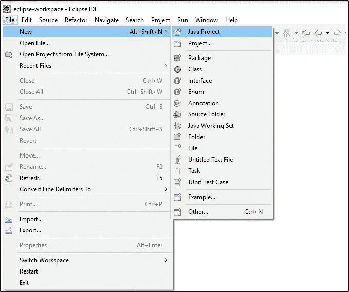
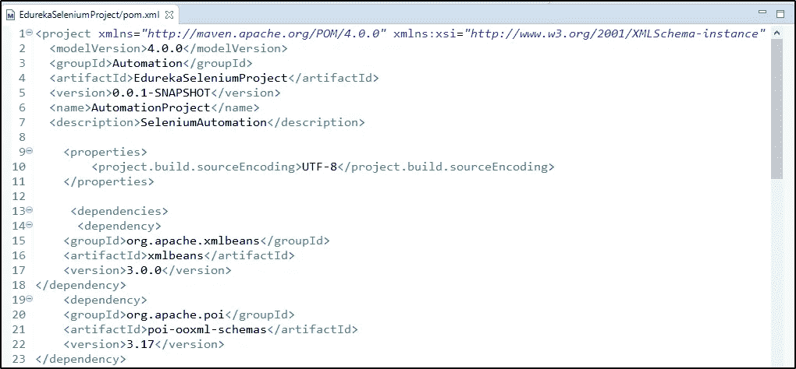
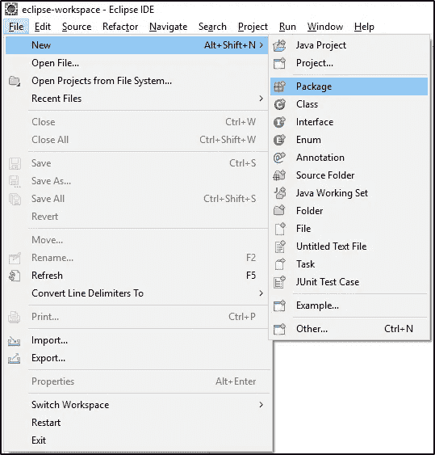

# 你应该实践的顶级硒项目

> 原文：<https://medium.com/edureka/selenium-projects-b2df15d35fe2?source=collection_archive---------0----------------------->


Selenium Projects —Edureka

在之前关于 Selenium 的文章中，我们已经介绍了测试的基础知识，如[定位器、](/edureka/locators-in-selenium-f6e6b282aed8) [等待、](/edureka/waits-in-selenium-5b57b56f5e5a) [Selenium Grid](/edureka/selenium-grid-tutorial-ef342799c484) 、 [TestNG](/edureka/selenium-webdriver-tutorial-e3e6219f21ad) 等。在这篇“Selenium 项目”文章中，我将演示如何实现上述概念并牢牢掌握它们。当然，这将有助于测试你的项目分析、开发和处理技能。

以下是我将在本文中讨论的主题:

*   硒简介
*   硒项目

1.  自动化 Edureka 网站

2.机票预订申请

*   硒案例研究

1.  企业管理系统
2.  体能数据的自动化框架

# 硒简介


Selenium 是在 web 浏览器上实现自动化测试的首选工具。使用 Selenium，只能测试 web 应用程序。任何桌面(软件)应用程序或移动应用程序都不能使用 Selenium 进行测试。写功能测试用例很有帮助。它还提供了 n 个测试用例的可靠性能，显然是 web 应用程序最合适的自动化工具。

现在让我们深入研究这篇文章，看看有哪些有趣的项目可以帮助您更好地理解 Selenium。

# 硒项目

你可以增强你对硒的知识的唯一方法就是做一些现实生活中的项目。在本文中，我将讨论两个重要的项目和一些案例研究。

让我们从我们的第一个项目开始。

# 自动化 Edureka 网站

***问题陈述 1:*** 考虑一个已经注册了 edureka 门户的候选人想要更新门户中所有可用的个人详细信息和职业兴趣。现在的任务是编写一个 Selenium 脚本来做同样的事情，并探索 edureka 门户。

*步骤:*

1.  登录到 [Edureka](https://www.edureka.co/)
2.  导航至“我的个人资料”
3.  更新专业和个人详细信息
4.  浏览博客并导航至主页
5.  注销门户

**注意:**在进行本练习时，请确保您已从 Edureka 的网站注销。

**解决方案**

现在让我们看一下代码，以便更好地理解这一点。

```
package edureka;
import java.util.concurrent.TimeUnit;
import org.junit.AfterClass;
import org.openqa.selenium.By;
import org.openqa.selenium.Keys;
import org.openqa.selenium.WebDriver;
import org.openqa.selenium.chrome.ChromeDriver;
import org.openqa.selenium.interactions.Actions;
import org.openqa.selenium.support.ui.ExpectedConditions;
import org.openqa.selenium.support.ui.Select;
import org.openqa.selenium.support.ui.WebDriverWait;
import org.testng.annotations.AfterTest;
import org.testng.annotations.Test;
public class HandlingAllControls {
static WebDriver driver;
[@Test](http://twitter.com/Test)( priority = 0)
public void EdurekaProfile() throws InterruptedException{
System.setProperty("webdriver.chrome.driver","C:\\Selenium-java-edureka\\chromedriver_win32\\chromedriver.exe");
driver = new ChromeDriver();
//Put a Implicit wait, this means that any search for elements on the page could take the time the implicit wait is set for before throwing exception
driver.manage().timeouts().implicitlyWait(15, TimeUnit.SECONDS);
//Launch the Edureka Website
driver.get("[https://www.edureka.co/](https://www.edureka.co/)");
try {
Thread.sleep(1000);
} catch (InterruptedException e) {
e.printStackTrace();
}
driver.findElement(By.linkText("Log In")).click();
try {
Thread.sleep(1000);
} catch (InterruptedException e) {
e.printStackTrace();
}
Actions actions = new Actions(driver);
actions.moveToElement(driver.findElement(By.id("si_popup_email")));
Thread.sleep(2000);
actions.click();
actions.sendKeys("[TestingEdureka@gmail.com](mailto:TestingEdureka@gmail.com)");
Thread.sleep(2000);
actions.build().perform();
actions.moveToElement(driver.findElement(By.id("si_popup_passwd")));
Thread.sleep(2000);
actions.click();
actions.sendKeys("12345678");
Thread.sleep(2000);
actions.build().perform();
actions.moveToElement(driver.findElement(By.xpath("//button[[@class](http://twitter.com/class)='clik_btn_log btn-block']")));
Thread.sleep(2000);
actions.click();
actions.build().perform();
driver.findElement(By.xpath("//a[[@class](http://twitter.com/class)='dropdown-toggle trackButton']//img[[@class](http://twitter.com/class)='img30']")).click();
Thread.sleep(2000);
driver.findElement(By.xpath("//ul[[@class](http://twitter.com/class)='dropdown-menu user-menu profile-xs hidden-sm hidden-xs']//a[[@class](http://twitter.com/class)='giTrackElementHeader'][contains(text(),'My Profile')]")).click();
Thread.sleep(2000);
WebDriverWait waitElement = new WebDriverWait(driver,20);
waitElement.until(ExpectedConditions.visibilityOfElementLocated(By.xpath("//li[[@class](http://twitter.com/class)='active']//a[[@data](http://twitter.com/data)-toggle='tab'][contains(text(),'My Profile')]")));
driver.findElement(By.xpath("//li[[@class](http://twitter.com/class)='active']//a[[@data](http://twitter.com/data)-toggle='tab'][contains(text(),'My Profile')]")).click();
String Pagetitle = driver.getTitle();
driver.findElement(By.xpath("//div[[@class](http://twitter.com/class)='personal-details']//i[[@class](http://twitter.com/class)='icon-pr-edit']")).click();
Thread.sleep(2000);
driver.findElement(By.xpath("//input[[@placeholder](http://twitter.com/placeholder)='Name']")).sendKeys("Edureka");
Thread.sleep(2000);
System.out.println("b");driver.navigate().to("[https://learning.edureka.co/my-profile](https://learning.edureka.co/my-profile)");
Thread.sleep(2000);
System.out.println("a");
System.out.println("abc");
driver.navigate().to("[https://learning.edureka.co/onboarding/careerinterests](https://learning.edureka.co/onboarding/careerinterests)");
Thread.sleep(3000);
Select dropdownCurrentJob = new Select(driver.findElement(By.xpath("//select[[@name](http://twitter.com/name)='interestedJob']")));
Thread.sleep(2000);
dropdownCurrentJob.selectByVisibleText("Software Testing");
Thread.sleep(2000);
Select dropdownEmployementType = new Select(driver.findElement(By.xpath("//select[[@name](http://twitter.com/name)='elementType']")));
Thread.sleep(2000);dropdownEmployementType.selectByVisibleText("Both");
Select dropdownCTC = new Select(driver.findElement(By.xpath("//select[[@name](http://twitter.com/name)='lastDrawnSalary']")));
Thread.sleep(2000);
dropdownCTC.selectByVisibleText("Not applicable");
driver.findElement(By.xpath("//label[contains(text(),'Yes')]")).click();
Thread.sleep(2000);
driver.findElement(By.name("preferredCity")).sendKeys("Mumbai");
Thread.sleep(2000);
driver.findElement(By.xpath("//button[[@type](http://twitter.com/type)='submit']")).click();
Thread.sleep(2000);
driver.navigate().to("[https://learning.edureka.co/](https://learning.edureka.co/)");
Thread.sleep(2000);
driver.findElement(By.xpath("//span[[@class](http://twitter.com/class)='user_name']")).click();
Thread.sleep(2000);
driver.findElement(By.xpath("//a[contains(text(),'Log Out')]")).click();
Thread.sleep(2000);
System.out.println("a");
try {Thread.sleep(2000);
} catch (InterruptedException e) {
e.printStackTrace();
}
}
}
```

因此，当你执行上述程序时，Chrome 驱动程序将启动谷歌 Chrome，导航到[edureka.co 网站](https://www.edureka.co/)，并输入登录用户名和密码。之后，它会浏览我的个人资料，更新个人和职业信息，然后注销账户。所以一切都将在 Selenium 的帮助下实现自动化。

现在我们来了解下一个项目。

# 自动化航班预订应用程序

***问题陈述 2:*** 让我们考虑这个特殊的项目，我们将尝试自动化预订航班的过程。让我们看看如何使用硒来完成。

让我们把这个过程分成不同的步骤，以便更好地理解项目的运作。

*步骤:*

1.  我们将从初始化浏览器驱动程序开始，然后登录到网页
2.  根据用户需求查找航班
3.  选择航班并预订
4.  捕获确认页面的屏幕截图

现在让我们来看看创建这个项目的步骤。

**解决方案**

**步骤 1:创建一个 Java 项目**

转到文件->转到新建->其他-> Maven 项目来创建一个新的 Java 项目。下图描述了同样的情况。



**步骤 2:将依赖项添加到 pom.xml 文件**



**第三步:创建包**

在 src/main/java 文件夹和 src/test/java 文件夹下创建包，并开始编写这段代码。



**步骤 4:编写运行测试用例的代码**

如果您希望了解详细的解决方案和完整的项目，您可以查看这篇关于 Eclipse 的 Selenium Maven 项目的文章。

所以这一切都是为了自动化机票预订应用程序。现在让我们更深入地研究这篇文章，了解几个重要的 Selenium 实时案例研究。

# 硒案例研究

## 案例研究 1:企业管理系统


**客户**:信息技术服务提供商

**行业** : IT

**技术:** Selenium 3.1，Eclipse， [Java](https://www.edureka.co/blog/java-tutorial?utm_source=medium&utm_medium=content-link&utm_campaign=selenium-projects) ，Ant

**解决方案提供商** : Mindfire 解决方案

***情况***

*企业管理系统*是一个包含许多模块的复杂应用程序。客户及其客户组织使用该应用程序的各种模块进行企业沟通、项目管理、客户和销售渠道管理、人力资源管理、会计、知识学习管理、内部社交网络等。

***挑战***

有大量的测试案例来检查应用程序的功能和工作流程。对于客户来说，对应用程序中的任何变化进行手动测试变得越来越困难和昂贵。因此，需要自动化测试工作，这需要非常有效和高效。

***解***

**步骤 1:** 在对应用程序和各种自动化工具进行全面分析后，Selenium 似乎是功能和回归测试的最佳工具，它非常适合客户的需求。

**步骤 2:** 接下来，解决方案提供商检查应用程序，了解其功能和工作流程，并准备自动化计划。

**第三步:**之后，他们设计了一个高级混合框架，使得脚本非常容易运行，即使对于非技术用户也是如此。此外，开发了足够多的脚本集，以便在应用程序发生变化时简单运行。

**第 4 步:**这不仅节省了资金，而且自动化脚本运行时间更短，同时还生成了非常易读和易懂的 HTML 报告。

**步骤 5:** 这些 HTML 报告显示诸如通过/失败结果、脚本执行时间、屏幕截图等信息。，分别针对每个测试用例以及测试步骤。这些结果也可以通过脚本自动通过电子邮件发送给任意数量的人。

## 案例研究 2:自动化体能数据

在这个案例研究中，我们的客户由一组专家提供训练、营养和物理治疗项目。他们利用与健身器集成的软件，根据以前的锻炼、每周锻炼挑战和会员目标为用户提供推荐的训练锻炼。

客户希望为他们的应用程序实现一个功能测试自动化框架，以便在新版本发布时执行回归测试。

***挑战***

功能测试自动化框架必须支持 Google Chrome web 浏览器。他们需要以这样的方式实现框架，使得脚本维护保持在最低限度。

***战略***

基本上，框架的解决方案提供商利用 Selenium WebDriver 来自动化业务交易。RTTS(解决方案提供商)利用页面对象设计模式来帮助最小化应用程序经历 UI 更改时所需的维护。

***解***

实施的自动化框架是 100%开源的，组件如下:

*   黯然失色
*   Java 语言(一种计算机语言，尤用于创建网站)
*   硒
*   朱尼特
*   阿帕奇蚂蚁
*   破坏

**步骤 1:** 一旦框架就位，就利用页面对象设计模式为应用程序中的每个页面创建类。页面对象类为测试人员提供了与每个页面交互的接口。

**步骤 2:** 然后通过调用页面对象类的方法来创建测试脚本，这些方法执行特定的事务，例如作为注册用户登录、创建新用户、创建锻炼等。所有工作都被提交给 Subversion 存储库进行版本控制。

**步骤 3:** 由于 Selenium WebDriver 缺乏任何内置的日志记录机制，所以使用了一个定制的解决方案，使用开源 Java API JExcel 将日志记录到 excel 文件中。执行的每个命令和验证都被记录下来。这实际上提供了测试脚本失败的详细视图，以及导致失败的执行步骤。

**第 4 步:**一旦框架就位并创建了几个测试脚本，就向客户的员工提供关于 Selenium 2 使用的培训。

**步骤 5:** 培训之后，QA 测试人员开始为遇到的任何问题创建测试脚本。

**第 6 步:**在编写脚本时，问题主要是由于在应用程序中大量使用 AJAX 造成的。由于 AJAX 只更新应用程序的一部分，而不是整个页面，Selenium WebDriver 测试脚本执行命令的速度比 AJAX 更新 UI 的速度快。Selenium Waits expected conditions 类用于在执行下一个 Selenium WebDriver 命令之前等待满足某些条件，如可见性。

**步骤 7:** 现在，报告是在执行了一个测试套件之后生成的。为了创建报告，Apache Ant 用于执行 JUnit 测试并生成 JUnit 报告。该报告显示了失败和通过的测试数量的指标。还可以深入查看报告，以显示每个故障的附加信息以及导致故障发生的原因。

**步骤 8:** 最后，用支持不同浏览器版本的不同操作系统的虚拟机建立本地服务器。因此，虚拟机将提供一个使用 Selenium 网格执行全面回归测试的环境。

***好处***

通过选择一个开源框架，不需要花费任何成本就可以获得建立框架所需的组件。通过实施 Selenium 网格还实现了额外的节约。最初，客户选择利用第三方公司来执行 Selenium WebDriver 测试脚本。使用第三方公司的成本为**$ 149/月**，并且对可以执行的测试数量有限制。有了 Selenium 网格，客户现在可以运行 Selenium WebDriver 测试脚本，没有任何限制或费用。

我希望您觉得这些真实的案例研究很有趣。至此，我们结束了关于 Selenium 项目的文章。*我希望你们喜欢这篇文章，并增加你们知识的价值。*

如果你想查看更多关于人工智能、DevOps、道德黑客等市场最热门技术的文章，那么你可以参考 [Edureka 的官方网站。](https://www.edureka.co/blog/?utm_source=medium&utm_medium=content-link&utm_campaign=selenium-projects)

请留意本系列中的其他文章，它们将解释硒的各个方面。

> 1.[硒教程](/edureka/selenium-tutorial-77879a1d9af1)
> 
> 2.[Selenium web driver:TestNG For Test Case Management&报告生成](/edureka/selenium-webdriver-tutorial-e3e6219f21ad)
> 
> 3.[构建数据驱动、关键字驱动的&混合 Selenium 框架](/edureka/selenium-framework-data-keyword-hybrid-frameworks-ea8d4f4ce99f)
> 
> 4.[硒中的定位器](/edureka/locators-in-selenium-f6e6b282aed8)
> 
> 5. [XPath 教程](/edureka/xpath-in-selenium-cd659373e01a)
> 
> 6.[等待硒](/edureka/waits-in-selenium-5b57b56f5e5a)
> 
> 7.[为分布式硒测试设置硒网格](/edureka/selenium-grid-tutorial-ef342799c484)
> 
> 8.[硒使用 Python](/edureka/selenium-using-python-edc22a44f819)
> 
> 9.[使用 LambdaTest 进行跨浏览器测试](/edureka/cross-browser-testing-9299b04ce277)
> 
> 10.[使用 Selenium 进行跨浏览器测试](/edureka/cross-browser-testing-using-selenium-90b1911c6d60)
> 
> 11.[在 Selenium 中处理多个窗口](/edureka/handle-multiple-windows-in-selenium-727ba5f8f6a7)
> 
> 12.[硒中的页面对象模型](/edureka/page-object-model-in-selenium-bc4d7c8c4203)
> 
> 13. [QTP vs 硒](/edureka/qtp-vs-selenium-338f3d3bbfa7)
> 
> 14.[硒 vs RPA](/edureka/selenium-vs-rpa-84159dbcd0f2)
> 
> 15. [Selenium WebDriver 架构](/edureka/selenium-webdriver-architecture-565e2db26dd5)
> 
> 16.[在 Selenium 中处理异常](/edureka/exceptions-in-selenium-369c38155e7d)
> 
> 17.[使用黄瓜&硒](/edureka/cucumber-selenium-tutorial-aefec05f4733)进行网站测试

*原载于 2019 年 4 月 12 日*[*https://www.edureka.co*](https://www.edureka.co/blog/selenium-projects/)*。*