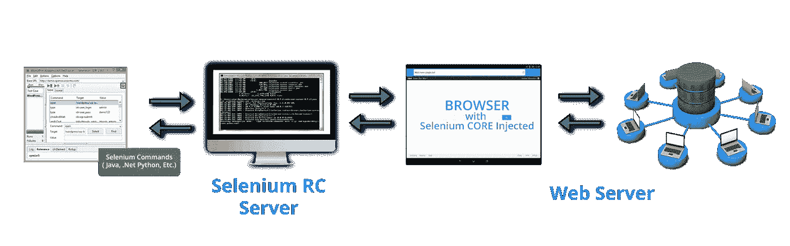
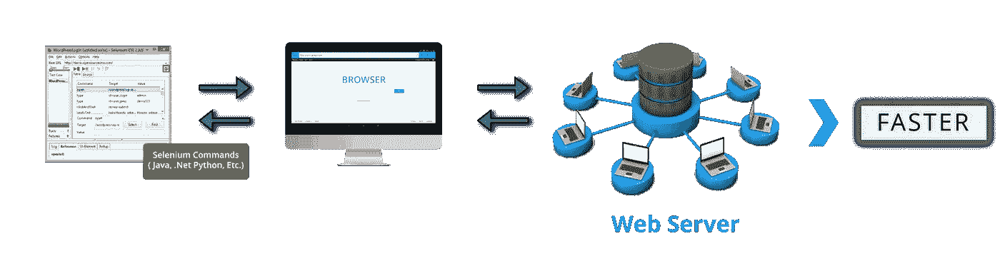
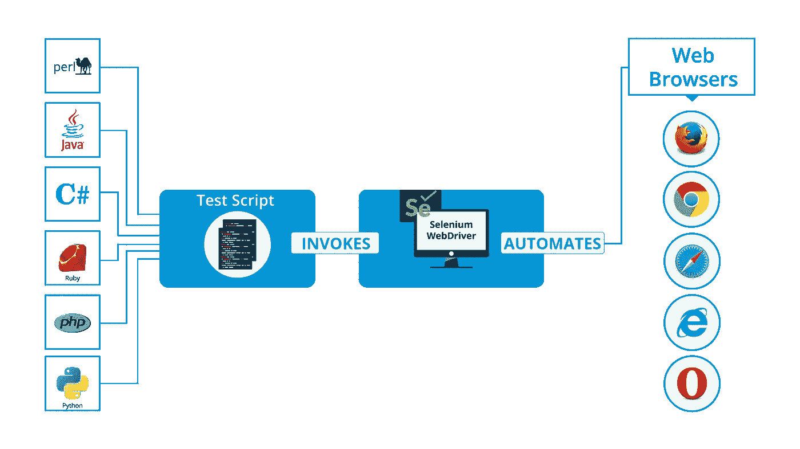
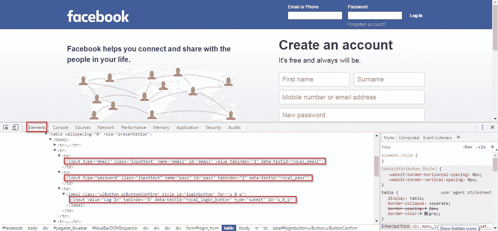

# Selenium 教程——了解如何使用 Selenium WebDriver 执行自动化测试

> 原文：<https://medium.com/edureka/selenium-tutorial-77879a1d9af1?source=collection_archive---------1----------------------->


Selenium Tutorial — Edureka

在这篇关于 Selenium 教程的文章中，我将告诉您开始使用 Selenium WebDriver 测试 web 应用程序所需要知道的一切。在本文中，我将深入研究 Selenium WebDriver，它是 Selenium 项目 中的旗舰工具。

# Selenium WebDriver

在我开始使用 Selenium WebDriver 之前，让我向您展示一下我将在本文中涉及的主题，这将帮助您为自动化测试编写您的第一个 Selenium 代码。在本文中，我编写了 Selenium 代码来测试自动登录脸书。这些主题是:

*   Selenium RC 的缺陷和 WebDriver 的诞生
*   什么是 Selenium WebDriver？
*   什么是浏览器元素？
*   在网页上定位浏览器元素
*   对浏览器元素的操作

# Selenium RC 的缺陷和 WebDriver 的诞生

让我们首先讨论 Selenium RC 的局限性，因为这是最终开发 WebDriver 的原因。当我说 Selenium RC 一经推出就一炮而红时，你可能会感到惊讶。这是因为它克服了**同源策略**的问题，这是用 Selenium Core 测试 web 应用时的一个主要问题。 ***但是你知道什么是同源政策问题吗？***

同源策略是实施 web 应用程序安全模型规则。根据同源策略，当且仅当被测试的 JavaScript 和网页都来自相同的域时，网络浏览器将允许 JavaScript 代码访问网页上的元素。Selenium Core 是一个基于 JavaScript 的测试工具，由于同样的原因，它不能测试每个网页。

但是当 Selenium RC 出现时，它使测试人员摆脱了相同的起源策略问题。但是，RC 是怎么做到的呢？RC 通过使用另一个名为 **Selenium RC server** 的组件来实现这一点。所以，RC 是一个由两个组件组合而成的工具: **Selenium RC 服务器**和 **Selenium RC 客户端**。

Selenium RC server 是一个 HTTP 代理服务器，旨在让浏览器相信 Selenium Core 和正在测试的 web 应用程序来自同一个域。因此，无法阻止 JavaScript 代码访问和测试任何网站。

尽管 Selenium RC 大受欢迎，但它也有自己的问题。其中最主要的是执行测试所花费的时间。因为 Selenium RC 服务器是浏览器和 Selenium 命令之间通信的中间人，所以测试执行非常耗时。除了时间因素，RC 的架构也略显复杂。

该架构首先将 Selenium Core 注入 web 浏览器。然后 Selenium Core 将接收来自 RC 服务器的指令，并将其转换为 JavaScript 命令。这段 JavaScript 代码负责访问和测试 web 元素。如果你看下面的图片，你会知道 RC 是如何工作的。



为了克服这些问题，开发了 Selenium WebDriver。WebDriver 速度更快，因为它直接与浏览器交互，不涉及外部代理服务器。架构也更简单，因为浏览器是从操作系统级别控制的。下图将帮助你理解 WebDriver 是如何工作的。



WebDriver 的另一个好处是它支持在 HTML 单元驱动上测试，这是一个无头驱动。我们说的无头驱动，是指浏览器没有 GUI。另一方面，RC 不支持 HTML 单元驱动程序。以上是 WebDriver 得分超过 RC 的一些原因。

# 什么是 Selenium WebDriver？

在文章的这一部分，我将深入研究 Selenium WebDriver。很有可能你会意识到我在下面段落中提到的细节，但我还是会修改它。

Selenium WebDriver 是一个基于 web 的自动化测试框架，可以测试在各种 web 浏览器和各种操作系统上启动的网页。事实上，你也可以自由地用不同的编程语言编写测试脚本，比如:Java、Perl、Python、Ruby、C#、PHP 和 JavaScript。请注意，Mozilla Firefox 是 Selenium WebDriver 的默认浏览器。

WebDriver 是作为 Selenium v2.0 的一部分引入的。Selenium v1 只包含 IDE、RC 和 Grid。但是 Selenium 项目的主要突破是在 Selenium v2 中开发和引入 WebDriver 作为替代品的时候。然而，随着 Selenium v3 的发布，RC 已经被弃用并被转移到遗留包中。你仍然可以下载并使用 RC，但是不要期望它会得到任何支持。

简而言之，WebDriver 相对于 RC 的优势在于:

*   支持更多编程语言、操作系统和网络浏览器
*   克服 Selenium 1 的限制，如文件上传、下载、弹出窗口和对话障碍
*   与 RC 相比，命令更简单，API 更好
*   支持批量测试、跨浏览器测试和数据驱动测试

但是与 RC 相比，它的缺点是无法生成测试报告。RC 生成详细的报告。

下图描述了 WebDriver 的工作方式:



你一定多次听说过“浏览器元素”这个术语。本 Selenium 教程的下一部分将讨论这些元素是什么，以及如何对这些 web 元素进行测试。

# 什么是浏览器元素？

元素是出现在网页上的不同组件。我们在浏览时最常注意到的元素是:

*   正文框
*   CTA 按钮
*   形象
*   超链接
*   单选按钮/复选框
*   文本区域/错误消息
*   下拉框/列表框/组合框
*   Web 表格/ HTML 表格
*   基本框架

测试这些元素本质上意味着我们必须检查它们是否工作正常，是否按照我们想要的方式做出响应。例如，如果我们测试文本框，你会测试它做什么？

1.  我们是否能够向文本框发送文本或数字
2.  我们能检索已经传递到文本框的文本吗，等等。

如果我们正在测试一个图像，我们可能想要:

1.  下载图像
2.  上传图像
3.  点击图片链接
4.  检索图像标题等。

类似地，可以对前面提到的每个元素执行操作。但是只有在元素被定位到网页上之后，我们才能执行操作并开始测试它们，对吗？所以，我将在本文中讨论的下一个主题是元素定位器技术。

# 定位网页上存在的浏览器元素

网页上的每个元素都有属性。元素可以有多个属性，并且这些属性中的大多数对于不同的元素都是唯一的。例如，假设一个页面有两个元素:一个图像和一个文本框。这两个元素都有一个“Name”属性和一个“ID”属性。对于每个元素，这些属性值需要是唯一的。换句话说，两个元素不能有相同的属性值。元素可以具有相同的“类名”值。

在所考虑的例子中，图像和文本框既不能有相同的“ID”值，也不能有相同的“Name”值。但是，页面上的一组元素有一些共同的属性。稍后我会告诉你这些属性是什么，但在此之前，让我列出 8 个属性，我们可以使用它们来定位元素。这些属性是 ID、名称、类名、标记名、链接文本、部分链接文本、CSS 和 XPath。

因为元素是使用这些属性来定位的，所以我们称它们为' [Locators](https://www.edureka.co/blog/locators-in-selenium?utm_source=medium&utm_medium=content-link&utm_campaign=selenium-tutorial) '。这些定位器是:

*   **by . id**语法:driver . find element(by . id(" XXX "))；
*   **by . name**语法:driver . find element(by . name(" XXX "))；
*   **by . class name**语法:driver . find element(by . class name(" XXX "))；
*   **By.tagName**
    语法:driver . find element(by . tagname(" XXX ")；
*   **By.linkText**
    语法:driver . find element(by . linktext(" XXX "))；
*   **by . partiallinktext**
    语法:driver . find element(by . partiallinktext(" XXX "))；
*   **by . CSS**语法:driver . find element(by . CSS(" XXX "))；
*   **by . XPath**语法:driver . find element(by . XPath(" XXX "))；

通过查看上面的语法，您可能已经意识到定位器是在方法内部调用的。因此，在进一步学习之前，您需要学习所有其他方法、浏览器命令和可用于对元素执行操作的函数。

# 对浏览器元素的操作

从本文的这一部分开始，您将会有很多乐趣，因为理论会更少，代码会更多。所以请做好准备，并保持 Eclipse IDE 打开，安装所需的 Selenium 包。

要开始测试一个网页，我们需要首先打开一个浏览器，然后通过提供 URL 导航到该网页，对吗？看看下面这段代码，我复制了同样的代码。火狐浏览器将首先被启动，然后它将导航到脸书的登录页面。

```
package seleniumWebDriver;
import org.openqa.selenium.WebDriver;
import org.openqa.selenium.firefox.FirefoxDriver;

public class WebDriverClass 
{
public static void main(String[] args) 
{
System.setProperty("webdriver.gecko.driver", "files/geckodriver.exe");
WebDriver driver = new FirefoxDriver();
driver.get("[https://www.facebook.com/](https://www.facebook.com/)");
driver.getTitle();
driver.quit();
}
}
```

> **导入 org . open QA . selenium . web driver；**是一个库包，其中包含启动加载了特定驱动程序的浏览器所需的类。
> 
> **导入 org . open QA . selenium . Firefox . Firefox driver；**是一个库包，包含了 WebDriver 类启动 FirefoxDriver 作为浏览器所需的 FirefoxDriver 类。
> 
> **system . set property(" web driver . gecko . driver "，" files/gecko driver . exe ")；—** 这个命令通知运行时引擎 Gecko 驱动程序出现在指定的路径中。在 Firefox 35 之后，我们需要下载 Gecko 驱动程序来使用 WebDriver。如果你想在 chrome 上测试，那么你必须下载 ChromeDriver，这是一个. exe 文件，并在这行代码中指定它的路径。在其他浏览器的情况下，我们也必须这样做。
> 
> **web driver driver = new Firefox driver()；—** 该命令用于启动一个新的 Firefox 驱动程序对象。
> 
> **driver . get(" https://www . edu reka . co/")；—** 该方法用于打开指定的 URL。
> 
> **driver . gettitle()；** —该命令获取浏览器中当前打开的选项卡的标题。
> 
> **driver . quit()；—** 该命令关闭浏览器驱动程序。

但是，如果您想导航到一个不同的 URL，然后进行测试呢？在这种情况下，您可以使用 navigate.to()命令，如下面的代码片段所示。如果您想返回上一页，可以使用 navigate.back()命令。同样，要刷新当前页面，可以使用 navigate.refresh()命令。

```
driver.navigate().to(“[https://www.edureka.co/testing-with-selenium-webdriver](https://www.edureka.co/testing-with-selenium-webdriver)”);
driver.navigate().refresh();
driver.navigate().back();
```

如果您想要最大化浏览器窗口的大小，那么您可以使用下面代码片段中的代码来实现。

```
driver.manage().window().maximize();
```

如果您想为浏览器窗口设置自定义大小，那么您可以设置自己的尺寸，如下面的代码片段所示。

```
Dimension d = new Dimension(420,600);
driver.manage().window().setSize(d);
```

现在你已经知道了大部分基础知识，让我们进入本文的下一个主题。让我们尝试在 web 页面上找到一个元素，然后执行任何可能的操作。

我很确定，你们都有脸书的账户。因此，让我向您展示如何通过传递代码本身的凭据来登录脸书。

脸书登录页面有两个文本字段，一个用于**电子邮件/电话**，另一个用于**密码**。我们必须找到这两个元素，将凭证传递给这些元素，然后找到第三个元素:**登录**按钮，需要点击它。

看下面的截图。是**脸书**登录页面的截图。



如果您检查(Ctlr + Shift + i)这个页面，那么您将在浏览器中得到相同的窗口。然后，在**元素**下，将显示页面上所有元素及其属性的列表。上面的截图中突出显示了三个部分。第一个突出显示的元素是电子邮件文本字段，第二个是密码文本字段，第三个是登录按钮。

如果您还记得，我前面提到过这些元素可以使用元素定位器技术来定位。让我们用它来定位这些元素并发送字段值。
这是查找元素的语法:**driver . find element(by . id(" XXX "))；** 对于发送它的值，我们可以使用方法**sendKeys(*credentials*)；** 对于点击按钮，我们要用**的方法点击()；**

因此，让我们开始寻找元素并对其执行操作。它的代码在下面的代码片段中。

```
driver.findElement(By.name("email")).sendKeys("[xxx@gmail.com](mailto:xxx@gmail.com)");
driver.findElement(By.name("pass")).sendKeys("xxxxxx");
driver.findElement(By.id("u_0_q")).click();
```

> 在第 1 行中，我们通过唯一的“Name”属性来标识 *Email* 元素，并向其发送 EmailID。
> 在第 2 行，我们通过唯一的‘Name’属性来识别 *Password* 元素，并将密码发送给它。
> 在第 3 行，我们通过唯一的 ID 定位*登录按钮*元素，并点击该按钮。

仅仅添加这几行代码可能还不够。这是因为页面的动态性，它可能不会立即响应，当页面加载时，WebDriver 将被终止并抛出超时异常错误。这个问题可能不会发生在脸书的网页上，因为它速度很快，但很可能会发生在任何其他电子商务网站和其他动态网站。

为了克服这个问题，我们需要使用一种先进的技术。我们需要请求我们的 WebDriver 在页面被访问后等待，在它完全加载后，我们需要定位元素，然后执行操作。

如果你想让你的 WebDriver 等到所有的元素都加载到一个网页中，然后关闭浏览器，那么我们可以通过使用 **driver.wait()** 方法或者 **Threads.sleep()方法**来实现。然而，如果你正在编写更高级的代码，那么你应该使用**隐式等待**或**显式等待**。在本文的下一部分，我将解释等待条件的概念。但是对于我们的情况，下面的命令就足够了。

```
driver.wait(5000);
// or use this:-
Thread.sleep(5000);
```

但是，在处理等待条件时，记得导入这个库:
**import Java . util . concurrent . time unit；** 我们这样做是因为，wait 的类及其相关方法将出现在这个库中。

我解释的全部代码出现在下面的代码片段中。

```
package seleniumWebDriver;
import org.openqa.selenium.WebDriver;
import org.openqa.selenium.firefox.FirefoxDriver;
import java.util.concurrent.TimeUnit;

public class WebDriverClass 
{
public static void main(String[] args) 
{
System.setProperty("webdriver.gecko.driver", "files/geckodriver.exe");
WebDriver driver = new FirefoxDriver();
driver.get("[https://www.facebook.com/](https://www.facebook.com/)");
driver.manage().window().maximize();
driver.getTitle();
driver.navigate().to(“[https://www.edureka.co/testing-with-selenium-webdriver](https://www.edureka.co/testing-with-selenium-webdriver)”);

driver.navigate().back();
driver.navigate().refresh();
driver.wait(5000);
// or use
// Thread.sleep(5000);

driver.findElement(By.name("email")).sendKeys("[xxx@gmail.com](mailto:xxx@gmail.com)");
driver.findElement(By.name("pass")).sendKeys("xxxxxx");
driver.findElement(By.id("u_0_q")).click();

driver.quit();
}
}
```

当你用你实际的电子邮件和密码替换凭证并执行这段代码时，脸书将在一个新窗口中打开，输入你的凭证并登录到你的帐户。

**瞧吧**！您已成功登录，这意味着您的完整代码已完全执行。

我使用了 **ID** 和 **Name** 属性来定位元素。事实上，您可以使用任何其他定位器来查找元素。 [**XPath**](https://www.edureka.co/blog/xpath-in-selenium?utm_source=medium&utm_medium=content-link&utm_campaign=selenium-tutorial) 是最有用也是最重要的定位技术。但是，只要您能够找到其中的一个属性并使用它们来定位元素，您就应该是优秀的。

至此，我们来结束“Selenium 教程”这篇文章。请留意本系列中的其他文章和视频，它们将帮助您理解 Java 的各种概念。

如果你想查看更多关于人工智能、DevOps、道德黑客等市场最热门技术的文章，你可以参考 Edureka 的官方网站。

请留意本系列中的其他文章，它们将解释硒的各个方面。

> 1.[Selenium web driver:TestNG For Test Case Management&报告生成](/edureka/selenium-webdriver-tutorial-e3e6219f21ad)
> 
> 2.[构建数据驱动、关键字驱动的&混合 Selenium 框架](/edureka/selenium-framework-data-keyword-hybrid-frameworks-ea8d4f4ce99f)
> 
> 3.[硒中的定位器](/edureka/locators-in-selenium-f6e6b282aed8)
> 
> 4. [XPath 教程](/edureka/xpath-in-selenium-cd659373e01a)
> 
> 5.[等待硒](/edureka/waits-in-selenium-5b57b56f5e5a)
> 
> 6.[为分布式硒检测建立硒网格](/edureka/selenium-grid-tutorial-ef342799c484)
> 
> 7.[硒用 Python](/edureka/selenium-using-python-edc22a44f819)
> 
> 8.[使用 LambdaTest 的跨浏览器测试](/edureka/cross-browser-testing-9299b04ce277)
> 
> 9.[使用 Selenium 进行跨浏览器测试](/edureka/cross-browser-testing-using-selenium-90b1911c6d60)
> 
> 10.[在 Selenium 中处理多个窗口](/edureka/handle-multiple-windows-in-selenium-727ba5f8f6a7)
> 
> 11.[Selenium 中的页面对象模型](/edureka/page-object-model-in-selenium-bc4d7c8c4203)
> 
> 12.[硒项目](/edureka/selenium-projects-b2df15d35fe2)
> 
> 13. [QTP vs 硒](/edureka/qtp-vs-selenium-338f3d3bbfa7)
> 
> 14.[硒 vs RPA](/edureka/selenium-vs-rpa-84159dbcd0f2)
> 
> 15. [Selenium 网络驱动架构](/edureka/selenium-webdriver-architecture-565e2db26dd5)
> 
> 16.[处理 Selenium 中的异常](/edureka/exceptions-in-selenium-369c38155e7d)
> 
> 17.[使用黄瓜&硒](/edureka/cucumber-selenium-tutorial-aefec05f4733)进行网站测试

*原载于 2017 年 5 月 5 日 www.edureka.co**[*。*](https://www.edureka.co/blog/selenium-tutorial)*