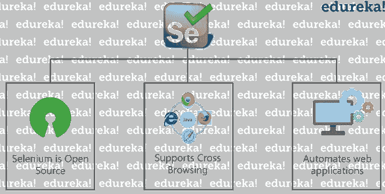
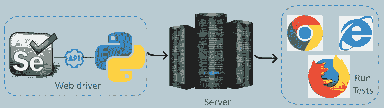
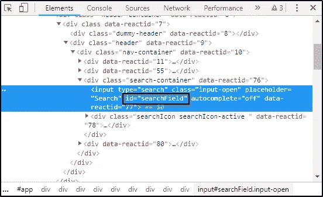

# 如何使用 Python 在 Selenium 中定位 Web 元素？

> 原文：<https://medium.com/edureka/selenium-using-python-edc22a44f819?source=collection_archive---------1----------------------->


Selenium using Python — Edureka

如果你问一个懒惰的程序员，他最喜欢的编程语言是哪一种，很大概率你会得到“ ***Python*** ”作为答案。Python 被认为是最流行和最受欢迎的编程语言之一。正如大家可能知道的，Selenium 是 web 应用程序自动化测试的完美工具。因此，与其他编程语言相比，Python 帮助我们以更简单的方式编写 Selenium 脚本。因此，我提出了这篇关于使用 Python 开发 Selenium 的文章，其中我将涉及以下主题:

*   硒简介
*   Python 简介
*   Selenium 和 Python 绑定
*   使用 Python 定位 web 元素

# 硒简介

[Selenium](https://www.edureka.co/blog/what-is-selenium?utm_source=medium&utm_medium=content-link&utm_campaign=selenium-using-python) 是一个开源工具，用于自动化在 web 浏览器上执行的测试用例，或者使用任何 web 浏览器测试的 web 应用程序。等等，在你忘乎所以之前，让我重申一下，只有对 web 应用程序的测试才有可能使用 Selenium。我们既不能测试任何桌面软件应用程序，也不能使用 Selenium 测试任何移动应用程序。因此，它是一个开源工具，支持交叉浏览和自动化网络应用程序！



现在继续，让我们看看*为什么我们需要 Selenium IDE 来进行自动化测试*？

正如我已经提到的——Selenium 是开源的，并且不涉及许可成本，这是相对于其他测试工具的一个主要优势。Selenium 日益流行背后的其他主要原因包括它们的测试用例、操作系统平台和浏览器支持。

与其他自动化工具相比，这些是 Selenium 保持领先地位的部分原因。现在让我们更深入地研究这篇文章，了解什么是 Python？

# Python 简介

Python 非常简单易学。它是最强大的语言之一，非常像英语！

那么，是什么促成了它的简单呢？Python 是

*   免费和开源
*   高层
*   解释
*   有幸拥有一个大社区

Python 还有许多内置的测试框架，涵盖了调试和最快的工作流程。有很多工具和模块可以让事情变得更简单，比如和 *Splinter 和 Python 也*支持跨平台测试&跨浏览器和框架，比如和框架。

理解了这一点，现在让我们理解 Selenium 和 Python 之间的绑定。

# Selenium 和 Python 绑定



第一步是使用 Selenium web driver 编写您的功能测试，之后，您需要向 Selenium 服务器发送一个请求，然后在各种浏览器上执行测试用例。可以是谷歌 Chrome、Internet Explorer 或者 Mozilla Firefox。

现在，为了用 Selenium 实现 Python，我们首先需要导入 Selenium web 驱动程序！

首先，让我告诉你什么是 Selenium web 驱动程序。

Selenium 中的 WebDriver 是一个基于 web 的[自动化测试框架](https://www.edureka.co/blog/test-automation-frameworks?utm_source=medium&utm_medium=content-link&utm_campaign=selenium-using-python)，可以测试在各种 web 浏览器和各种操作系统上启动的网页。为了导入和配置依赖项以添加库和功能，您需要在以下命令的帮助下导入 Selenium WebDriver。

```
from selenium import webdriver 
from selenium.webdriver.common.keys import keys 
from selenium.import.*
```

这完全是关于 Python 和 Selenium 之间的绑定。现在让我们进一步了解如何使用 Python 在 Selenium 中定位元素。

# 使用 Python 定位 Web 元素

Python 编程语言提供了各种框架，如 Django、flask 等。你可以用主题和插件定制它&它还可以让你在**编码**的时候通过提供一些像建议、本地 VCS 等功能来提高生产率。您可以使用任何工具，如 Jupyter Notebook、Anaconda 和 PyCharm，用 Python 编写 Selenium 脚本。

***现在让我们看看硒里的定位器？***

定位符是在网页内唯一标识 web 元素的地址。定位器是 web 元素的 HTML 属性，它告诉 Selenium 它需要对哪个元素执行操作。Selenium 使用定位器与网页上的 web 元素进行交互。

现在，有各种各样的 web 元素，如文本框、id、单选按钮等，识别这些元素一直是一个非常棘手的问题。因此，它需要一种准确有效的方法。因此，我们可以说定位器越有效，自动化脚本就越稳定。每个 Selenium 命令都需要定位器来查找 web 元素。因此，为了准确无误地识别这些 web 元素，我们有不同类型的定位器，即:

*   身份证明
*   名字
*   链接文本
*   CSS 选择器
*   部分链接文本和
*   XPath

现在让我们看一个小例子来理解 Selenium 中使用 Python 的定位器的工作原理。

我将启动谷歌浏览器并导航到 hotstar.com。这里，我将尝试使用 **ID 定位器**定位*搜索框*。


在检查上面的 web 元素时，您可以看到它有一个输入标记和属性，如 class 和 id。现在，我将使用 Id 定位器的值，即**搜索字段**来定位搜索框。



让我们看看如何自动化搜索框，并使用 Id locator 向它发送值。

```
from selenium import webdriver
driver = webdriver.Chrome("C:\\Users\\Neha_Vaidya\\eclipse-workspace\\Selenium\\chromedriver_win32\\chromedriver.exe")
driver.get("[https://www.hotstar.com](https://www.hotstar.com)")
driver.find_element_by_id("searchField").send_keys("Movies")
```

当你运行上面的代码， ***chrome 驱动*** 会启动谷歌 chrome，重定向到 Hotstar，在搜索框中输入值为‘Movies’。

我希望这能让您清楚地了解 Selenium 中的 Id locator 是如何工作的。现在让我们进一步了解如何使用名称定位器。

现在假设如果你希望谷歌自动搜索一个元素，让我们看看如何在名称定位器的帮助下做到这一点。最初，我将检查谷歌搜索框，并检索名称属性的值，即' q '。下一步是将值发送到搜索框。一旦您将这些值发送给 search，它就会自动搜索 Selenium。你可以看看下面的 Python 代码。

```
from selenium import webdriver
driver = webdriver.Chrome("C:\\Users\\Neha_Vaidya\\eclipse-workspace\\Selenium\\chromedriver_win32\\chromedriver.exe") 
driver.get("[https://www.google.com](https://www.google.com)")
driver.find_element_by_name("q").send_keys("Selenium")
driver.find_element_by_name("btnK").click()
```

所以，基本上，这就是它的工作方式。现在让我们看看使用 XPath 定位元素的通用代码。

```
from selenium import webdriver
driver = webdriver.Chrome("C:\\Users\\Neha_Vaidya\\eclipse-workspace\\Selenium\\chromedriver_win32\\chromedriver.exe")
driver.get("[https://www.hotstar.com](https://www.hotstar.com)")
driver.find_element_by_xpath("//div[[@class](http://twitter.com/class)='signIn displayElement']").click()   # Click on login icon
driver.find_element_by_xpath("//input[[@name](http://twitter.com/name)='email']").send_keys("[xyz@edureka.co](mailto:xyz@edureka.co)") # Entering email address
driver.find_element_by_name("password").send_keys("edureka123")    #Entering the given password
driver.find_element_by_xpath("//button[[@type](http://twitter.com/type)='submit']").click()      #Clicking submit button to login
```

上面的代码描述了 hotstar.com 的登录。第一，通过 hotstar.com 使用。所以登录过程的每一步都是在 XPath 定位器的帮助下进行的。这就是它的工作原理。如果您希望深入学习 XPath 及其基础知识，可以阅读这篇关于 XPath 的文章。我将单击登录图标，然后输入电子邮件地址和密码。之后，再次使用 XPath，我将单击 submit 按钮在 Selenium 中登录 XPath。

至此，我们结束了这篇关于使用 [Python](https://www.edureka.co/blog/10-reasons-why-you-should-learn-python?utm_source=medium&utm_medium=content-link&utm_campaign=selenium-using-python) 开发 Selenium 的文章。希望对你有帮助，让你的知识增值。

如果你想查看更多关于人工智能、DevOps、道德黑客等市场最热门技术的文章，那么你可以参考 [Edureka 的官方网站。](https://www.edureka.co/blog/?utm_source=medium&utm_medium=content-link&utm_campaign=selenium-using-python)

请留意本系列中的其他文章，它们将解释硒的各个方面。

> 1.[硒教程](/edureka/selenium-tutorial-77879a1d9af1)
> 
> 2.[Selenium web driver:TestNG For Test Case Management&报告生成](/edureka/selenium-webdriver-tutorial-e3e6219f21ad)
> 
> 3.[构建数据驱动、关键字驱动的&混合 Selenium 框架](/edureka/selenium-framework-data-keyword-hybrid-frameworks-ea8d4f4ce99f)
> 
> 4.[硒中的定位器](/edureka/locators-in-selenium-f6e6b282aed8)
> 
> 5. [XPath 教程](/edureka/xpath-in-selenium-cd659373e01a)
> 
> 6.[等待硒](/edureka/waits-in-selenium-5b57b56f5e5a)
> 
> 7.[为分布式硒测试设置硒网格](/edureka/selenium-grid-tutorial-ef342799c484)
> 
> 8.[使用 LambdaTest 进行跨浏览器测试](/edureka/cross-browser-testing-9299b04ce277)
> 
> 9.[使用 Selenium 进行跨浏览器测试](/edureka/cross-browser-testing-using-selenium-90b1911c6d60)
> 
> 10.[在 Selenium 中处理多个窗口](/edureka/handle-multiple-windows-in-selenium-727ba5f8f6a7)
> 
> 11.[硒中页面对象模型](/edureka/page-object-model-in-selenium-bc4d7c8c4203)
> 
> 12.[硒项目](/edureka/selenium-projects-b2df15d35fe2)
> 
> 13. [QTP vs 硒](/edureka/qtp-vs-selenium-338f3d3bbfa7)
> 
> 14.[硒 vs RPA](/edureka/selenium-vs-rpa-84159dbcd0f2)
> 
> 15. [Selenium WebDriver 架构](/edureka/selenium-webdriver-architecture-565e2db26dd5)
> 
> 16.[在 Selenium 中处理异常](/edureka/exceptions-in-selenium-369c38155e7d)
> 
> 17.[使用黄瓜&硒](/edureka/cucumber-selenium-tutorial-aefec05f4733)进行网站测试

*原载于 2019 年 4 月 5 日 https://www.edureka.co**T21*[。](https://www.edureka.co/blog/selenium-using-python/)