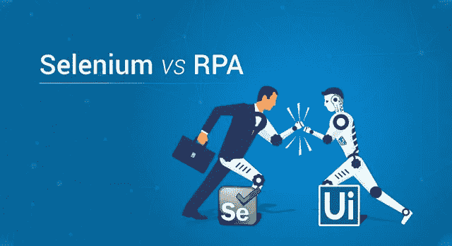
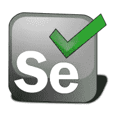
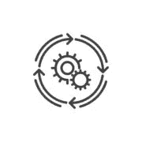
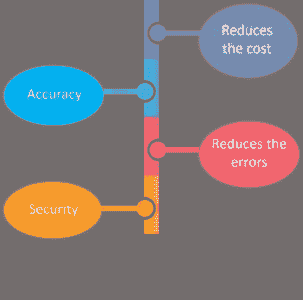
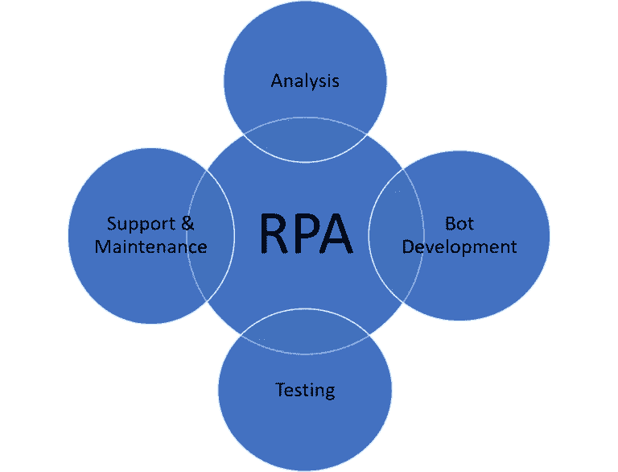
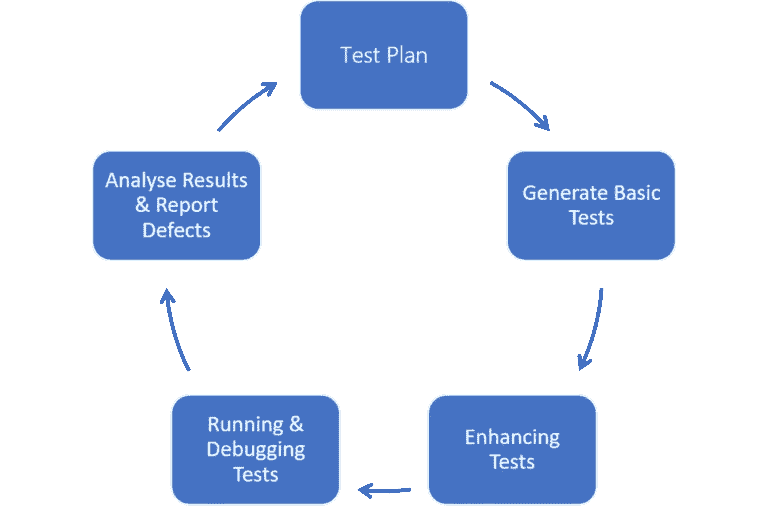
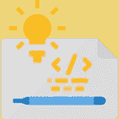
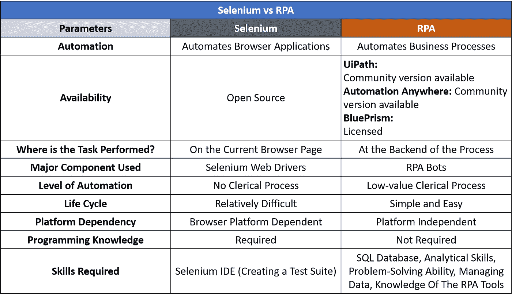

# Selenium vs RPA:最佳自动化技术之战

> 原文：<https://medium.com/edureka/selenium-vs-rpa-84159dbcd0f2?source=collection_archive---------1----------------------->

Selenium vs RPA — Edureka

最近，技术已经达到了顶峰，自动化的发展为这种转变增添了更多的翅膀。从自动化简单的单元测试到自动化整个业务流程，技术已经扩展到数字时代。在这篇 Selenium vs RPA 文章中，我将让您清楚地了解这些自动化工具之间的区别。

以下是一些统计数据，它们相当准确地反映了自动化需求的增长:

*   根据 bots 的[*预测，到 2022 年，RPA 市场预计将达到 24.6 亿美元，2017 年至 2022 年的 CAGR 为 30.14%。这与试图在 RPA 建立*职业生涯的人成正比。**](https://www.houseofbots.com/news-detail/4301-1-for-digital-transformation-both-robotic-process-automation-and-digital-process-automation-are-equally-important)
*   据 [*美通社*](https://www.prnewswire.com/news-releases/global-automation-testing-market-2018-2023-expected-to-grow-at-a-cagr-of-17-7-during-the-forecast-period-to-reach-19-27-billion-300652566.html) 报道，全球自动化测试市场规模预计将从 2018 年的 85.2 亿美元增长到 2023 年的 192.7 亿美元，预测期内 CAGR 为 17.7%。 *Selenium* 是使用最多的自动化测试工具之一。

因此，在本文中，我将比较这两个自动化巨头。让我们来看看本文将要讨论的内容:

*   硒是什么？它有什么特点？
*   RPA 是什么？它有什么特点？
*   硒和 RPA 的比较
*   结论

在比较 Selenium 和 RPA 之前，让我们详细了解一下它们。

# 硒是什么？它有什么特点？

Selenium 是一个开源的可移植框架，用于跨不同浏览器(Chrome、Firefox、Safari)自动测试 web 应用程序，而不仅仅是传统浏览器。

*   Selenium 支持跨浏览器测试，这使得跨多种浏览器多次实现测试用例变得容易。
*   测试用例可以用 Java、Python、C#、Ruby 等几种编程语言编写。其中，Java 是编写测试脚本最常用的语言。
*   Selenium 在功能和回归测试方面非常灵活。*功能测试有助于根据业务需求测试软件，确保没有缺陷。*回归测试* 有助于针对修改后的应用程序重新执行测试，以检查修改后的代码是否相应地运行。*
*   *一组运行测试的 Selenium 命令称为 Selenese，测试脚本指的是这些命令的顺序。*
*   *无法在移动或桌面应用程序上执行测试；它只倾向于 web 应用程序测试。*

*让我们来谈谈 Selenium 最适合的场景之一。假设您想从电子商务网站的当前页面中找到一个特定的元素。假设元素是产品的形象或成本。使用硒可以很容易做到这一点。事实上，它可以让您检查页面，根据元素定位器技术获得元素的相关代码，并毫不费力地测试 web 页面。*

*现在让我们试着理解什么是机器人过程自动化，以及为什么它非常重要。*

# *什么是 RPA，它有什么特点？*

**

*机器人流程自动化(RPA)是一种商业自动化技术，有助于在没有人工干预的情况下自动化单调重复的任务(数据输入、银行业务)。*

*   *RPA 的初衷是让业务用户能够创建软件机器人，就像人类一样与系统进行交互。*
*   *它是从三个主要的前身发展而来的:屏幕抓取、工作流自动化和人工智能。*
*   *RPA 机器人功能强大，可以模拟多种人类操作，例如登录应用程序、复制和粘贴数据、移动文件和文件夹、填写表单、抓取浏览器以及从文档中提取结构化和半结构化数据。*
*   *它高度依赖于屏幕抓取和工作流自动化，以可视化的方式管理使用拖放功能的工作流，这完全独立于编码知识。*
*   *RPA 基本上是人工智能和自动化的结合。*
*   *RPA 独立于平台。*

*来到 RPA 的前辈们，我会说，他们只是嵌入了 RPA 关键字**。***

***屏幕抓取**工具在数据迁移和集成中发挥着重要作用。第一项在当前系统和遗留系统之间架起桥梁的技术。它是一个组件，用于从一个应用程序收集屏幕显示数据，并对其进行转换，以便另一个应用程序可以显示它。它提供了通过抓取其他应用程序的用户界面来检索数据的功能。*

**

***工作流自动化**是指业务流程的自动化和执行，其中任务是基于一组程序规则来执行的。这有助于设计低代码工作流，以更少的努力执行它们，管理一切并优化工作流以获得更好的结果。*

**

***人工智能**是完全不同的概念。它主要研究机器对人类智能的模拟。它让你的系统完成所有分配给用户的任务。 **AI** 有能力改造行业，帮助业务发展。 ***机器学习*** 和 ***深度学习*** 是实现 AI 的几种方式。*

*以下功能有助于更好地理解 RPA:*

*   *软件机器人已经成为组织实现明显成本节约的一种潜在方式。*
*   *对于需要重复执行程序的任务，RPA 将是最佳选择。*
*   *它有助于各种组织中的业务流程，如运营活动、计算和数据提取*
*   *您可以在更短的时间内获得更准确的结果，因为它易于学习和实施。*
*   *减少了错误的数量。*
*   *RPA 可用作无法通过其他 IT 选项连接的外部系统的链接。*
*   *当您谈到业务流程自动化时，安全性就开始起作用了。用户将要处理的数据将受到高度保护，风险系数也会降低。*

**

# *硒和 RPA 的比较*

*我将考虑以下因素来比较 Selenium 与 RPA。*

*   *这些工具自动化了什么？*
*   *自动化发生在哪里？*
*   *这些工具是开源的还是付费的？*
*   *硒和 RPA 使用哪个主要成分？*
*   *这些工具的自动化程度如何？*
*   *它们生命周期的复杂性*
*   *是平台依赖还是独立？*
*   *需要编码知识？*

## *这些工具自动化了什么？*

*Selenium 自动测试 web 应用程序。*

*机器人流程自动化(RPA)自动化业务流程，如记录维护、查询、交易处理、计算等。*

## *自动化发生在哪里？*

*Selenium 只能自动化当前的 web 页面。*

*RPA 自动化了所有耗时的后端流程。*

## *这些工具是开源的还是付费的？*

**

*   *Selenium 是一个开源测试工具，而 [RPA 工具](https://www.edureka.co/blog/rpa-tools-list-and-comparison?utm_source=medium&utm_medium=content-link&utm_campaign=selenium-vs-rpa)是 UiPath、Automation Anywhere、BluePrism 等。*
*   *在这些工具中，UiPath 提供了一个学习的平台，其中社区版供个人免费使用，商业版获得许可。其他工具用于商业用途，并获得许可。*

## *硒和 RPA 使用哪个主要成分？*

*   *Webdriver 在自动化测试用例中起着非常重要的作用，因为它克服了 Selenium RC 的所有缺点，并使测试过程简单明了。*
*   *RPA 利用**机器人**通过模仿人类活动来帮助呈现可能的结果。*

## *这些工具的自动化程度如何？*

*RPA 有助于维护大量数据记录并简化流程，并且在处理文书流程时非常灵活。*

*Selenium 不支持文书处理，因为它工作在 web 应用程序的前端。*

## *它们生命周期的复杂性*

*他们的生命周期越简单，最终结果就越有效率。与 RPA 相比，硒具有复杂的生命周期。*

# *机器人过程自动化生命周期*

*   *分析*
*   *Bot 开发*
*   *测试，以及*
*   *支持和维护。*

**

## ***第一步:分析***

*RPA 的生命周期从分析开始。*

*   *业务团队一起确定 RPA 开发流程。*
*   *它有助于识别自动化的可行过程。*
*   *借助资源规划开发过程。然后在 RPA 引导下制定流程。*
*   *文档方法在完成后由项目干系人批准。*

## ***第二步:机器人开发***

*   *bot 开发过程发生在一个独立的环境中。*
*   *有限的编码是必需的，因为它是一个向导驱动的过程。*

## ***第三步:测试***

*测试以两种方式进行:*

*   *RPA 开发测试*
*   *独立测试工具*

*其中，RPA 开发测试是首选，因为脚本的正确性已经过验证和审查。然而，通过使用单独的工具，可以在专用的 QA 环境中执行测试。*

## ***步骤 4:支持和维护***

*开发测试之后，进入维护阶段。每一个变化都会定期更新。如果有一个错误，该过程将被测试并不断重复以获得更好的结果。*

# *硒生命周期*

*   *测试计划*
*   *生成基本测试*
*   *增强测试*
*   *运行和调试测试*
*   *分析测试结果并报告缺陷*

**

## ***第一步:测试计划***

*   *从开发团队获取应用程序环境规范。*
*   *然后，识别 AUT(测试中的应用程序)中的对象。*
*   *此外，创建测试用例。*
*   *最后，根据需求选择合适的框架。*

## ***第二步:生成基本测试***

*   *Selenium IDE:元素定位器和 selenese 命令。*
*   *Selenium WebDriver:使用了元素定位器技术和 WebDriver 方法。*

## ***第三步:加强测试***

*   *使用断言/验证命令插入验证点。*
*   *与被测试的应用程序同步。*
*   *处理预期和意外错误。*

## ***第四步:运行和调试测试***

*   *执行测试用例是 Selenium 生命周期中的一个重要阶段。*
*   *只有在测试用例中出现错误时，才需要调试。*

## ***第五步:分析结果并报告缺陷***

*   *Selenium 有助于给出记录的概述，但不提供详细的报告。*
*   *TestNG 和 JUnit 用于生成详细的记录。*

## *是平台依赖还是独立？*

*Selenium 是一个开源工具，它独立于平台，可以在任何浏览平台上使用。*

*在 RPA 中，用户可以使用可以在任何 web、桌面和移动应用程序上运行的流程。它是平台独立的。*

**

## *需要编码知识？*

*   *如果您正在使用 Selenium，则需要 Java 的基础知识。*
*   *RPA 需要最少的编码知识。*

*考虑一个场景，你在任何一个电子商务网站上订购一些东西。*

*   *RPA 有助于捕获订单详细信息。*
*   *通过简化订单输入来简化流程。*
*   *将详细信息与输入的数据集成在一起。这减少了差异，简化了订单状态视图。*

*使用硒，*

*   *可以创建一个 Webdriver 实例。*
*   *导航到相应的网页，并在当前网页上查找特定元素。*
*   *执行登录、注册等操作。*
*   *启动浏览器响应，运行测试，并使用测试框架记录测试结果。*

# *这些工具之间的相似之处。*

*   *Selenium 和 RPA 都是自动化工具，可以减少手动干预并提高质量。*
*   *它们都遵循基于规则的过程。*

*现在，您可能会问，**如果我尝试使用 RPA 作为测试工具会怎么样？**我认为，Selenium 和 RPA 都有助于交付自动化解决方案。说到把它作为测试工具，可以用来测试 web 应用，但是不推荐。我来说说抵制 RPA 做测试机的实用方面。RPA 并不直接应用于产品，而是应用于与业务环境相关的流程。Selenium 完全取决于测试案例的产品。*

# *结论*

*谈到他们不同的因素，我建议你看一下表格:*

**

*在这篇文章中，我已经指出了业界两个蓬勃发展的自动化软件之间的主要区别和相似之处。就自动化而言，Selenium 和 RPA 各有利弊。因此，需要明确需求以及这些工具与需求的匹配程度。*

*如果你想查看更多关于人工智能、DevOps、道德黑客等市场最热门技术的文章，那么你可以参考 [Edureka 的官方网站。](https://www.edureka.co/blog/?utm_source=medium&utm_medium=content-link&utm_campaign=selenium-vs-rpa)*

*请留意本系列中的其他文章，它们将解释硒的各个方面。*

> *1.[硒教程](/edureka/selenium-tutorial-77879a1d9af1)*
> 
> *2.[Selenium web driver:TestNG For Test Case Management&报告生成](/edureka/selenium-webdriver-tutorial-e3e6219f21ad)*
> 
> *3.[构建数据驱动、关键字驱动的&混合 Selenium 框架](/edureka/selenium-framework-data-keyword-hybrid-frameworks-ea8d4f4ce99f)*
> 
> *4.[硒里的定位器](/edureka/locators-in-selenium-f6e6b282aed8)*
> 
> *5. [XPath 教程](/edureka/xpath-in-selenium-cd659373e01a)*
> 
> *6.[硒中等待](/edureka/waits-in-selenium-5b57b56f5e5a)*
> 
> *7.[为分布式硒测试设置硒网格](/edureka/selenium-grid-tutorial-ef342799c484)*
> 
> *8.[硒使用 Python](/edureka/selenium-using-python-edc22a44f819)*
> 
> *9.[使用 LambdaTest 进行跨浏览器测试](/edureka/cross-browser-testing-9299b04ce277)*
> 
> *10.[使用 Selenium 进行跨浏览器测试](/edureka/cross-browser-testing-using-selenium-90b1911c6d60)*
> 
> *11.[在 Selenium 中处理多个窗口](/edureka/handle-multiple-windows-in-selenium-727ba5f8f6a7)*
> 
> *12.[硒中页面对象模型](/edureka/page-object-model-in-selenium-bc4d7c8c4203)*
> 
> *13.[硒项目](/edureka/selenium-projects-b2df15d35fe2)*
> 
> *14. [QTP vs 硒](/edureka/qtp-vs-selenium-338f3d3bbfa7)*
> 
> *15. [Selenium WebDriver 架构](/edureka/selenium-webdriver-architecture-565e2db26dd5)*
> 
> *16.[处理 Selenium 中的异常](/edureka/exceptions-in-selenium-369c38155e7d)*
> 
> *17.[使用黄瓜&硒](/edureka/cucumber-selenium-tutorial-aefec05f4733)进行网站测试*

**原载于 2019 年 4 月 15 日*[*https://www.edureka.co*](https://www.edureka.co/blog/selenium-vs-rpa/)*。**