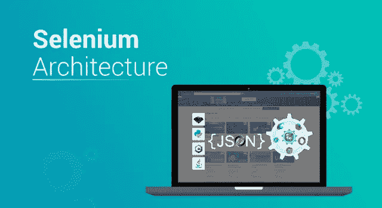
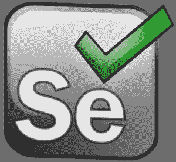
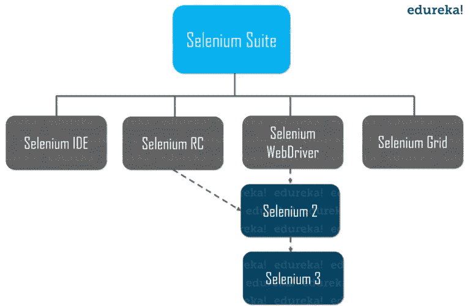
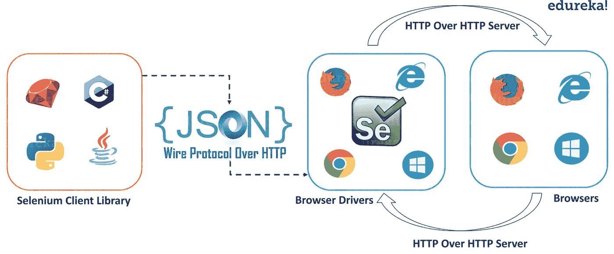

# Selenium WebDriver 架构综合指南

> 原文：<https://medium.com/edureka/selenium-webdriver-architecture-565e2db26dd5?source=collection_archive---------0----------------------->



Selenium Architecture — Edureka

在各种不利条件下测试系统是一项具有挑战性的任务，您需要一个工具来帮助您完成这个过程。自动化测试人员主要使用的工具之一是 Selenium。如果您是初学者，并且希望了解 Selenium 的内部功能，那么您已经找到了一个完美的地方。在本文中，我将向您简要介绍 Selenium WebDriver 架构。

以下是本文涵盖的主题:

*   硒是什么？
*   Selenium 工具套件
*   Selenium WebDriver 架构
*   演示

# 硒是什么？



Selenium 是一个开源的可移植框架，用于自动测试 web 应用程序。在测试功能和回归测试用例时，它是高度灵活的。Selenium 测试脚本可以用不同的编程语言编写，比如 Java、Python、C#等等。这些测试脚本可以跨各种浏览器运行，如 Chrome、Safari、Firefox、Opera，并且还提供跨各种平台的支持，如 Windows、Mac OS、Linux、Solaris。Selenium 还支持交叉浏览，其中测试用例同时在不同的平台上运行。它还有助于创建健壮的、基于浏览器的回归自动化套件并执行测试。

我希望你了解硒的基本原理。现在，让我们进一步了解 Selenium 套件中可用的各种工具。

# Selenium 工具套件

Selenium 主要由一套工具组成，包括:

*   硒 IDE
*   硒 RC
*   Selenium WebDriver
*   硒栅



让我们更详细地了解一下这些工具的功能。

## 硒 IDE

IDE(集成开发环境)是一个火狐插件。它是 Selenium 套件中最简单的框架之一。它允许我们记录和回放脚本。如果您希望使用 [Selenium IDE](https://www.edureka.co/blog/selenium-ide?utm_source=medium&utm_medium=content-link&utm_campaign=selenium-webdriver-architecture) 创建脚本，您需要使用 Selenium RC 或 Selenium WebDriver 来编写更加高级和健壮的测试用例。

接下来我们来看看什么是 Selenium RC。

## 硒 RC

Selenium RC，也称为 Selenium 1，在 WebDriver 合并带来 Selenium 2 之前的很长一段时间里是主要的 Selenium 项目。它主要依靠 JavaScript 来实现自动化。它支持 Ruby，PHP，Python，Perl 和 C#，Java，Javascript。它支持几乎所有的浏览器。

> ***注:*** *硒 RC 正式弃用。*

## Selenium WebDriver

Selenium WebDriver 是一个浏览器自动化框架，它接受命令并将它们发送到浏览器。它是通过特定于浏览器的驱动程序实现的。它直接与浏览器通信并控制它。Selenium WebDriver 支持各种编程语言，如 Java、C#、PHP、Perl 和 JavaScript

Selenium WebDriver 支持以下功能:

1.  ***操作系统支持*** — Windows、Mac OS、Linux、Solaris
2.  ***浏览器支持*** — Mozilla Firefox、Internet Explorer、Google Chrome 12.0.712.0 及以上、Safari、Opera 11.5 及以上、Android、iOS、HtmlUnit 2.9 及以上。

## 硒栅

Selenium Grid 是一个与 Selenium RC 一起使用的工具。它用于在不同的机器上针对不同的浏览器并行运行测试。这意味着—在运行不同浏览器和操作系统的不同机器上同时运行多个测试。

这就是关于 Selenium 工具套件的全部内容。让我们更深入地研究这篇文章，了解 Selenium WebDriver 架构的功能和各种组件。

# Selenium WebDriver 架构

为了理解 Selenium WebDriver 架构，我们首先应该知道什么是 WebDriver API。Selenium Webdriver API 有助于语言和浏览器之间的交流。每个浏览器都有不同的在浏览器上执行动作的逻辑。下图描述了 Selenium WebDriver 架构的各个组件。



它包括四个主要部分:

1.  Selenium 客户端库
2.  HTTP 客户端上的 JSON 有线协议
3.  浏览器驱动程序
4.  浏览器

让我们深入了解这些组件。

## **1。Selenium 客户端库/语言绑定**

Selenium 支持 Java、Ruby、Python 等多种库。Selenium 开发人员已经开发了语言绑定，允许 Selenium 支持多种语言。如果你想了解更多关于库的信息，请参考 Selenium 库的官方网站。

## **2。HTTP 客户端上的 JSON 有线协议**

JSON 代表 JavaScript 对象符号。它用于在 web 上的服务器和客户端之间传输数据。JSON Wire 协议是一个 REST API，它在 HTTP 服务器之间传输信息。每个 BrowserDriver(比如 FirefoxDriver，ChromeDriver 等。)有自己的 HTTP 服务器。

## **3。浏览器驱动程序**

每个浏览器都包含一个单独的浏览器驱动程序。浏览器驱动程序与相应的浏览器进行通信，而不会暴露浏览器功能的内部逻辑。当浏览器驱动程序接收到任何命令时，该命令将在相应的浏览器上执行，响应将以 HTTP 响应的形式返回。

## **4。浏览器**

Selenium 支持 Firefox、Chrome、IE、Safari 等多种浏览器。

现在让我们更进一步，借助下面的例子来了解 Selenium 的内部功能。

# 演示

实际上，您可以使用任何一个受支持的 Selenium 客户端库(比如 Java)在 UI(比如 Eclipse IDE)中编写代码。

```
WebDriver driver = new FirefoxDriver(); driver.get("https://www.edureka.co");
```

准备好脚本后，您将单击 Run 来执行程序。基于上述声明，Firefox 浏览器将会启动并导航至 [Edureka 网站。](https://www.edureka.co/)

一旦你点击“运行”,你的脚本中的每一条语句都将被转换成一个 URL，这是借助于 HTTP 上的 JSON Wire 协议。URL 将被传递给浏览器驱动程序。(在上面的代码中，我已经使用了 FirefoxDriver)。这里，在这种情况下，客户端库(Java)会将脚本的语句转换成 JSON 格式，并进一步与 FirefoxDriver 通信。

每个浏览器驱动程序都使用 HTTP 服务器来接收 HTTP 请求。一旦 URL 到达浏览器驱动程序，它就会通过 HTTP 将请求传递给真正的浏览器。一旦完成，Selenium 脚本中的命令将在浏览器上执行。对于 Chrome 浏览器，您可以编写如下所示的 Selenium 脚本:

```
WebDriver driver = new ChromeDriver(); driver.get("https://www.edureka.co");
```

如果请求是 *POST* 请求，那么浏览器上会有一个动作。如果请求是一个 *GET* 请求，那么相应的响应将在浏览器端生成。然后，它将通过 HTTP 发送到浏览器驱动程序，浏览器驱动程序通过 JSON Wire 协议将其发送到 UI (Eclipse IDE)。

这就是关于 Selenium WebDriver 架构的全部内容。我希望你理解了这些概念，并且它增加了你知识的价值。

如果你想查看更多关于人工智能、DevOps、道德黑客等市场最热门技术的文章，你可以参考 Edureka 的官方网站。

请留意本系列中的其他文章，它们将解释硒的各个方面。

> 1.[硒教程](/edureka/selenium-tutorial-77879a1d9af1)
> 
> 2.[Selenium web driver:TestNG For Test Case Management&报告生成](/edureka/selenium-webdriver-tutorial-e3e6219f21ad)
> 
> 3.[构建数据驱动、关键字驱动的&混合 Selenium 框架](/edureka/selenium-framework-data-keyword-hybrid-frameworks-ea8d4f4ce99f)
> 
> 4.[硒中的定位器](/edureka/locators-in-selenium-f6e6b282aed8)
> 
> 5. [XPath 教程](/edureka/xpath-in-selenium-cd659373e01a)
> 
> 6.[等待硒](/edureka/waits-in-selenium-5b57b56f5e5a)
> 
> 7.[为分布式硒测试建立硒网格](/edureka/selenium-grid-tutorial-ef342799c484)
> 
> 8.[硒使用 Python](/edureka/selenium-using-python-edc22a44f819)
> 
> 9.[使用 LambdaTest 的跨浏览器测试](/edureka/cross-browser-testing-9299b04ce277)
> 
> 10.[使用 Selenium 进行跨浏览器测试](/edureka/cross-browser-testing-using-selenium-90b1911c6d60)
> 
> 11.[在 Selenium 中处理多个窗口](/edureka/handle-multiple-windows-in-selenium-727ba5f8f6a7)
> 
> 12.[Selenium 中的页面对象模型](/edureka/page-object-model-in-selenium-bc4d7c8c4203)
> 
> 13.[硒项目](/edureka/selenium-projects-b2df15d35fe2)
> 
> 14. [QTP vs 硒](/edureka/qtp-vs-selenium-338f3d3bbfa7)
> 
> 15.[硒与 RPA](/edureka/selenium-vs-rpa-84159dbcd0f2)
> 
> 16.[在 Selenium 中处理异常](/edureka/exceptions-in-selenium-369c38155e7d)
> 
> 17.[使用黄瓜&硒](/edureka/cucumber-selenium-tutorial-aefec05f4733)进行网站测试

*原载于 2019 年 5 月 8 日 https://www.edureka.co**T21*[。](https://www.edureka.co/blog/selenium-webdriver-architecture/)