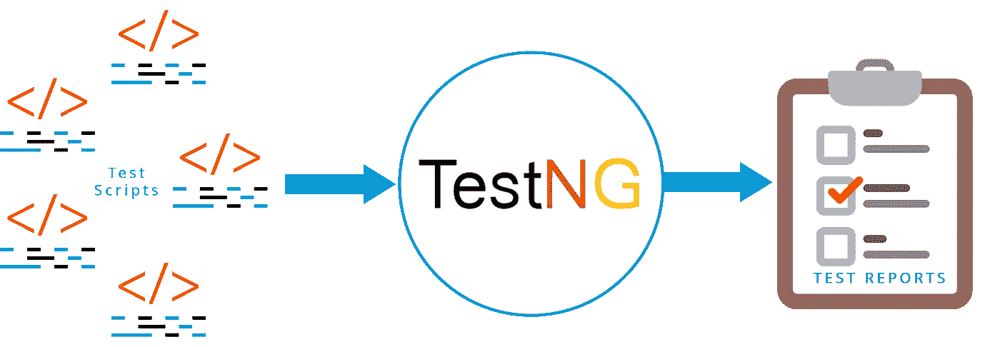
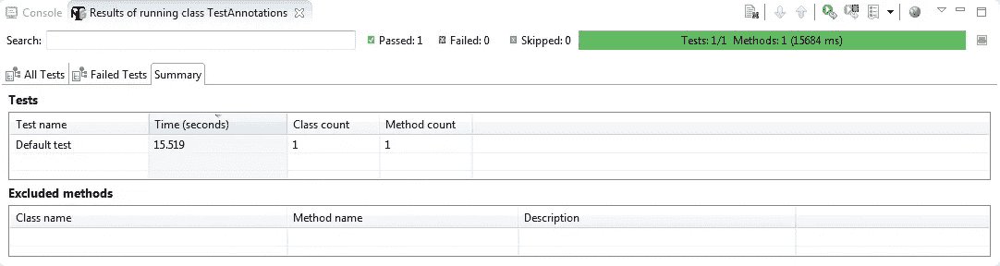
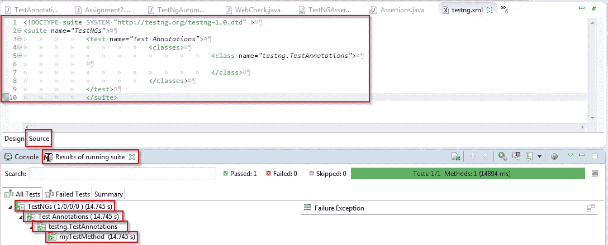
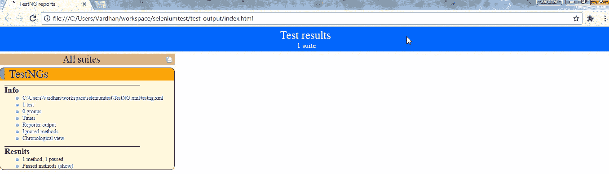
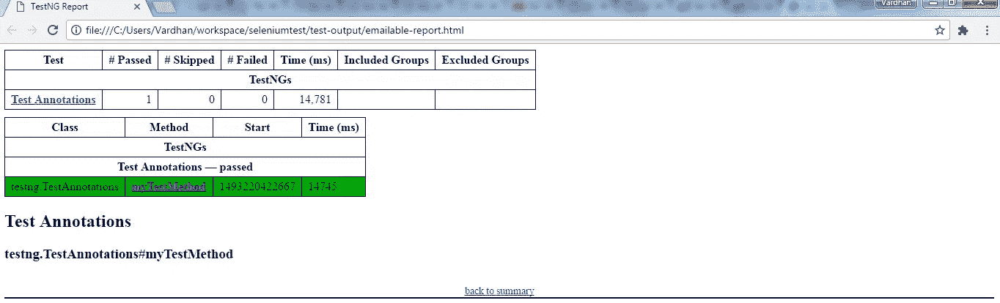

# selenium web driver——TestNG，用于测试用例管理和报告生成

> 原文：<https://medium.com/edureka/selenium-webdriver-tutorial-e3e6219f21ad?source=collection_archive---------2----------------------->


Selenium WebDriver — Edureka

在本文中，我将介绍高级 Selenium WebDriver 概念。我已经多次提到 Selenium WebDriver 在测试用例管理和测试报告生成方面有局限性。那么，还有什么选择呢？像 Selenium 这样受欢迎的工具肯定有变通方法，对吗？当然有！我们可以使用 Selenium 和 TestNG 的组合来克服这个限制，这将是本文讨论的主题。

来自世界各地的软件开发人员会一致同意，在测试用例中编写代码节省了他们调试时间的很大一部分。为什么？这是因为测试用例有助于创建健壮且无错误的代码。它是怎么做到的？通过将整个代码分成更小的测试用例，然后评估每个测试用例的通过/失败条件，我们可以创建无错误的代码。因为 Selenium 不支持在测试用例中执行代码，所以我们必须使用 TestNG 来实现同样的功能。这就是 TestNG 适合 Selenium 框架的地方。

**TestNG** 代表*测试下一代*，它是一个开源的测试自动化框架，灵感来自 JUnit 和 NUnit。不仅仅是灵感，而是对这两个框架的升级。所以你可能会问这里的升级是什么？TestNG 的升级在于，它在代码中提供了额外的功能，如测试注释、分组、优先级、参数化和排序技术，这在早期是不可能的。

除了管理测试用例，通过使用 TestNG 甚至可以获得测试的详细报告。将会有一个概要，显示失败的测试用例，以及它所属的组和类。当 bug 可以像这样被准确定位时，它们可以被立即修复，让开发人员松了一口气。下图描述了 TestNG 的工作方式。



那么，TestNG 是如何完成工作的呢？这个问题将在这篇 Selenium WebDriver 教程文章的下一节中回答，在那里我将讨论如何使用 TestNG 管理各种测试用例。

# 带 TestNG 的 Selenium WebDriver

测试用例可以通过以下方式之一来定义和管理:

1.  测试注释
2.  优化
3.  禁用测试用例
4.  方法依赖性
5.  分组
6.  断言
7.  报表生成

让我开始解释这些功能。

## 测试注释

首先，让我们问自己这个问题:为什么我们需要使用注释？我们什么时候可以使用它们？Selenium 中的注释用于控制下一个要执行的方法。测试注释是在测试代码中的每个方法之前定义的。如果任何方法没有以注释为前缀，那么该方法将被忽略，并且不会作为测试代码的一部分执行。为了定义它们，方法需要简单地用“ **@Test** ”进行注释。例如，请看下面的代码片段。

```
package testng;

import org.openqa.selenium.WebDriver;
import org.openqa.selenium.firefox.FirefoxDriver;
import org.testng.annotations.AfterClass;
import org.testng.annotations.AfterMethod;
import org.testng.annotations.BeforeClass;
import org.testng.annotations.BeforeMethod;
import org.testng.annotations.Test;

public class TestAnnotations {
 [@Test](http://twitter.com/Test)
 public void myTestMethod() {
 System.out.println("Inside method:- myTestMethod");
 WebDriver driver = new FirefoxDriver();
 driver.get("[http://www.seleniumframework.com/Practiceform/](http://www.seleniumframework.com/Practiceform/)");
 String title = driver.getTitle();
 System.out.println(title);
 driver.quit();
 }

 [@BeforeMethod](http://twitter.com/BeforeMethod)
 public void beforeMethod() {
 System.out.println("This piece of code is executed before method:- myTestMethod");
 System.setProperty("webdriver.gecko.driver", "C:\\Users\\Vardhan\\workspace\\SeleniumProject\\files\\geckodriver.exe");
 }

 [@AfterMethod](http://twitter.com/AfterMethod)
 public void afterMethod() {
 System.out.println("This piece of code is executed after method:- myTestMethod");
 }

 [@BeforeClass](http://twitter.com/BeforeClass)
 public void beforeClass() {
 System.out.println("This piece of code is executed before the class is executed");
 }

 [@AfterClass](http://twitter.com/AfterClass)
 public void afterClass() {
 System.out.println("This piece of code is executed after the class is executed");
 }
}
```

在上面的代码中，你会注意到我没有定义一个“main”方法。然而，我定义了 5 个其他方法。它们是“myTestMethod”、“beforeMethod”、“afterMethod”、“beforeClass”和“afterClass”。此外，请注意代码中方法定义的顺序，因为它们不会以相同的顺序执行。

方法“myTestMethod”用 **@Test** 注释，它是必须执行的主要方法或代码段。其他带注释的方法将在该方法执行前后执行。由于' beforeMethod '是用 **@BeforeMethod** 注释的，所以会在' myTestMethod '执行之前执行。同样，“afterMethod”用 **@AfterMethod** 注释，因此它将在“myTestMethod”之后执行。

但是，“beforeClass”被注释为 **@BeforeClass** ，这意味着它甚至会在类本身被执行之前被执行。我们这里的类名是 **TestAnnotations** ，因此在类开始执行之前，将执行“beforeClass”中的代码段。类似地，“afterClass”用 **@AfterMethod** 注释，因此将在类 **TestAnnotations** 执行后执行。

如果您仍然对执行的顺序感到困惑，那么下面的代码片段一定会帮助您。

```
1\. BeforeSuite
2\. BeforeTest
3\. BeforeClass
4\. BeforeMethod
5\. Test
6\. AfterMethod
7\. AfterClass
8\. AfterTest
9\. AfterSuite
```

上述代码的输出将是:

```
This piece of code is executed before the class is executed
This piece of code is executed before method:- myTestMethod
Inside method:- myTestMethod
1493192682118 geckodriver INFO Listening on 127.0.0.1:13676
1493192682713 mozprofile::profile INFO Using profile path C:\Users\Vardhan\AppData\Local\Temp\rust_mozprofile.wGkcwvwXkl2y
1493192682729 geckodriver::marionette INFO Starting browser C:\Program Files (x86)\Mozilla Firefox\firefox.exe
1493192682729 geckodriver::marionette INFO Connecting to Marionette on localhost:59792
[GPU 6152] WARNING: pipe error: 109: file c:/builds/moz2_slave/m-rel-w32-00000000000000000000/build/src/ipc/chromium/src/chrome/common/ipc_channel_win.cc, line 346
1493192688316 Marionette INFO Listening on port 59792
Apr 26, 2017 1:14:49 PM org.openqa.selenium.remote.ProtocolHandshake createSession
INFO: Detected dialect: W3C
JavaScript error: [http://t.dtscout.com/i/?l=http%3A%2F%2Fwww.seleniumframework.com%2FPracticeform%2F&j=](http://t.dtscout.com/i/?l=http%3A%2F%2Fwww.seleniumframework.com%2FPracticeform%2F&j=), line 1: TypeError: document.getElementsByTagName(...)[0] is undefined
Selenium Framework | Practiceform
1493192695134 Marionette INFO New connections will no longer be accepted
Apr 26, 2017 1:14:57 PM org.openqa.selenium.os.UnixProcess destroy
SEVERE: Unable to kill process with PID 6724
This piece of code is executed after method:- myTestMethod
This piece of code is executed after the class is executed
PASSED: myTestMethod===============================================
 Default test
 Tests run: 1, Failures: 0, Skips: 0
==============================================================================================
Default suite
Total tests run: 1, Failures: 0, Skips: 0
===============================================
```

从上面的输出可以看出，测试运行的次数是 1，失败的次数是 0。这意味着代码是成功的。甚至方法的执行顺序也会按照我前面提到的顺序。

当您在机器上执行这段代码时，Selenium WebDriver 将实例化您的 Firefox 浏览器，导航到 Selenium Framework 的练习表单，关闭浏览器实例，并在您的 Eclipse IDE 中显示与上面所示相同的输出。

我在代码中只使用了 5 种不同的注释。但是还有更多的注释可以用来控制下一个要执行的方法。下表解释了注释的完整列表:

> **@BeforeSuite** —用 *@BeforeSuite* 标注的方法将在套件中的所有测试运行之前运行。
> 
> **@AfterSuite** —用 *@AfterSuite* 标注的方法将在套件中的所有测试运行完毕后运行。
> 
> **@BeforeTest** —用 *@BeforeTest* 标注的方法将在属于某个类的任何测试方法运行之前运行。
> 
> **@AfterTest** —注释有 *@AfterTest* 的方法将在属于一个类的所有测试方法都运行后运行。
> 
> **@BeforeGroup** —注释有 *@BeforeGroup* 的方法将在每个组运行之前运行。
> 
> **@AfterGroup** —注释有 *@AfterGroup* 的方法将在每组运行后运行。
> 
> **@BeforeClass** —用 *@BeforeClass* 标注的方法将在调用当前类中的第一个测试方法之前运行一次。
> 
> **@AfterClass** —用 *@AfterClass* 标注的方法将在当前类中的所有测试方法运行后运行一次。
> 
> **@BeforeMethod** —用 *@BeforeMethod* 标注的方法将在类内的任何测试方法运行之前运行。
> 
> **@AfterMethod** —用 *@AfterMethod* 标注的方法将在类内的每个测试方法运行后运行。
> 
> **@Test** —注有 *@Test* 的方法是整个程序中的主要测试方法。其他带注释的方法将围绕这个方法执行。

TestNG 报告的屏幕截图如下所示



## 优化

我们谈到了如何定义不同的方法，以便围绕 *@Test* 方法执行这些方法。但是，如果您有不止一个 **@Test** 方法，并且想要定义它们之间的执行顺序，该怎么办呢？

在这种情况下，我们可以通过给带注释的测试用例分配一个数字来区分它们的优先级。数字越小，优先级越高。在定义测试用例时，优先级可以被指定为参数。但是，如果没有指定优先级，那么带注释的测试方法将按照测试的字母顺序执行。看看下面这段代码中测试注释的参数。

```
[@Test](http://twitter.com/Test)(Priority=2)
public static void FirstTest()
{
system.out.println("This is the Test Case number Two because of Priority #2");
}

[@Test](http://twitter.com/Test)(Priority=1)
public static void SecondTest()
{
system.out.println("This is the Test Case number One because of Priority #1");
}

[@Test](http://twitter.com/Test)
public static void FinalTest()
{
system.out.println("This is the Final Test Case because there is no Priority");
}
```

## 禁用测试用例

让我给你看一些更有趣的东西。如果您有一个跨越百万行的代码，由数百个测试用例组成，而您只想禁用一个测试方法，该怎么办？您不需要删除代码的任何部分，相反，我们可以简单地禁用该测试方法。

禁用测试用例的行为也是通过参数来完成的。我们可以将 *enabled* 属性设置为‘false’。默认情况下，所有的测试用例都将被启用，因此我们不需要在每次编写测试时都定义它们。看看下面这段代码中第三和第四个方法的参数。

```
[@Test](http://twitter.com/Test)(Priority=2, enabled = True)
public static void FirstTest()
{
system.out.println("This is the Test Case number Two because of Priority #2");
}

[@Test](http://twitter.com/Test)(Priority=1, enabled = True)
public static void SecondTest()
{
system.out.println("This is the Test Case number One because of Priority #1");
}

[@Test](http://twitter.com/Test)(enabled = false)
public static void SkippedTest()
{
system.out.println("This is the Skipped Test Case because this has been disabled");
}

[@Test](http://twitter.com/Test)(enabled = True)
public static void FinalTest()
{
system.out.println("This is the Final Test Case, which is enabled and has no Priority");
}
```

## 方法依赖性

现在，如果您有这样一种情况，您希望一段代码仅在满足某个条件或某个特定方法成功执行时才执行，那么我们可以通过使用 *dependsOnMethod()来实现这一点。*这基本上是一个方法依赖的条件，其中一个方法将依赖于另一个方法来执行。如果我们另外将 *alwaysRun* 属性设置为 true，那么无论依赖方法的失败/通过条件如何，该方法都将被执行。查看下面代码片段中的代码。

```
[@Test](http://twitter.com/Test)
public static void FirstTest()
{
system.out.println("This is the first Test Case to be executed");
}

[@Test](http://twitter.com/Test)(dependsOnMethods = { "FirstTest" })
public static void SecondTest()
{
system.out.println("This is the second Test Case to be executed; This is a Dependent method");
}

[@Test](http://twitter.com/Test)(dependsOnMethods = { "SecondTest" })
public static void FinalTest()
{
system.out.println("This is the Final Test Case; It will be executed anyway.");
}
```

现在，这将我们带到测试注释的另一个重要方面，那就是*分组*。

## 分组

到现在为止，您一定知道在代码中将有许多方法作为我们测试用例的一部分。假设有 100 个测试用例，但是我们希望在下一个测试中只执行 20 个测试用例。你认为我们能做到吗？我们当然可以。

为此，我们可以使用*组*属性。我们可以为一些测试用例分配一个组名，然后选择执行这个组，而不是整个代码。查看下面的代码片段，了解如何创建组。

```
[@Test](http://twitter.com/Test)(groups = { "MyGroup" })
public static void FirstTest()
{
system.out.println("This is a part of the Group: MyGroup");
}

[@Test](http://twitter.com/Test)(groups = { "MyGroup" })
public static void SecondTest()
{
system.out.println("This is also a part of the Group: MyGroup");
}

[@Test](http://twitter.com/Test)
public static void ThirdTest()
{
system.out.println("But, this is not a part of the Group: MyGroup");
}
```

## 测试断言

这就把我们带到了 TestNG 的下一个主题，即断言。顾名思义，断言可以在测试方法中用来确定测试的通过/失败条件。基于陈述的真/假条件，测试将通过/失败。

在下面的代码中，我包含了 3 个测试方法，其中第一个和第三个方法有一个通过条件，第二个方法有一个失败条件。自己看代码。

```
package testng;

import org.testng.annotations.Test;
import org.testng.annotations.BeforeMethod;
import org.openqa.selenium.WebDriver;
import org.openqa.selenium.firefox.FirefoxDriver;
import org.testng.Assert;
import org.testng.annotations.AfterMethod;

public class Assertions {
 [@BeforeMethod](http://twitter.com/BeforeMethod)
 public void beforeMethod() {
 System.setProperty("webdriver.gecko.driver",
 "C:\\Users\\Vardhan\\workspace\\SeleniumProject\\files\\geckodriver.exe");
 }

 public boolean isEqual(int a, int b) {
 if (a == b) {
 return true;
 } else {
 return false;
 }
 }

 [@Test](http://twitter.com/Test)
 public void testEquality1() {
 Assert.assertEquals(true, isEqual(10, 10));
 System.out.println("This is a pass condition");
 }

 [@Test](http://twitter.com/Test)
 public void testEquality2() {
 Assert.assertEquals(true, isEqual(10, 11));
 System.out.println("This is a fail condition");
 }

 [@Test](http://twitter.com/Test)
 public void getTitle() {
 WebDriver driver = new FirefoxDriver();
 driver.get("[https://www.gmail.com](https://www.gmail.com)");
 String title = driver.getTitle();
 Assert.assertEquals(title, "Gmail");
 System.out.println("This is again a pass condition");
 }
}
```

当您查看执行后生成的报告时，您会注意到在三个测试中，一个失败，两个通过。另一个需要注意的要点是，当断言失败时，该测试中的其他命令/代码行将被跳过。只有当断言成功时，才会在该测试中执行下一行代码。查看下面的输出，其中 *system.out.println* 只执行了第一个和第三个方法。

```
1493277977348 geckodriver INFO Listening on 127.0.0.1:47035
1493277977993 mozprofile::profile INFO Using profile path C:\Users\Vardhan\AppData\Local\Temp\rust_mozprofile.Z7X9uFdKODvi
1493277977994 geckodriver::marionette INFO Starting browser C:\Program Files (x86)\Mozilla Firefox\firefox.exe
1493277977998 geckodriver::marionette INFO Connecting to Marionette on localhost:50758
[GPU 6920] WARNING: pipe error: 109: file c:/builds/moz2_slave/m-rel-w32-00000000000000000000/build/src/ipc/chromium/src/chrome/common/ipc_channel_win.cc, line 346
1493277981742 Marionette INFO Listening on port 50758
Apr 27, 2017 12:56:22 PM org.openqa.selenium.remote.ProtocolHandshake createSession
INFO: Detected dialect: W3C
This is again a pass condition
This is a pass condition
PASSED: getTitle
PASSED: testEquality1
FAILED: testEquality2
java.lang.AssertionError: expected [false] but found [true]
 at org.testng.Assert.fail(Assert.java:93)
 at org.testng.Assert.failNotEquals(Assert.java:512)
 at org.testng.Assert.assertEqualsImpl(Assert.java:134)
 at org.testng.Assert.assertEquals(Assert.java:115)
 at org.testng.Assert.assertEquals(Assert.java:304)
 at org.testng.Assert.assertEquals(Assert.java:314)
 at testng.Assertions.testEquality2(Assertions.java:38)
 at sun.reflect.NativeMethodAccessorImpl.invoke0(Native Method)
 at sun.reflect.NativeMethodAccessorImpl.invoke(Unknown Source)
 at sun.reflect.DelegatingMethodAccessorImpl.invoke(Unknown Source)
 at java.lang.reflect.Method.invoke(Unknown Source)
 at org.testng.internal.MethodInvocationHelper.invokeMethod(MethodInvocationHelper.java:108)
 at org.testng.internal.Invoker.invokeMethod(Invoker.java:661)
 at org.testng.internal.Invoker.invokeTestMethod(Invoker.java:869)
 at org.testng.internal.Invoker.invokeTestMethods(Invoker.java:1193)
 at org.testng.internal.TestMethodWorker.invokeTestMethods(TestMethodWorker.java:126)
 at org.testng.internal.TestMethodWorker.run(TestMethodWorker.java:109)
 at org.testng.TestRunner.privateRun(TestRunner.java:744)
 at org.testng.TestRunner.run(TestRunner.java:602)
 at org.testng.SuiteRunner.runTest(SuiteRunner.java:380)
 at org.testng.SuiteRunner.runSequentially(SuiteRunner.java:375)
 at org.testng.SuiteRunner.privateRun(SuiteRunner.java:340)
 at org.testng.SuiteRunner.run(SuiteRunner.java:289)
 at org.testng.SuiteRunnerWorker.runSuite(SuiteRunnerWorker.java:52)
 at org.testng.SuiteRunnerWorker.run(SuiteRunnerWorker.java:86)
 at org.testng.TestNG.runSuitesSequentially(TestNG.java:1301)
 at org.testng.TestNG.runSuitesLocally(TestNG.java:1226)
 at org.testng.TestNG.runSuites(TestNG.java:1144)
 at org.testng.TestNG.run(TestNG.java:1115)
 at org.testng.remote.AbstractRemoteTestNG.run(AbstractRemoteTestNG.java:132)
 at org.testng.remote.RemoteTestNG.initAndRun(RemoteTestNG.java:230)
 at org.testng.remote.RemoteTestNG.main(RemoteTestNG.java:76)===============================================
 Default test
 Tests run: 3, Failures: 1, Skips: 0
==============================================================================================
Default suite
Total tests run: 3, Failures: 1, Skips: 0
===============================================
```

所以，这就是与测试用例管理相关的概念的结尾。我们还有一个话题，那就是报告生成。报告生成是本 Selenium WebDriver 教程的最后一个主题，因为只有在执行了所有测试之后才能生成报告。

## 报表生成

您需要注意的最重要的一点是，报告只能通过. xml 文件生成。这意味着，无论是一个方法，还是一个类，或者是一个组，都必须在。xml 文件。

首先，您可以在项目下创建一个新文件夹，并在该文件夹中创建一个新文件，为该文件命名，然后用。xml 扩展。您可以通过右键单击 package explorer 来创建新的文件夹和文件。创建文件后，转到窗口底部的 source 选项卡，输入下面代码片段中指定的配置。

```
<!DOCTYPE suite SYSTEM "[http://testng.org/testng-1.0.dtd](http://testng.org/testng-1.0.dtd)" >
<suite name="TestNGs">
 <test name="Test Annotations">
  <classes>
   <class name="testng.TestAnnotations">
   </class>
  </classes>
 </test>
</suite>
```

第一行是 XML 文档类型定义。这是所有测试报告的标准和强制性要求。但是，其他行非常简单明了。我已经为 suite、test、classes 和 class 使用了 open 标记。Classes 标记中可以有一个或多个类。因此，如果我们想要生成一个测试多个类的报告，就可以使用它。这对想要测试一段长代码的开发人员来说尤其方便。

无论如何，回到我们的报告，你可以在打开这些标签后命名每个套件或测试或类，并记住关闭你打开的每个标签。我将我的套件名命名为 *TestNGs* ，测试名命名为 *Test* *Annotations* ，类名命名为*TestNG . Test Annotations*注意类名的格式是**'*package name . class name '***。

当您将这个文件作为 TestNG suite 运行时，将开始执行，您将获得详细的测试报告。您将在控制台选项卡中获得测试输出，在下一个选项卡中获得测试套件的结果。我为执行我的代码生成的报告在下面的屏幕截图中。您会注意到，这一次，有一个套件名、测试名、类名以及执行它们所花费的时间。



如果您想要查看 HTML 报告(索引报告或电子邮件报告)，您可以转到工作区中项目目录内的*测试输出*文件夹。通过点击它们，您甚至可以在以后的某个时间点查看报告。下面是他们的截图。

**指标报告** :-



**电子邮件报告** :-



这就把我们带到了这篇 Selenium WebDriver 教程文章的结尾。现在是时候在您的终端安装 eclipse、安装各种 Selenium 包、安装 TestNG 并开始编写测试用例了。

如果你想查看更多关于人工智能、DevOps、道德黑客等市场最热门技术的文章，那么你可以参考 [Edureka 的官方网站。](https://www.edureka.co/blog/?utm_source=medium&utm_medium=content-link&utm_campaign=selenium-webdriver-tutorial)

请留意本系列中的其他文章，它们将解释硒的各个方面。

> 1.[硒教程](/edureka/selenium-tutorial-77879a1d9af1)
> 
> 2.[构建数据驱动、关键字驱动的&混合 Selenium 框架](/edureka/selenium-framework-data-keyword-hybrid-frameworks-ea8d4f4ce99f)
> 
> 3.[硒中的定位器](/edureka/locators-in-selenium-f6e6b282aed8)
> 
> 4. [XPath 教程](/edureka/xpath-in-selenium-cd659373e01a)
> 
> 5.[等待硒](/edureka/waits-in-selenium-5b57b56f5e5a)
> 
> 6.[为分布式硒测试设置硒网格](/edureka/selenium-grid-tutorial-ef342799c484)
> 
> 7.[硒使用 Python](/edureka/selenium-using-python-edc22a44f819)
> 
> 8.[使用 LambdaTest 进行跨浏览器测试](/edureka/cross-browser-testing-9299b04ce277)
> 
> 9.[使用 Selenium 进行跨浏览器测试](/edureka/cross-browser-testing-using-selenium-90b1911c6d60)
> 
> 10.[在 Selenium 中处理多个窗口](/edureka/handle-multiple-windows-in-selenium-727ba5f8f6a7)
> 
> 11.[硒中页面对象模型](/edureka/page-object-model-in-selenium-bc4d7c8c4203)
> 
> 12.[硒项目](/edureka/selenium-projects-b2df15d35fe2)
> 
> 13. [QTP vs 硒](/edureka/qtp-vs-selenium-338f3d3bbfa7)
> 
> 14.[硒 vs RPA](/edureka/selenium-vs-rpa-84159dbcd0f2)
> 
> 15. [Selenium WebDriver 架构](/edureka/selenium-webdriver-architecture-565e2db26dd5)
> 
> 16.[在 Selenium 中处理异常](/edureka/exceptions-in-selenium-369c38155e7d)
> 
> 17.[使用黄瓜&硒](/edureka/cucumber-selenium-tutorial-aefec05f4733)进行网站测试

*原载于 2017 年 5 月 5 日 www.edureka.co**的* [*。*](https://www.edureka.co/blog/selenium-webdriver-tutorial)