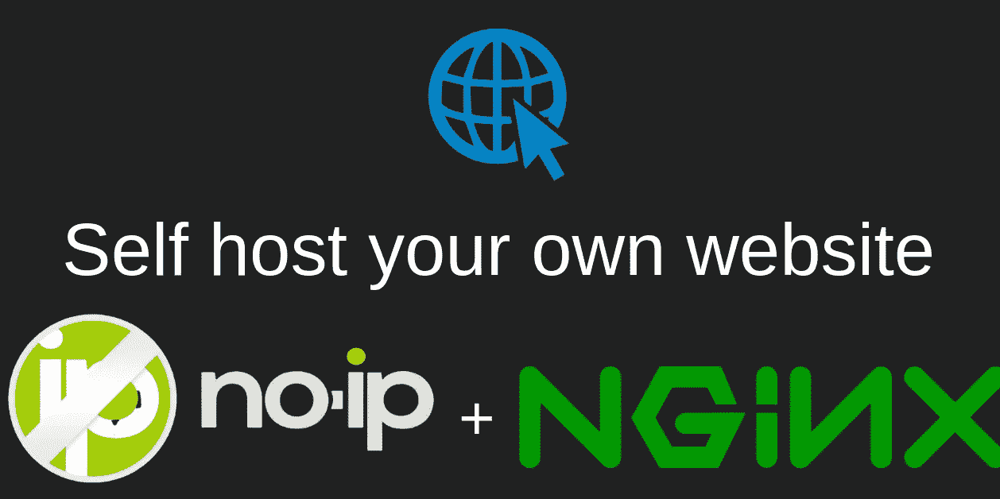

# 免费托管自己的网站

> 原文：<https://medium.com/quick-code/self-host-your-own-website-for-free-80b0d5e53357?source=collection_archive---------1----------------------->

## 在本文中，我将向您展示如何设置 Nginx 并使用 ddns 进行端口转发。

# 要求:

1.  托管网站的计算机或微型计算机
2.  电脑需要运行 Linux，看看我关于如何安装 Debian 服务器的教程…