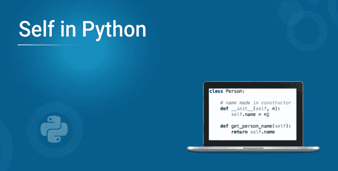
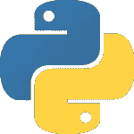

# Python 中的 self 有什么用？

> 原文：<https://medium.com/edureka/self-in-python-fb23ccc0c0bd?source=collection_archive---------0----------------------->



如果你正在使用 Python，那么“自我”这个词是不可避免的。它用于方法定义和变量初始化。每当我们定义一个方法时，self 方法都被显式地使用。在本文中，我们将按照以下顺序深入探讨 Python 中的自我:

*   Python 中的 self 有什么用？
*   Python 类自构造函数
*   Python 中的 self 是关键字吗？

# Python 中的 Self 有什么用？



self 用于表示类的实例。使用这个关键字，您可以在 python 中访问类的属性和方法。它将属性与给定的参数绑定在一起。我们使用 self 的原因是 Python 不使用' @ '语法来引用实例属性。在 Python 中，我们有一些方法可以自动传递实例，但不能自动接收。

**举例:**

```
**class** food():
# init method or constructor
**def** __init__(self, fruit, color):
self.fruit **=** fruit
self.color **=** color**def** show(self):
print("fruit is", self.fruit)
print("color is", self.color )apple **=** food("apple", "red")
grapes **=** food("grapes", "green")apple.show()
grapes.show()
```

**输出:**

```
Fruit is apple
color is red
Fruit is grapes
color is green
```

# Python 类自构造函数

self 也用于指类中的变量字段。让我们举个例子，看看它是如何工作的:

```
# name made in constructor
**def** __init__(self, John):
self.name **=** John**def** get_person_name(self):
**return** self.name
```

在上面的例子中，self 指的是整个 Person 类的 name 变量。在这里，如果我们在一个方法中有一个变量，self 将不起作用。该变量只在该方法运行时存在，因此是该方法的局部变量。为了定义整个类的全局字段或变量，我们需要在类方法之外定义它们。

# 自我是关键词吗？

self 用于不同的地方，通常被认为是一个关键字。但与 C++不同的是，self 在 Python 中并不是一个关键字。

self 是函数中的一个参数，用户可以使用不同的参数名来代替它。虽然建议使用 self，因为它增加了代码的可读性。

**举例:**

```
**class** this_is_class:
**def** show(in_place_of_self):
print("It is not a keyword "
"and you can use a different keyword")object **=** this_is_class()
object.show()
```

**输出:**

```
It is not a keyword and you can use a different keyword
It is not a keyword and you can use a different keyword
```

说到这里，我们的文章就到此为止了。我希望您理解了 self 的用法以及它在 Python 中是如何工作的。

如果你想查看更多关于人工智能、DevOps、道德黑客等市场最热门技术的文章，那么你可以参考 [Edureka 的官方网站。](https://www.edureka.co/blog/?utm_source=medium&utm_medium=content-link&utm_campaign=self-in-python)

请留意本系列中的其他文章，它们将解释 Python 和数据科学的各个方面。

> *1。*[*Python 中的机器学习分类器*](/edureka/machine-learning-classifier-c02fbd8400c9)
> 
> *2。*[*Python Scikit-Learn Cheat Sheet*](/edureka/python-scikit-learn-cheat-sheet-9786382be9f5)
> 
> *3。* [*机器学习工具*](/edureka/python-libraries-for-data-science-and-machine-learning-1c502744f277)
> 
> *4。* [*用于数据科学和机器学习的 Python 库*](/edureka/python-libraries-for-data-science-and-machine-learning-1c502744f277)
> 
> *5。*[*Python 中的聊天机器人*](/edureka/how-to-make-a-chatbot-in-python-b68fd390b219)
> 
> *6。* [*Python 集合*](/edureka/collections-in-python-d0bc0ed8d938)
> 
> *7。* [*Python 模块*](/edureka/python-modules-abb0145a5963)
> 
> 8。 [*Python 开发者技能*](/edureka/python-developer-skills-371583a69be1)
> 
> *9。* [*哎呀面试问答*](/edureka/oops-interview-questions-621fc922cdf4)
> 
> *10。* [*一个 Python 开发者的简历*](/edureka/python-developer-resume-ded7799b4389)
> 
> *11。*[*Python 中的探索性数据分析*](/edureka/exploratory-data-analysis-in-python-3ee69362a46e)
> 
> *12。* [*蛇与蟒蛇的游戏*](/edureka/python-turtle-module-361816449390)
> 
> *13。* [*Python 开发者工资*](/edureka/python-developer-salary-ba2eff6a502e)
> 
> *14。* [*主成分分析*](/edureka/principal-component-analysis-69d7a4babc96)
> 
> *15。*[*Python vs c++*](/edureka/python-vs-cpp-c3ffbea01eec)
> 
> *16。* [*刺儿头教程*](/edureka/scrapy-tutorial-5584517658fb)
> 
> *17。*[*Python SciPy*](/edureka/scipy-tutorial-38723361ba4b)
> 
> *18。* [*最小二乘回归法*](/edureka/least-square-regression-40b59cca8ea7)
> 
> *19。* [*Jupyter 笔记本小抄*](/edureka/jupyter-notebook-cheat-sheet-88f60d1aca7)
> 
> *20。* [*Python 基础知识*](/edureka/python-basics-f371d7fc0054)
> 
> *21。* [*Python 模式程序*](/edureka/python-pattern-programs-75e1e764a42f)
> 
> *22。* [*用 Python 进行网页抓取*](/edureka/web-scraping-with-python-d9e6506007bf)
> 
> 23。 [*Python 装饰器*](/edureka/python-decorator-tutorial-bf7b21278564)
> 
> *24。*[*Python Spyder IDE*](/edureka/spyder-ide-2a91caac4e46)
> 
> *25。* [*在 Python 中使用 Kivy 的移动应用*](/edureka/kivy-tutorial-9a0f02fe53f5)
> 
> 26。 [*十大最佳学习书籍&练习 Python*](/edureka/best-books-for-python-11137561beb7)
> 
> *27。* [*机器人框架与 Python*](/edureka/robot-framework-tutorial-f8a75ab23cfd)
> 
> 28。[*Python 中的贪吃蛇游戏*](/edureka/snake-game-with-pygame-497f1683eeaa)
> 
> *29。* [*Django 面试问答*](/edureka/django-interview-questions-a4df7bfeb7e8)
> 
> 30。 [*十大 Python 应用*](/edureka/python-applications-18b780d64f3b)
> 
> *31。*[*Python 中的哈希表和哈希表*](/edureka/hash-tables-and-hashmaps-in-python-3bd7fc1b00b4)
> 
> *32。*[*Python 3.8*](/edureka/whats-new-python-3-8-7d52cda747b)
> 
> *33。* [*支持向量机*](/edureka/support-vector-machine-in-python-539dca55c26a)
> 
> *34。* [*Python 教程*](/edureka/python-tutorial-be1b3d015745)

*原载于 2019 年 10 月 3 日*[*https://www.edureka.co*](https://www.edureka.co/blog/self-in-python/)*。*