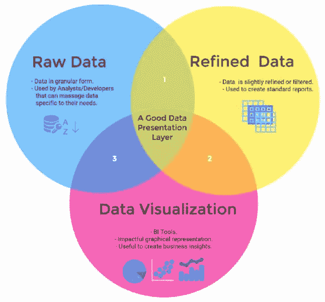
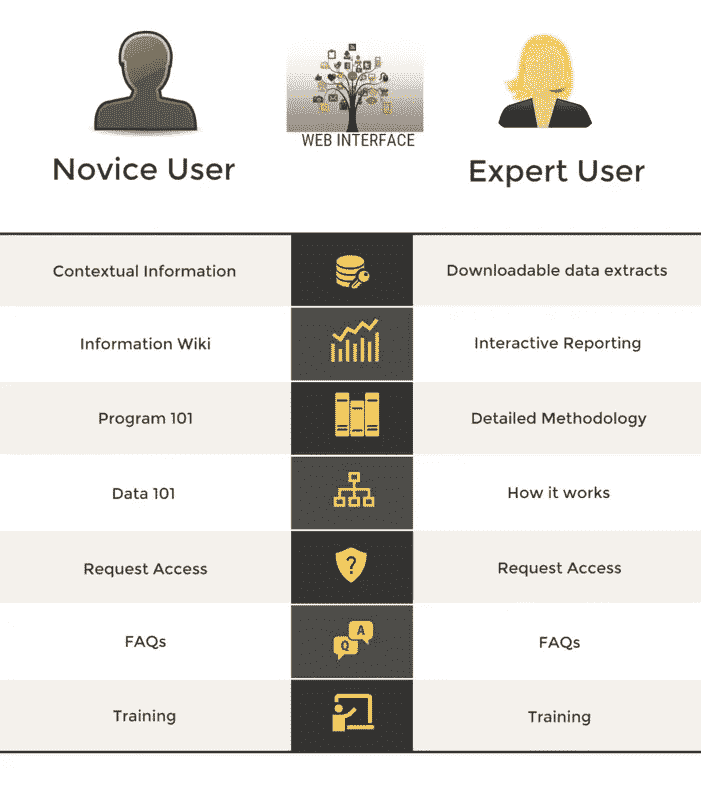

# 自助服务数据接口

> 原文：<https://medium.com/capital-one-tech/self-service-data-interfaces-8a9b605f2b3d?source=collection_archive---------3----------------------->

在当今世界，技术类似于数据。网飞、优步和 LinkedIn 是利用数据和技术之间共生关系的公司的恰当例子。这些公司越来越依赖数据来做出战略决策，从招聘到预算分配，再到日常运营管理。每个客户接触点都被数字化并记录下来以供分析。同样，作为基于信息的决策的先驱，Capital One 投入巨资积累大量数据，以便为其业务的多个方面提供信息。

然而，没有被有效利用的数据和不存在的数据一样好。例如，组织内的业务部门可能会投入分析师时间从其企业数据仓库收集数据，执行数据分析以解决业务问题。这项工作和分析的结果通常保持在该业务线的范围内。通常情况下，公司内的另一条业务线可能想要执行相同的分析；但是在没有信息 wiki/知识库的情况下，他们必须从头开始，导致相同的工作重复多次。

如果通过具有搜索功能的标准化表示层来整合、处理和呈现常用的分析数据，则重复和多余的工作会显著减少。组织通常非常注重简化和集中数据的积累和存储。通常在演示和交付方面的投入要少得多。要真正利用分析的力量，项目中使用的数据/工具需要通过创建高效的呈现/消费层来实现成熟，这些层不仅可以为直接用户提供信息的可视化表示，还可以作为更广泛的企业社区的自助服务层。

# **消费数据呈现的三个层次**

传统上，数据以三种方式呈现以供消费:

> 1.基本级别是可以按原样使用的实际原始数据，并且是最细粒度的形式。这对于寻求更大灵活性的分析师和开发人员来说很有用，他们可以根据自己的需要调整数据。
> 
> 2.第二级表示涉及到对数据进行一些细化，以便可以在可重复的过程中使用，比如标准报告。
> 
> 3.最后，最高级别的表示是可视化和商业智能，包括可视化地表示数据以生成商业见解。

一个高效且设计良好的表示层必须满足这三种需求。因此，数字驱动的组织必须考虑所有三个级别的数据呈现的含义及其消费需求。

# **投资解决方案以降低复杂性**

数字化需要对云和企业技术能力进行合理投资。这些技术投资可能因数据中心、平台即服务模型、数据库、软件、工具等而异。这些投资的幕后成本数据通常是复杂的、分离的，并且局限在单个业务线内。因为随着这些投资的增长，每个业务部门都需要维持复杂的技术成本结构，以及跨越其内部和云平台的足迹。具有标准化分析框架和表示层的集成企业级技术成本数据仓库可以为领导者了解和衡量成本创造巨大的价值。

Capital One 内部的一项此类努力是技术成本转换。该计划的目标是整合和简化技术成本数据的收集、存储和呈现，同时创建标准化的分析能力，以实现透明高效的成本管理。从各个业务线数据源收集了成本丰富的数据存储库，财务管理工具对成本模型进行评分，以处理数据和相关财务信息。为了使来自不同来源的如此大量的已处理数据可供使用，该 web 界面被设计为创建一个标准化的表示层，以满足上述所有三种数据消费需求。

# 满足数据呈现需求

构建为网络接口的数据表示层可以方便地访问数据和程序信息。因此，网站上的内容流是基于成本转换计划的发展而设计的。该应用托管在我们的云环境中，创建所需的用户层，以便轻松访问我们的标准报告和数据套件。每个页面都被设计成数据的信息维基。

我们认识到，不是每个需要访问这些数据的人都是分析师或技术专家；因此，创建这些页面是为了向更广泛的、不太专业的观众传达节目故事。熟悉该程序的用户可以浏览交互式报告和可下载的数据文件。或者，该计划的新成员可以在使用数据之前简单地浏览自助服务页面以获取上下文信息。

我们的总体目标是创建自助服务功能，以满足具有不同技能和独特数据需求的所有受众的需求。这种表示层风格是我们使数据访问简单有效的解决方案。数据交付和表示与数据的精简和集中积累和存储一样重要。我们认为，可访问的自助式数据层可以激发人们的兴趣，增加数据的活跃度。

# 结论

简而言之，收集数据只是将数据纳入商业计划的第一步。为数据呈现创建服务层可以创建广泛的可用性。广泛的可用性可以带来更好的分析。更好的分析可以带来更好的决策。更好的决策可以增加组织的成功。在 Capital One，我们致力于最大化我们旅程中的每一层数据。

要了解更多关于 Capital One 的 API、开源、社区活动和开发人员文化的信息，请访问我们的一站式开发人员门户网站 DevExchange。