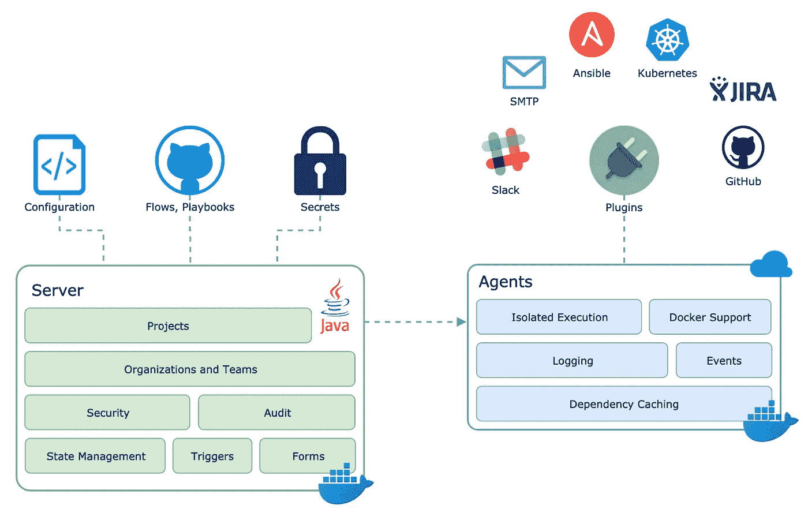
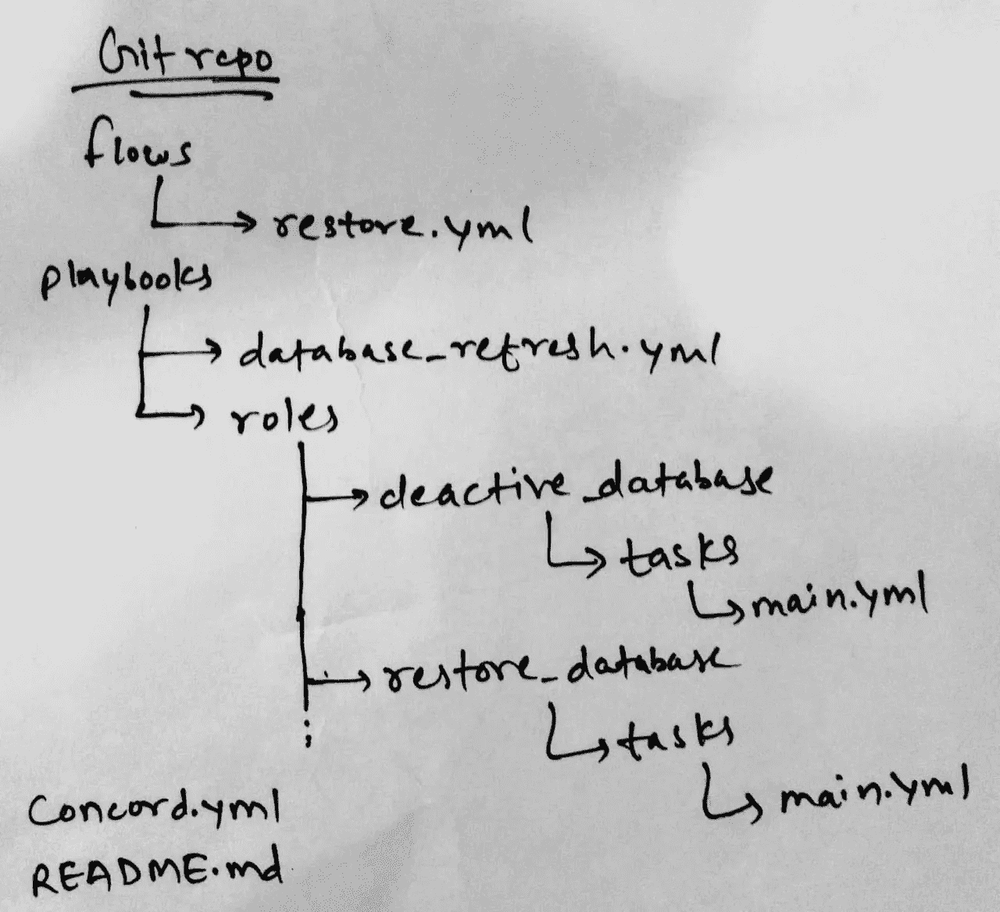
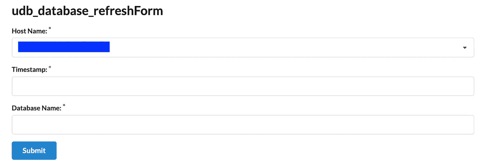

# 自助服务:DB2 数据库使用 Concord 自动恢复

> 原文：<https://medium.com/walmartglobaltech/self-service-db2-database-restores-automated-using-concord-cea1bc0930d6?source=collection_archive---------5----------------------->

## 在沃尔玛实验室，我们学习最新的技术，比如沃尔玛自己的 Concord，并尝试将我们的知识应用于自动化频繁耗时的活动，从而在许多方面节省时间和人力。

Database Restore — Just a hit away (Image Credit [restore image](https://www.google.com/search?biw=1268&bih=686&tbm=isch&sa=1&ei=GTZaXePQJY3I5gLp_acg&q=restore&oq=restore&gs_l=img.3...766.766..1068...0.0..0.0.0.......0....1..gws-wiz-img.MDxSoHs3guo&ved=0ahUKEwijwYGgnI7kAhUNpFkKHen-CQQQ4dUDCAY&uact=5#imgrc=-LQ4Dj1ew0M_pM:))

用例:容量和性能测试(VPT)是一个普遍的问题。对于我们环境中的 TRIRIGA 应用程序，应用程序团队执行 VPT 测试来测试不同的模块，其中软件受到大量数据的影响。需要有一个强大的 VPT 实践，以确保生产系统设置为在峰值水平执行。

Source: [giphy](https://giphy.com/gifs/awesomenesstv-lol-comedy-xUA7aRBOcImI6JNyF2?utm_source=iframe&utm_medium=embed&utm_campaign=Embeds&utm_term=https%3A%2F%2Fcdn.embedly.com%2Fwidgets%2Fmedia.html%3Fsrc%3Dhttps%3A%2F%2Fgiphy.com%2Fembed%2FxUA7aRBOcImI6JNyF2%2Ftwitter%2Fiframe&%3Burl=https%3A%2F%2Fmedia.giphy.com%2Fmedia%2FxUA7aRBOcImI6JNyF2%2Fgiphy.gif&%3Bimage=https%3A%2F%2Fi.giphy.com%2Fmedia%2FxUA7aRBOcImI6JNyF2%2Fgiphy.gif&%3Bkey=a19fcc184b9711e1b4764040d3dc5c07&%3Btype=text%2Fhtml&%3Bschema=giphy)

如果测试不成功或不符合预期怎么办？然后，应用程序团队需要系统恢复到测试前的状态，并在 DBA 的帮助下从以前备份的映像执行数据库恢复。

如果该活动需要一天执行两次，对于 DBA 来说，意味着一天内完成了所有工作。下一步做什么？我们分析了 DBA 支持任务的月度报告，每月有 20 多个恢复请求，每个 400–500 GB 的恢复需要大约 2–2.5 小时才能完成，同样，这可能会因您的数据库大小和网络备份服务器的网络吞吐量而异。所以，每个月我们都要花 40 多个小时在这个活动上。

*提示:报告是识别支持工作的自动化活动或任务的最佳方式。就我而言，我现在正在使用吉拉和服务。我们可以每周或每月获取报告，并找出频繁且可以自动化的活动。*

解决方案:为了消除重复的数据库恢复，DBA 提出了基于表单的 [Concord](https://concord.walmartlabs.com/overview/index.html) 自动化。此外，它与#Slack 和吉拉集成，用于通知和报告目的，甚至可以用于但不限于部署、安装和访问请求。

此外，您可以将使用限制到特定的用户组或 LDAP 组，这些用户或 LDAP 组只能运行流，并且可以通过设置服务器限制为特定的服务器运行流。

Workflow

开始您的第一个项目:**DB2 数据库恢复的手动工作包括备份配置文件、强制应用程序连接、停用数据库以及从磁带或磁盘恢复它。这些步骤需要由 DBA 执行，所以我们的想法是使用 Github repository 创建 concord 项目，将这些手动步骤自动化为自助形式，这样任何人都可以运行 [URL](/api/v1/org/{orgName}/project/{projectName}/repo/{repoName}/start/{entryPoint}) (显然我们需要对最终用户和服务器进行一些限制)并一次性执行恢复。**

***经验:在你开始第一个项目之前，建议为你手动执行的每一步创建操作手册，以节省时间，提高编码效率和可重用性。***

**以下是创建基于表单的流程的步骤:**

1.  **为你的项目创建一个 Git 库:你需要在 repo 中创建 concord.yml 的第一个文件，它将包含 Slack、吉拉等插件的依赖和配置代码。**

**Concord File**

**2.下一个文件将是流，例如流目录下的 restore.yml，我们需要在这里定义表单和流(EntryPoint: db_restore ),它们将通过 URL 调用。**

**Form definition and entry point**

**3.现在，我们需要写剧本和角色，我们需要调用它。而且，行动手册将使用这些角色来执行所需的任务，以执行数据库刷新活动。**

**Ansible Playbook**

**角色就像我们编程中的函数，可以在剧本中调用来执行某些任务。角色的概念很简单；它是一组存储在标准文件结构中的变量、任务、文件和处理程序。 **restore_database** 角色的示例代码。**

**Ansible Role Explamle**

**Git repo 目录结构如下所示:**

****

**Git Repo Structure**

**4.在 concord 服务器上创建 Key，并在 concord 和我们在上述步骤中创建的 Github repo 之间建立 SSH 连接。导航到*组织* → *默认*组织→ *机密*；并在 concord 中创建了新的 secret，用户界面显示了生成的公钥(以 ssh-rsa 开头),需要添加到 git 存储库的*设置——部署密钥*部分。**

**5.[创建项目](https://concord.walmartlabs.com/docs/getting-started/projects.html):导航至组织→默认组织→项目。提供项目的名称，在 Repositories 选项卡下，添加一个存储库，并为您的存储库命名。在 custom authentication 按钮下，添加在上述步骤中创建的密码。**

*   **在 *URL* 字段中存储库的 SSH URL，例如`git@github.com:me/myrepo.git`；**

**6.最终用户流:用户可以在浏览器中点击 URL，concord 将启动后台进程，该进程将启动一个表单，其中包含用户需要输入的必填字段，以便开始活动。这里是 URL 格式:API/v1/org/{ orgName }/project/{ project name }/repo/{ repo name }/start/{ entry point }。例如/API/v1/org/ **默认**/project/**UDB**/回购/ **协和 _ 回购** /start/ **db_restore****

**{orgName} —默认或另一个组织名称(如果已创建)。**

**{项目名称} —在步骤 5 中创建的项目名称。**

**{repoName} —我们在 concord 中给出的 Repo 名称，不要记住我们在 Github 中创建的名称。**

**{entryPoint} —我们在表单中创建的流。例如，我们的案例是 db_restore(参考步骤 2)。**

****

**Concord Form: End-user will select a server from the drop-down and put required details.**

****结论**:试试沃尔玛的 concord，为各种用例构建惊人的自动化和部署。我们已经在各种用例中使用它，如数据库恢复、二进制文件安装、访问请求、数据库活动，以提高性能，但它不仅限于这些活动。Concord 是一个编排工具，可用于部署和持续部署平台支持工具，如 Ansible、托管容器、Looper、Slack、吉拉等。**

****参考文献:****

** [## 沃尔玛实验室

### 沃尔玛实验室有 30 个可用的仓库。在 GitHub 上关注他们的代码。

github.com](https://github.com/walmartlabs/)  [## 协和|协和

### Concord 是一个工作流服务器。

concord.walmartlabs.com](https://concord.walmartlabs.com/)  [## 入门— Ansible 文档

### 作为一个高级主题，Ansible 不仅仅需要通过 SSH 远程连接。传输是可插拔的，而且…

docs.ansible.com](https://docs.ansible.com/ansible/latest/user_guide/intro_getting_started.html)  [## 你好世界

### Hello World 项目是计算机编程中历史悠久的传统。这是一个简单的练习，让你…

guides.github.com](https://guides.github.com/activities/hello-world/)**