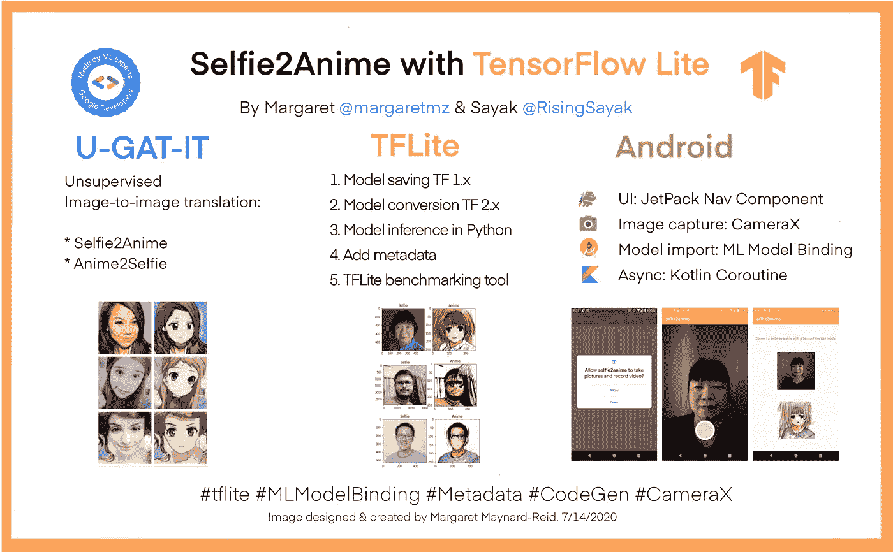

# 带 TFLite 的 self ie 2 动画第 1 部分:概述

> 原文：<https://medium.com/google-developer-experts/selfie2anime-with-tflite-part-1-overview-f97500800ffe?source=collection_archive---------3----------------------->

## 艺术与设计的人工智能

由 ML GDEs[Margaret Maynard-Reid](https://twitter.com/margaretmz)和 [Sayak Paul](https://twitter.com/RisingSayak) 撰写|由 [Khanh LeViet](https://twitter.com/khanhlvg) 和 [Hoi Lam](https://twitter.com/hoitab) 审阅

这是一个端到端教程的第 1 部分，介绍如何将 TF 1.x 模型转换为 TensorFlow Lite (TFLite ),然后将其部署到一个 Android 应用程序，以将自拍图像转换为可信的动画。

本教程分为三个部分，您可以随意跟随端到端教程，或者跳到您最感兴趣或最感兴趣的部分:

*   [**Part 1**](/@margaretmz/selfie2anime-with-tflite-part-1-overview-f97500800ffe) :使用 TensorFlow Lite(这一个)的 Selfie2Anime 项目概述及介绍。
*   [**第二部分**](/@margaretmz/selfie2anime-with-tflite-part-2-tflite-model-84002cf521dc) :如何创建一个`SavedModel`然后转换成 TFLite 模型。模型保存步骤在 TensorFlow 1.14 运行时执行，其中编写了模型代码，尽管同样的方法可以应用于用 **TensorFlow 1.x** 编写的大多数模型。模型转换步骤在 **TensorFlow 2.x** 运行时中执行，以便利用 TFLiteConverter 中的最新功能。
*   [**第三部分**](/@margaretmz/selfie2anime-with-tflite-part-3-android-app-e47f8a2c92b2) :将 TFLite 模型部署到 Android 应用程序中。

E2E Tutorial: Selfie2Anime with TensorFlow Lite

# 教程目标

本端到端教程的目标如下:

*   为希望使用最新(v2)转换器的新功能(例如，MLIR 转换器、更多支持的 ops 和改进的内核等)将 TensorFlow 1.x 中编写的模型转换为其 TFLite 变体的开发人员提供参考。
*   了解如何使用 TFLite 工具，如 Android 基准工具、模型元数据和 Codegen。
*   利用 Android Studio 的 ML 模型绑定特性，指导开发人员如何轻松创建具有 TFLite 模型的移动应用程序。

请在 GitHub [这里](https://github.com/margaretmz/selfie2anime-with-tflite/tree/master/android)跟随**型号保存/转换**的 [Colab 笔记本](https://github.com/margaretmz/selfie2anime-e2e-tutorial/blob/master/ml/Selfie2Anime_Model_Conversion.ipynb)和 **Android** 代码。如果您不熟悉 **SavedModel** 格式，请参考 [TensorFlow 文档](https://www.tensorflow.org/guide/saved_model)了解详情。

# u**GAT-IT**

我们使用了本文提出的生成对抗网络(GAN)模型 [**无监督生成注意网络，采用自适应层实例归一化进行图像到图像的翻译**](https://arxiv.org/abs/1907.10830) (也称为 U-GAT-IT)。该论文提供了两个生成器:一个将自拍转换为动漫风格的图像，另一个从动漫转换为自拍。这里我们只实现了 Selfie2Anime 模型，因为它更类似于真实世界的场景。

# **限制**

来自 U-GAT 的 selfie2anime 模型-由于只包含女性人脸和动漫人脸的训练数据的偏差，它似乎只在女性人脸上表现良好。改进模型的一种方法是用具有跨种族、性别和年龄多样性的人脸图像来重新训练模型，例如 [Fairface](https://arxiv.org/abs/1908.04913) 数据集。我们将把它作为一个练习留给读者。

转换后的 TFLite 模型已量化，但 Android 上的 GPU 代表尚不支持该模型。因此，您可能会注意到模型推断中稍长的延迟。

尽管有这些限制，我们认为与每个人分享端到端流程以及我们面临的挑战仍然是非常有价值的。希望本教程的示例应用程序能够帮助您实现现实世界中的应用程序。

# 社区协作

本教程是 ML GDEs 和 TensorFlow Lite 团队通力合作的成果。这是 TensorFlow Lite 端到端教程系列的第一篇。查看[**awesome-TF lite**](https://github.com/margaretmz/awesome-tflite)**repo 获取 app 创意和即将推出的 E2E 教程。此外，您还可以在那里找到 TensorFlow Lite 模型、样本、教程、工具和学习资源的精彩列表。**

**我们要感谢 Khanh LeViet 和王陆(TensorFlow Lite 团队)、Hoi Lam (Android ML)和 Soonson Kwon ( ML GDEs Google 开发者专家计划)，感谢他们的合作和持续支持。**

**让我们从模型保存和转换开始。(教程 [**第二部分**](/@margaretmz/selfie2anime-with-tflite-part-2-tflite-model-84002cf521dc) **)****