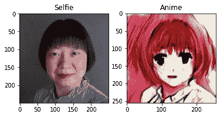
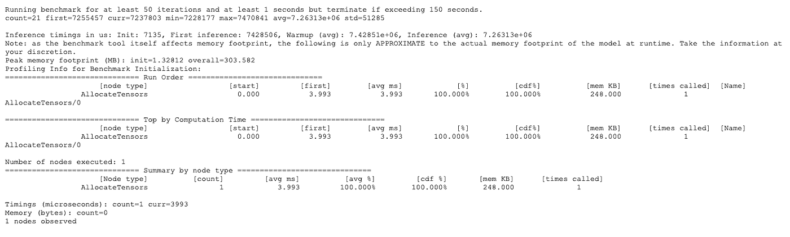

# 带 TFLite 的 self ie 2 动画第 2 部分:TFLite 模型

> 原文：<https://medium.com/google-developer-experts/selfie2anime-with-tflite-part-2-tflite-model-84002cf521dc?source=collection_archive---------2----------------------->

由 ML GDEs[Margaret Maynard-Reid](https://twitter.com/margaretmz)和 [Sayak Paul](https://twitter.com/RisingSayak) 撰写|由 [Khanh LeViet](https://twitter.com/khanhlvg) 和 [Hoi Lam](https://twitter.com/hoitab) 审阅

这是关于如何将 TF 1.x 模型转换为 TensorFlow Lite (TFLite)的端到端教程的第 2 部分，然后将其部署到 Android 上，以便将自拍图像转换为看似真实的动画。([Part 1](/@margaretmz/selfie2anime-with-tflite-part-1-overview-f97500800ffe)|[Part 2](/@margaretmz/selfie2anime-with-tflite-part-2-tflite-model-84002cf521dc)|[Part 3](/@margaretmz/selfie2anime-with-tflite-part-3-android-app-e47f8a2c92b2))本教程是 [awesome-tflite](https://github.com/margaretmz/awesome-tflite) 系列 E2E TFLite 教程的第一篇。

以下是逐步总结:

*   从预训练的 U-GAT-IT 模型检查点生成一个`SavedModel`。
*   使用最新的`TFLiteConverter`转换 SavedModel
*   使用转换后的模型在 Python 中运行推理
*   添加元数据以实现与移动应用的轻松集成
*   运行模型基准以确保模型在移动设备上运行良好

# 使用 TF1 保存模型—从预先训练的检查点创建保存的模型

请注意，该部分需要在 TensorFlow 1.x 运行时运行。我们使用 TensorFlow 1.14，因为这是编写模型代码的版本。

U-GAT-IT 作者提供了两个检查点:一个在 [50 个时期](https://drive.google.com/file/d/1V6GbSItG3HZKv3quYs7AP0rr1kOCT3QO/view?usp=sharing)后提取(约 4.6GB)，另一个在 [100 个时期](https://drive.google.com/file/d/19xQK2onIy-3S5W5K-XIh85pAg_RNvBVf/view?usp=sharing)后提取(4.7GB)。我们将使用 Kaggle 的一个更轻便的版本，适合基于移动的部署。

# 从 Kaggle 下载并提取模型检查点

所以，重要的事情先来！让我们用 [Kaggle API](https://github.com/Kaggle/kaggle-api) 从 Kaggle 下载检查点。在 kaggle.com 上，进入我的帐户/API，点击“创建新的 API 令牌”，这将触发 **kaggle** 的下载。json，包含您的 **API** 凭证。然后在 Colab 中，您可以指定以下内容并设置环境变量-

让我们下载检查点并提取它们-

**加载模型检查点，连接张量**

该步骤通常因型号而异。此步骤遵循的一般工作流程如下:

1.  定义模型的输入和输出张量。
2.  实例化模型并连接输入和输出张量，从而可以构建计算图。
3.  在模型图中加载预先训练的检查点。
4.  生成 SavedModel。

值得注意的是，该工作流程中的**步骤 2** 可能因型号而异，因此很难事先知道。对于这一节，我们将只关注理解代码的重要部分，对于完整的实现，请查看本教程附带的 C [olab 笔记本](https://github.com/margaretmz/selfie2anime-e2e-tutorial/blob/master/ml/Selfie2Anime_Model_Conversion.ipynb)。

在我们的例子中，输入和输出张量及其细节可以从主模型类的实例中访问。所以，我们将从实例化 UGATIT 模型类的实例开始-

`data`指型号配置，此处[可见](https://github.com/taki0112/UGATIT/blob/master/main.py)。`UGATIT`级来自这里的。此时，我们的模型应该已经被实例化了。现在我们需要通过加载检查点的会话将检查点加载到模型中，这就是`load_checkpoint()`方法所做的

此时，创建`SavedModel`只需要几次击键。记住我们仍然在`Session`的背景下。

正如我们在上面的代码中看到的，可以从模型图本身访问输入和输出张量。执行完这段代码后，我们应该已经准备好了`SavedModel`文件。我们可以继续将这个`SavedModel`转换成 TFLite 模型。

# 准备 TFLite 模型

是时候转向 TensorFlow 2.x (2.2.0 或任何更高的夜间版本)了。在这一节中，我们将使用我们之前生成的`SavedModel`，并将其转换为一个 TFLite 平面缓冲区，其大小约为 **10 MB** ，完全可用于移动应用程序。然后，我们将使用一些最新的 TensorFlow Lite 工具来准备部署模型:

*   使用 TFLite 模型在 Python 中运行推理，以确保它在转换后是好的。
*   通过 Android Studio 的 ML 模型绑定插件，向 TFLite 模型添加元数据，使其更容易集成到 Android 应用程序中。
*   使用基准测试工具来查看该模型在移动设备上的表现。

# 使用 TF2 将 SavedModel 转换为 TFLite

首先，我们加载保存的模型文件，并从它们中创建一个[具体函数](https://www.tensorflow.org/guide/concrete_function)

以这种方式进行转换的优点是，它使我们能够灵活地设置生成的 TFLite 模型的输入和输出张量的形状。你可以在下面的代码片段中看到这一点-

建议使用在相应地训练模型期间使用的输入和输出张量的原始形状。在这种情况下，该形状为(1，256，256，3)，1 表示批次维度。这是必需的，因为模型期望数据采用以下形式:BATCH_SIZE、IMAGE_SHAPE、IMAGE_SHAPE、NB_CHANNELS。为了进行实际的转换，我们运行以下代码-

除非我们为`converter`明确指定任何优化选项，否则模型仍然是浮动模型。您可以从[这里](https://www.tensorflow.org/lite/performance/model_optimization)探索 TFLite 中可用的不同优化选项。

# 使用 TFLite 模型运行推理

在转换之后和部署`.tflite`模型之前，在 Python 中运行推理来确认它是否按预期工作总是一个好的实践。

我们已经在一些人脸上尝试了该模型，结果表明它在女性人脸上比男性人脸上产生了更好的结果。仔细观察训练数据集，发现所有人脸都是女性人脸，并且模型存在偏差，因为模型只在女性人脸上训练。

以下是测试结果的屏幕:

# 向 TFLite 模型添加元数据

让我们向 TensorFlow 模型添加元数据，这样我们就可以在 Android 上自动生成模型推理代码。

**选项 A:通过命令行**

如果您通过命令行使用 Python 脚本添加元数据，请确保首先在 conda 或 virtualenv 环境中使用`pip install tflite-support`。并按如下方式设置文件夹结构:

然后使用 metadata _ writer _ for _ selfie 2 anime . py 脚本将元数据添加到 selfie2anime.tflite 模型中:

**选项 a B:通过 Colab**

或者，你可以用这个 [Colab 笔记本](https://github.com/margaretmz/selfie2anime-e2e-tutorial/blob/master/ml/add-meta-data-Colab/Add%20metadata%20to%20selfie2anime.ipynb)来代替。记得先还`$pip install tflite-support`。如果您不熟悉在命令行中运行 Python 脚本，这个选项可能更容易。你只需要在浏览器中启动笔记本，上传 selfie2anime.tflite 文件，执行所有单元格。

**添加元数据**

在`model_with_metadata`文件夹下创建了两个新文件`selfie2anime.tflite`和`selfie2anime.json`。这个新的`selfie2anime.tflite`包含模型元数据，在将模型部署到 Android 时，我们可以将它用作 Android Studio 中 ML 模型绑定的输入。而`selfie2anime.json`是让你验证加入模型的元数据是否正确。

要了解更多关于 TFLite 元数据如何工作的信息，请参考这里的文档。

# Android 上的性能指标评测模型(可选)

作为一个可选步骤，我们在部署之前使用了 TFLite Android 模型基准测试工具来获得 Android 上的运行时性能。详情请参考基准工具上的说明。

以下是高级汇总步骤:

*   配置 Android NDK/SDK——有一些 Android SDK/NDK 的先决条件，然后用 bazel 构建工具。
*   构建基准 apk

*   使用 adb (Android Debug Bridge)安装基准测试工具，并将 selfie2anime.tflite 模型推送到 Android 设备:

*   运行基准测试工具

我们看到的基准测试结果如下——有点慢:*美国的推理计时:Init: 7135，第一次推理:7428506，预热(平均):7.42851e+06，推理(平均):7.26313e+06*

现在您已经有了一个 TensorFlow Lite 模型，让我们看看如何在 Android 上实现这个模型([第 3 部分](/@margaretmz/selfie2anime-with-tflite-part-3-android-app-e47f8a2c92b2))。