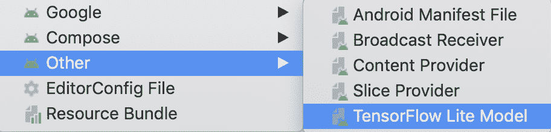
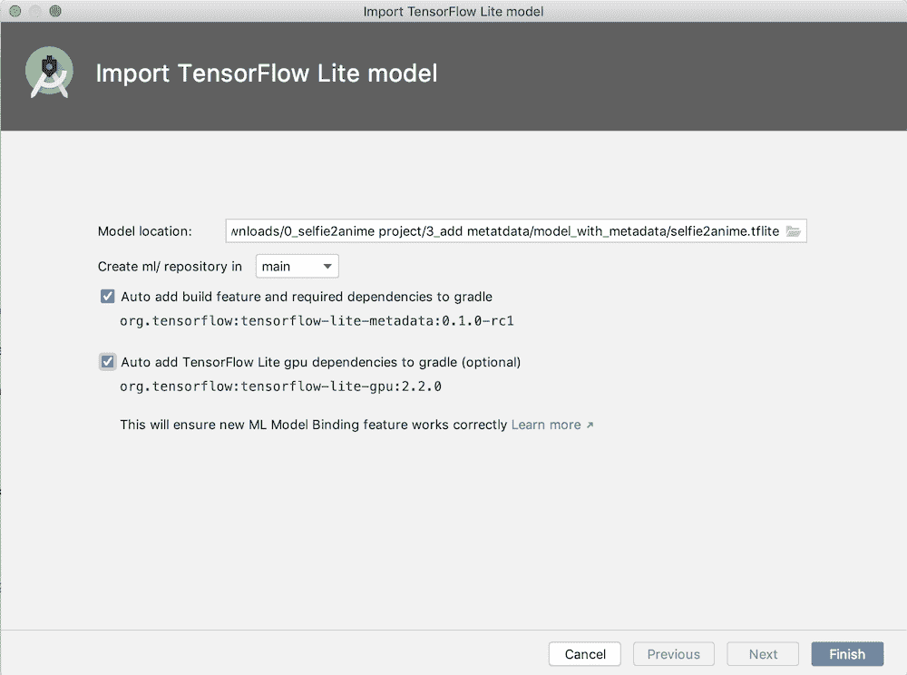
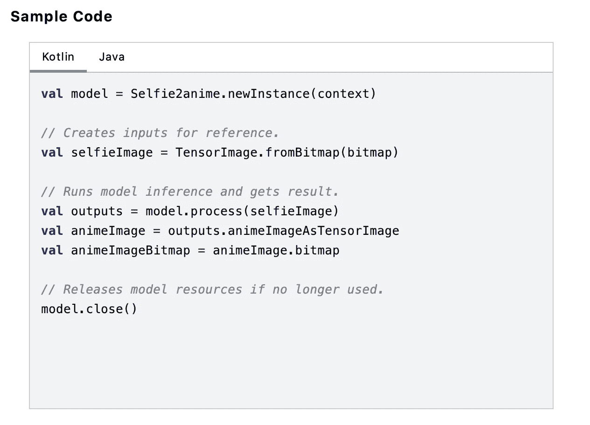
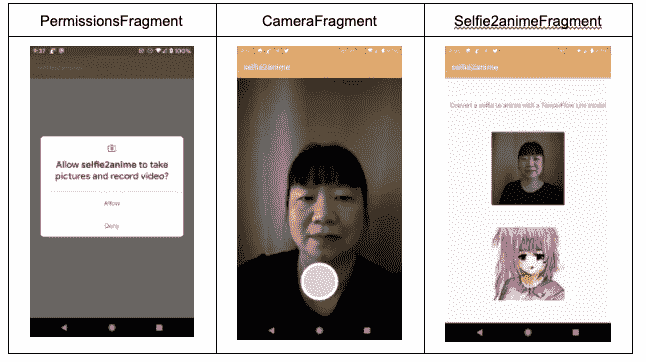

# 带 TFLite 的 Selfie2Anime 第 3 部分:Android 应用程序

> 原文：<https://medium.com/google-developer-experts/selfie2anime-with-tflite-part-3-android-app-e47f8a2c92b2?source=collection_archive---------4----------------------->

由 ML GDEs [撰写 Margaret Maynard-Reid](https://twitter.com/margaretmz) |由 [Sayak Paul](https://twitter.com/RisingSayak) 、 [Khanh LeViet](https://twitter.com/khanhlvg) 和 [Hoi Lam](https://twitter.com/hoitab) 审阅

这是一个端到端教程的第 3 部分，介绍如何将 TF 1.x 模型转换为 TensorFlow Lite (TFLite ),然后将其部署到 Android 上，以便将自拍图像转换为可信的动画。([Part 1](/@margaretmz/selfie2anime-with-tflite-part-1-overview-f97500800ffe)|[Part 2](/@margaretmz/selfie2anime-with-tflite-part-2-tflite-model-84002cf521dc)|[Part 3](/@margaretmz/selfie2anime-with-tflite-part-3-android-app-e47f8a2c92b2))本教程是 [awesome-tflite](https://github.com/margaretmz/awesome-tflite) 系列 E2E TFLite 教程的第一篇。

在第 2 部分中，我们得到了一个 TFLite 模型，现在我们准备将 selfie2anime.tflite 模型部署到 Android 上！Android 代码在 GitHub [这里](https://github.com/margaretmz/selfie2anime-with-tflite/tree/master/android/)。

以下是 Android 应用的主要特性:

*   **用于 UI 导航的 Jetpack 导航组件**
*   `**CameraX**`用于图像捕捉
*   **ML 模型绑定**用于导入 tflite 模型
*   **Kotlin 协程**用于模型推理的异步处理

下面是 TFLite 模型在 Android 上的逐步实现:

0.下载 Android Studio 4.1 预览版

1.创建一个新的 Android 项目并设置 UI 导航

2.为图像捕获设置`CameraX` API

3.用 ML 模型绑定导入 selfie2anime.tflite 模型。

4.将所有东西放在一起:

*   模型输入:用相机拍摄自拍图像
*   在自拍图像上运行推理并创建一个动画
*   在 UI 中显示自拍图像和动画图像
*   使用 Kotlin 协程防止模型推理阻塞 UI 主线程

**0。下载 Android Studio 4.1 预览版**

我们将安装 Android Studio Preview (4.1 Beta 1)，以便使用新的 **ML 模型绑定**功能来导入. tflite 模型和自动代码生成。您可以直观地探索 tfllite 模型，也可以在您的 Android 项目中直接使用生成的类。

在这里下载 Android Studio 预览[。您应该能够同时运行预览版和稳定版。确保将您的 Gradle 插件更新到至少 4.1.0-alpha10，否则 ML 绑定菜单可能无法访问。](https://developer.android.com/studio/preview)

**1。创建一个新的 Android 项目**

首先，让我们创建一个新的 Android 项目，该项目包含一个名为 MainActivity 的空活动，该活动包含一个伴生对象，该对象定义了存储图像(用 CameraX 捕获)的输出目录。

使用 Jetpack 导航组件在应用程序中导航。请参考我的教程[这里](/@margaretmz/android-ui-with-jetpack-nav-component-5ef46d9e0cfc)了解更多关于这个支持库的细节。

在这个示例应用程序中有 3 个屏幕:

*   PermissionsFragment —处理相机权限的检查
*   相机片段—处理相机设置和图像捕捉
*   自拍 2 动画片段—处理用户界面中自拍和动画图像的显示

nav_graph.xml 中的导航图将定义三个屏幕的导航以及 CameraFragment 和 Selfie2animeFragment 之间的数据传递。

**2。为图像拍摄设置 CameraX**

CameraX 是一个 Jetpack 支持库，它使得相机应用程序的开发更加容易。

Camera1 API 使用简单，但缺少很多功能。Camera 2 API 提供了比 Camera 1 更好的控制，但是它非常复杂——在一个非常基本的例子中有将近 1000 行代码。

另一方面，CameraX 更容易设置，只需十分之一的代码。此外，它具有生命周期意识，因此您不需要编写额外的代码来处理生命周期。

以下是为该示例应用程序设置 CameraX 的步骤:

*   更新`build.gradle`依赖关系
*   使用`CameraFragment.kt`保存 CameraX 代码
*   请求相机许可
*   更新`AndroidManifest.ml`
*   在`MainActivity.kt`中检查权限
*   用`CameraX`实现一个取景器`Preview`类
*   实现图像捕捉
*   捕捉图像并将其转换为`Bitmap`

一旦我们捕获了一个图像，我们将把它转换成一个`Bitmap`，我们可以把它传递给 TFLite 模型进行推理。导航到一个新的屏幕`Selfie2animeFragment.kt`，显示原始自拍和动画图像。

**3。导入 TensorFlow Lite 模型**

既然 UI 代码已经完成。是时候导入 TensorFlow Lite 模型进行推理了。ML 模型绑定很容易解决这个问题。在 Android Studio 中，进入**文件>新建>其他> TensorFlow Lite 模型。**

*   指定 selfie2anime.tflite 文件位置。
*   默认情况下，“自动将构建功能和所需的依赖项添加到 gradle”处于选中状态。
*   请确保同时选中“自动将 TensorFlow Lite gpu 依赖项添加到 gradle ”,因为 selfie2anime 模型非常慢，我们需要启用 GPU delegate。

这个导入做了两件事:

*   自动创建一个 *ml* 文件夹，并将模型文件 selfie2anime.tflite 文件放在该文件夹下。
*   在文件夹下自动生成一个名为`Selfie2anime.java`的 Java 类:app/build/generated/ml _ source _ out/debug/com/TF lite/selfie 2 anime/ml，该类将处理模型加载、图像预处理和后处理等所有任务，并运行模型推理将自拍图像转换为动漫图像。

导入完成后，我们会看到 selfie2anime.tflite 显示了模型元数据信息以及 Kotlin 和 Java 代码片段，我可以复制并粘贴这些代码片段来使用模型:

**4。将所有东西放在一起**

现在我们已经设置了 UI 导航，配置了 CameraX 进行图像捕捉，并且导入了 selfie2anime.tflite 模型，下面让我们将所有的部分放在一起！首先我们在*image capture 下的 CameraFragment.kt 中用 CameraX 捕捉一张自拍图像。。takePicture()* ，那么在 *onCaptureSuccess()* 中有一个返回的 ImageProxy。我们将 ImageProxy 转换成位图，然后保存到前面 MainActivity 中定义的输出目录中。

使用 JetPack nav 组件，我们可以轻松地导航到 Selfie2animeFragment，并将图像目录位置作为字符串参数传递。

然后在*self ie 2 animefragment . kt*中，检索存储自拍的文件目录字符串，创建一个图像文件，然后将其转换为位图，可以作为 tflite 模型的输入。

在自拍图像上运行模型推理，并创建一个动画。我们在 UI 中显示自拍图像和动画图像。

注意:推理需要相当长的时间，所以我们使用 Kotlin 协程来防止模型推理阻塞 UI 主线程。显示进度条，直到模型推理完成。

这是我们将所有的碎片拼在一起后得到的结果:

这就把我们带到了教程的结尾。我们希望您喜欢阅读它，并将您学到的知识应用到 TensorFlow Lite 的实际应用中。如果你用你在这里学到的创造了任何酷的样品，请记得把它添加到 [awesome-tflite](https://github.com/margaretmz/awesome-tflite) ！