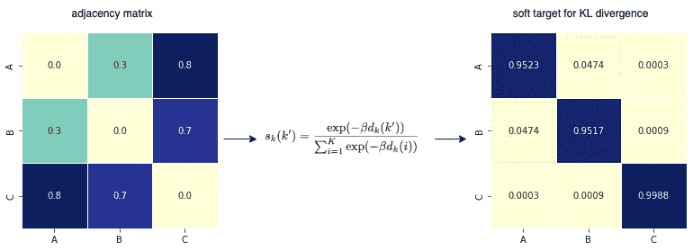
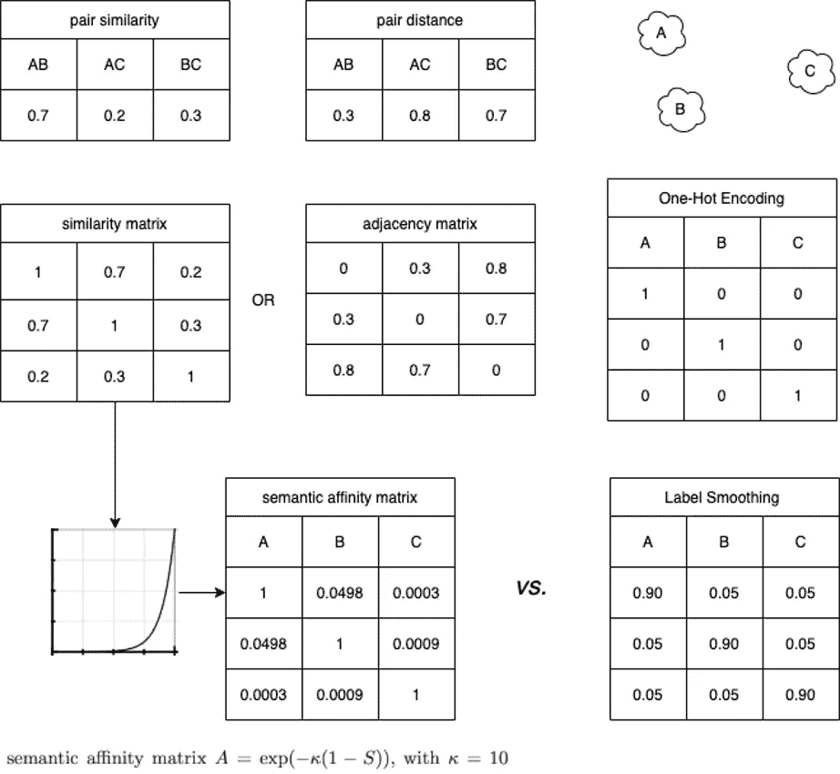
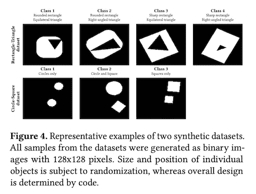
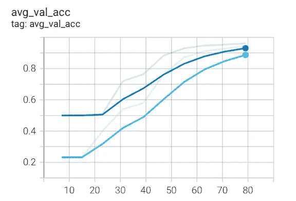
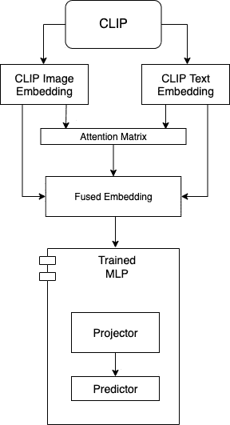
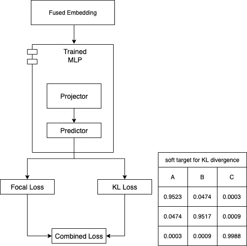

# 语义标签表示及其在多模态产品分类中的应用

> 原文：<https://medium.com/walmartglobaltech/semantic-label-representation-with-an-application-on-multimodal-product-categorization-63d668b943b7?source=collection_archive---------1----------------------->

Semantic Label Representation

**简介**

任何电子商务产品目录的核心是产品分类。准确的产品分类不仅对收入增长有影响，也是获得良好客户体验的关键。为了便于导航，产品类别的集合被组织在一个层次结构中，并且出现了一个正式定义的分类法。随着时间的推移，会添加新的类别，现有的类别会被分成更细粒度的类别。这种演变是自然发生的，因为客户更加重视密切相关类别的差异化。

我们现在处于这样一个阶段，类别的数量超过了数千，如果不是数万的话。客观地说，ImageNet-21K 代表了 21，000 个类，根据心理学家的估计，有超过 30，000 个视觉概念。最先进的机器学习模型已经证明，它可以达到超过人类的性能水平。

然而，研究[1]表明，尽管由于聪明的建模和数据改进，机器学习分类模型所犯的错误已经大大减少，但错误的严重程度没有太大变化。当错误确实发生时，顶级模型预测仍然令人尴尬地远离真实类别。为了解决这个问题，我们将首先退一步，从语义标签表示的角度提出一个合理的解释。然后，对于语义上有意义的产品类别组织，我们将制定两个创新的标签表示。接下来，我们将提出如何在优化多模态产品分类的背景下，借助语义标签表示来构建辅助目标。最后，我们将讨论实验结果，这些结果显示了产品分类在准确性以及更重要的顶部预测的语义相似性方面的显著改进。

**对语义标签表示的需求**

在有监督的多类训练中表示标签的一种便捷方式是通过一键编码(OHE)。使用 OHE，鼓励多类分类器在交叉熵损失的帮助下最大化真实类的概率。但是，类之间的内在相似性被忽略了，本质上每个类都被视为与任何其他类都没有关系的匿名类。结果，与未能区分语义相关的类别(例如，牛仔靴和雨靴)相关联的损失被惩罚到与未能区分不相关的类别(例如，靴子和 t 恤)相关联的损失完全相同的程度。这种成熟的方法已经得到完善，可以产生以最高精度衡量的高性能分类器，但代价往往是过于自信和/或不太通用。层次不可知或语义不可知的方法有这个基本缺陷，所以当它的输出错过了目标时，通常是严重错过了更大的点。

与 OHE 相反，标签平滑用概率分布来构建目标。真实的类将被给予加权分数 1-α，例如，α=0.1，并且剩余的权重α将被平均分配给每个其他类。这种纯数学策略已被用于许多最新的模型[2]，并在模型概括和校准[3]中显示出经验改进。在[2]中可以找到对这种方法及其实际好处的全面调查。然而，这种统一标签平滑的方法导致了关于相关类的实例之间的相似性的信息的丢失。

**语义标签表示的公式化**

标签是人类产生的信号，具有高度的语义和信息密度。此外，标签之间的相似性排序是人类可解释的，具有内在模糊性的空间。让我们看一个有三个类的简单例子，其中两个类 A 和 B 密切相关。把这些类想成 A)牛仔靴，B)雨靴，和 C) T 恤可能会有帮助。为了便于比较，我们根据 OHE(右上)和统一标签平滑(右下)显示了示例类的编码，其中图中α=0.1。

我们提出的第一个方法是建立在标签平滑概念上的。我们利用先验语义信息来对类别上的概率分布进行建模，从而使用反映类别之间相似性的概率权重来表示目标标签。具体来说，我们从成对相似性度量或等价的成对距离度量开始。然后，类的语义关系可以用相似矩阵或邻接矩阵来表示，两者都是对称的，前者的对角元素都是 1，后者的对角元素都是 0。类似于[4]中提出的语义相似度矩阵，我们可以从相似度矩阵构造标签表示，如图所示。归一化后，每个类的概率之和为 1，生成的标注表示看起来像非均匀标注平滑。

另一个例子显示了我们如何从邻接矩阵中导出标签表示。这种转变类似于在知识提炼公式中如何构建软目标，在这种公式中教师的逻辑被软化。使用 Kullback-Leibler (KL)散度损失来确保学生逻辑的分布与教师逻辑的分布相似。在下一节中，我们将讨论如何将标签表示用作软目标，作为优化多模态产品分类的一部分。

Semantic Label Representation

如果我们第一个提出的方法旨在编码标签表示中的语义相似性，我们第二个提出的方法是设计捕捉特征相似性的标签表示。为了推动这种方法，我们将描述一个使用来自[5]的合成数据集的实验。其核心思想是使用多标签分类来保持密切相关的标签之间的语义关系。

具有四个类的第一个合成数据集以在类之间共享细粒度特征的方式生成。例如，1 班和 2 班都有圆角矩形，1 班和 3 班都有等边三角形，等等。事实上，两对类(类 1 和 4，类 2 和 3)没有共享任何特征，而其他每对都有一些特征共享。多类分类器可以在没有关于类之间相似性的先验信息的情况下被训练。然而，给定已知的共享特性，我们可以使用二进制代码来表示每个类，这样共享一个特性的类将具有对应特性的相同值编码。

*   类别 1: [1，0，1，0]
*   第二类:[1，0，0，1]
*   类别 3: [0，1，1，0]
*   第 4 类:[0，1，0，1]

四个类别的标签被有效地二进制化，并且多类别任务被多标签任务代替。鼓励经训练的多标签分类器学习潜在的特征，潜在地汇集共享共同特征的训练样本。我们比较了相似性通知多标签分类器和多类分类器的性能。多标签分类器(下图中的上部曲线)在验证准确性和学习效率方面略有优势。直觉是，如果我们能够以某种方式将类别共享的共同特征编码在标签表示中，多标签方法比多类别分类器收敛得更快，并且产生更好的分类器。

Multi-label vs. Multi-class (solid lines are TensorBoard smoothed plots of the actual data in gray lines)

我们对第二个合成数据集进行了类似的实验，发现了一致的结果。此外，我们故意分配了“错误的”二进制编码，使得标签表示与共享特征相矛盾。正如可能已经预料到的，我们观察到多标签分类器的性能比基线多类分类器的性能差。这表明，我们提出的第二种方法取决于二值化标签表示正确地捕捉相关类之间的先验语义关系。对于具有大量类别的产品分类应用来说，构造精确捕获特征相似性的二进制代码被证明是不切实际的。我们已经决定把这个留给将来的研究。

**在多模态产品分类上的应用**

让我们把注意力转移到产品分类的应用上。我们的语义不可知基线模型使用 OpenAI 的剪辑编码器[6]来获得产品图像和产品标题的嵌入，将这两种嵌入与注意力层融合，并训练一个微调网络。

为了将我们提出的使用语义标签表示的方法与基线模型进行比较，我们将冻结剪辑编码器，并且仅训练由多层感知器(MLP)组成的微调层。我们还将焦点损失[7]用于多类损失，以解决不平衡的训练数据。

Baseline model for multimodal product categorization

对于我们提出的语义标签平滑方法，我们使用产品类别名称的剪辑嵌入来构建软目标。对于标签是自然单词的特殊情况，基于标签的剪辑嵌入之间的余弦相似性，使用其前 20 个最近的邻居来软化每个标签。我们将多类损失的焦点损失与 logits 和软目标之间的 KL 损失相结合，我们的训练目标是最小化这种结合损失。

Multimodal product categorization with semantic label smoothing

**实验结果**

我们的训练数据集包含 4，350 个产品类别的近 1，200 万个项目。数据集经过数据清理过程，以移除重复项目以及标题和图像不一致的项目。产品类别标签是手动整理的，有些来自众包，有些由我们的店内员工制作。众所周知，数据集相当不平衡，但仍然代表了目录中的产品类别分布。

接下来，我们使用以下方法之一来训练产品类别分类器，以实验语义标签平滑:

1.  OHE(基线模型)
2.  α=0.1 的统一标签平滑(语义不可知)
3.  前 20 个最近邻的α=0.1 的统一标签平滑(语义感知)
4.  基于前 20 个最近邻居的语义相似度的标签平滑(语义感知)
5.  将方法 4 与课程学习相结合(语义感知)

为了在语义不可知模型和语义标签平滑模型之间进行比较，我们将如下控制软标签表示中的权重:

明确地说，语义不可知模型包括前两种方法，第一种方法是我们的基线模型。包括第二种方法(具有均匀标签平滑以及 KL 损失)的原因是为了确定有多少改进可能是由于均匀标签平滑。有必要对权重的增量变化进行实验，保持训练机制不变，以便彻底理解归因于语义感知标签表示的改进。此外，最后一种方法使用课程学习[8]来强化培训过程中的目标。这种技术与初始标签表示的选择是正交的，并且我们仅将它与第四种方法(基于语义相似性的标签平滑)相结合，以探索课程学习的潜在益处。

每个产品类别分类器都将根据由大约 10，000 个样本组成的保留验证数据集进行测试。除了前 1 名和前 5 名的准确性之外，我们还将测量有多少最高预测落在基本事实标签的前 20 个最近邻内。当预测偏离目标时，这是分类错误严重性的简单度量。在[9]和[10]中可以找到对分级损失指标需求的详细分析，我们在这里不讨论。

表 1 总结了与基线模型相比，前 1 名和前 5 名精度的改进。语义感知方法#3 具有最好的性能。令人惊讶的是，语义不可知的方法#2 具有第二好的性能。具有课程培训的语义感知方法#5 具有最佳的前 5 名性能。

Table 1: Improvement of Top-1 and Top-5 Accuracies

表 2 显示了落在基本事实标签的前 20 个最近邻内的顶部预测的数量。例如，基线模型只有 1.55%的项目的所有前 5 个预测都与基本事实标签的前邻居重叠，平均而言，前 5 个预测中只有 2.25 个落在该范围内。该度量表明，语义感知方法#4，我们提出的语义标签平滑方法的最接近的实现，是最好的模型，其中前 5 个预测中的 4.05 个落在基本事实标签的接近范围内；语义感知方法#3 是方法#4 的近似，具有统一的标签平滑，是第二好的模型。

Table 2: Number of Top Predictions as Close Neighbors of the True Label

基于这些结果，从语义标签表示的角度推荐语义感知方法#4(基于前 20 个最近邻居的语义相似性的标签平滑)。当与另一个具有最佳 top-1 准确性的模型一起使用时，它有助于在准确性和 top 预测的语义相似性之间取得平衡。另一个要点是，语义感知方法#3(对于前 20 个最近的邻居，α=0.1 的统一标签平滑)似乎是方法#4 的一个很好的近似。当由于分类法中的模糊性而面临量化语义关系的挑战时，我们可以依靠密切相关的产品类别的定性知识，并确定最近的邻居，而不必按照绝对的接近顺序对它们进行排序。在这种情况下，语义感知方法#3 允许我们充分利用语义标签表示。

# 确认

没有[亚历山德罗·](https://www.linkedin.com/in/alemagnani/)、[、](https://www.linkedin.com/in/mingsunee/)和[泽普·张](https://www.linkedin.com/in/zpz/)的支持，这项工作是不可能完成的。特别感谢 [Brian Seaman](https://www.linkedin.com/in/brian-seaman-78710a25/) 对沃尔玛全球技术中心新兴技术应用的指导。

**参考文献**

1.  《犯更好的错误:利用深层网络的阶级阶层》*IEEE/CVF 计算机视觉和模式识别会议论文集*。2020.
2.  米勒、拉斐尔、西蒙·科恩布鲁斯和杰弗里·辛顿。“标签平滑何时有帮助？”arXiv 预印本 arXiv:1906.02629 (2019)。
3.  刘，，和约瑟夫贾亚。"基于类别相似度的标签平滑置信度校准."人工神经网络国际会议。施普林格，查姆，2021。
4.  多类别学习的语义标签共享。欧洲计算机视觉会议。施普林格，柏林，海德堡，2010。
5.  迪佩尔、乔纳斯、斯蒂芬·沃格勒和约翰尼斯·霍恩。"通过将对比学习与图像重建和注意力加权池相结合，实现细粒度的视觉表征."arXiv 预印本 arXiv:2104.04323 (2021)。
6.  《从自然语言监督中学习可转移的视觉模型》 *arXiv 预印本 arXiv:2103.00020* (2021)。
7.  密集物体侦测中的焦点损失。*IEEE 计算机视觉国际会议论文集*。2017.
8.  多安、尤尔伦等人，《标签相似性课程学习》欧洲计算机视觉会议。施普林格，查姆，2020。
9.  吴、辛纳、马克·泰格特和扬·勒村。"分层损失及其在非分层分类时的问题." *arXiv 预印本 arXiv:1709.01062* (2017)。
10.  等着《Huse:分级的普遍语义嵌入》arXiv 预印本 arXiv:1911.05978 (2019)。