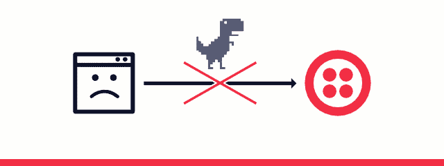
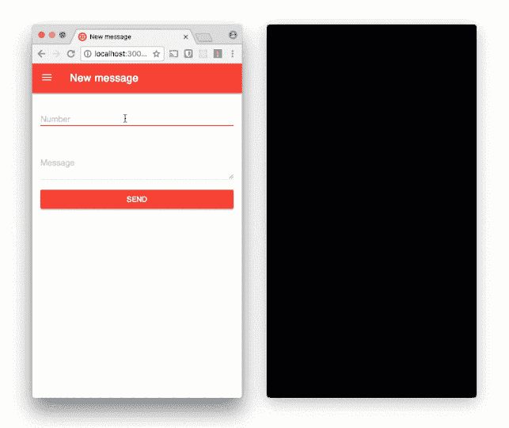
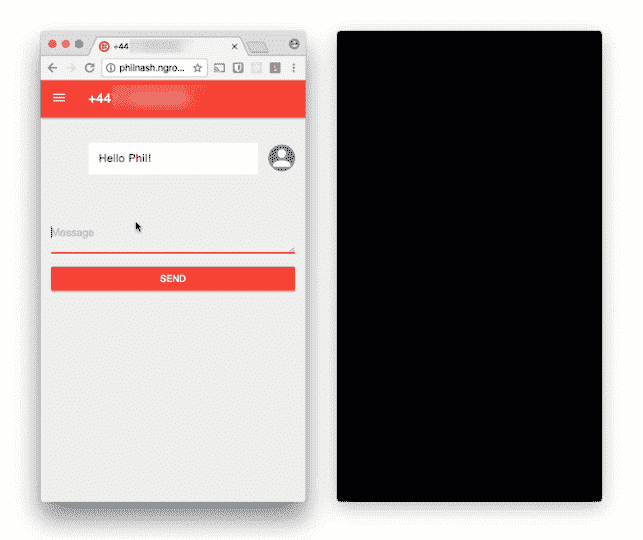
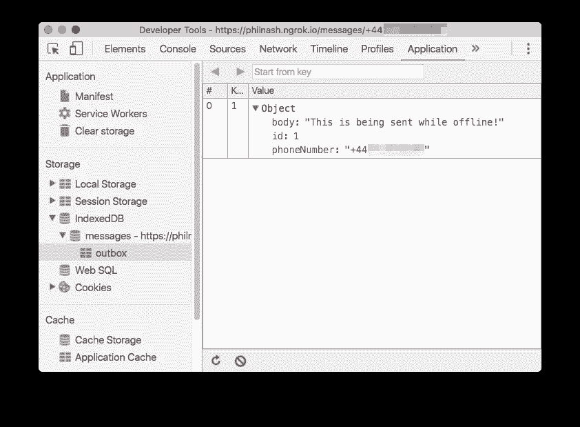
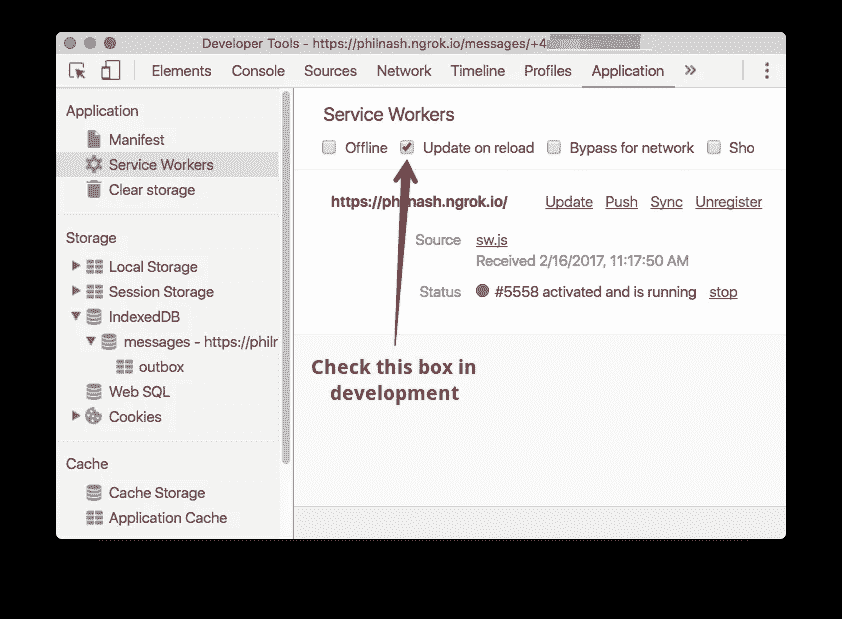

# 当您与服务人员和后台同步恢复在线时发送信息

> 原文：<https://medium.com/google-developer-experts/send-messages-when-youre-back-online-with-service-workers-and-background-sync-be6fc7de36c9?source=collection_archive---------1----------------------->



当你发送短信，但你的手机没有很好的信号，它会继续尝试在后台发送消息，即使你关闭应用程序。很有用吧？

在这篇文章中，我们将看到如何使用来自[服务工作者](https://developers.google.com/web/fundamentals/getting-started/primers/service-workers)的[后台同步 API](https://developers.google.com/web/updates/2015/12/background-sync) 在 web 应用程序中复制这种行为。

# 我们需要什么

为了演示后台同步 API，让我们在现有的应用程序中构建一个功能，一个基于 web 的 Twilio 号码 SMS 收件箱。当我们为收到的文本消息实现[网络推送通知](https://www.twilio.com/blog/2016/02/web-powered-sms-inbox-with-service-worker-push-notifications.html)时，你可能已经见过这个应用程序了。

要运行该应用程序，您需要:

一旦你对这些比特进行了排序，你就可以从 GitHub 下载应用程序或者使用 git 克隆它。

```
$ git clone https://github.com/philnash/sms-messages-app.git
```

转到目录并安装依赖项:

```
$ cd sms-messages-app
$ npm install
```

将`.env.example`文件复制到一个名为`.env`的文件中，并在其中填入您的 Twilio 帐户 SID、身份验证令牌和您的 Twilio 电话号码。

现在，您应该能够启动应用程序并对其进行测试。使用以下命令启动它:

```
$ node index.js
```

在 [http://localhost:3000](http://localhost:3000/) 的浏览器中打开应用程序。您可以使用[新消息表单](http://localhost:3000/messages/new)给自己发送短信。



如果你试图在没有网络连接的情况下用这个应用程序发送消息，你会得到不一样的体验。



事实上，这种体验很糟糕，但后台同步 API 可以解决这一问题。如果我们有一个服务人员，并注册了一个同步事件，那么浏览器将只在它认为有一个良好的网络连接时触发该事件。这允许我们在离线时存储我们想要发送的消息，并且只在浏览器再次连接时发送它们。

# 我们要做什么

要完成这项任务，我们还有几个步骤，所以让我们把它们分解一下。在页面上，我们需要:

1.  注册服务人员
2.  拦截消息表单的“提交”事件
3.  将消息详情放入浏览器数据库中的 [IndexedDB](https://developer.mozilla.org/en/docs/Web/API/IndexedDB_API) 。
4.  注册服务人员以接收“同步”事件

然后，在服务人员中，我们需要:

1.  监听同步事件
2.  当接收到同步事件时，从 IndexedDB 中检索消息
3.  对于每封邮件，向我们的服务器发送一个发送邮件的请求
4.  如果消息发送成功，则从 IndexedDB 中删除该消息

仅此而已。我们将从服务人员注册开始。

# 注册服务人员

在`public/js`目录下创建一个名为`app.js`的新文件。通过将以下内容添加到`views/layout.hbs`的底部，将其包含在页面中:

```
 <script type=”text/javascript” src=”https://www.twilio.com/blog/js/material.min.js"></script>
    <script type=”text/javascript” src=”https://www.twilio.com/blog/js/app.js"></script> 
  </body>
</html>
```

打开`public/js/app.js`并从以下内容开始:

```
document.addEventListener('DOMContentLoaded', function(event) {
  if ('serviceWorker' in navigator) {
    navigator.serviceWorker.register('/sw.js').then(function(reg) {
      if ('sync' in reg) {
        // do stuff here
      }
    }).catch(function(err) { 
      console.error(err); // the Service Worker didn't install correctly
    });
  }
});
```

一旦 DOM 的内容被完全加载，这段代码将检查浏览器是否支持服务人员，如果不支持，那么继续下去就没有意义了。然后它在文件`sw.js`中注册将要居住的服务工作者。当承诺完成并且服务人员成功注册后，我们将检查是否也支持同步。然后我们就可以真正开始工作了。

# 拦截表单提交事件

我们需要获取对表单和字段的引用，稍后我们将从中读取值。然后我们监听表单上的`submit`事件，这样当它触发时，我们可以阻止它实际提交。相反，我们将创建一个包含电话号码和消息正文的`message`对象，并将其保存到 IndexedDB 中。

```
if ('sync' in reg) {
  var form = document.querySelector('.js-background-sync');
  var phoneNumberField = form.querySelector('#phoneNumber');
  var bodyField = form.querySelector('#body'); form.addEventListener('submit', function(event) {
    event.preventDefault();
    var message = {
      phoneNumber: phoneNumberField.value,
      body: bodyField.value
    }; // do more stuff here
  });
}
```

# 将邮件保存到 IndexedDB

现在我们已经将消息作为一个对象，我们需要将它保存到 [IndexedDB](https://developer.mozilla.org/en-US/docs/Web/API/IndexedDB_API) 中，以便服务人员以后可以再次获取它。我们使用 IndexedDB 来做这件事，因为 [localStorage](https://developer.mozilla.org/en/docs/Web/API/Window/localStorage) API 虽然更简单，但不能在服务工作者中工作。

为了使使用 IndexedDB 更容易一些，我将包含 Jake Archibald 的 idb 库，它用承诺代替了回调系统。这有两个好处，使用数据库的代码稍微简单一点，服务人员希望工作时有承诺，所以这为我们以后更容易的工作做好了准备。如果你不熟悉承诺，看看张秀坤的承诺指南。

我已经在项目中包含了这个库，所以只需在`app.js`之前将下面的脚本标签添加到布局中。

```
 <script type="text/javascript" src="[https://www.twilio.com/blog/js/material.min.js](https://www.twilio.com/blog/js/material.min.js)"></script>
  <script type="text/javascript" src="[https://www.twilio.com/blog/js/idb.js](https://www.twilio.com/blog/js/idb.js)"></script>
  <script type="text/javascript" src="[https://www.twilio.com/blog/js/app.js](https://www.twilio.com/blog/js/app.js)"></script>
</body>
</html>
```

接下来，我们打开一个数据库，我们称之为“消息”，在回调中，我们创建一个名为“发件箱”的对象存储，并告诉它使用一个自动递增键，我们称之为`id`。当这个承诺兑现后，我们就可以访问我们的数据库了。然后，我们可以使用它在我们的对象存储中启动一个事务，并将`put`消息对象放入存储中。

```
 var message = {
      phoneNumber: phoneNumberField.value,
      body: bodyField.value
    }; idb.open('messages', 1, function(upgradeDb) {
      upgradeDb.createObjectStore('outbox', { autoIncrement : true, keyPath: 'id' });
    })
    .then(function(db) {
      var transaction = db.transaction('outbox', 'readwrite');
      return transaction.objectStore('outbox').put(message);
    })
    .then(function() {
      // register for sync and clean up the form
    });
  });
}
```

一旦数据库事务成功完成，我们需要做的就是注册同步事件，我们希望服务人员接收并整理我们的表单。

```
 return transaction.objectStore('outbox').put(message);
    }).then(function() {
      bodyField.value = '';
      if (phoneNumberField.getAttribute('type') !== 'hidden') {
        phoneNumberField.value = '';
      }
      return reg.sync.register('outbox');
    }).catch(function(err) {
      // something went wrong with the database or the sync registration, log and submit the form
      console.error(err); 
      form.submit();
    });
  });
}
```

在我们测试第一部分之前，我们需要为服务人员创建一个文件，否则我们的初始安装会失败，我们的代码都不会运行。只需在`public`目录下创建一个名为`sw.js`的空白文件。现在，打开消息表单，填写消息和您的电话号码，然后单击发送。表单将被清除，但不会发送任何消息。如果您打开开发工具并从应用程序选项卡中检查 IndexedDB，您会发现消息安全地存储在那里。



为了使服务人员的开发对我们来说更容易，选择 dev tools 的 Application 标签下的 Update on reload 复选框。这将使我们在开发过程中不必处理服务工作者的生命周期。



现在我们需要在服务工作者中实现实际的同步事件。

# 实现同步事件

打开`public/sw.js`，从[导入](https://developer.mozilla.org/en-US/docs/Web/API/WorkerGlobalScope/importScripts)IDB 库开始，监听同步事件。

```
importScripts('/js/idb.js');self.addEventListener('sync', function(event) {});
```

在事件侦听器中，我们需要告诉浏览器等待服务工作者完成连接到 IndexedDB、检索任何需要发送的消息并发送它们的异步任务。

为此，我们使用事件的`[waitUntil](https://developer.mozilla.org/en-US/docs/Web/API/ExtendableEvent/waitUntil)`方法，该方法将一个承诺作为参数，只有在承诺得到解决时才完成。

```
importScripts('/js/idb.js');self.addEventListener('sync', function(event) {
  event.waitUntil(
    // do asynchronous tasks here
  );
});
```

## 是时候进行重构了

我们需要连接到我们的 IndexedDB 数据库，但是我们已经在我们的`app.js`文件中编写了这样做的代码。这个连接代码可以在服务人员和页面之间重构和共享。

在`public/js`目录中创建一个名为`store.js`的文件，并输入以下内容:

```
var store = {
  db: null, init: function() {
    if (store.db) { return Promise.resolve(store.db); }
    return idb.open('messages', 1, function(upgradeDb) {
      upgradeDb.createObjectStore('outbox', { autoIncrement : true, keyPath: 'id' });
    })
    .then(function(db) {
      return store.db = db;
    });
  }, outbox: function(mode) {
    return store.init().then(function(db) {
      return db.transaction('outbox', mode).objectStore('outbox');
    })
  }
}
```

如果需要的话,`init`函数会打开并升级数据库，并返回一个用数据库对象本身解决的承诺。`outbox`函数返回一个承诺，该承诺在一个事务中以所选择的模式(“readonly”或“readwrite”)通过对发件箱的对象存储的引用来解析。

将这个脚本添加到`views/layouts.hbs`中。

```
 <script type="text/javascript" src="[https://www.twilio.com/blog/js/material.min.js](https://www.twilio.com/blog/js/material.min.js)"></script>
  <script type="text/javascript" src="[https://www.twilio.com/blog/js/idb.js](https://www.twilio.com/blog/js/idb.js)"></script>
  <script type="text/javascript" src="[https://www.twilio.com/blog/js/store.js](https://www.twilio.com/blog/js/store.js)"></script>
  <script type="text/javascript" src="[https://www.twilio.com/blog/js/app.js](https://www.twilio.com/blog/js/app.js)"></script>
</body>
```

用我们的新店取代`app.js`中 idb 的使用。

```
var message = {
                phoneNumber: phoneNumberField.value,
                body: bodyField.value
              };
-           idb.open('messages', 1, function(upgradeDb) {
-             upgradeDb.createObjectStore('outbox', { autoIncrement : true, keyPath: 'id' });
-           }).then(function(db) {
-             var transaction = db.transaction('outbox', 'readwrite');
-             return transaction.objectStore('outbox').put(message);
+           store.outbox('readwrite').then(function(outbox) {
+             return outbox.put(message);
            }).then(function() {
```

将我们的商店导入到服务人员文件中。

```
importScripts('/js/idb.js');
importScripts('/js/store.js');self.addEventListener('sync', function(event) {
  event.waitUntil(
    // do asynchronous tasks here
  );
});
```

现在，我们可以使用我们的存储来获取所有消息，而无需重复自己。

```
self.addEventListener('sync', function(event) {
  event.waitUntil(
    store.outbox('readonly').then(function(outbox) {
      return outbox.getAll();
    })
    .then(function(messages) {
      // send the messages
    })
    .catch(function(err) { console.error(err); });
  );
});
```

我们有一系列信息要发送。对于每条消息，我们需要向原始路径“/messages”发出一个 POST 请求，请求中包含消息的详细信息。然后我们将读取响应，如果成功，我们将从数据库中删除该消息。

由于所有这些动作都是异步的，我们需要使用`Promise.all`来等待它们全部成功完成。在 sw.js 中应该是这样的:

```
 store.outbox('readonly').then(function(outbox) {
      return outbox.getAll();
    })
    .then(function(messages) {
      return Promise.all(messages.map(function(message) {
        return fetch('/messages', {
          method: 'POST',
          body: JSON.stringify(message),
          headers: {
            'Accept': 'application/json',
            'X-Requested-With': 'XMLHttpRequest',
            'Content-Type': 'application/json'
          }
        })
        .then(function(response) {  
          return response.json();
        })
        .then(function(data) {
          if (data.result === 'success') {
            return store.outbox('readwrite').then(function(outbox) {
              return outbox.delete(message.id);
            });
          }
        })
    })
    .catch(function(err) { console.error(err); });
```

一切就绪后，我们就可以开始测试了。重新加载页面并发送消息。你应该马上收到它。您还应该收到您尝试发送的第一条消息，因为它也在 IndexedDB 中等待。

现在断开与互联网的连接，尝试发送消息。等一会儿，打开网络，嗖的一声，信息来了！


# 网络弹性消息

使用服务工作者的后台同步 API，我们现在有了网络弹性消息发送。用户不再需要打开一个网站来等待他们刚刚做的事情是否有效。我们越来越接近原生应用程序可以为用户提供的体验，就像我在开始时提到的内置短信应用程序。

这只是一个初步的实现，完整的代码在 GitHub 上。

我们还可以尝试在更多地方改善该应用程序的用户体验，例如:

*   改进用户界面以显示尚未发送的消息
*   包括超时或取消已发送消息的方法
*   [推送通知](https://www.twilio.com/blog/2016/02/web-powered-sms-inbox-with-service-worker-push-notifications.html)通知消息失败

发送消息也不是后台同步的唯一用例。我可以看到这在以下方面很有用:

我希望你对后台同步 API 的潜力感到兴奋，让我知道你的想法或者你对它的用途有什么想法。你可以在这里的评论中找到我，也可以在 Twitter 上发邮件到 philnash@twilio.com。

*原载于 2017 年 2 月 17 日*[*【www.twilio.com】*](https://www.twilio.com/blog/2017/02/send-messages-when-youre-back-online-with-service-workers-and-background-sync.html)*。*