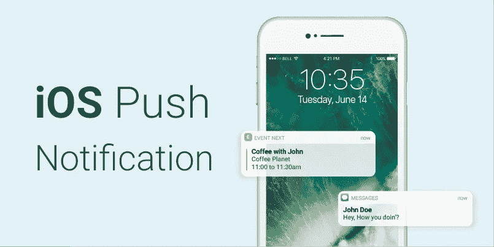

# 向 iOS 模拟器发送推送通知

> 原文：<https://medium.com/globant/send-push-notifications-to-the-ios-simulator-3a78b6689cf?source=collection_archive---------0----------------------->



是的，这是真的。我一直在想，我是否可以在 iOS 模拟器上发送推送通知，而不是在开发应用程序时得到一个真正的设备。

众所周知，推送通知在用户参与中起着非常重要的作用。因此，它在应用程序中变得更加重要

您需要的是 Xcode 11.4 测试版。发行说明中提到了在模拟器上发送推送通知

> 模拟器支持模拟远程推送通知，包括后台内容获取通知。在模拟器中，将 APNs 文件拖放到目标模拟器上。该文件必须是具有有效苹果推送通知服务有效负载的 JSON 文件，包括“aps”密钥。它还必须包含顶级“模拟器目标捆绑包”，其字符串值与目标应用程序的捆绑包标识符匹配。
> 
> `simctl`还支持发送模拟推送通知。如果文件包含“模拟器目标捆绑包”，则不需要捆绑包标识符，否则您必须将其作为参数提供(8164566):
> 
> `$ xcrun simctl push <device> com.example.my-app ExamplePush.apns`

**实施推送通知**

1.  `import UserNotifications`
2.  注册推送通知

在`applicationDidFinishLaunching`中增加以下一行

```
UNUserNotificationCenter.current().requestAuthorization(options:   [.alert, .sound, .badge]) {(granted, error) in 
        print("Permission granted: \(granted)") 
}
```

3.运行应用程序并保持在后台

4.让我们创建一个带有有效负载的 JSON 文件。[有效载荷上的苹果文档](https://developer.apple.com/documentation/usernotifications/setting_up_a_remote_notification_server/generating_a_remote_notification?language=objc)对此有更多的解释。创建`payload.apns`，在下面添加 JSON 并保存。

```
{
    "aps" : {
        "alert" : {
            "title" : "Push On Simulator",
            "body" : "You have sent it on simulator"
        },
        "badge" : 7
    }
}
```

5.命令行

**使用** `**simctl**` **命令模拟远程通知**

`xcrun simctl push <device> <bundle-identifier> <path-to-apns-file>`

例子

```
xcrun simctl push booted com.nirmal.simpush payload.apns
```

如果您有多个模拟器在运行，您也可以使用`xcrun simctl list`获得设备列表

如果您的有效载荷包含`Simulator Target Bundle`，则不需要在命令中添加包标识符。见下面的例子。

```
{
    "aps" : {
        "alert" : {
            "title" : "Push On Simulator",
            "body" : "You have sent it on simulator"
        },
        "badge" : 7
    },
    "Simulator Target Bundle" : "com.nirmal.simpush"
}
```

6.拖放

您也可以将 load . APN 拖放到模拟器中以查看通知。确保您使用的文件必须有`Simulator Target Bundle`才能正常工作。

# **参考文献**

*   [xccode 11.4 Beta 发行说明](https://developer.apple.com/documentation/xcode_release_notes/xcode_11_4_beta_release_notes/)
*   [Apple 文档—创建远程通知有效负载](https://developer.apple.com/library/archive/documentation/NetworkingInternet/Conceptual/RemoteNotificationsPG/CreatingtheNotificationPayload.html)