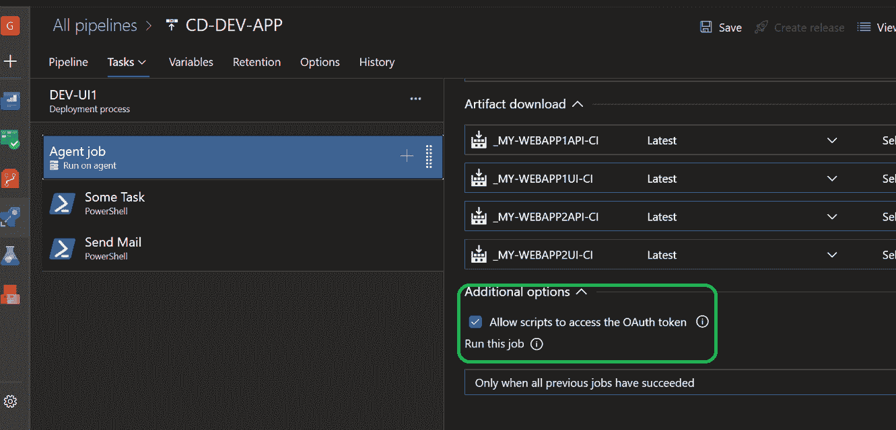
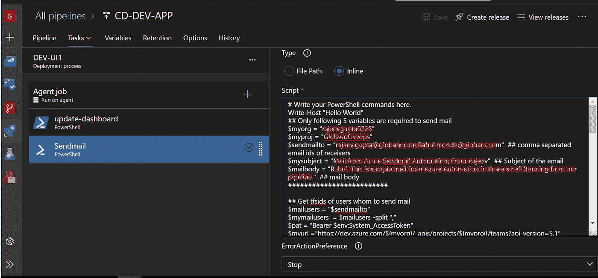

# 使用 PowerShell 在 Azure DevOps 中发送简单的电子邮件(无需任何 smtp 服务器)

> 原文：<https://medium.com/globant/send-simple-email-in-azure-devops-using-powershell-without-any-smtp-server-bd669a24e544?source=collection_archive---------0----------------------->

# 简介:

本文是 Azure Devops 自动化系列的第一篇文章，其中没有任何特定的任务，我们可以使用脚本(主要是 Powershell)实现许多自动化。这篇文章是关于在 azure pipeline PowerShell 任务中发送简单的电子邮件，而不需要任何 smtp 服务器或市场任务。这解决了很多不允许项目使用外部 SMTP 服务器的安全问题。所有的邮件都将由 azuredevops@microsoft.com Azure devo PS 发送。

# 背景

我们会遇到这样的情况，我们需要发送简单的电子邮件来通知 Azure DevOps 团队成员快速的自定义细节。我们可以使用它来发送基于一些脚本或任务或工作的结果的详细信息。例如，如果我们使用自动化来检查哪些 SPN 将在未来 10 天内到期。到目前为止，我们必须使用 sendgrid 或任何第三方邮件服务，在那里我们必须设置 smtp 服务器细节来发送甚至是简单的邮件。

# 解决方案:

我们可以使用这个简单的发送邮件代码，它使用 Azure Devops 未发布的 **SendMail** RestApi 向指定的人发送电子邮件，而无需设置任何 smtp 服务器或第三方工具。所有电子邮件将被视为来自 azuredevops@microsoft.com>T5**蔚蓝海岸<的邮件**

我们只能向 Azure DevOps 项目中的团队成员发送电子邮件。发送邮件的 Azure Rest API 只使用 tfsid 来发送邮件，因此我们需要获得与收件人的电子邮件相对应的所有 tfsid。

**先决条件:**

由于 Rest Api 调用是在任务中进行的，所以我们必须在代理作业设置中为**启用一个复选框，以允许脚本访问 OAuth 令牌**，如下图所示。



# 该脚本实现了以下目标:

**第一步:**使用 Rest api 调用，我们获得 devops 项目中所有团队的信息，然后从每个团队获得项目中所有成员的详细信息。

**第二步:**现在，我们从成员信息中获取他们的电子邮件 id 和相关的 TFSIDs。从主信息中，我们过滤与预期接收者的电子邮件相关联的 TFSids 列表。

**第三步:**用给定的主题和自定义的邮件正文形成邮件请求对象后发送邮件。

所有三个步骤的实现细节都在下面的代码中。

# 详细的代码片段

################# ##################

```
## Only following 5 variables are required to send mail$myorg = “my-ado-org”$myproj = “my-ado-project”$sendmailto = “devops.user1@xyz.com,devops.user2@xyz.com” ## comma separated email ids of receivers$mysubject = “my custom subject of the mail” ## Subject of the email$mailbody = “my custom mail body details” ## mail body########################### Get tfsids of users whom to send mail$mailusers = “$sendmailto”$mymailusers = $mailusers -split “,”$pat = “Bearer $env:System_AccessToken”$myurl =”https://dev.azure.com/${myorg}/_apis/projects/${myproj}/teams?api-version=5.1"$data = Invoke-RestMethod -Uri “$myurl” -Headers @{Authorization = $pat}$myteams = $data.value.id##Get list of members in all teams$myusersarray = @()foreach($myteam in $myteams) {$usrurl = “https://dev.azure.com/${myorg}/_apis/projects/${myproj}/teams/"+$myteam+"/members?api-version=5.1"$userdata = Invoke-RestMethod -Uri “$usrurl” -Headers @{Authorization = $pat}$myusers = $userdata.valueforeach($myuser in $myusers) {$myuserid = $myuser.identity.id$myusermail = $myuser.identity.uniqueName$myuserrecord = “$myuserid”+”:”+”$myusermail”$myusersarray += $myuserrecord}}## filter unique users$myfinalusersaray = $myusersarray | sort -Unique## create final hash of emails and tfsids$myusershash = @{}for ($i = 0; $i -lt $myfinalusersaray.count; $i++){$myusershash[$myfinalusersaray[$i].split(“:”)[1]] = $myfinalusersaray[$i].split(“:”)[0]}#### create list of tfsid of mailersforeach($mymail in $mymailusers) {$myto = $myto +’”’+$myusershash[$mymail]+’”,’}##send mail$uri = “https://${myorg}.vsrm.visualstudio.com/${myproj}/_apis/Release/sendmail/$(RELEASE.RELEASEID)?api-version=3.2-preview.1"$requestBody =@”{“senderType”:1,“to”:{“tfsIds”:[$myto]},“body”:”${mailbody}”,“subject”:”${mysubject}”}“@Try {Invoke-RestMethod -Uri $uri -Body $requestBody -Method POST -Headers @{Authorization = $pat} -ContentType “application/json”}Catch {$_.Exception}
```

# 怎么跑

在常规任务之后创建 PowerShell 任务(例如 sendmail)。在这个 PowerShell 任务中使用上面的代码。根据您的项目和邮件列表，更新上面代码片段中提到的前五个变量。当管道运行时，它将执行并向 **sendmailto** 变量中提到的所有电子邮件 id 发送邮件。下面给出了屏幕截图。



# 局限性:

虽然我们可以使用上面的脚本方法发送简单的电子邮件，但它仅限于发送简单的电子邮件，因为我们无法格式化我们的邮件，它们就像简单的文本邮件一样。第二，我们只能向 azure devops 项目的成员发送邮件，因为 sendmail 功能将电子邮件 id 与项目的 tfsid 进行映射，外部人员没有相应的 tfsid，因此邮件不会发送给他们。我们使用未发布的 sendmail rest api，因此它总是存在将来被淘汰或废弃的风险。

# 结论:

当我们想要激活快速电子邮件通知时，当组织邮箱不允许接受来自未授权邮箱的邮件，并且不允许在 DevOps 项目中使用第三方 smtp 服务器时，这个简单的电子邮件脚本会产生奇迹。