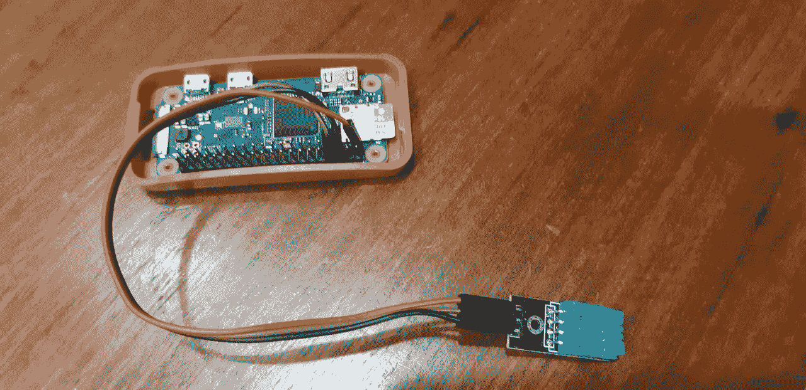
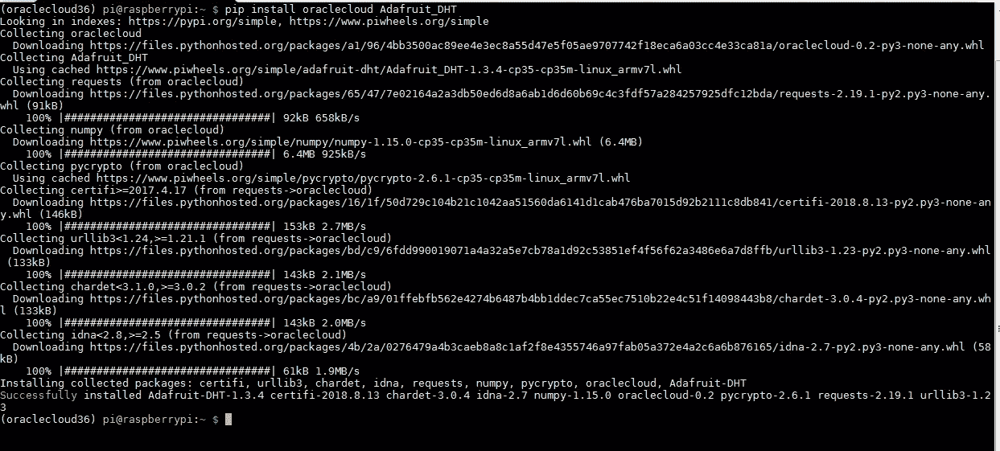
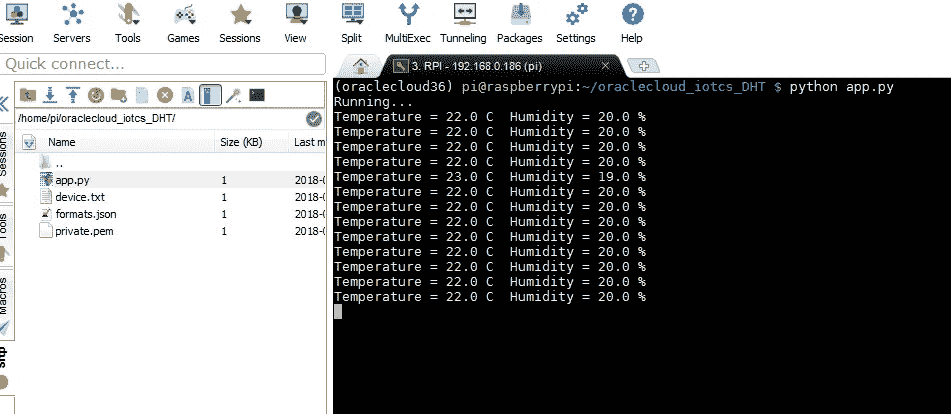
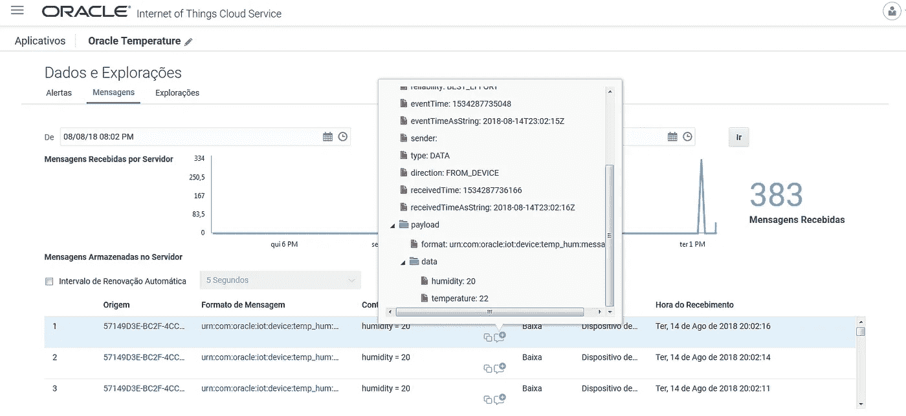

# 将数据从 Python 应用程序发送到 Oracle 物联网云服务

> 原文：<https://medium.com/oracledevs/sending-data-from-python-app-to-oracle-iot-cloud-service-d3cc0e5fe66b?source=collection_archive---------0----------------------->

如果你看过我的博文“ [*将数据从树莓 Pi 发送到 Oracle 物联网云服务*](http://waslleysouza.com.br/en/2017/06/send-data-from-raspberry-pi-to-oracle-iot-cloud-service/) ”，你就学会了如何使用 CPOSIX SDK 将数据从树莓 Pi 发送到 Oracle 物联网云服务。Oracle 为许多编程语言提供了 SDK，但是如果您没有找到您最喜欢的编程语言(例如 python)的 SDK，您可以使用 REST API。

在这篇博文中，您将了解如何使用 Python 和 REST API 将湿度和温度数据从 Raspberry Pi 发送到 Oracle 物联网云服务。你可以从这里克隆这个项目:【https://github.com/waslleysouza/oraclecloud_iotcs_DHT】T4。



为了让事情变得更简单，我使用 REST API 为 Oracle 物联网云服务创建了一个简单的 Python 包，你可以在这里了解更多:[https://github.com/waslleysouza/oraclecloud](https://github.com/waslleysouza/oraclecloud)。

首先，你需要安装所需的 Python 包。

```
pip install oraclecloud Adafruit_DHT
```



创建 formats.json 文件。
该文件为 JSON 格式的报文。

```
[
    {
        "name": "Message",
        "urn": "urn:com:oracle:iot:device:camera:message",
        "type": "DATA",
        "fields": [
            {
                "name": "license_plate",
                "optional": "False",
                "type": "STRING"
            },
            {
                "name": "confidence",
                "optional": "False",
                "type": "NUMBER"
            },
            {
                "name": "picture_url",
                "optional": "False",
                "type": "URI"
            }
        ]
    }
]
```

创建 app.py 文件。这是应用程序的主文件。

```
#!/usr/bin/python3
# Waslley Souza (waslleys@gmail.com)
# 2018

import Adafruit_DHT
import time
import json
import os
import platform
from oraclecloud import Iot

USER = 'iot'
PASS = 'welcome1'
URL  = 'https://192.168.0.177:10443'
SHARED_SECRET = 'Welcome_1'

DEVICE_MODEL_URN = "urn:com:oracle:iot:device:temp_hum"
DEVICE_MODEL_FORMAT_URN = DEVICE_MODEL_URN + ":message"

sensor = Adafruit_DHT.DHT11
#sensor = Adafruit_DHT.DHT22

# GPIO pin
pino_sensor = 14

def main():
    print('Running...')

    while True:
        humidity, temperature = Adafruit_DHT.read_retry(sensor, pino_sensor)

        if humidity is not None and temperature is not None:
            print("Temperature = {0:0.1f} C  Humidity = {1:0.1f} %".format(temperature, humidity))
            data = {'humidity':humidity,'temperature':temperature}
            iot.send_message(device, DEVICE_MODEL_FORMAT_URN, data)
            time.sleep(1)

        else:
            print("Error !!!")

def _open_file(file_name):
    f = open(file_name, 'r')
    text = f.read()
    f.close()
    return text

def _create_file(file_name, text):
    f = open(file_name, 'w')
    f.write(text)
    f.close()

if __name__ == "__main__":
    iot = Iot(USER, PASS, URL, False)

    if os.path.isfile('device.txt'):
        device_id = _open_file('device.txt')
        device = iot.get_device(device_id)  
        iot.set_shared_secret(SHARED_SECRET)

    else:
        device_model = iot.get_device_model(DEVICE_MODEL_URN)
        if not device_model:
            formats = json.loads(_open_file('formats.json'))
            device_model = iot.create_device_model("TemperatureHumidity", DEVICE_MODEL_URN, formats)

        device_name = platform.node() + "_DHT"
        device = iot.create_device(device_name, SHARED_SECRET, hardware_id=device_name)
        iot.activate_device(device, DEVICE_MODEL_URN)

        _create_file('device.txt', device['id'])

    main()
```

不要忘记根据您的环境信息来更改这部分代码。

```
USER = 'iot'
PASS = 'welcome1'
URL = 'https://192.168.0.177:10443'
```

执行以下命令启动您的应用程序。

```
python app.py
```



现在，您可以使用 Oracle 物联网云服务来监控湿度和温度。



玩得开心！

*原载于 2018 年 8 月 14 日*[*waslleysouza.com.br*](http://waslleysouza.com.br/en/2018/08/sending-data-from-python-app-to-oracle-iot-cloud-service/)*。*