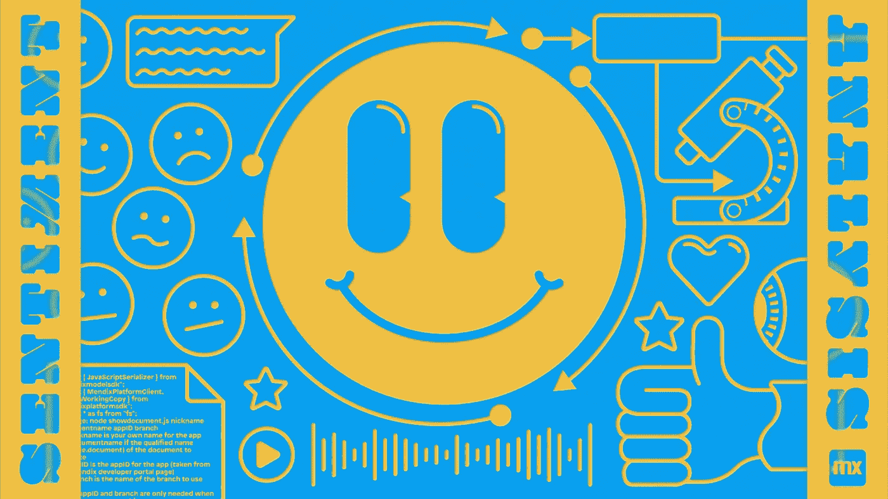
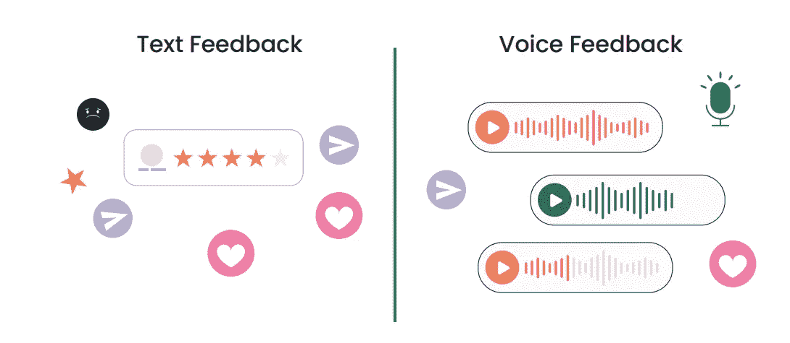
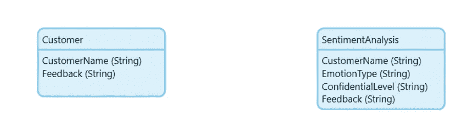
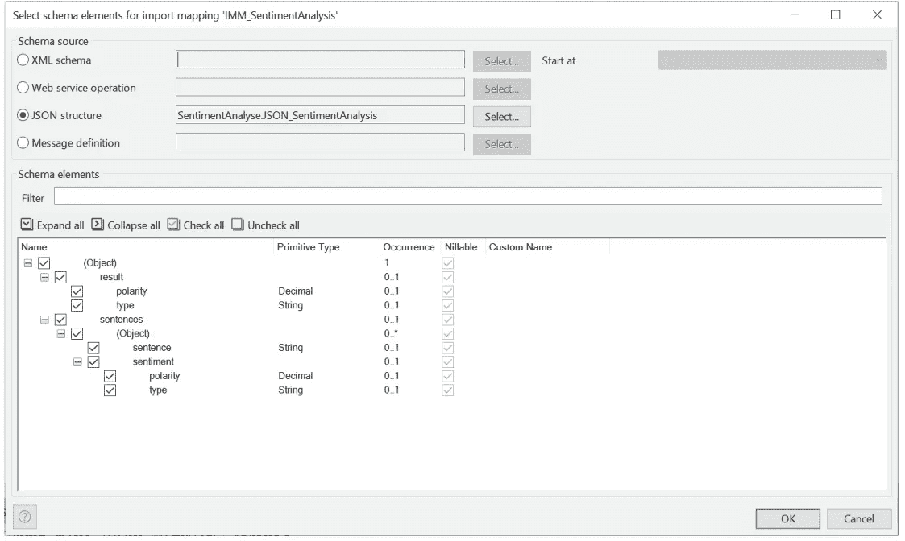
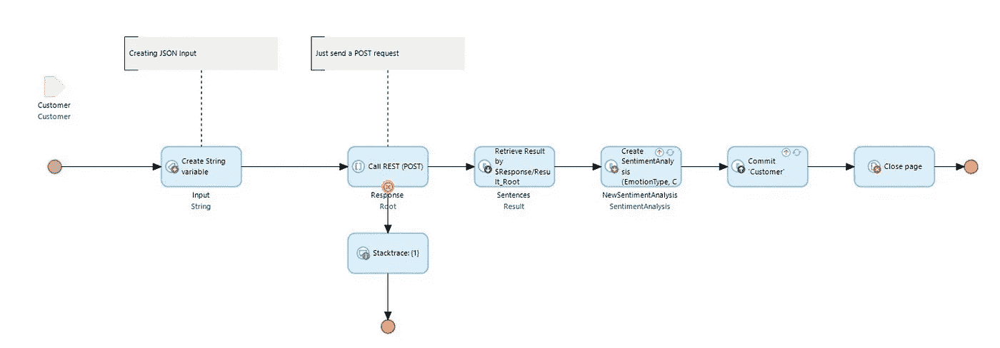
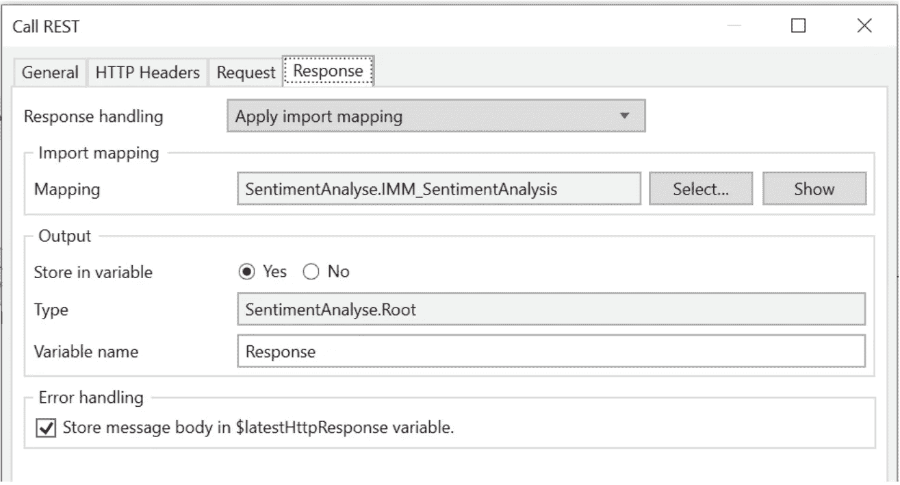
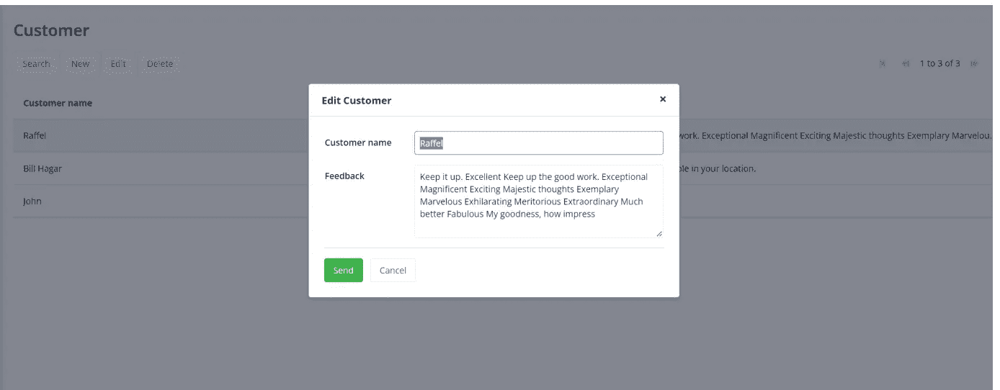
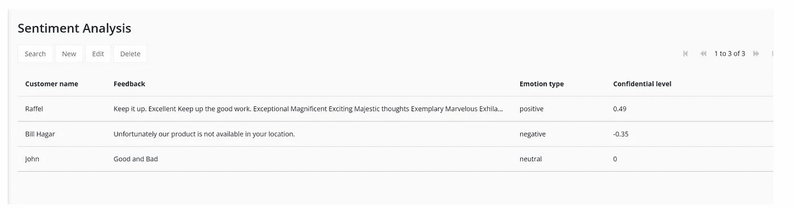

# 使用开源 API 在 Mendix 中进行情感分析

> 原文：<https://medium.com/mendix/sentiment-analysis-in-mendix-using-an-open-source-api-55c321ed9f2c?source=collection_archive---------6----------------------->

嗨伙计们！在这篇博客中，我将向您展示如何使用 REST API 在您的 Mendix 中集成情感分析。这有助于我们轻松分析客户反馈和信心水平。



Sentiment Analysis in Mendix using an Open Source API

# 什么是情感分析？

情感分析(也称为**意见挖掘**)是一种**自然语言处理(NLP)技术**，用于确定数据是**正面**、**负面、**还是**中性**。情感分析通常在文本数据上进行，通过分析客户的反馈来帮助企业了解客户的感受。

情感分析最常用于捕捉客户的反馈，并确定消费者对某个人或产品的意见。



## 我使用的是什么 API？

虽然有一些提供商，如 IBM Watson 和其他提供商提供情感分析，但我决定选择一个免费使用的开源 API，名为 **SENTIM-API。**

[](https://sentim-api.herokuapp.com/) [## SENTIM-API

### 一个用于情感分析的免费 API

sentim-api.herokuapp.com](https://sentim-api.herokuapp.com/) 

## **如何分析 Mendix 中的文本反馈？**

首先，我们需要创建**域模型**结构，并为客户和情感分析创建概述页面。我创建了如下所示的领域模型，然后**为这个例子自动生成了**一些页面。



在创建了域模型和页面之后，我们需要为数据映射创建 JSON 结构。

点击模块，选择“**添加其他**”→“**JSON 结构**

```
{
 “result”:{
 “polarity”:0.11,
 “type”:”positive”
 },
 “sentences”:[
 {
 “sentence”:”Excellent Keep up the good work.”,
 “sentiment”:{
 “polarity”:0.04,
 “type”:”negative”
 }
 },
 {
 “sentence”:”\”Good and Bad”,
 “sentiment”:{
 “polarity”:0,
 “type”:”neutral”
 }
 },
 {
 “sentence”:”Unfortunately our product is not avail­able in your location.”,
 “sentiment”:{
 “polarity”:-0.35,
 “type”:”negative”
 }
 }
 ]
}
```

将上面的示例粘贴到 JSON 片段中，点击“**格式”**→“**全部展开”**→“**刷新”**，最后点击“**确定”**。

创建 JSON 结构**后，右击模块**，选择“**添加其他**”→“**导入映射**”。

最后，确保点击"**展开所有"** → " **检查所有"**，以确保 API 中的所有字段均已映射。



然后我选择自动映射，这样 Mendix 将为我的集成创建我的数据结构。

# 呼叫休息服务活动

为从模块中调用 rest API 创建一个新的微流。参考这个微流程:



我将这个微流添加到客户编辑页面上的发送按钮，客户可以在这里提交他们的反馈。

```
**Method** 
POST

**Location** 
[https://sentim-api.herokuapp.com/api/v1/](https://sentim-api.herokuapp.com/api/v1/)

**Headers** 
Accept: “application/json”, 
Content-Type”: “application/json”

**Body** 
{
  “text”: “Your text here”
}
```

# **响应**



# **用户反馈**

在该编辑页面上，**客户可以在点击发送按钮**时输入反馈。这将触发 REST API 来分析客户 er 的情绪，并以状态(**积极、消极、中立**)和**置信度百分比来响应。**



您还可以在您的应用程序中保留此状态，以供管理员级别的审查。

# **Mendix 中的情感分析输出**



在我的下一篇博客中，我们将介绍如何使用 Mendix 分析来自客户的语音反馈。

谢谢大家！

## 阅读更多

[](https://sentim-api.herokuapp.com/) [## SENTIM-API

### 一个用于情感分析的免费 API

sentim-api.herokuapp.com](https://sentim-api.herokuapp.com/)  [## 呼叫休息服务

### 此活动只能在微流中使用。1 简介呼叫休息服务活动可用于呼叫休息…

docs.mendix.com](https://docs.mendix.com/refguide/call-rest-action/) 

*来自发布者-*

*如果你喜欢这篇文章，你可以在我们的* [*中页*](https://medium.com/mendix) *找到更多喜欢的。对于精彩的视频和直播会话，您可以前往*[*MxLive*](https://www.mendix.com/live/)*或我们的社区*[*Youtube PAG*](https://www.youtube.com/c/MendixCommunity/community)*e .*

*希望入门的创客，可以注册一个* [*免费账号*](https://signup.mendix.com/link/signup/?source=direct) *，通过我们的* [*学苑*](https://academy.mendix.com/link/home) *获得即时学习。*

有兴趣更多地参与我们的社区吗？加入我们的 [*Slack 社区频道*](https://join.slack.com/t/mendixcommunity/shared_invite/zt-hwhwkcxu-~59ywyjqHlUHXmrw5heqpQ) *。*