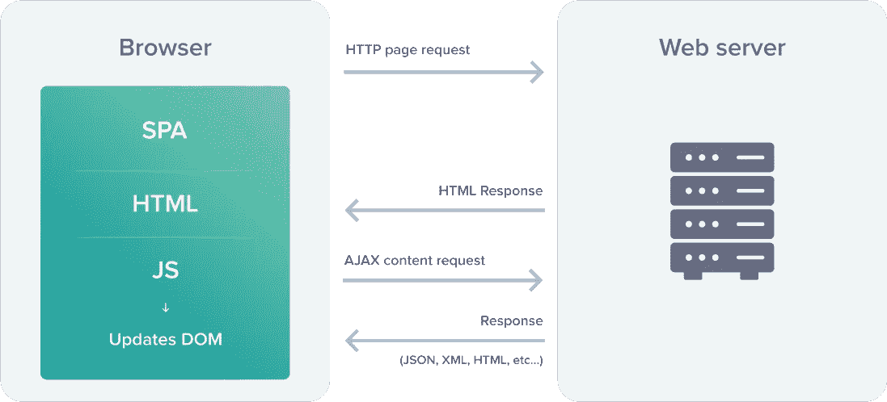
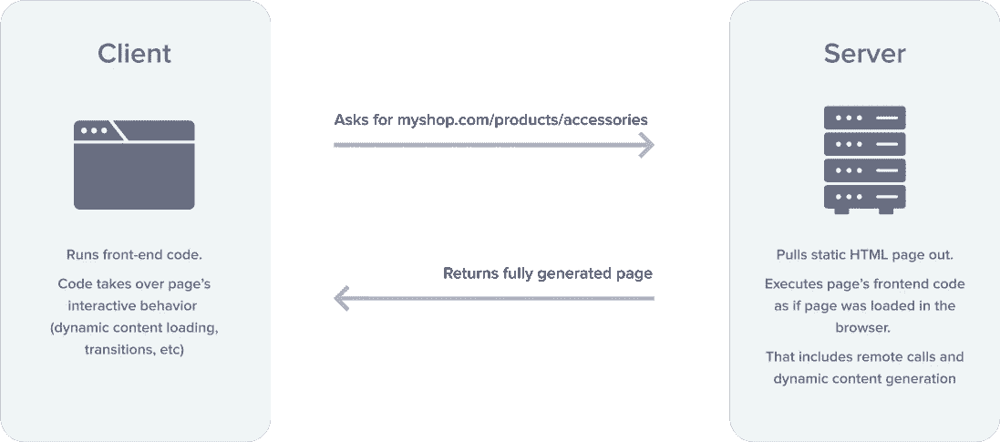
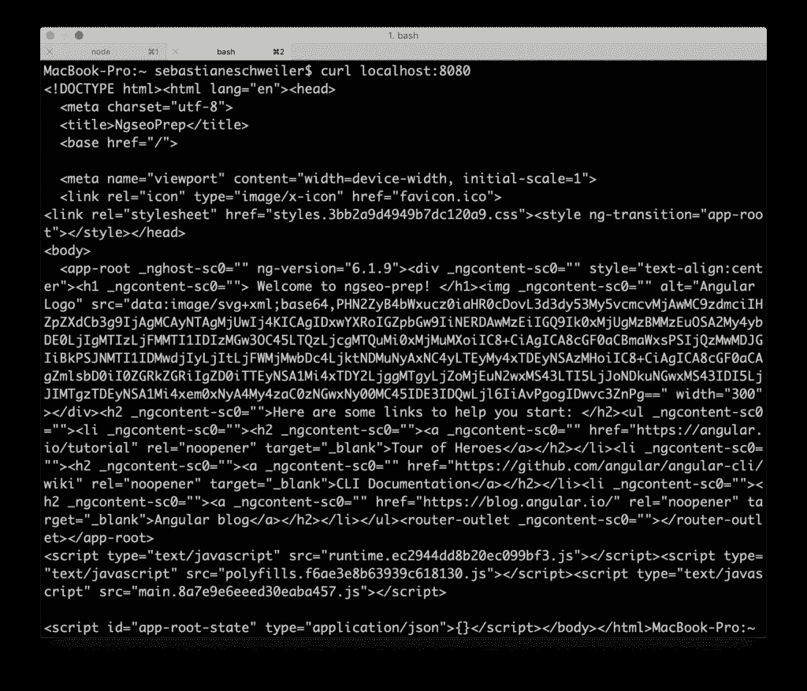

# 通过服务器端渲染将 SEO 带入 Angular

> 原文：<https://medium.com/globant/seo-for-single-page-application-with-server-side-rendering-5f670576b44b?source=collection_archive---------2----------------------->


由于其动态特性，单页面应用程序有许多固有的好处。

*   当用户在页面上导航时，只有部分页面被替换，使其体验更加流畅
*   第一次加载页面后，当用户导航应用程序时，只有数据通过网络传输:JSON 被传送到浏览器，并直接绑定到浏览器的 HTML 模板
*   这导致了更好的性能，并为那些后端服务用于其他事情提供了可能性，因为它们只是返回数据

我们可以把这归结为:

> 单页应用程序可以提供更好的用户体验！！

在公共互联网领域，用户体验至关重要。



鉴于这些事实，spa 提供了一个更好的用户体验，为什么不是每个人都使用单页应用程序呢？

原因是:

> 单页应用在搜索引擎上表现不好！！

他们的客户端呈现的内容不容易抓取

SEO *是*重要。对于许多在线企业来说，谷歌不仅仅是一个搜索引擎； [**这是一个增长引擎**](https://www.flanthiernadeau.com/saas-content/) 。

但是为 Google baba 优化可能很难——但是困难并不意味着不可能！

所以让我们开始吧，让整个事情变得简单一点。


# 用于服务器端渲染的角度通用

用于服务器端渲染的角度通用



有关如何使用 Angular Universal 的详细说明，请访问 [angular.io](https://angular.io/guide/universal) 。然而，还有另一种方法可以让添加 Angular Universal 变得非常简单:使用包 *@ng-toolkit/universal* 。

为 Angular 应用程序启用服务器端渲染的技术称为 Angular Universal。Angular Universal 通过称为服务器端渲染的过程在服务器上生成静态应用程序页面。

在 [angular.io](https://angular.io/guide/universal) 中有关于如何使用 Angular Universal 的详细说明。然而，还有另一种方法可以让添加 Angular Universal 变得非常简单:使用包 *@ng-toolkit/universal* 。

# 使用@ng-toolkit/universal 添加 Angular Universal，使您的 Angular 应用程序搜索引擎友好

使用 *ng* 命令，以如下方式将 *@ng-toolkit/universal* 包添加到项目中:

$ ng add @ng-toolkit/universal

添加完包后，打开 *package.json* 并确保 *webpack-cli* 包在 dependencies 部分列出，版本至少为 3.1:

```
"webpack-cli": "^3.1.0"
```

接下来，你不用跑 *ng serve -o* 而是跑:

`$ npm run build:prod`

和

`$ npm run server`

服务器在 localhost:8080 上启动，如果您在浏览器中访问该 URL，您应该能够再次看到默认 angular 应用程序的网站。

让我们试着通过 curl 访问网站:

`$ curl localhost:8080`

现在，输出应该类似于您在下面的屏幕截图中看到的内容:



这一次包含了 HTML 站点的完整内容。原因是 HTML 端已经作为构建过程(服务器端)的一部分呈现，现在不需要在客户端执行 JavaScript 代码就可以使用。因此，搜索引擎的爬虫能够找到该侧的内容，并且能够确保它被正确地添加到搜索结果中。

# 结论

默认情况下，Angular 使用客户端渲染，当您的网站应该在搜索引擎结果中列出时，这是一个问题。解决方案是在服务器端呈现应用程序，并生成最终的 HTML 元素，搜索引擎爬虫可以轻松地解释这些元素。

Angular 应用程序的服务器端渲染可以通过 Angular Universal 实现。通过使用包 *@ng-toolkit/universal* ，将 Angular Universal 添加到您现有的 Angular 应用程序非常容易。