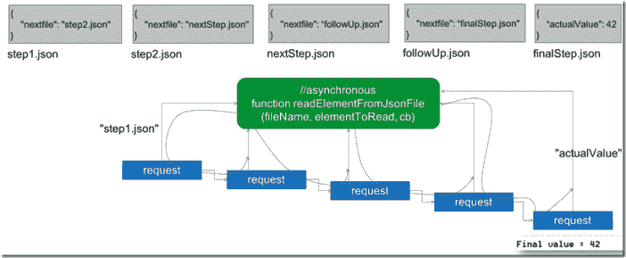

# 节点中的顺序异步调用。JS —回调、异步和 ES6 承诺

> 原文：<https://medium.com/oracledevs/sequential-asynchronous-calls-in-node-js-using-callbacks-async-and-es6-promises-e92cc849de46?source=collection_archive---------3----------------------->

一般来说，用 JavaScript (ECMA 脚本)和 Node 编程的挑战之一。JS 尤其需要处理异步操作。每当调用一个异步处理请求的函数时，都必须小心准备以异步方式接收函数的结果。此外，我们必须确保程序流不会过早地继续——只有那些可以在没有函数调用结果的情况下执行的步骤才能继续。编排多个异步调用——其中一些是顺序的或链式的，其他的可能是并行的——并以适当的方式从这些调用中收集结果并不容易。

传统上，我们使用回调函数对异步交互进行编程:调用者将一个函数的引用传递给异步操作，当异步操作完成时，被调用的函数将调用这个回调函数来传递结果。回调函数将接管并继续程序流程。每当使用 setTimeout()计划执行一个动作时，就会看到一个回调函数的简单示例:

```
setTimeout(function () { 
  console.log("Now I am doing my thing "); 
}
, 1000);
```

或者更明确地说:

```
function cb() { console.log("Now I am doing my thing "); } setTimeout(cb, 1000);
```

# 异步动作链

对于多个相互依赖的(链式)调用，使用回调函数会导致嵌套的程序逻辑，很快变得难以阅读、调试和维护。这里显示了一个示例:



函数 readElementFromJsonFile 顾名思义:它从输入参数指定的文件中读取特定元素的值。它异步地这样做，并在获得结果时调用回调函数返回结果。使用这个函数，我们得到最终值。从文件 step1.json 开始，我们读取 nextfile 元素的名称，该名称指示要读取的下一个文件，在本例中为 step2.json。显然，我们有一个异步动作链的例子，其中每个动作的输出为下一个动作提供输入。

在经典的面向回调的 JavaScript 中，调用链的代码看起来像这样——我们期望使用回调函数来处理异步情况的嵌套结构:

```
// the classic approach with nested callbacks var fs = require('fs'); 
var step1 = "/step1.json"; 
function readElementFromJsonFile(fileName, elementToRead, cb) { 
  var elementToRetrieve = 'nextfile'; 
  if (elementToRead) { 
    elementToRetrieve = elementToRead; 
  } 
  console.log('file to read from ' + fileName); 
  fs.readFile(__dirname + '/' + fileName, "utf8"
             , function (err, data) { 
     var element = ""; 
     if (err) return cb(err); 
     try { 
       element = JSON.parse(data)[elementToRetrieve];
     } catch (e) { return cb(e); } 
     console.log('value of element read = ' + element); 
     cb(null, element); 
  }); //readFile 
}//readElementFromJsonFile readElementFromJsonFile(step1, null, function (err, data) { 
   if (err) return err; 
   readElementFromJsonFile(data, null, function (err, data) { 
     if (err) return err; 
     readElementFromJsonFile(data, null, function (err, data) { 
       if (err) return err; 
       readElementFromJsonFile(data, null, function (err, data) { 
         if (err) return err; 
         readElementFromJsonFile(data, 'actualValue', function (err, data) { 
           if (err) return err; 
           console.log("Final value = " + data); 
         }); 
      }); 
    }); 
  }); 
});
```

ES6 承诺的到来——一种本机语言机制，因此在 Node 的最新版本中可用。JS——让事情变得有点不同，更有组织性、可读性和可维护性。函数 readElementFromJsonFile()现在将返回一个承诺—异步操作最终结果的占位符。即使结果将在稍后通过 Promise 对象提供，我们也可以像 Promise 代表现在的结果一样进行编程——并且我们可以在代码中预测当函数实现其承诺时要做什么(通过调用 Promise 中的内置函数 *resolve* )。

承诺解析的结果是一个值——在函数 *readElementFromJsonFile* 的情况下，它是从文件中读取的值。用该值解析承诺时执行的 then()操作调用作为参数给出的函数。承诺的结果(解决结果)作为输入传递给该函数。在下面的代码示例中，我们看到*如何读取 ElementFromJsonFile(参数)*。然后使用( *readElementFromJsonFile* )。这意味着:当第一次调用函数返回的承诺被解析时，再次调用函数，这次使用第一次调用的结果作为第二次调用的输入。对于第四个*，然后是*，这一点更加明确:因为在对函数*readElementFromJsonFile*的最后一次调用中，我们不仅需要将前一次调用的结果作为输入参数传递给函数，还需要传递要从文件中读取的元素的名称。因此，我们使用一个匿名函数，该函数将解析结果作为输入，并调用带有附加参数的函数。类似的事情发生在最后的*然后是*——之前调用的结果被简单地打印到输出中。

我们随后异步读取文件的示例代码变为:

```
var fs = require('fs'); 
var step1 = "step1.json"; function readElementFromJsonFile(fileName, elementToRead) { 
  return new Promise((resolve, reject) => { 
     var elementToRetrieve = 'nextfile'; 
     if (elementToRead) { elementToRetrieve = elementToRead; }     
     console.log('file to read from ' + fileName);
     fs.readFile(__dirname + '/' + fileName, "utf8"
                , function (err, data) { 
       var element = ""; 
       if (err) return reject(err); 
       try { 
         element = JSON.parse(data)[elementToRetrieve]; 
       } catch (e) { reject(e); } 
       console.log('element read = ' + element); 
       resolve(element); 
     }); //readFile
})// promise } readElementFromJsonFile(step1) 
.then(readElementFromJsonFile) 
.then(readElementFromJsonFile) 
.then(readElementFromJsonFile) 
.then(function (filename) { 
   return readElementFromJsonFile(filename, 'actualValue') }) 
.then(function (value) { 
   console.log('Value read after processing five files = ' + value); })
```

# 作为承诺的预定操作或如何承诺设置超时

内置的 setTimeout()需要回调函数。它目前不返回承诺。类似于:

> setTimeout(1000)。然后(myFunc)

会很好但是不存在。

Stackoverflow 上的这个[条目有一个很好的解决方案，可以使用一个定制的通用 delay()函数来处理 setTimeout Promise 样式:](http://stackoverflow.com/questions/39538473/using-settimeout-on-promise-chain)

```
function delay(t) { 
  return new Promise( function(resolve) { setTimeout(resolve, t) }); } function myFunc() { console.log('At last I can work my magic!'); } delay(1000).then(myFunc);
```

*原载于 2017 年 5 月 18 日*[*technology . amis . nl*](https://technology.amis.nl/2017/05/18/sequential-asynchronous-calls-in-node-js-using-callbacks-async-and-es6-promises/)*。*